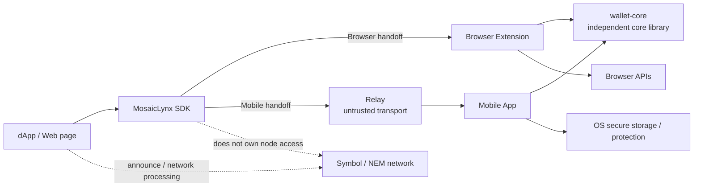

# MosaicLynx アーキテクチャ設計

## 1. 目的

本書は、MosaicLynx v1 を構成する Browser Extension、Mobile App、Relay、SDK、`symbol-nem-wallet-core`（以下 `wallet-core`）の責任境界、依存方向、秘密情報の境界および署名要求の主要な流れを定める基本設計である。

本書は、現在のワークスペースに実装されている機能だけでなく、要件で定義された Android / iOS の Mobile milestone を含む全体構成を扱う。ただし、現在のワークスペースに `apps/mobile` は存在せず、Mobile App を実装済みまたは検証済みとは扱わない。

プロダクト上の要求は [共通要件](../requirements/requirements.md)、[Browser Extension 要件](../requirements/browser-extension.md)、[Mobile App 要件](../requirements/mobile-app.md)、[Relay 要件](../requirements/relay.md)、[SDK 要件](../requirements/sdk.md) を正本とする。下位の API、データ形式、暗号方式および実装方式は、それぞれの仕様書と wallet-core の外部契約で定める。

## 2. 対象と対象外

### 2.1 対象

- dApp / Web page から Browser Extension または Mobile App へ署名要求を渡す構成。
- transaction signing と message signing の共通能力。
- Profile、Account、接続許可、要求ライフサイクル、承認および結果対応の Application 責務。
- Symbol / NEM と Mainnet / Testnet の文脈を保った要求・結果の受け渡し。
- Relay を信頼しない transport として利用する Mobile 経路。
- `wallet-core` を鍵管理、Wallet Store、秘密情報処理および raw byte signing の正本として利用する境界。

### 2.2 対象外

- 残高、履歴、ノード選択、継続的な network state 管理および announce。
- 利用者確認を省略する自動署名、永続的署名許可および blind signing。
- Relay による transaction / message の意味解釈、承認または署名。
- Profile 全体の backup / restore を v1 共通能力とすること。個別 platform で提供する場合の範囲は、その platform の要件・仕様で決める。
- Hardware wallet、cold wallet、MPC、enterprise custody、組織向け policy engine などを現行の必須構成とすること。

## 3. アーキテクチャ原則

1. 利用者が確認できない要求は、警告だけで署名へ進めず、安全側に終了する。
2. dApp、Web page、Provider、Content Script、Relay は秘密情報を取得できない。
3. 利用者の明示的な承認は、Browser Extension または Mobile App が管理する確認領域で成立する。SDK、Relay、外部アプリケーションの表示や成功応答は承認の代替にならない。
4. 利用者が確認した要求と実際に署名する対象、要求元、Account、Chain、Network および結果の対応を、Signer 側と必要に応じて dApp 側で検証する。
5. `wallet-core` が正本とする鍵管理、Wallet Store、秘密情報を使用する暗号処理、鍵導出および raw signing を MosaicLynx 側で再実装しない。
6. 共通化するのは要求、許可、ライフサイクルおよび承認の意味であり、Symbol / NEM 固有の transaction、message、address、network、Key Identity および署名規則を一つの独自規則へ置き換えない。
7. 外部入力は境界ごとに検証する。Relay の構造検証は Signer の意味解析・表示・承認を代替しない。
8. Manifest V3 Service Worker、Mobile OS、Relay の可用性を、秘密鍵の保持や承認済み署名の安全な再開の前提にしない。
9. 署名に必要な解析・検証・承認・wallet-core 呼び出しは、外部 node へ問い合わせずローカルで完結できる境界を持つ。

## 4. システムコンテキスト



Browser Extension と Mobile App は Signer である。Relay は Signer ではなく、dApp と Mobile App 間の opaque request / response を受け渡す transport である。SDK は dApp と Signer の接続境界であり、秘密情報を保有する wallet ではない。`wallet-core` は MosaicLynx の UI、接続許可、要求解釈または Relay を内包するものではなく、独立したコアライブラリとして利用する。

## 5. 全体構成

### 5.1 Browser Extension 経路

```text
dApp / Web page
      │
      ▼
MosaicLynx SDK ── window Provider ── Content Script
                                           │
                                           ▼
                                  Extension privileged layer
                                    ├─ request / permission context
                                    ├─ approval UI
                                    └─ wallet-core binding
                                           │
                                           ▼
                                      wallet-core
```

Web page に公開する Provider と Content Script は、秘密情報を扱わない境界層である。Extension の privileged layer は、browser が観測した要求元と document context、接続許可、要求の完全性、Chain / Network / Account、承認状態および結果対応を検証する。承認 UI は Extension が管理する確認領域であり、Web page が表示する内容を承認の根拠にしない。

### 5.2 Mobile / Relay 経路

```text
dApp / mobile browser
      │
      ▼
MosaicLynx SDK ── encrypted handoff ── Relay
                                      │ opaque delivery
                                      ▼
                                  Mobile App
                           ┌──────────┼──────────┐
                           │          │          │
                     request check  approval  wallet-core
```

Mobile App は Relay または OS が提供する外部受け渡し経路から要求を受け取り、送信元・handoff session・要求内容・期限・Chain / Network / Account を検証した後、アプリ管理下で表示、承認、署名する。具体的な Deep Link、Universal Link、App Link、QR、固定済み wallet-core Binding の host integration および OS API は未確定の詳細設計であり、本書では固定しない。

SDK は Browser Extension 直接経路と Mobile / Relay 経路の operation、結果、失敗の意味を可能な限り共通化する。ただし、transport の選択順、利用者が明示的に選択する代替経路、unavailable / timeout の扱いは未決事項である。利用者拒否、完全性・caller・replay 検証失敗、または result unknown の後に、別 transport へ自動 fallback して安全境界を迂回してはならない。

## 6. コンポーネントと責任

### 6.1 dApp / Web page

- SDK の公開契約を使って接続、Account の公開情報取得、transaction signing および message signing を要求する。
- MosaicLynx が利用者に代わって announce、node 選択、残高取得または継続的な network 処理を行うことを前提にしない。
- 受け取った署名結果を、元の要求、署名者、Account、Chain、Network および operation に対応するか独立して確認する。
- 秘密鍵、Mnemonic、Profile password、Wallet Store、復号鍵および Relay の session secret を扱わない。

### 6.2 MosaicLynx SDK

- dApp に対する transport 非依存の接続・署名・結果・失敗の境界を提供する。
- 利用可能な capability、対応 operation、Chain / Network、version の不一致を成功と誤認させない。
- 要求と結果の correlation、要求元との binding 情報、完全性、期限および replay / duplicate の確認を、Signer / Mobile App が検証できる形で受け渡す。
- Provider と Mobile / Relay の固有エラーを、外部アプリケーションが安全に分岐できる共通分類へ対応付ける。
- 署名対象の最終的な意味解析、表示、利用者承認、秘密情報処理および raw signing は行わない。
- 秘密鍵、Mnemonic、Profile password、復号済み Vault、Wallet Store の秘密部分、署名用秘密情報、Relay credential または内部 Account ID を dApp に要求・公開しない。

SDK の API 名、message format、result / error の wire 契約、version policy および transport 選択は [SDK 要件](../requirements/sdk.md) と後続仕様に従う。SDK が transaction を構築する範囲は未決であり、SDK を Symbol / NEM の汎用 SDK や node client の代替とは扱わない。

### 6.3 Browser Extension

Browser Extension は、Chrome 固有の受信、browser context の確認、接続許可、確認 UI、Profile / Account の Application 管理、wallet-core の Binding 利用および署名結果の受け渡しを担う。

Browser Extension の privileged layer は、Browser 経路における共通署名ゲートの管理主体として、利用者認証、署名可能な unlock、対象 Profile / Chain / Network / Account の署名認可および利用者の明示承認を成立させ、署名前に再確認する。

- `sender`、Origin、tab / frame / document など browser が観測できる要求元 context を最終検証する。
- Provider / Content Script から受けた外部入力を検証し、許可範囲、現在の Profile / Account、Chain / Network、要求の鮮度・完全性を確認する。
- transaction / message の対応範囲を chain-specific な処理で解析し、利用者が確認できる表示へ変換する。解析不能、表示不能、対象外または未対応の要求は署名しない。
- Extension が管理する確認領域で明示的な承認・拒否を取得し、承認した対象と wallet-core へ渡す raw payload の対応を検証する。
- Browser API と Extension の Storage を使うが、Web page から参照できる領域へ秘密情報を置かない。

Manifest V3 Service Worker は routing、検証、UI 起動および Extension lifecycle の一部を担い得るが、秘密鍵の保持、unlocked session の安全性、承認済み要求の自動再開または処理の可用性を Service Worker の寿命に依存させない。停止・再起動・更新・tab / document 変更時は、失われた文脈や承認を安全側に無効化し、必要なら新しい要求と再承認を要求する。

### 6.4 Mobile App

Mobile App は iOS / Android の host として、外部要求の受信、要求元・handoff の検証、Profile / Account の Application 管理、確認 UI、認証・ロック、OS integration、wallet-core の Binding 利用および署名結果の返却を担う。

Mobile App は、Mobile 経路における共通署名ゲートの管理主体として、利用者認証、署名可能な unlock、対象 Profile / Chain / Network / Account の署名認可および利用者の明示承認を成立させ、署名前に再確認する。

- Browser Extension と UI 実装を共有することを前提にしない。共通化するのは domain、request model、署名 policy、結果・失敗の意味および wallet-core 境界である。
- Deep Link、Intent、通知、Relay metadata などの外部受け渡し情報を、署名承認の唯一の根拠にしない。
- App が background、停止、再起動または OS 終了した場合、未確認・承認済み要求から署名を無条件に再開しない。
- OS の secure storage、hardware-backed protection、端末ロック、生体認証等を利用する場合、その capability と限界を Application / platform の責任として扱う。具体的な OS API、固定済み wallet-core Binding の host integration、保存場所は後続設計で決定する。

現在のワークスペースには Mobile App の実装は存在しない。Mobile の要件を満たす構成を示すことと、Mobile の実装・E2E 検証が完了していることを混同しない。

### 6.5 Relay

Relay は信頼しない online transport であり、dApp と Mobile App の request / response を短期間受け渡す。

- E2E で保護された opaque envelope と、handoff に必要な最小限の transport metadata / authorization を扱う。
- envelope の外形、protocol、lifetime、session / request / result の対応、generation、重複および stale state など、意味解釈を伴わない transport / structural validation を担う。
- Relay 障害、再起動、状態消失、改ざん、差し替え、重複または遅延が意図しない署名へ到達しない状態を提供する。
- request / response plaintext、transaction / message の意味、Signer の表示内容、秘密鍵、Mnemonic、Profile password、復号済み Wallet Store、署名用秘密情報を復号・解釈・保持・ログ出力しない。
- 署名対象の semantic validation、表示、利用者の承認・拒否、署名、announce、node 選択および長期履歴を担わない。

Relay の credential と E2E session secret は同一視しない。Relay が扱う transport authorization は必要最小限に限定し、署名能力を与える秘密情報や、Mobile App / SDK の復号に必要な秘密を Relay の責任に置かない。Relay の TTL、state、generation、storage、HTTP および Redis の詳細は Relay 要件・仕様で定め、本書では固定しない。

### 6.6 MosaicLynx Application / domain core

MosaicLynx 側の共通 domain は、Profile / Account のアプリケーション上の関連付け、接続 scope、Permission、署名要求の lifecycle、Chain / Network の文脈、承認 policy、結果対応および安全側失敗を扱う。

ここでいう Profile / Account は MosaicLynx Application の表示・接続・選択モデルであり、`wallet-core` の Profile、Software Key、Wallet Store と同一の責任単位ではない。Application は wallet-core が返す opaque Store を保存・受け渡しできるが、その内部形式を解釈・編集しない。

### 6.7 Chain integration / transaction inspection

Symbol と NEM の transaction / message の意味解析、対応範囲の検証、表示用情報への変換および Chain / Network context の照合は、Signer 側の chain-specific integration が担う。共通の request / approval model はこの差異を吸収するが、Symbol と NEM の schema、address、network constant、hash、署名対象 byte 列を一つの独自規則へ統合しない。

この層は wallet-core の鍵管理、鍵導出、暗号、raw signing、公開 identity 生成を複製しない。raw payload をどの chain-specific operation として扱うか、表示・承認可能かを判断し、承認済みの raw byte 列を wallet-core の署名境界へ渡す。対応範囲、transaction construction、aggregate / multisig / cosignature、message format の具体的な公開範囲は、各仕様と未決事項に従う。

現在の `packages/chain-symbol` / `packages/chain-nem` は、実装上の chain-specific integration として扱う。既存実装に wallet-core と重複する鍵・暗号・署名処理が残る場合、それは本アーキテクチャの責任境界ではなく、wallet-core を正本とする移行対象である。

### 6.8 `symbol-nem-wallet-core`

`wallet-core` は MosaicLynx の内部 UI や Relay の一部ではなく、独立した Rust Core と Binding からなる外部コンポーネントである。`wallet-core` v1 の Binding 方式は外部契約として固定されており、WASM は `wasm-bindgen`、Native は `bindings/native` の C ABI を使用する。Binding は入力 buffer、固定長 ID、DTO、error / warning および ownership の変換を担い、鍵導出、秘密情報処理、意味検証および signing を再実装せず Core へ委譲する。MosaicLynx はこの固定済みの公開契約を各 host から利用する。

この Binding の境界は API / data ownership 上の責任境界であり、実行コンテキスト、process または hardware による秘密情報の隔離を意味しない。特に WASM は JavaScript と同じ execution context 内で動作し、WASM linear memory、JavaScript の入力 buffer、glue code または runtime が保持するコピーを host から自動的に隔離・消去するものではない。Binding 内の Core が管理する一時 buffer の安全な処理と、host 側の入力・出力・lifecycle の管理は別の責任として扱う。

`wallet-core` が担う責任:

- Mainnet / Testnet に固定された Wallet Core Profile の管理。
- Mnemonic と Symbol / NEM の chain-specific Software Key の生成、復元、導出、取込み、削除および明示的 export。導出要求には対象 Chain を明示し、Chain ごとの導出契約を適用する。
- Profile password による Wallet Store の保護、Wallet Store の検証・更新および秘密情報の処理。
- Chain-specific な Software Key、public key、address の生成・取得。
- 呼び出し側が渡す raw byte 列への署名。
- 上記処理に必要な KDF、AEAD、秘密情報の一時的な取り扱い、検証およびエラー境界。

MosaicLynx が担う責任:

- dApp 接続、Origin / caller / handoff context、Permission、Profile / Account の表示・選択・関連付け。
- transaction / message の意味解析、対応範囲、表示、利用者の明示的承認・拒否および blind signing 防止。
- Browser / Mobile host、Provider、Relay、OS integration、要求 lifecycle、結果 correlation および orchestration。
- 固定済みの wallet-core Binding を各 host から呼び出す adapter / integration、opaque Store の保存、wallet-core のエラーを安全な Application 結果へ対応付けること。

`wallet-core` は transaction construction、transaction / message の利用者向け意味解釈、REST / WebSocket、announce、UI、外部 Signer、Hardware Wallet、OS 固有 secure storage を担わない。MosaicLynx はその不足を同じ暗号・raw signing 実装の再実装で補わない。

Wallet Core の Profile / Software Key と MosaicLynx Application の Profile / Account の対応、各 host から固定済み Binding を利用する adapter / integration、React Native 連携、OS 保護との組み合わせ、秘密 byte の一時 lifecycle、エラー対応および移行手順は、`CR-OPEN-001` / `CR-OPEN-002` と wallet-core の外部契約に従って後続設計で定める。wallet-core の v1 Binding 方式自体を変更する場合は、先に `_snwc` の決定記録と仕様書を更新する。

### 6.9 共通署名ゲート / セキュリティ不変条件

Browser Extension の privileged layer と Mobile App の trusted host は、共通 Signer として、wallet-core の署名処理へ進む前に、対象の署名要求、署名対象、Profile、Account、Chain および Network に対して、次の4条件をすべて成立させる。このゲートは個別 platform の UI 詳細ではなく、Signer を利用する全実行経路に共通するアーキテクチャレベルの成立条件である。

1. **利用者認証（Authentication）**: 現在の利用者または操作主体が認証済みであること。
2. **署名可能な unlock（Signing-capable unlock）**: 単なるアプリ利用可能状態ではなく、署名能力を利用可能にする適切な unlock 条件が成立していること。
3. **Account 利用認可（Account authorization）**: 対象 Profile / Chain / Network の文脈において、対象の署名要求で選択された Account を利用する権限が確認されていること。
4. **利用者の明示承認（Explicit user approval）**: 利用者が署名対象の内容を確認し、当該署名要求を明示的に承認していること。

4条件のいずれかが未成立、locked、unknown、stale、失効または不整合である場合、Signer は署名を開始せず、署名結果を成功として返さない。署名前の再確認、要求・文脈の lifecycle 失効および結果返却にもこのゲートと対象 binding を適用する。connection / permission、単なるアプリ利用可能状態、過去の認証、非署名用の unlock または wallet-core の password / Store 処理の成功だけで、このゲートを代替してはならない。

共通ゲートの成立と再確認は Browser Extension の privileged layer または Mobile App の trusted host の責任であり、下流コンポーネントが迂回できない。dApp、SDK および Relay は、このゲートを成立・更新・免除する権限を持たない。`wallet-core` は Wallet Store、秘密情報処理および raw signing の正本であるが、UI による利用者の明示承認または Application-level の利用者認証、署名可能な unlock、Account 利用認可を担わない。認証方式、unlock の実装方式、Account 利用認可の具体的な構造および UI は下位設計へ委譲するが、fail-closed の共通条件を弱めてはならない。

## 7. 依存方向

### 7.1 現行ワークスペースとの対応

| 現行の場所                                     | 基本設計上の位置付け                                                                                        |
| ---------------------------------------------- | ----------------------------------------------------------------------------------------------------------- |
| `apps/extension`                               | Browser Extension host。Provider、Content Script、privileged layer、確認 UI、Browser API 境界を実装する     |
| `apps/relay`                                   | Relay server。opaque envelope の transport、short-lived state、structural validation を実装する             |
| `apps/link-fallback`                           | Mobile handoff の fallback host。Signer、wallet-core、秘密情報を持たない                                    |
| `apps/test-dapp`                               | SDK / Provider の利用者側検証用 dApp。信頼境界の外側にある                                                  |
| `packages/core`                                | MosaicLynx の共通 domain、request、permission、lifecycle および policy の候補                               |
| `packages/provider-api`                        | Browser Provider の公開契約と結果・エラーの境界                                                             |
| `packages/sdk`                                 | dApp 向け SDK と transport adapter の境界                                                                   |
| `packages/relay-protocol`                      | Relay handoff の client / protocol 契約。Relay に意味解釈を追加しない                                       |
| `packages/chain-symbol` / `packages/chain-nem` | Symbol / NEM の chain-specific inspection / integration。wallet-core の鍵・暗号・raw signing の代替ではない |
| `packages/profile-backup`                      | backup 形式を提供する場合の Application 側の補助。v1 共通能力や wallet-core の Store 責務を決めない         |
| `packages/release-evidence`                    | Mainnet capability と release evidence の境界。署名要求の実行主体ではない                                   |
| `_snwc`                                        | `wallet-core` の独立した外部コンポーネント。MosaicLynx package の内部実装として統合しない                   |

`apps/mobile` や Mobile 用 package は現在存在しない。Mobile App の host 固有実装を、既存 Extension の UI や現在の package から実装済みと推定しない。

```text
dApp
  └─> sdk ──> provider-api / relay-protocol（公開・受け渡し契約）

extension ──> MosaicLynx domain / request policy
extension ──> provider-api
extension ──> wallet-core binding
extension ──> chain-specific inspection
extension ──> Browser APIs / Extension Storage

mobile ────> MosaicLynx domain / request policy
mobile ────> wallet-core binding
mobile ────> chain-specific inspection
mobile ────> OS integration

relay ─────> transport / protocol validation only

wallet-core ──> its own Rust implementation and chain compatibility contract
```

依存の原則は次のとおりである。

- Domain / request policy は Browser API、Mobile OS、DOM、Relay server、特定 Storage および `wallet-core` 内部実装へ依存しない。
- Provider / Content Script は Extension の privileged layer や wallet-core へ秘密情報を渡す依存を持たない。
- SDK は Browser Extension、Mobile App、wallet-core、Relay server を内包しない。
- Relay は MosaicLynx の domain、chain parser、wallet-core、Vault または signing policy へ依存しない。
- Chain-specific inspection は wallet-core の鍵管理・暗号・raw signing を呼び出し側で再実装しない。署名実行は wallet-core 境界へ委譲する。
- Application は wallet-core の Store blob を opaque 値として扱い、内部 schema を Application の domain model に取り込まない。

## 8. Trust boundary

```text
┌──────────────────────────── 外部・信頼しない領域 ────────────────────────────┐
│ Web page / dApp │ injected Provider │ Content Script │ Relay │ OS / network │
└───────────────┬────────────────────┬─────────────────┬──────┬──────────────┘
                │検証済み要求         │検証済み channel │opaque │外部結果
                ▼                     ▼                 ▼      ▼
┌──────────────────── MosaicLynx の host 境界 ────────────────────┐
│ Extension privileged layer / Mobile App                          │
│ - caller・session・permission・request integrity                  │
│ - Chain / Network / Account 整合性                                │
│ - 利用者認証・署名可能な unlock・Account 利用認可                  │
│   ・利用者の明示承認による共通署名ゲート                            │
│ - semantic inspection・display・explicit approval                  │
│ - lifecycle・result correlation・safe failure                      │
└──────────────────────────────┬───────────────────────────────────┘
                               │ binding / approved raw bytes
                               ▼
┌────────────── 秘密情報処理の論理 / API 境界 ───────────────────────┐
│ wallet-core                                                        │
│ - Wallet Store・鍵材料・秘密情報を使用する暗号・raw signing       │
└───────────────────────────────────────────────────────────────────┘
```

Web page、Provider、Content Script および Relay は、署名可否を決める最終的な信頼主体ではない。Extension / Mobile の確認領域は、外部入力を検証した後に利用者が判断する場所である。wallet-core は Application の承認を代行せず、Application から渡された操作をその契約に従って実行する秘密情報処理の正本および論理 / API 境界である。ただし、Binding 自体が host runtime、別 process または hardware から秘密情報を隔離するわけではない。実際の保護は、Binding を公開する trusted host context、Browser / OS の security boundary、host lifecycle および不要な秘密情報を保持しない設計の組み合わせで成立する。

## 9. 鍵・秘密情報の境界

| 情報                             | 正本・取扱主体                                | Web page / SDK                   | Relay                                             | Browser / Mobile host                                                      |
| -------------------------------- | --------------------------------------------- | -------------------------------- | ------------------------------------------------- | -------------------------------------------------------------------------- |
| Mnemonic、private key            | wallet-core                                   | 渡さない                         | 受け取らない                                      | wallet-core Binding の呼び出し境界を越えて通常の公開データにしない         |
| Profile password                 | wallet-core の各処理に対する Application 入力 | 渡さない                         | 受け取らない                                      | UI / OS credential から wallet-core へ一時的に渡す責任と保持期間を管理する |
| Wallet Store / 復号済み秘密情報  | wallet-core と host の Binding 境界           | 渡さない                         | 受け取らない                                      | Store は opaque に保存し、復号済み秘密を provider / relay / log へ出さない |
| E2E session secret               | SDK / Mobile handoff の client-side 境界      | dApp の公開 API に露出させない   | Relay の署名能力にならない                        | Mobile / SDK が必要な範囲で処理し、Relay と混同しない                      |
| Relay transport authorization    | SDK / Mobile / Relay の契約で定める最小情報   | dApp が任意指定しない            | endpoint authorization に必要な最小限だけ処理する | handoff の文脈と結び付けて検証する                                         |
| public key / address / signature | wallet-core の公開結果を host が利用          | 許可された公開情報と結果だけ返す | opaque result として中継する                      | Chain / Network / Account と対応付けて表示・検証する                       |

秘密情報は URL、Deep Link、App Link、通知、Relay body、Provider event、Content Script message、SDK error、ログ、warning、diagnostics、analytics および telemetry に不要に含めない。Browser / Mobile の保存・認証・OS 保護は host の責任であり、wallet-core の内部暗号・Store 形式・メモリ処理を host 側で複製しない。WASM Binding を利用する場合も、JavaScript の入力 buffer、WASM glue code または runtime のコピーを Core の zeroize が自動的に消去するとは扱わず、page / Content Script へ Binding を公開しない。

## 10. 署名要求の主要フロー

1. dApp が SDK の共通契約から transaction signing または message signing を要求する。
2. SDK が利用可能性、operation、Chain / Network、version および transport の契約を確認し、要求を選択された handoff へ渡す。具体的な transport 選択は未決事項を尊重する。
3. Browser Extension または Mobile App が、要求元・接続・session・Permission、要求の完全性・鮮度・重複、Chain / Network / Account を検証する。
4. Signer 側の chain-specific integration が、transaction / message を対象範囲内として完全に解析・表示可能か検証する。理解できない、未対応、表示できない、改ざんされた要求は署名しない。
5. Signer が管理する確認領域で、利用者が署名対象、Chain、Network、Account、確認可能な影響を確認し、要求ごとに明示的に承認または拒否する。
6. Signer が共通署名ゲートを適用し、利用者認証、署名可能な unlock、対象 Profile / Chain / Network における Account 利用認可および当該要求への利用者の明示承認がすべて成立していることを、署名前に再確認する。いずれかが確認できなければ署名しない。
7. 承認された元要求と実際の raw payload、signer、Account、Chain、Network の対応を再確認する。
8. Signer が wallet-core の契約を使って approved raw bytes に署名する。MosaicLynx 側は private key、KDF、AEAD、raw signature algorithm を実行しない。
9. Signer が署名結果と元要求の対応、および署名時に成立した共通署名ゲートの文脈を確認し、確認不能な場合は成功結果を返さず、SDK を通じて安全側の結果を返す。Relay を使う場合、Relay は結果を生成・変更せずに中継する。
10. dApp が署名結果を独立して検証し、必要な node 処理や announce を自ら行う。

## 11. Browser Extension の詳細境界

| 境界                                                   | 信頼度                  | 主な責任                                                                                    |
| ------------------------------------------------------ | ----------------------- | ------------------------------------------------------------------------------------------- |
| Web page ↔ injected Provider                           | 信頼しない              | 公開 API の受け渡し。秘密情報を扱わない                                                     |
| Provider ↔ Content Script                              | 信頼しない              | request の搬送。browser context の最終保証や承認を行わない                                  |
| Content Script ↔ Extension privileged layer            | privileged layer が検証 | sender、Origin、document context、Permission、lifecycle を確認する                          |
| privileged layer ↔ approval UI                         | Extension 管理下        | 利用者への表示、明示的承認・拒否、承認対象の保持と再検証                                    |
| approval UI / trusted host ↔ fixed wallet-core binding | 秘密情報処理の境界      | 固定済み Binding の API 契約に従い、approved raw bytes の署名を依頼する                     |
| Extension ↔ Browser Storage                            | host 管理下だが環境依存 | opaque Wallet Store と必要な Application metadata を保存する。Web page から直接参照させない |

Provider / Content Script は、wallet-core の公開 API、秘密鍵、Mnemonic、password、復号鍵、復号済み Store および signing result の秘密部分を参照できない。Service Worker が停止した場合に、承認済みだからという理由だけで署名を再開しない。再開可能性を設計する場合も、要求・context・freshness・利用者承認・wallet-core 認証を再確認できない状態では署名しない。

## 12. Mobile / Relay の詳細境界

Mobile App は、外部経路から得た metadata や自己申告 Origin をそのまま信頼せず、handoff session と要求元、要求内容、期限および許可状態を自ら確認する。Relay の delivery success、Mobile App の起動、外部ブラウザの表示または URL の存在だけでは caller verified や署名成功を成立させない。

Relay は opaque envelope の delivery coordinator であり、Mobile App の semantic validation、表示、承認、認証または署名を代替しない。Relay restart、active state loss、stale request、duplicate、result unknown の場合、Mobile App と SDK は古い承認を再利用せず、安全側に終了する。再試行を提供する場合は、要求・session・必要な承認を新しくする。

Mobile App の Profile / Account 表示・選択・関連付け、OS 保護能力の表示、ロック・再認証、OS lifecycle、backup / migration の提供範囲は Mobile Application の責任である。wallet-core が Profile 全体の backup / migration / recovery を提供すること、また OS secure storage が wallet-core の内部機能であることを前提にしない。

## 13. Symbol / NEM の共通化方針

| 共通化するもの                                                                        | Chain 固有に保つもの                                                        |
| ------------------------------------------------------------------------------------- | --------------------------------------------------------------------------- |
| request / response の lifecycle、correlation、Permission、approval policy、安全側失敗 | transaction schema、message format、address、network constant               |
| Chain / Network / Account を含む context model                                        | transaction の semantic inspection、影響の表示、対応 type / version         |
| dApp に見せる operation の意味と結果分類                                              | hash、署名対象 bytes、署名検証、aggregate / multisig / cosignature の扱い   |
| host 間の wallet-core Binding 境界                                                    | `wallet-core` が提供する Chain-specific key / public identity / raw signing |

Symbol と NEM は同じ Application の署名接点から扱えるが、Account / Key Identity は別々に管理する。各 Account は Chain、Profile の Network および対応する chain-specific Software Key に明示的に関連付ける。mnemonic からの導出では対象 Chain を指定して Chain ごとの導出契約を利用し、Symbol 用の秘密鍵を NEM 用として、または NEM 用の秘密鍵を Symbol 用として暗黙に利用しない。一つの Account の秘密鍵を Symbol / NEM で暗黙共用する標準 Account model は採用しない。具体的な derivation path、algorithm、library および raw private key import の検証・UX は wallet-core / Chain integration または platform 下位設計へ委譲する。

## 14. オンライン / ローカル処理境界

本書でいうローカル完結またはオフライン署名とは、ブラウザやスマホがインターネットへ接続中であっても、署名に必要な request 検証、transaction / message の解析・表示、利用者承認、wallet-core の鍵処理・署名および署名結果の検証を外部 node への問い合わせなしで完了できることをいう。これは air-gapped cold wallet を意味しない。

MosaicLynx は node 接続、REST / WebSocket、node 選択、残高・履歴取得、announce および継続的な network state を担わない。dApp または別の network layer が署名結果を検証し、必要な network 処理を行う。Relay はオンライン transport だが、署名内容を理解するオンライン署名サービスではない。

## 15. 外部依存境界

| 外部依存                                       | MosaicLynx が委ねるもの                                                         | MosaicLynx が保持する責任                                                                                       |
| ---------------------------------------------- | ------------------------------------------------------------------------------- | --------------------------------------------------------------------------------------------------------------- |
| `wallet-core` と固定済み Native / WASM Binding | Wallet Store、秘密情報を使用する暗号、鍵導出、public identity、raw signing      | 各 host からの Binding adapter / integration、opaque Store の保存、Application の承認・表示、エラーの安全な扱い |
| Symbol / NEM の SDK・互換性資料                | Chain-specific schema、network、address、hash、署名規則の実装基準               | 対応範囲の選択、完全な解析・表示、Chain / Network context、blind signing 防止                                   |
| Browser API / Extension Storage                | browser context、Extension lifecycle、host storage                              | Origin / caller 検証、web との隔離、再起動時の安全側処理、権限・承認                                            |
| iOS / Android OS                               | App lifecycle、外部 handoff、secure storage / hardware-backed capability の候補 | capability の正確な表示、認証・ロック、端末状態と署名可否の整合                                                 |
| Relay service / Redis 等                       | opaque envelope の受け渡し、short-lived state、transport validation             | Relay を信頼しない前提、E2E integrity、semantic validation・承認・署名を Relay 外に置く                         |
| dApp の node / network layer                   | announce、node 選択、残高・履歴・継続的 network state                           | 署名結果が元要求に対応することを検証可能に返す                                                                  |

外部 SDK の便利 API、Browser API の状態、OS の保護 capability、Relay の delivery success を、秘密情報の安全性、利用者承認または署名結果の正当性の単独の根拠にしない。

## 16. 非機能・セキュリティ上の主要原則

- 外部入力、要求、結果、handoff metadata、Wallet Store および Binding の戻り値を検証し、検証不能な場合は fail closed にする。
- Secret、password、復号済み Store、session secret および transport credential をエラー、ログ、warning、診断情報、analytics、telemetry、URL、通知へ含めない。
- 利用者の承認前、利用者認証、署名可能な unlock、Account 利用認可または利用者の明示承認のいずれかが未成立のとき、または要求内容の変更後、要求元文脈の変更後、期限切れ・replay・duplicate・result unknown の状態では署名しない。
- Provider、SDK、Relay、外部アプリケーションによる self-reported Origin、Account、Chain、Network または表示文言を、検証済み情報として無条件に採用しない。
- Mainnet capability は、適用される release evidence / policy を満たした場合だけ有効化する。判定不能や evidence 不足で fail-open にしない。
- Browser Extension の software signer、Mobile の OS 保護、wallet-core の保証範囲を混同せず、hardware wallet、cold wallet、custody 相当の保証を表示しない。
- 詳細な schema、timeout、retry、storage key、record layout、Redis key、mutex / CAS、暗号 parameter、byte-level wire format は、この基本設計で発明せず、対応する要件・仕様・wallet-core 契約へ委ねる。

## 17. 未決事項と設計への引継ぎ

以下は本書で勝手に決定しない。

- `CR-OPEN-001` / `CR-OPEN-002`: 固定済み wallet-core Binding を各 host から利用する adapter / integration、React Native 連携、秘密情報の一時受け渡し、OS 保護、error mapping および移行手順。Binding 方式そのものは未決事項ではない。
- `MR-OPEN-002` / `MR-OPEN-003` / `MR-OPEN-005` / `MR-OPEN-006`: Mobile の受信経路、OS 保護、固定済み wallet-core Binding の host integration、lifecycle、backup / migration。
- `SDK-OPEN-002` / `SDK-OPEN-003` / `SDK-OPEN-004` / `SDK-OPEN-006` / `SDK-OPEN-007`: aggregate / cosignature の SDK 公開範囲、transport 選択と代替経路、transaction construction、version policy、caller / Origin binding。
- 共通要件 `OPEN-003`: Android / iOS / Relay の個別 milestone 完了条件と platform 固有依存。
- Message signing の具体的 format、公開 operation 名、結果・error・handoff 契約。共通要件では v1 能力として確定しているが、既存 handoff 仕様との具体的整合は後続仕様で解消する。
- Symbol / NEM transaction の対応 type / version、aggregate / multisig / cosignature を含む semantic inspection の具体範囲。
- Profile 全体 backup / restore の platform ごとの責任分担と wallet-core opaque Store の移行方法。

### 17.1 責務・不変条件・下流引継ぎの追跡

Architecture で定める責務、不変条件および未決事項は、次の正本となる下流設計 / 仕様が詳細化する。責任主体は各責務を実行または成立させる主体を示し、委譲境界を越えて Architecture の責任分界を再定義してはならない。

| Architecture の責務・不変条件・未決事項                                                                                                                    | 正本となる下流設計 / 仕様                                                          | 責任主体                                                                     | Architecture から委譲する境界                                                                                                                 |
| ---------------------------------------------------------------------------------------------------------------------------------------------------------- | ---------------------------------------------------------------------------------- | ---------------------------------------------------------------------------- | --------------------------------------------------------------------------------------------------------------------------------------------- |
| 共通セキュリティ / Trust Boundary、秘密情報分離、fail-closed、共通署名ゲート（利用者認証、署名可能な unlock、Account 利用認可、利用者の明示承認）          | [共通セキュリティ設計](./security-design.md) §5、§7–§8、§15、§17                   | Signer（Browser Extension の privileged layer / Mobile App の trusted host） | 認証方式、unlock 方式、credential 保存、UI 詳細。wallet-core は利用者の明示承認と Application-level の利用者認証 / 認可を担わない             |
| 署名要求の lifecycle、承認 / 対象 binding、署名前再検証、stale / lifecycle / result unknown の扱い                                                         | [署名フロー基本設計](./signing-flow.md) §7–§8、§16、§23                            | Signer（Browser Extension / Mobile App）                                     | API、wire 契約、具体的な状態遷移、再試行 / エラー契約                                                                                         |
| 要求 / 結果の概念モデル、境界ごとの検証、対応付けおよび結果の責任                                                                                          | [共通データモデル・インターフェース基本設計](./interfaces.md) §4、§7–§9、§11       | 各境界の実装主体（SDK、Signer、Relay、wallet-core）                          | API、schema、DTO、encoding、エラー一覧                                                                                                        |
| Browser の要求元文脈、Permission、trusted UI、Browser lifecycle、共通署名ゲートの Browser 適用                                                             | [Browser Extension 基本設計](./browser-extension.md) §4、§6、§8、§10–§12、§20–§24  | Browser Extension の privileged layer                                        | Chrome API、message、Storage、UI layout、具体的な lock / unlock および lifecycle 実装                                                         |
| Mobile の外部 handoff、端末 / App 認証、Profile / Account、trusted UI、OS lifecycle、共通署名ゲートの Mobile 適用（`MR-OPEN-002` / `003` / `005` / `006`） | [Mobile App 基本設計](./mobile-app.md) §4、§6、§10、§12、§15–§18、§24–§28          | Mobile App の trusted host                                                   | OS API、handoff 方式、credential、画面 / UI、具体的な lifecycle、Binding の host 連携                                                         |
| Relay の opaque transport、構造検証、短期状態、stale / duplicate / state loss の安全側処理（`RR-OPEN-001` / `002`）                                        | [Relay 基本設計](./relay.md) §3、§5、§7–§12、§25–§32                               | Relay サービス                                                               | HTTP / Redis、TTL、session / generation、認証形式、storage、rate limit および wire protocol                                                   |
| dApp 側の非特権連携、要求構築、対応付け、transport abstraction、共通署名ゲートの非代替（`SDK-OPEN-002` / `003` / `004` / `006` / `007`）                   | [SDK 基本設計](./sdk.md) §4、§6、§11–§18、§22–§25                                  | SDK / dApp 側の連携層                                                        | API、wire format、transport 選択、caller binding、version policy、再試行 / エラー詳細                                                         |
| Symbol / NEM および Mainnet / Testnet の分離、チェーン固有 inspection、対応 type / version、署名対象 bytes                                                 | [Chain Compatibility Specification](../specifications/chain-compatibility-spec.md) | チェーン固有 integration と wallet-core 契約                                 | schema、type / version の具体範囲、serialization、hash / signature bytes、fixture および parser 詳細                                          |
| Application の Profile / Account 関連付け、署名 Account 利用認可、Profile 全体 backup / restore の共通非包含、`CR-OPEN-001` / `002` の Profile / Account 対応                                               | [Profile / Account 仕様](../specifications/profile-account-spec.md)                | MosaicLynx Application（host が適用）                                        | permission 構造、backup / restore、migration、opaque Store の具体形式および platform ごとの提供範囲                                           |
| Wallet Store、鍵管理、秘密情報処理、raw signing および固定済み v1 Binding（`CR-OPEN-001` / `002` の host integration を除く）                              | [`wallet-core` 外部仕様](../../_snwc/docs/specifications/specification.md)         | `wallet-core`（秘密情報処理） / host adapter（連携）                         | Rust / Binding API、暗号処理、鍵導出、秘密情報の一時 lifecycle、ownership、error mapping。固定済み Binding 方式を Architecture で再選択しない |
| Mainnet capability、release evidence、evidence 不足時の fail-closed                                                                                        | [Mainnet release evidence](../release/mainnet-release-evidence.md)                 | Release / Operation と `packages/release-evidence`                           | evidence の収集・署名・信頼鍵・build embedding・runtime enforcement の運用詳細                                                                |

## 18. 関連資料

### 要件・上流

- [Concept Sheet](../concept/concept-sheet.md)
- [共通要件](../requirements/requirements.md)
- [Browser Extension 要件](../requirements/browser-extension.md)
- [Mobile App 要件](../requirements/mobile-app.md)
- [Relay 要件](../requirements/relay.md)
- [SDK 要件](../requirements/sdk.md)

### 仕様・設計判断

- [Product Specification](../specifications/product-spec.md)
- [Web Transaction Handoff Specification](../specifications/web-transaction-handoff-spec.md)
- [Chain Compatibility Specification](../specifications/chain-compatibility-spec.md)
- [Profile / Account Specification](../specifications/profile-account-spec.md)
- [Mainnet Evidence Lite ADR](../adr/0001-mainnet-evidence-lite.md)

### 外部コンポーネント契約

- `_snwc/README.md`
- `_snwc/docs/requirements/requirements.md`
- `_snwc/docs/specifications/specification.md`
- `_snwc/docs/decisions/binding-implementation.md`
