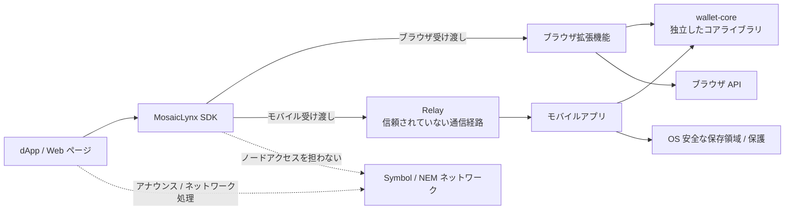

# MosaicLynx アーキテクチャ設計

## 1. 目的

本書は、MosaicLynx v1 を構成するブラウザ拡張機能、モバイルアプリ、Relay、SDK、`symbol-nem-wallet-core`（以下 `wallet-core`）の責任境界、依存方向、秘密情報の境界および署名要求の主要な流れを定める基本設計である。

本書は、現在のワークスペースに実装されている機能だけでなく、要件で定義された Android / iOS のモバイルマイルストーンを含む全体構成を扱う。ただし、現在のワークスペースに `apps/mobile` は存在せず、モバイルアプリを実装済みまたは検証済みとは扱わない。

プロダクト上の要求は [共通要件](../requirements/requirements.md)、[ブラウザ拡張機能要件](../requirements/browser-extension.md)、[モバイルアプリ要件](../requirements/mobile-app.md)、[Relay 要件](../requirements/relay.md)、[SDK 要件](../requirements/sdk.md) を正本とする。下位の API、データ形式、暗号方式および実装方式は、それぞれの仕様書と wallet-core の外部契約で定める。

## 2. 対象と対象外

### 2.1 対象

- dApp / Web ページからブラウザ拡張機能またはモバイルアプリへ署名要求を渡す構成。
- トランザクション署名とメッセージ署名の共通能力。
- プロファイル、アカウント、接続許可、要求ライフサイクル、承認および結果対応のアプリケーション責務。
- Symbol / NEM と Mainnet / Testnet の文脈を保った要求・結果の受け渡し。
- Relay を信頼しない通信経路として利用するモバイル経路。
- `wallet-core` を鍵管理、ウォレットストア、秘密情報処理および生バイト署名の正本として利用する境界。

### 2.2 対象外

- 残高、履歴、ノード選択、継続的なネットワーク状態管理およびアナウンス。
- 利用者確認を省略する自動署名、永続的署名許可および内容を確認しない署名。
- Relay によるトランザクション / メッセージの意味解釈、承認または署名。
- プロファイル全体のバックアップ / 復元を v1 共通能力とすること。個別プラットフォームで提供する場合の範囲は、そのプラットフォームの要件・仕様で決める。
- ハードウェアウォレット、初回ウォレット、MPC、enterprise カストディ、組織向けポリシーエンジンなどを現行の必須構成とすること。

## 3. アーキテクチャ原則

1. 利用者が確認できない要求は、警告だけで署名へ進めず、安全側に終了する。
2. dApp、Web ページ、Provider、コンテンツスクリプト、Relay は秘密情報を取得できない。
3. 利用者の明示的な承認は、ブラウザ拡張機能またはモバイルアプリが管理する確認領域で成立する。SDK、Relay、外部アプリケーションの表示や成功応答は承認の代替にならない。
4. 利用者が確認した要求と実際に署名する対象、要求元、アカウント、チェーン、ネットワークおよび結果の対応を、署名主体側と必要に応じて dApp 側で検証する。
5. `wallet-core` が正本とする鍵管理、ウォレットストア、秘密情報を使用する暗号処理、鍵導出および生の署名を MosaicLynx 側で再実装しない。
6. 共通化するのは要求、許可、ライフサイクルおよび承認の意味であり、Symbol / NEM 固有のトランザクション、メッセージ、アドレス、ネットワーク、鍵識別情報および署名規則を一つの独自規則へ置き換えない。
7. 外部入力は境界ごとに検証する。Relay の構造検証は署名主体の意味解析・表示・承認を代替しない。
8. マニフェスト V3 サービスワーカー、モバイル OS、Relay の可用性を、秘密鍵の保持や承認済み署名の安全な再開の前提にしない。
9. 署名に必要な解析・検証・承認・wallet-core 呼び出しは、外部ノードへ問い合わせずローカルで完結できる境界を持つ。
10. アプリケーションプロファイルは作成時に一つのネットワークと一つのチェーンに固定する。Symbol と NEM の両方を利用する場合はチェーンごとに別プロファイルを使用し、異なるチェーンのアカウント、許可または署名文脈を同じプロファイルに関連付けない。

## 4. システムコンテキスト


```mermaid
flowchart LR
    D[dApp / Web ページ]
    S[MosaicLynx SDK]
    E[ブラウザ拡張機能]
    M[モバイルアプリ]
    R[Relay<br/>信頼されていない通信経路]
    W[wallet-core<br/>独立したコアライブラリ]
    N[Symbol / NEM ネットワーク]
    B[ブラウザ API]
    O[OS 安全な保存領域 / 保護]

    D --> S
    S -->|ブラウザ受け渡し| E
    S -->|モバイル受け渡し| R
    R --> M
    E --> W
    M --> W
    E --> B
    M --> O
    D -.->|アナウンス / ネットワーク処理| N
    S -.->|ノードアクセスを担わない| N
```

ブラウザ拡張機能とモバイルアプリは署名主体である。Relay は署名主体ではなく、dApp とモバイルアプリ間の内容を解釈しない要求 / 応答を受け渡す通信経路である。SDK は dApp と署名主体の接続境界であり、秘密情報を保有するウォレットではない。`wallet-core` は MosaicLynx の UI、接続許可、要求解釈または Relay を内包するものではなく、独立したコアライブラリとして利用する。

## 5. 全体構成

### 5.1 ブラウザ拡張機能経路

```text
dApp / Web ページ
      │
      ▼
MosaicLynx SDK ── window Provider ── コンテンツスクリプト
                                           │
                                           ▼
                                  拡張機能特権を持つ層
                                    ├─ 要求 / 許可文脈
                                    ├─ 承認 UI
                                    └─ wallet-core バインディング
                                           │
                                           ▼
                                      wallet-core
```

Web ページに公開する Provider とコンテンツスクリプトは、秘密情報を扱わない境界層である。拡張機能の特権を持つ層は、ブラウザが観測した要求元と文書文脈、接続許可、要求の完全性、チェーン / ネットワーク / アカウント、承認状態および結果対応を検証する。承認 UI は拡張機能が管理する確認領域であり、Web ページが表示する内容を承認の根拠にしない。

### 5.2 モバイル / Relay 経路

```text
dApp / モバイルブラウザ
      │
      ▼
MosaicLynx SDK ── 暗号化された受け渡し ── Relay
                                      │ 内容を解釈しない配送
                                      ▼
                                  モバイルアプリ
                           ┌──────────┼──────────┐
                           │          │          │
                     要求確認承認  wallet-core
```

モバイルアプリは Relay または OS が提供する外部受け渡し経路から要求を受け取り、送信元・受け渡しセッション・要求内容・期限・チェーン / ネットワーク / アカウントを検証した後、アプリ管理下で表示、承認、署名する。具体的なディープリンク、普遍的な Link、App Link、QR、固定済み wallet-core バインディングのホスト統合および OS API は未確定の詳細設計であり、本書では固定しない。

SDK はブラウザ拡張機能直接経路とモバイル / Relay 経路の操作、結果、失敗の意味を可能な限り共通化する。ただし、通信経路の選択順、利用者が明示的に選択する代替経路、利用不能 / タイムアウトの扱いは未決事項である。利用者拒否、完全性・呼び出し元・リプレイ検証失敗、または結果不明の後に、別通信経路へ自動代替経路して安全境界を迂回してはならない。

## 6. コンポーネントと責任

### 6.1 dApp / Web ページ

- SDK の公開契約を使って接続、アカウントの公開情報取得、トランザクション署名およびメッセージ署名を要求する。
- MosaicLynx が利用者に代わってアナウンス、ノード選択、残高取得または継続的なネットワーク処理を行うことを前提にしない。
- 受け取った署名結果を、元の要求、署名者、アカウント、チェーン、ネットワークおよび操作に対応するか独立して確認する。
- 秘密鍵、ニーモニック、プロファイルパスワード、ウォレットストア、復号鍵および Relay のセッション秘密情報を扱わない。

### 6.2 MosaicLynx SDK

- dApp に対する通信経路非依存の接続・署名・結果・失敗の境界を提供する。
- 利用可能な対応能力、対応操作、チェーン / ネットワーク、バージョンの不一致を成功と誤認させない。
- 要求と結果の対応付け、要求元との結び付け情報、完全性、期限およびリプレイ / 重複の確認を、署名主体 / モバイルアプリが検証できる形で受け渡す。
- Provider とモバイル / Relay の固有エラーを、外部アプリケーションが安全に分岐できる共通分類へ対応付ける。
- 署名対象の最終的な意味解析、表示、利用者承認、秘密情報処理および生の署名は行わない。
- 秘密鍵、ニーモニック、プロファイルパスワード、復号済み Vault、ウォレットストアの秘密部分、署名用秘密情報、Relay 認証情報または内部アカウント ID を dApp に要求・公開しない。

SDK の API 名、メッセージ形式、結果 / エラーの通信上の契約、バージョンポリシーおよび通信経路選択は [SDK 要件](../requirements/sdk.md) と後続仕様に従う。SDK がトランザクションを構築する範囲は未決であり、SDK を Symbol / NEM の汎用 SDK やノードクライアントの代替とは扱わない。

### 6.3 ブラウザ拡張機能

ブラウザ拡張機能は、Chrome 固有の受信、ブラウザ文脈の確認、接続許可、確認 UI、プロファイル / アカウントのアプリケーション管理、wallet-core のバインディング利用および署名結果の受け渡しを担う。

ブラウザ拡張機能の特権を持つ層は、ブラウザ経路における共通署名ゲートの管理主体として、利用者認証、署名可能なロック解除、対象プロファイル / チェーン / ネットワーク / アカウントの署名認可および利用者の明示承認を成立させ、署名前に再確認する。

- `sender`、オリジン、タブ / フレーム / 文書などブラウザが観測できる要求元文脈を最終検証する。
- Provider / コンテンツスクリプトから受けた外部入力を検証し、許可範囲、現在のプロファイル / アカウント、チェーン / ネットワーク、要求の鮮度・完全性を確認する。
- トランザクション / メッセージの対応範囲をチェーン固有のな処理で解析し、利用者が確認できる表示へ変換する。解析不能、表示不能、対象外または未対応の要求は署名しない。
- 拡張機能が管理する確認領域で明示的な承認・拒否を取得し、承認した対象と wallet-core へ渡す生のペイロードの対応を検証する。
- ブラウザ API と拡張機能の保存領域を使うが、Web ページから参照できる領域へ秘密情報を置かない。

マニフェスト V3 サービスワーカーは経路選択、検証、UI 起動および拡張機能ライフサイクルの一部を担い得るが、秘密鍵の保持、ロック解除済みセッションの安全性、承認済み要求の自動再開または処理の可用性をサービスワーカーの寿命に依存させない。停止・再起動・更新・タブ / 文書変更時は、失われた文脈や承認を安全側に無効化し、必要なら新しい要求と再承認を要求する。

### 6.4 モバイルアプリ

モバイルアプリは iOS / Android のホストとして、外部要求の受信、要求元・受け渡しの検証、プロファイル / アカウントのアプリケーション管理、確認 UI、認証・ロック、OS 統合、wallet-core のバインディング利用および署名結果の返却を担う。

モバイルアプリは、モバイル経路における共通署名ゲートの管理主体として、利用者認証、署名可能なロック解除、対象プロファイル / チェーン / ネットワーク / アカウントの署名認可および利用者の明示承認を成立させ、署名前に再確認する。

- ブラウザ拡張機能と UI 実装を共有することを前提にしない。共通化するのはドメイン、要求モデル、署名ポリシー、結果・失敗の意味および wallet-core 境界である。
- ディープリンク、Intent、通知、Relay メタデータなどの外部受け渡し情報を、署名承認の唯一の根拠にしない。
- アプリがバックグラウンド、停止、再起動または OS 終了した場合、未確認・承認済み要求から署名を無条件に再開しない。
- OS の安全な保存領域、ハードウェアで保護された保護、端末ロック、生体認証等を利用する場合、その対応能力と限界をアプリケーション / プラットフォームの責任として扱う。具体的な OS API、固定済み wallet-core バインディングのホスト統合、保存場所は後続設計で決定する。

現在のワークスペースにはモバイルアプリの実装は存在しない。モバイルの要件を満たす構成を示すことと、モバイルの実装・E2E 検証が完了していることを混同しない。

### 6.5 Relay

Relay は信頼しない online 通信経路であり、dApp とモバイルアプリの要求 / 応答を短期間受け渡す。

- E2E で保護された内容を解釈しないエンベロープと、受け渡しに必要な最小限の通信経路メタデータ / 認可を扱う。
- エンベロープの外形、プロトコル、有効期間、セッション / 要求 / 結果の対応、世代、重複および古くなった状態など、意味解釈を伴わない通信経路 / 構造上の検証を担う。
- Relay 障害、再起動、状態消失、改ざん、差し替え、重複または遅延が意図しない署名へ到達しない状態を提供する。
- 要求 / 応答平文、トランザクション / メッセージの意味、署名主体の表示内容、秘密鍵、ニーモニック、プロファイルパスワード、復号済みウォレットストア、署名用秘密情報を復号・解釈・保持・ログ出力しない。
- 署名対象の意味上の検証、表示、利用者の承認・拒否、署名、アナウンス、ノード選択および長期履歴を担わない。

Relay の認証情報と E2E セッション秘密情報は同一視しない。Relay が扱う通信経路認可は必要最小限に限定し、署名能力を与える秘密情報や、モバイルアプリ / SDK の復号に必要な秘密を Relay の責任に置かない。Relay の TTL、状態、世代、保存領域、HTTP および Redis の詳細は Relay 要件・仕様で定め、本書では固定しない。

### 6.6 MosaicLynx アプリケーション / ドメインコア

MosaicLynx 側の共通ドメインは、プロファイル / アカウントのアプリケーション上の関連付け、接続対象範囲、許可、署名要求のライフサイクル、チェーン / ネットワークの文脈、承認ポリシー、結果対応および安全側失敗を扱う。

ここでいうプロファイル / アカウントは MosaicLynx アプリケーションの表示・接続・選択モデルであり、`wallet-core` のプロファイル、ソフトウェア鍵、ウォレットストアと同一の責任単位ではない。アプリケーションは wallet-core が返す内容を解釈しないストアを保存・受け渡しできるが、その内部形式を解釈・編集しない。

アプリケーションプロファイルは作成時に一つのネットワークと一つのチェーンを持ち、作成後にチェーンを切り替えない。アプリケーションアカウント、既定アカウント、許可、有効な文脈および署名認可はそのプロファイルのチェーンと一致するものだけを関連付ける。Symbol と NEM を利用する場合はチェーンごとに別プロファイルを選択し、プロファイル切り替えは旧プロファイルの承認、認証、アカウントの利用認可および保留中の要求を失効させる。異なるチェーンのアカウントや許可を一つのプロファイルに関連付けること、また要求に応じてプロファイルのチェーンを暗黙に切り替えることを設計上許可しない。

### 6.7 チェーン統合 / トランザクション内容検査

Symbol と NEM のトランザクション / メッセージの意味解析、対応範囲の検証、表示用情報への変換およびチェーン / ネットワーク文脈の照合は、署名主体側のチェーン固有の統合が担う。共通の要求 / 承認モデルはこの差異を吸収するが、Symbol と NEM のスキーマ、アドレス、ネットワーク定数、ハッシュ、署名対象バイト列を一つの独自規則へ統合しない。

この層は wallet-core の鍵管理、鍵導出、暗号、生の署名、公開識別情報生成を複製しない。生のペイロードをどのチェーン固有の操作として扱うか、表示・承認可能かを判断し、承認済みの生バイト列を wallet-core の署名境界へ渡す。対応範囲、トランザクション組み立て、アグリゲート / マルチシグ / 連署署名、メッセージ形式の具体的な公開範囲は、各仕様と未決事項に従う。

現在の `packages/chain-symbol` / `packages/chain-nem` は、実装上のチェーン固有の統合として扱う。既存実装に wallet-core と重複する鍵・暗号・署名処理が残る場合、それは本アーキテクチャの責任境界ではなく、wallet-core を正本とする移行対象である。

### 6.8 `symbol-nem-wallet-core`

`wallet-core` は MosaicLynx の内部 UI や Relay の一部ではなく、独立した Rust コアとバインディングからなる外部コンポーネントである。MosaicLynx の正式入口は固定コミット / バージョン 0.2.0 の npm ファサードとする。内部 WASM / ネイティブ ABI を直接呼ばない。バインディングは入力バッファー、固定長 ID、DTO、エラー / 警告および所有責任の変換を担い、鍵導出、秘密情報処理、意味検証および署名を再実装せずコアへ委譲する。MosaicLynx はこの固定済みの公開契約を各ホストから利用する。

このバインディングの境界は API / データ所有責任上の責任境界であり、実行コンテキスト、プロセスまたはハードウェアによる秘密情報の隔離を意味しない。特に WASM は JavaScript と同じ実行文脈内で動作し、WASM linear メモリ、JavaScript の入力バッファー、glue コードまたは実行環境が保持するコピーをホストから自動的に隔離・消去するものではない。バインディング内のコアが管理する一時バッファーの安全な処理と、ホスト側の入力・出力・ライフサイクルの管理は別の責任として扱う。

`wallet-core` が担う責任:

- Mainnet / Testnet に固定された wallet-core プロファイルの管理。
- ニーモニックと Symbol / NEM のチェーン固有のソフトウェア鍵の生成、復元、導出、取込み、削除および明示的エクスポート。導出要求には対象チェーンを明示し、チェーンごとの導出契約を適用する。
- プロファイルパスワードによるウォレットストアの保護、ウォレットストアの検証・更新および秘密情報の処理。
- チェーン固有のなソフトウェア鍵、公開鍵、アドレスの生成・取得。
- 呼び出し側が渡す生バイト列への署名。
- 上記処理に必要な KDF、AEAD、秘密情報の一時的な取り扱い、検証およびエラー境界。

MosaicLynx が担う責任:

- dApp 接続、オリジン / 呼び出し元 / 受け渡し文脈、許可、プロファイル / アカウントの表示・選択・関連付け。
- トランザクション / メッセージの意味解析、対応範囲、表示、利用者の明示的承認・拒否および内容を確認しない署名防止。
- ブラウザ / モバイルホスト、Provider、Relay、OS 統合、要求ライフサイクル、結果対応付けおよび処理の調整。
- 固定済みの wallet-core バインディングを各ホストから呼び出すアダプター / 統合、内容を解釈しないストアの保存、wallet-core のエラーを安全なアプリケーション結果へ対応付けること。

`wallet-core` はトランザクション組み立て、トランザクション / メッセージの利用者向け意味解釈、REST / WebSocket、アナウンス、UI、外部署名主体、ハードウェアウォレット、OS 固有安全な保存領域を担わない。MosaicLynx はその不足を同じ暗号・生の署名実装の再実装で補わない。

wallet-core プロファイル / ソフトウェア鍵とアプリケーションプロファイル / アカウントの対応、同期16関数、三つのバックエンド、エラー / 警告、秘密情報の許容範囲は [wallet-core 統合仕様](../specifications/wallet-core-integration.md) で確定する。MosaicLynx にニーモニック / 秘密鍵を返す初期設定 / エクスポートは現行対象外とし、事前準備済みの内容を解釈しないストアを利用する。symbol-sdk は解析 / 公開ハッシュ / 検証に限り、全署名を正式コア `sign` に委譲する。生バインディング、別生の署名基本機構、秘密鍵エクスポート回避策を禁止する。

### 6.9 共通署名ゲート / セキュリティ不変条件

ブラウザ拡張機能の特権を持つ層とモバイルアプリの信頼されたホストは、共通署名主体として、wallet-core の署名処理へ進む前に、対象の署名要求、署名対象、プロファイル、アカウント、チェーンおよびネットワークに対して、次の4条件をすべて成立させる。このゲートは個別プラットフォームの UI 詳細ではなく、署名主体を利用する全実行経路に共通するアーキテクチャレベルの成立条件である。

1. **利用者認証（認証）**: 現在の利用者または操作主体が認証済みであること。
2. **署名可能なロック解除（署名可能な状態へのロック解除）**: 単なるアプリ利用可能状態ではなく、署名能力を利用可能にする適切なロック解除条件が成立していること。
3. **アカウント利用認可（アカウントの利用認可）**: 対象プロファイル / チェーン / ネットワークの文脈において、対象の署名要求で選択されたアカウントを利用する権限が確認されていること。
4. **利用者の明示承認（利用者による明示的な承認）**: 利用者が署名対象の内容を確認し、当該署名要求を明示的に承認していること。

4条件のいずれかが未成立、ロック済み、不明、古くなった、失効または不整合である場合、署名主体は署名を開始せず、署名結果を成功として返さない。署名前の再確認、要求・文脈のライフサイクル失効および結果返却にもこのゲートと対象結び付けを適用する。接続 / 許可、単なるアプリ利用可能状態、過去の認証、非署名用のロック解除または wallet-core のパスワード / ストア処理の成功だけで、このゲートを代替してはならない。

共通ゲートの成立と再確認はブラウザ拡張機能の特権を持つ層またはモバイルアプリの信頼されたホストの責任であり、下流コンポーネントが迂回できない。dApp、SDK および Relay は、このゲートを成立・更新・免除する権限を持たない。`wallet-core` はウォレットストア、秘密情報処理および生の署名の正本であるが、UI による利用者の明示承認またはアプリケーションレベルの利用者認証、署名可能なロック解除、アカウント利用認可を担わない。認証方式、ロック解除の実装方式、アカウント利用認可の具体的な構造および UI は下位設計へ委譲するが、安全側での終了の共通条件を弱めてはならない。

## 7. 依存方向

### 7.1 現行ワークスペースとの対応

| 現行の場所                                     | 基本設計上の位置付け                                                                                       |
| ---------------------------------------------- | ---------------------------------------------------------------------------------------------------------- |
| `apps/extension`                               | ブラウザ拡張機能ホスト。Provider、コンテンツスクリプト、特権を持つ層、確認 UI、ブラウザ API 境界を実装する |
| `apps/relay`                                   | Relay サーバー。内容を解釈しないエンベロープの通信経路、短期間のみ有効な状態、構造上の検証を実装する       |
| `apps/link-fallback`                           | モバイル受け渡しの代替経路ホスト。署名主体、wallet-core、秘密情報を持たない                                |
| `apps/test-dapp`                               | SDK / Provider の利用者側検証用 dApp。信頼境界の外側にある                                                 |
| `packages/core`                                | MosaicLynx の共通ドメイン、要求、許可、ライフサイクルおよびポリシーの候補                                  |
| `packages/provider-api`                        | ブラウザ Provider の公開契約と結果・エラーの境界                                                           |
| `packages/sdk`                                 | dApp 向け SDK と通信経路アダプターの境界                                                                   |
| `packages/relay-protocol`                      | Relay 受け渡しのクライアント / プロトコル契約。Relay に意味解釈を追加しない                                |
| `packages/chain-symbol` / `packages/chain-nem` | Symbol / NEM のチェーン固有の内容検査 / 統合。wallet-core の鍵・暗号・生の署名の代替ではない               |
| `packages/profile-backup`                      | バックアップ形式を提供する場合のアプリケーション側の補助。v1 共通能力や wallet-core のストア責務を決めない |
| `packages/release-evidence`                    | Mainnet 対応能力とリリース証跡の境界。署名要求の実行主体ではない                                           |
| `_snwc`                                        | `wallet-core` の独立した外部コンポーネント。MosaicLynx パッケージの内部実装として統合しない                |

`apps/mobile` やモバイル用パッケージは現在存在しない。モバイルアプリのホスト固有実装を、既存拡張機能の UI や現在のパッケージから実装済みと推定しない。

```text
dApp
  └─> sdk ──> provider-api / relay-protocol（公開・受け渡し契約）

拡張機能 ──> MosaicLynx ドメイン / 要求ポリシー
拡張機能 ──> provider-api
拡張機能 ──> wallet-core バインディング
拡張機能 ──> チェーン固有の内容検査
拡張機能 ──> ブラウザ API / 拡張機能保存領域

モバイル ────> MosaicLynx ドメイン / 要求ポリシー
モバイル ────> wallet-core バインディング
モバイル ────> チェーン固有の内容検査
モバイル ────> OS 統合

relay ─────> 通信経路 / プロトコル検証のみ

wallet-core ──> 自身の Rust 実装とチェーン互換性契約
```

依存の原則は次のとおりである。

- ドメイン / 要求ポリシーはブラウザ API、モバイル OS、DOM、Relay サーバー、特定保存領域および `wallet-core` 内部実装へ依存しない。
- Provider / コンテンツスクリプトは拡張機能の特権を持つ層や wallet-core へ秘密情報を渡す依存を持たない。
- SDK はブラウザ拡張機能、モバイルアプリ、wallet-core、Relay サーバーを内包しない。
- Relay は MosaicLynx のドメイン、チェーンパーサー、wallet-core、Vault または署名ポリシーへ依存しない。
- チェーン固有の内容検査は wallet-core の鍵管理・暗号・生の署名を呼び出し側で再実装しない。署名実行は wallet-core 境界へ委譲する。
- アプリケーションは wallet-core のストア blob を内容を解釈しない値として扱い、内部スキーマをアプリケーションのドメインモデルに取り込まない。

## 8. 信頼境界

```text
┌──────────────────────────── 外部・信頼しない領域 ────────────────────────────┐
│ Web ページ / dApp │ 注入された Provider │ コンテンツスクリプト │ Relay │ OS / ネットワーク │
└───────────────┬────────────────────┬─────────────────┬──────┬──────────────┘
                │検証済み要求         │検証済みチャネル │内容を解釈しない │外部結果
                ▼                     ▼                 ▼      ▼
┌──────────────────── MosaicLynx のホスト境界 ────────────────────┐
│ 拡張機能特権を持つ層 / モバイルアプリ                          │
│ - 呼び出し元・セッション・許可・要求完全性                  │
│ - チェーン / ネットワーク / アカウント整合性                                │
│ - 利用者認証・署名可能なロック解除・アカウント利用認可                  │
│   ・利用者の明示承認による共通署名ゲート                            │
│ - 意味上の内容検査・表示・明示的な承認                  │
│ - ライフサイクル・結果対応付け・安全な失敗                      │
└──────────────────────────────┬───────────────────────────────────┘
                               │ 結び付け / 承認済み生バイト列
                               ▼
┌────────────── 秘密情報処理の論理 / API 境界 ───────────────────────┐
│ wallet-core                                                        │
│ - ウォレットストア・鍵材料・秘密情報を使用する暗号・生の署名       │
└───────────────────────────────────────────────────────────────────┘
```

Web ページ、Provider、コンテンツスクリプトおよび Relay は、署名可否を決める最終的な信頼主体ではない。拡張機能 / モバイルの確認領域は、外部入力を検証した後に利用者が判断する場所である。wallet-core はアプリケーションの承認を代行せず、アプリケーションから渡された操作をその契約に従って実行する秘密情報処理の正本および論理 / API 境界である。ただし、バインディング自体がホスト実行環境、別プロセスまたはハードウェアから秘密情報を隔離するわけではない。実際の保護は、バインディングを公開する信頼されたホスト文脈、ブラウザ / OS のセキュリティ境界、ホストライフサイクルおよび不要な秘密情報を保持しない設計の組み合わせで成立する。

## 9. 鍵・秘密情報の境界

| 情報                                | 正本・取扱主体                                   | Web ページ / SDK                 | Relay                                        | ブラウザ / モバイルホスト                                                        |
| ----------------------------------- | ------------------------------------------------ | -------------------------------- | -------------------------------------------- | -------------------------------------------------------------------------------- |
| ニーモニック、秘密鍵                | wallet-core                                      | 渡さない                         | 受け取らない                                 | MosaicLynx は取得・保持せずコア内だけで扱う                                      |
| プロファイルパスワード              | wallet-core の各処理に対するアプリケーション入力 | 渡さない                         | 受け取らない                                 | UI / OS 認証情報から wallet-core へ一時的に渡す責任と保持期間を管理する          |
| ウォレットストア / 復号済み秘密情報 | wallet-core とホストのバインディング境界         | 渡さない                         | 受け取らない                                 | ストアは内容を解釈せずに保存し、復号済み秘密を provider / relay / ログへ出さない |
| E2E セッション秘密情報              | SDK / モバイル受け渡しのクライアント側の境界     | dApp の公開 API に露出させない   | Relay の署名能力にならない                   | モバイル / SDK が必要な範囲で処理し、Relay と混同しない                          |
| Relay 通信経路認可                  | SDK / モバイル / Relay の契約で定める最小情報    | dApp が任意指定しない            | エンドポイント認可に必要な最小限だけ処理する | 受け渡しの文脈と結び付けて検証する                                               |
| 公開鍵 / アドレス / 署名            | wallet-core の公開結果をホストが利用             | 許可された公開情報と結果だけ返す | 内容を解釈しない結果として中継する           | チェーン / ネットワーク / アカウントと対応付けて表示・検証する                   |

秘密情報は URL、ディープリンク、App Link、通知、Relay 本文、Provider イベント、コンテンツスクリプトメッセージ、SDK エラー、ログ、警告、診断情報、利用状況分析および遠隔計測データに不要に含めない。ブラウザ / モバイルの保存・認証・OS 保護はホストの責任であり、wallet-core の内部暗号・ストア形式・メモリ処理をホスト側で複製しない。WASM バインディングを利用する場合も、JavaScript の入力バッファー、WASM glue コードまたは実行環境のコピーをコアのゼロ化が自動的に消去するとは扱わず、ページ / コンテンツスクリプトへバインディングを公開しない。

## 10. 署名要求の主要フロー

1. dApp が SDK の共通契約からトランザクション署名またはメッセージ署名を要求する。
2. SDK が利用可能性、操作、チェーン / ネットワーク、バージョンおよび通信経路の契約を確認し、要求を選択された受け渡しへ渡す。具体的な通信経路選択は未決事項を尊重する。
3. ブラウザ拡張機能またはモバイルアプリが、要求元・接続・セッション・許可、要求の完全性・鮮度・重複、チェーン / ネットワーク / アカウントを検証する。
4. 署名主体側のチェーン固有の統合が、トランザクション / メッセージを対象範囲内として完全に解析・表示可能か検証する。理解できない、未対応、表示できない、改ざんされた要求は署名しない。
5. 署名主体が管理する確認領域で、利用者が署名対象、チェーン、ネットワーク、アカウント、確認可能な影響を確認し、要求ごとに明示的に承認または拒否する。
6. 署名主体が共通署名ゲートを適用し、利用者認証、署名可能なロック解除、対象プロファイル / チェーン / ネットワークにおけるアカウント利用認可および当該要求への利用者の明示承認がすべて成立していることを、署名前に再確認する。いずれかが確認できなければ署名しない。
7. 承認された元要求と実際の生のペイロード、署名主体、アカウント、チェーン、ネットワークの対応を再確認する。
8. 署名主体が wallet-core の契約を使って承認済み生バイト列に署名する。MosaicLynx 側は秘密鍵、KDF、AEAD、生の署名アルゴリズムを実行しない。
9. 署名主体が署名結果と元要求の対応、および署名時に成立した共通署名ゲートの文脈を確認し、確認不能な場合は成功結果を返さず、SDK を通じて安全側の結果を返す。Relay を使う場合、Relay は結果を生成・変更せずに中継する。
10. dApp が署名結果を独立して検証し、必要なノード処理やアナウンスを自ら行う。

## 11. ブラウザ拡張機能の詳細境界

| 境界                                                         | 信頼度                   | 主な責任                                                                                                     |
| ------------------------------------------------------------ | ------------------------ | ------------------------------------------------------------------------------------------------------------ |
| Web ページ ↔ 注入された Provider                             | 信頼しない               | 公開 API の受け渡し。秘密情報を扱わない                                                                      |
| Provider ↔ コンテンツスクリプト                              | 信頼しない               | 要求の搬送。ブラウザ文脈の最終保証や承認を行わない                                                           |
| コンテンツスクリプト ↔ 拡張機能特権を持つ層                  | 特権を持つ層が検証       | 送信者、オリジン、文書文脈、許可、ライフサイクルを確認する                                                   |
| 特権を持つ層 ↔ 承認 UI                                       | 拡張機能管理下           | 利用者への表示、明示的承認・拒否、承認対象の保持と再検証                                                     |
| 承認 UI / 信頼されたホスト ↔ 固定 wallet-core バインディング | 秘密情報処理の境界       | 固定済みバインディングの API 契約に従い、承認済み生バイト列の署名を依頼する                                  |
| 拡張機能 ↔ ブラウザ保存領域                                  | ホスト管理下だが環境依存 | 内容を解釈しないウォレットストアと必要なアプリケーションメタデータを保存する。Web ページから直接参照させない |

Provider / コンテンツスクリプトは、wallet-core の公開 API、秘密鍵、ニーモニック、パスワード、復号鍵、復号済みストアおよび署名結果の秘密部分を参照できない。サービスワーカーが停止した場合に、承認済みだからという理由だけで署名を再開しない。再開可能性を設計する場合も、要求・文脈・鮮度・利用者承認・wallet-core 認証を再確認できない状態では署名しない。

## 12. モバイル / Relay の詳細境界

モバイルアプリは、外部経路から得たメタデータや自己申告オリジンをそのまま信頼せず、受け渡しセッションと要求元、要求内容、期限および許可状態を自ら確認する。Relay の配送成功、モバイルアプリの起動、外部ブラウザの表示または URL の存在だけでは呼び出し元検証済みや署名成功を成立させない。

Relay は内容を解釈しないエンベロープの配送調整役であり、モバイルアプリの意味上の検証、表示、承認、認証または署名を代替しない。Relay 再起動、有効な状態消失、古くなった要求、重複、結果不明の場合、モバイルアプリと SDK は古い承認を再利用せず、安全側に終了する。再試行を提供する場合は、要求・セッション・必要な承認を新しくする。

モバイルアプリのプロファイル / アカウント表示・選択・関連付け、OS 保護能力の表示、ロック・再認証、OS ライフサイクル、バックアップ / 移行の提供範囲はモバイルアプリケーションの責任である。wallet-core がプロファイル全体のバックアップ / 移行 / 復旧を提供すること、また OS 安全な保存領域が wallet-core の内部機能であることを前提にしない。

## 13. Symbol / NEM の共通化方針

| 共通化するもの                                                        | チェーン固有に保つもの                                                           |
| --------------------------------------------------------------------- | -------------------------------------------------------------------------------- |
| 要求 / 応答のライフサイクル、対応付け、許可、承認ポリシー、安全側失敗 | トランザクションスキーマ、メッセージ形式、アドレス、ネットワーク定数             |
| チェーン / ネットワーク / アカウントを含む文脈モデル                  | トランザクションの意味上の内容検査、影響の表示、対応型 / バージョン              |
| dApp に見せる操作の意味と結果分類                                     | ハッシュ、署名対象バイト列、署名検証、アグリゲート / マルチシグ / 連署署名の扱い |
| ホスト間の wallet-core バインディング境界                             | `wallet-core` が提供するチェーン固有の鍵 / 公開識別情報 / 生の署名               |

Symbol と NEM は同じアプリケーションの署名接点から扱えるが、プロファイルは一つのチェーンに固定する。両チェーンを利用する場合はチェーンごとに別プロファイルを使用し、各プロファイル内でアカウント / 鍵識別情報、既定アカウント、許可および署名文脈を単一チェーンに限定する。各アカウントはチェーン、プロファイルのネットワークおよび対応するチェーン固有のソフトウェア鍵に明示的に関連付ける。ニーモニックからの導出では対象チェーンを指定してチェーンごとの導出契約を利用し、Symbol 用の秘密鍵を NEM 用として、または NEM 用の秘密鍵を Symbol 用として暗黙に利用しない。一つのアカウントの秘密鍵を Symbol / NEM で暗黙共用する標準アカウントモデルは採用しない。具体的な導出パス、アルゴリズム、ライブラリおよび生の秘密鍵インポートの検証・UX は wallet-core / チェーン統合またはプラットフォーム下位設計へ委譲する。

## 14. オンライン / ローカル処理境界

本書でいうローカル完結またはオフライン署名とは、ブラウザやスマホがインターネットへ接続中であっても、署名に必要な要求検証、トランザクション / メッセージの解析・表示、利用者承認、wallet-core の鍵処理・署名および署名結果の検証を外部ノードへの問い合わせなしで完了できることをいう。これは air-gapped 初回ウォレットを意味しない。

MosaicLynx はノード接続、REST / WebSocket、ノード選択、残高・履歴取得、アナウンスおよび継続的なネットワーク状態を担わない。dApp または別のネットワーク層が署名結果を検証し、必要なネットワーク処理を行う。Relay はオンライン通信経路だが、署名内容を理解するオンライン署名サービスではない。

## 15. 外部依存境界

| 外部依存                                                 | MosaicLynx が委ねるもの                                                                     | MosaicLynx が保持する責任                                                                                                     |
| -------------------------------------------------------- | ------------------------------------------------------------------------------------------- | ----------------------------------------------------------------------------------------------------------------------------- |
| `wallet-core` と固定済みネイティブ / WASM バインディング | ウォレットストア、秘密情報を使用する暗号、鍵導出、公開識別情報、生の署名                    | 各ホストからのバインディングアダプター / 統合、内容を解釈しないストアの保存、アプリケーションの承認・表示、エラーの安全な扱い |
| Symbol / NEM の SDK・互換性資料                          | チェーン固有のスキーマ、ネットワーク、アドレス、ハッシュ、署名規則の実装基準                | 対応範囲の選択、完全な解析・表示、チェーン / ネットワーク文脈、内容を確認しない署名防止                                       |
| ブラウザ API / 拡張機能保存領域                          | ブラウザ文脈、拡張機能ライフサイクル、ホスト保存領域                                        | オリジン / 呼び出し元検証、web との隔離、再起動時の安全側処理、権限・承認                                                     |
| iOS / Android OS                                         | アプリライフサイクル、外部受け渡し、安全な保存領域 / ハードウェアで保護された対応能力の候補 | 対応能力の正確な表示、認証・ロック、端末状態と署名可否の整合                                                                  |
| Relay サービス / Redis 等                                | 内容を解釈しないエンベロープの受け渡し、短期間のみ有効な状態、通信経路検証                  | Relay を信頼しない前提、E2E 完全性、意味上の検証・承認・署名を Relay 外に置く                                                 |
| dApp のノード / ネットワーク層                           | アナウンス、ノード選択、残高・履歴・継続的ネットワーク状態                                  | 署名結果が元要求に対応することを検証可能に返す                                                                                |

外部 SDK の便利 API、ブラウザ API の状態、OS の保護対応能力、Relay の配送成功を、秘密情報の安全性、利用者承認または署名結果の正当性の単独の根拠にしない。

## 16. 非機能・セキュリティ上の主要原則

- 外部入力、要求、結果、受け渡しメタデータ、ウォレットストアおよびバインディングの戻り値を検証し、検証不能な場合は不合格終了済みにする。
- 秘密情報、パスワード、復号済みストア、セッション秘密情報および通信経路認証情報をエラー、ログ、警告、診断情報、利用状況分析、遠隔計測データ、URL、通知へ含めない。
- 利用者の承認前、利用者認証、署名可能なロック解除、アカウント利用認可または利用者の明示承認のいずれかが未成立のとき、または要求内容の変更後、要求元文脈の変更後、期限切れ・リプレイ・重複・結果不明の状態では署名しない。
- Provider、SDK、Relay、外部アプリケーションによる self-reported オリジン、アカウント、チェーン、ネットワークまたは表示文言を、検証済み情報として無条件に採用しない。
- Mainnet 対応能力は、適用されるリリース証跡 / ポリシーを満たした場合だけ有効化する。判定不能や根拠不足で安全条件を満たさない継続にしない。
- ブラウザ拡張機能のソフトウェア署名主体、モバイルの OS 保護、wallet-core の保証範囲を混同せず、ハードウェアウォレット、初回ウォレット、カストディ相当の保証を表示しない。
- 詳細なスキーマ、タイムアウト、再試行、保存領域鍵、レコード配置、Redis 鍵、排他制御 / CAS、暗号パラメーター、byte-level 通信上の形式は、この基本設計で発明せず、対応する要件・仕様・wallet-core 契約へ委ねる。

## 17. 未決事項と設計への引継ぎ

以下は本書で勝手に決定しない。

- `CR-OPEN-001` / `CR-OPEN-002`: 固定済み wallet-core バインディングを各ホストから利用するアダプター / 識別情報対応付け、React ネイティブ共通 API、エラー対応付けは Wallet-core 統合で確定済み。OS 保護・移行手順だけを後続判断とし、生の秘密情報の受渡しを追加しない。
- `MR-OPEN-002` / `MR-OPEN-003` / `MR-OPEN-005` / `MR-OPEN-006`: モバイルの受信経路、OS 保護、固定済み wallet-core バインディングのホスト統合、ライフサイクル、バックアップ / 移行。
- `SDK-OPEN-002` / `SDK-OPEN-003` / `SDK-OPEN-004` / `SDK-OPEN-006` / `SDK-OPEN-007`: アグリゲート / 連署署名の SDK 公開範囲、通信経路選択と代替経路、トランザクション組み立て、バージョンポリシー、呼び出し元 / オリジンとの結び付け。
- 共通要件 `OPEN-003`: Android / iOS / Relay の個別マイルストーン完了条件とプラットフォーム固有依存。
- メッセージ署名の具体的形式、公開操作名、結果・エラー・受け渡し契約は、v1 の共通能力として承認済みであり、[Web トランザクション受け渡し仕様](../specifications/web-transaction-handoff-spec.md) と下位の署名プロトコルを正本とする。アーキテクチャでは署名主体の責務、トランザクション署名との分離および既存契約への委譲だけを保持し、API、通信上の、エンコーディングまたはシリアライズ済みのメッセージ形式を再定義しない。
- Symbol / NEM トランザクションの対応型 / バージョン、アグリゲート / マルチシグ / 連署署名を含む意味上の内容検査の具体範囲。
- プロファイル全体バックアップ / 復元のプラットフォームごとの責任分担と wallet-core 内容を解釈しないストアの移行方法。

### 17.1 責務・不変条件・下流引継ぎの追跡

アーキテクチャで定める責務、不変条件および未決事項は、次の正本となる下流設計 / 仕様が詳細化する。責任主体は各責務を実行または成立させる主体を示し、委譲境界を越えてアーキテクチャの責任分界を再定義してはならない。

| アーキテクチャの責務・不変条件・未決事項                                                                                                                                            | 正本となる下流設計 / 仕様                                                                                                                                                       | 責任主体                                                                      | アーキテクチャから委譲する境界                                                                                                                                |
| ----------------------------------------------------------------------------------------------------------------------------------------------------------------------------------- | ------------------------------------------------------------------------------------------------------------------------------------------------------------------------------- | ----------------------------------------------------------------------------- | ------------------------------------------------------------------------------------------------------------------------------------------------------------- |
| 共通セキュリティ / 信頼境界、秘密情報分離、安全側での終了、共通署名ゲート（利用者認証、署名可能なロック解除、アカウント利用認可、利用者の明示承認）                                 | [共通セキュリティ設計](./security-design.md) §5、§7–§8、§15、§17                                                                                                                | 署名主体（ブラウザ拡張機能の特権を持つ層 / モバイルアプリの信頼されたホスト） | 認証方式、ロック解除方式、認証情報保存、UI 詳細。wallet-core は利用者の明示承認とアプリケーションレベルの利用者認証 / 認可を担わない                          |
| 署名要求のライフサイクル、承認 / 対象結び付け、署名前再検証、古くなった / ライフサイクル / 結果不明の扱い                                                                           | [署名フロー基本設計](./signing-flow.md) §7–§8、§16、§23                                                                                                                         | 署名主体（ブラウザ拡張機能 / モバイルアプリ）                                 | API、通信上の契約、具体的な状態遷移、再試行 / エラー契約                                                                                                      |
| 要求 / 結果の概念モデル、境界ごとの検証、対応付けおよび結果の責任                                                                                                                   | [共通データモデル・インターフェース基本設計](./interfaces.md) §4、§7–§9、§11                                                                                                    | 各境界の実装主体（SDK、署名主体、Relay、wallet-core）                         | API、スキーマ、DTO、エンコーディング、エラー一覧                                                                                                              |
| ブラウザの要求元文脈、許可、信頼された UI、ブラウザライフサイクル、共通署名ゲートのブラウザ適用                                                                                     | [ブラウザ拡張機能基本設計](./browser-extension.md) §4、§6、§8、§10–§12、§20–§24                                                                                                 | ブラウザ拡張機能の特権を持つ層                                                | Chrome API、メッセージ、保存領域、UI 配置、具体的なロック / ロック解除およびライフサイクル実装                                                                |
| モバイルの外部受け渡し、端末 / アプリ認証、プロファイル / アカウント、信頼された UI、OS ライフサイクル、共通署名ゲートのモバイル適用（`MR-OPEN-002` / `003` / `005` / `006`）       | [モバイルアプリ基本設計](./mobile-app.md) §4、§6、§10、§12、§15–§18、§24–§28                                                                                                    | モバイルアプリの信頼されたホスト                                              | OS API、受け渡し方式、認証情報、画面 / UI、具体的なライフサイクル、バインディングのホスト連携                                                                 |
| Relay の内容を解釈しない通信経路、構造検証、短期状態、古くなった / 重複 / 状態消失の安全側処理（`RR-OPEN-001` / `002`）                                                             | [Relay 基本設計](./relay.md) §3、§5、§7–§12、§25–§32                                                                                                                            | Relay サービス                                                                | HTTP / Redis、TTL、セッション / 世代、認証形式、保存領域、頻度上限および通信上のプロトコル                                                                    |
| dApp 側の非特権連携、要求構築、対応付け、通信経路抽象化、共通署名ゲートの非代替（`SDK-OPEN-002` / `003` / `004` / `006` / `007`）                                                   | [SDK 基本設計](./sdk.md) §4、§6、§11–§18、§22–§25                                                                                                                               | SDK / dApp 側の連携層                                                         | API、通信上の形式、通信経路選択、呼び出し元結び付け、バージョンポリシー、再試行 / エラー詳細                                                                  |
| Symbol / NEM および Mainnet / Testnet の分離、チェーン固有内容検査、対応型 / バージョン、署名対象バイト列                                                                           | [チェーン互換性仕様](../specifications/chain-compatibility-spec.md)                                                                                                             | チェーン固有統合と wallet-core 契約                                           | スキーマ、型 / バージョンの具体範囲、シリアライズ、ハッシュ / 署名バイト列、フィクスチャおよびパーサー詳細                                                    |
| アプリケーションのプロファイル / アカウント関連付け、署名アカウント利用認可、プロファイル全体バックアップ / 復元の共通非包含、`CR-OPEN-001` / `002` のプロファイル / アカウント対応 | [プロファイル / アカウント仕様](../specifications/profile-account-spec.md)                                                                                                      | MosaicLynx アプリケーション（ホストが適用）                                   | 許可構造、バックアップ / 復元、移行、内容を解釈しないストアの具体形式およびプラットフォームごとの提供範囲                                                     |
| `CR-017` / `CR-AC-020` の単一チェーンプロファイル境界、異なるチェーンのアカウント / 許可 / 署名文脈の分離                                                                           | [要件](../requirements/requirements.md) `CR-017`、`CR-AC-020`、[プロファイル / アカウント仕様](../specifications/profile-account-spec.md) §3、§11、§26                          | MosaicLynx アプリケーション（各ホストが適用）                                 | プロファイルメタデータ、アカウント関連付け、許可の具体構造、既存データ移行・互換性およびバックアップ形式は下位仕様 / 未決へ委譲                               |
| ウォレットストア、鍵管理、秘密情報処理、生の署名および固定済み v1 バインディング（`CR-OPEN-001` / `002` のホスト統合を除く）                                                        | [`wallet-core` 外部仕様](../../_snwc/docs/specifications/specification.md)                                                                                                      | `wallet-core`（秘密情報処理） / ホストアダプター（連携）                      | Rust / バインディング API、暗号処理、鍵導出、秘密情報の一時ライフサイクル、所有責任、エラー対応付け。固定済みバインディング方式をアーキテクチャで再選択しない |
| Mainnet 対応能力、リリース証跡、根拠不足時の安全側での終了                                                                                                                          | [Mainnet リリース証跡](../release/mainnet-release-evidence.md)                                                                                                                  | リリース / 操作と `packages/release-evidence`                                 | 根拠の収集・署名・信頼鍵・ビルド埋め込み・実行環境強制の運用詳細                                                                                              |
| v1 メッセージ署名の共通能力、トランザクション署名との分離、既存受け渡しの結果 / 失敗意味                                                                                            | [Web トランザクション受け渡し仕様](../specifications/web-transaction-handoff-spec.md) §2、§5.2、§5.2.1、および [署名プロトコル](../specifications/signing-protocol.md) §15〜§16 | 署名主体と受け渡しの各責任主体                                                | `signData`、`SignedData`、通信上のスキーマ、エンコーディング、具体的エラー対応付けおよびプラットフォーム表示受け入れ条件                                      |

## 18. 関連資料

### 要件・上流

- [コンセプトシート](../concept/concept-sheet.md)
- [共通要件](../requirements/requirements.md)
- [ブラウザ拡張機能要件](../requirements/browser-extension.md)
- [モバイルアプリ要件](../requirements/mobile-app.md)
- [Relay 要件](../requirements/relay.md)
- [SDK 要件](../requirements/sdk.md)

### 仕様・設計判断

- [プロダクト仕様](../specifications/product-spec.md)
- [Web トランザクション受け渡し仕様](../specifications/web-transaction-handoff-spec.md)
- [チェーン互換性仕様](../specifications/chain-compatibility-spec.md)
- [プロファイル / アカウント仕様](../specifications/profile-account-spec.md)
- [Mainnet 根拠 Lite ADR](../adr/0001-mainnet-evidence-lite.md)

### 外部コンポーネント契約

- `_snwc/README.md`
- `_snwc/docs/requirements/requirements.md`
- `_snwc/docs/specifications/specification.md`
- `_snwc/docs/decisions/binding-implementation.md`
