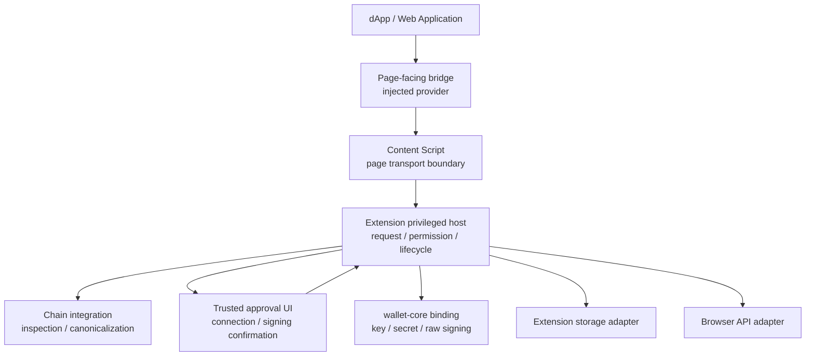

# MosaicLynx Browser Extension 基本設計

## 1. 目的

本書は、MosaicLynx Browser Extension を、Symbol / NEM dApp からの署名要求を安全に受け取り、利用者が内容を確認して明示的に承認または拒否し、署名結果を要求元へ返すローカル Signer として設計する。

本書は Browser Extension 固有のコンポーネント構成、責任分界、Trust Boundary、Origin / Permission、要求 lifecycle、trusted UI、lock / unlock、保存および Browser lifecycle を定める。署名の共通意味、共通データモデル、wallet-core の暗号・鍵管理契約および Relay / Mobile の protocol は、本書で再定義しない。

## 2. 適用範囲と上位設計との関係

対象は、現在の Browser Extension milestone における次の能力である。

- Web Application / dApp からの接続要求、Account の公開情報取得および署名要求の受付。
- Browser が観測した要求元 context に基づく Origin の識別と、Origin 単位の接続・公開許可。
- Symbol / NEM、Mainnet / Testnet、Profile / Account の整合性を保った署名対象の検証と表示。
- Browser v1 の `MESSAGE_SIGN` を、既存の structured message contract に従う署名 operation として提供すること。arbitrary raw bytes signing や、解析・表示不能な message の fallback は含めない。
- Extension が管理する trusted UI での接続許可、署名内容の確認、明示的な approve / reject および要求ごとの認証。
- `wallet-core` を利用した鍵管理、秘密情報処理および raw signing。
- 署名結果または安全に分類された拒否・失敗結果の、元の request への binding を保った返却。

本書は次の上位資料と合わせて適用する。

- [MosaicLynx アーキテクチャ設計](./architecture.md)
- [MosaicLynx 共通セキュリティ設計](./security-design.md)
- [MosaicLynx 署名フロー基本設計](./signing-flow.md)
- [MosaicLynx 共通データモデル・インターフェース基本設計](./interfaces.md)
- [MosaicLynx ブラウザ拡張機能要件定義書](../requirements/browser-extension.md)
- [MosaicLynx Concept Sheet](../concept/concept-sheet.md)

共通設計と本書が重なる場合、共通の security invariant、署名 semantics、request / response の意味および wallet-core の責任境界は上位設計を優先する。本書は、それらを Browser の実行 context、UI、lifecycle および local signer の責務へ適用する。

## 3. 設計前提

### 3.1 Browser Extension の位置付け

Browser Extension は単独の資産管理 wallet や node client ではなく、Web Application / dApp と Signer の間にある利用者向けの署名クライアントである。秘密情報を Web page へ渡さず、署名対象を Signer 自身が検証・表示し、利用者の明示的な意思決定を成立させることを中心責務とする。

Browser Extension は次を担わない。

- 署名済み transaction の announce、node 選択、残高・履歴取得または継続的な network state 管理。
- Relay を使った Mobile remote signing。Relay は Mobile 経路の opaque transport であり、Browser Extension の local signing 経路には含めない。
- dApp が用意した表示文言、transaction summary、site branding または Web page 内の approve UI を署名判断の根拠とすること。
- `wallet-core` の暗号、KDF、Wallet Store、鍵導出または raw signing の独自実装。

### 3.2 初回対応範囲と拡張可能性

初回 Browser Extension milestone の提供・サポート対象は Chrome とする。将来 Chromium 系以外へ展開できるよう、Browser API、Origin 観測、Extension lifecycle、Storage および trusted UI の platform 差異は adapter 境界へ閉じ込める。ただし、対応 Browser が変わっても security invariant、Origin binding、明示承認および fail-closed を緩和してはならない。

## 4. Browser Extension の責務

Browser Extension は、次の責務を一つの trusted host の中で調整する。

1. Browser が観測した tab、frame、document および Origin context と、受信した request の対応を確認する。
2. 接続要求と署名要求を区別し、Origin、Profile、Account、Chain、Network および permission の scope を検証する。
3. request の完全性、鮮度、重複、replay、session、permission revision および lifecycle を管理する。
4. chain-specific integration を使って transaction / message を parse、validate、canonicalize および inspection する。
5. 利用者に Origin、Chain、Network、Account、署名対象および確認可能な影響を提示する。
6. Extension が管理する trusted UI で、接続許可または request ごとの approve / reject と認証を受け取る。
7. `Authentication`、`Signing-capable unlock`、対象 Profile / Chain / Network / Account に対する `Account authorization` および `Explicit user approval` を、同一 request・caller context・Profile・Account・Chain / Network・operation・exact target・freshness context に対する独立した必須条件として成立・再確認する。
8. 承認対象と実際に `wallet-core` へ渡す payload、Account、Chain、Network および caller が一致することを署名前に再検証する。
9. `wallet-core` の Binding を介して署名し、戻り値を検証して元 request へ対応付ける。
10. lock、unlock、manual lock、idle、Browser restart、Extension reload および context loss に伴う安全側の状態遷移を管理する。
11. Account、Profile、permission、session および settings の Application 上の関連付けを管理する。

Browser 固有の orchestration と cryptographic core は分離する。Browser Extension が実装する署名処理とは、chain-specific inspection 済みの承認対象を wallet-core の契約へ渡し、結果を安全に受け取るまでの境界を指す。暗号処理そのものを Browser Extension の独自責務とはしない。

Browser privileged layer は Browser Signer として、上記4条件の成立、署名前の再確認、失効および success result への帰属を担う唯一の Signer-side orchestration owner である。Provider、Content Script、SDK、dApp または wallet-core が、4条件を成立・変更・免除・迂回することはできない。

## 5. コンポーネント構成



### 5.1 Page-facing bridge

Web page に公開する Provider または injected bridge を担う。dApp が Extension の存在と公開 API を検出し、接続・署名要求を送るための page-facing boundary である。

- Web page の実行 context にあるため、常に untrusted input / untrusted code として扱う。
- Secret、Wallet Store、内部 Account reference、permission decision、認証状態を保持・返却しない。
- dApp から渡された Origin、Account、表示文言、transaction summary を verified information として昇格させない。
- response は request correlation を保つが、response の正当性を page-facing bridge 自身が決定しない。

Extension の検出可能性は connection または signing capability の許可を意味しない。検出結果、API の存在または `ready` 通知だけで Account 情報や署名能力を公開してはならない。

### 5.2 Content Script

Page context と Extension privileged host の間で、request / response を搬送する境界である。

- Web page から受けた入力を最小限の構造検査後、privileged host へ渡す。
- browser が観測した context と page が申告する値を混同しない。
- Secret、復号済み Vault、署名可能状態または trusted UI の状態を公開しない。
- Extension context の停止、document 破棄、navigation または通信切断を検知できない・報告できない場合、署名を継続する根拠にしない。

Content Script が isolated world 等で動作しても、Content Script 自体を trusted signer とみなさない。最終的な caller、Origin、permission、request integrity および署名判断は privileged host が担う。

### 5.3 Extension privileged host

Extension の trusted application 層であり、Service Worker 等の実行形態には依存しない論理責務として定義する。

- Browser API から得た sender、top-level document、tab / frame、Origin および context identity を検証する。
- request reception、permission / session binding、Account 選択、lifecycle、approval orchestration および response delivery を担う。
- Browser Signer として、Authentication、Signing-capable unlock、対象 Profile / Chain / Network / Account に対する Account authorization および Explicit user approval の4条件を独立に成立・再確認する。この4条件は connection、permission、capability、session、ordinary `UNLOCKED`、previous authentication、Account selection、Provider / SDK state または wallet-core の状態から推論しない。
- chain integration の inspection 結果を trusted UI に渡し、UI の結果を request identity に binding する。
- `wallet-core` の入力を準備し、承認対象との一致を再検証して Binding adapter を呼び出す。
- `wallet-core` から返された error、warning、validation failure、Store integrity failure または結果不明を成功に変換しない。

Service Worker の停止・再生成を前提に署名承認を安全に復元しない。Service Worker は routing や一時 orchestration の host になり得るが、長寿命の unlocked secret、承認済み request の自動再開または署名 capability の継続をその寿命に依存させない。

### 5.4 Profile / Account / Permission 管理

Profile、Application Account、接続許可および current settings の関連付けを管理する。これは wallet-core の Wallet Store や key slot そのものではない。

- 外部へ公開する Account は public identity に限定する。
- 外部 request の account identifier は、privileged host が permission、Profile、Chain、Network および signer identity と照合するための補助情報であり、外部 requester が秘密鍵を直接選択する capability ではない。
- Application Account の association、利用者が確認した Account の選択および対象 Profile / Chain / Network に対する Account authorization は privileged host の Application / Signer authority とする。Account selection、public Account cache、permission または wallet-core の cryptographic identity は Account authorization の代替ではない。
- Profile の変更、Account の削除・除外、Chain / Network の変更または permission の revoke は、該当する session と未完了 authorization を失効させる。

### 5.5 Chain integration / inspection

Symbol と NEM の chain-specific adapter が、受信 payload を対象 Chain / Network の意味に従って parse、validate、canonicalize し、利用者向けの confirmation model を生成する。

この層は次を共通規則へ押し込めない。

- Symbol と NEM の transaction schema、address、network constant、hash、signing bytes。
- Symbol Aggregate と NEM multisig の transaction model。
- Aggregate、cosignature、Partial、structured message の chain-specific 対応範囲。

inspection で扱えない field、unknown type / version、canonicalization 不能、対象外の Chain / Network または表示不能な影響がある場合、warning を表示して通常署名へ進めない。

### 5.6 Trusted approval UI

接続許可、Account 公開の選択、署名対象の確認、認証および approve / reject を Extension が管理する UI で行う。Web page の DOM、Web page が提示した確認文言または dApp の modal は承認領域ではない。

UI は少なくとも次を、要求ごとに同じ確認対象として提示する。

- 要求元の検証済み Origin。
- Symbol / NEM の Chain と Mainnet / Testnet の Network。
- 署名に用いる Profile / Account と公開 identity。
- Transaction / message の種別、内容および Signer が検証できる影響。
- `MESSAGE_SIGN` では structured message の domain、purpose、message content、nonce、issued / expiry、request freshness および replay に関わる context。
- Aggregate / cosignature の場合の parent、embedded / inner transaction、selected signer role 等、対象を理解するために必要な全体 context。

表示情報は request から Extension 自身が導出する。Origin の display name、icon、dApp の説明、外部からの summary は補助表示に留め、署名対象の authority にしない。

## 6. Trust Boundary

```text
untrusted page boundary
  Web page / dApp / injected bridge / Content Script
             │  request と response は untrusted input
             ▼
Extension trusted host boundary
  browser-observed context
  Origin / permission / session / request integrity
  Profile / Account / Chain / Network
  inspection / confirmation / authentication / signing-capable unlock
  Account authorization / explicit approval / lifecycle
             │ approved and revalidated raw payload only
             ▼
wallet-core logical / Binding boundary
  Wallet Store / key management / secret processing / raw signing
```

Trust は段階的であり、wallet-core を信頼することは caller 検証、利用者承認または transaction の意味表示を wallet-core に委譲することを意味しない。逆に、Extension trusted host は秘密鍵・Mnemonic・復号済み Vault を Web page、Provider、Content Script または response へ渡さない。

Browser Signer は、同一の request、browser-observed caller / Origin、tab / frame / document、Profile、Account、Chain / Network、operation、exact target または structured message、freshness に対して、Authentication、Signing-capable unlock、Account authorization、Explicit user approval の4条件を独立に成立させる。いずれかを確認できない場合は署名せず、成功結果も返さない。

Browser API、Browser storage および Extension runtime は platform boundary である。Browser が提供する context 情報を利用するが、browser の API が返した外部由来の文字列をそれだけで trusted signer input としない。観測された context と request の相関を privileged host が検証する。

## 7. Web Application 接続と Origin Binding

### 7.1 接続の基本フロー

```text
detect Extension
  → connection request
  → browser-observed Origin / context validation
  → trusted connection approval
  → Origin / Profile / Account / Chain / Network permission
  → public account information disclosure
```

Extension が検出されたことと、Account 情報または signing capability が使えることは分離する。未許可 Origin からの request は、検証可能な場合は署名要求としてではなく connection request として扱い、trusted UI で接続許可が成立するまで署名確認へ進めない。

初回 milestone の外部 dApp request は、top-level browsing context の HTTPS Origin を原則とする。開発用途の loopback Origin は要求定義に従って扱う。`file:`、`data:`、opaque Origin、browser internal page、他の Extension Origin および iframe / child frame の外部 dApp request は受け付けない。これらはサイトの善性や本人性を保証する判断ではなく、request の caller context を一意に結び付けるための境界である。

### 7.2 Origin と request の binding

署名 request は、少なくとも次の論理的な authorization tuple に binding する。

```text
observed caller / Origin
  + tab / frame / document context
  + request identity
  + session identity
  + permission scope and revision
  + Profile / Account
  + Chain / Network
  + operation and capability context
  + exact signing target / structured message context
  + request freshness and integrity
  + Authentication / Signing-capable unlock / Account authorization / Explicit user approval context
```

`requestId` は相関のための識別子であり、この binding の代替ではない。Web page が自己申告する Origin、tab、Account、Chain、Network または requestId と、Browser が観測した context が一致しない場合は拒否する。

この binding に含まれる4条件は互いに独立した必須条件であり、connection、permission、capability、session、ordinary `UNLOCKED`、previous authentication、Account selection、Provider state、SDK state、dApp self-declaration または Content Script metadata の存在から成立したとみなしてはならない。wallet-core の password validation、Store validation / decryption または signing success も、Browser Signer の4条件を代替しない。

次の状態変化は、旧 request / authorization を失効させる。

- Origin、top-level document、tab、frame または document context の変更。
- navigation、page disconnect、Content Script / Extension context の消失。
- Profile、Account、Chain、Network、permission scope または permission revision の変更。
- request payload、parent、embedded transaction、message、signer または expected signer の変更。
- request の期限切れ、duplicate、replay、stale session または capability context の変更。

Authentication、Signing-capable unlock、Account authorization、Explicit user approval のいずれかが失効、locked、stale、unknown または再確認不能になった場合も、関連する authorization と approval を失効させる。変化後の新しい context が安全に見える場合でも、古い authorization を継続せず fail-closed とする。

### 7.3 Response binding と leakage 防止

response の correlation と success result は、元 request、caller / Origin、tab / frame / document、signer、Profile、Account、Chain / Network、operation、exact signing target またはその trusted digest および freshness に対応させる。success とするには、署名時点の Authentication、Signing-capable unlock、Account authorization、Explicit user approval の4条件と approval context も同じ binding として安全に確認できなければならない。現在の document context が元 request と対応しない場合、response をその document へ返さず、stale response として破棄または配送不明に分類する。

異なる Origin の page、別 tab の document、別 session、別 Profile または新しい request に、旧 request の response、signed payload、内部 reference、error context または approval result を流用してはならない。署名済み result の配送だけが不明な場合も、同じ target を再署名してはならない。

## 8. Permission / Session Model

### 8.1 Permission の概念分離

細かな permission taxonomy は下位仕様へ委譲するが、少なくとも次の capability を概念上分離する。

| Capability                   | 意味                                          | Browser Extension での扱い                                             |
| ---------------------------- | --------------------------------------------- | ---------------------------------------------------------------------- |
| connection                   | Origin が Extension と接続関係を持つ          | trusted UI で明示作成・変更・revoke。署名権限を含まない                |
| account / address disclosure | 許可した public Account identity を取得できる | address、public key 等の公開情報だけを scope 内で返す                  |
| signing request              | 署名 request を受付・確認できる               | permission があっても request ごとの確認、approve / reject、認証が必要 |

Permission は Origin 単位を基本とし、少なくとも Profile、Account、Chain、Network と結び付ける。Origin 単位の接続済み状態を、別 Profile、別 Account、別 Chain / Network または別 Origin へ暗黙に拡張しない。

接続許可は包括的な署名許可ではなく、permission の存在だけで署名を実行してはならない。利用者は Extension 管理下の UI で permission を変更・撤回でき、revoke または scope / revision の変更時点で該当 session と未完了 authorization を無効化する。

connection、permission、capability、session、Account selection、public Account disclosure および Provider state は、4条件のいずれでもなく、署名 authorization の成立・変更・免除を行う authority ではない。Account authorization は、対象 Profile / Chain / Network / Account と request に対して privileged host が独立に確認する。

### 8.2 Session

Session は、接続済み Origin と Browser context、permission scope、Profile / Account、Chain / Network および capability context を相関させる短期の Application state である。Session は次のいずれでもない。

- private key、Mnemonic、復号鍵または Wallet Store。
- 永続的な署名許可。
- 利用者の署名ごとの認証または approval の代替。
- Authentication、Signing-capable unlock、Account authorization または Explicit user approval の代替。

Browser restart、Extension reload、document navigation、context loss、permission revoke、Profile / Account の変更および stale 判定時は session を失効させる。session を復元できない場合は、古い approval を再利用せず、新しい connection / signing request と確認を要求する。

## 9. Account / Profile / Network 管理

Profile は Network を固定する Application 上の境界として扱い、Account は Profile と Chain-specific identity に対応付ける。Symbol と NEM の identity、address、public key および signing semantics を暗黙に共通化しない。

Web Application に公開可能な Account 情報は、permission により明示的に許可された公開情報だけとする。代表的には次を含み得る。

- Chain / Network。
- address。
- public key。
- Application が外部へ返すために定めた account identifier。

内部 Account reference、wallet-core key slot、private key、Mnemonic、seed、復号済み Vault、Profile password および署名用の秘密情報は公開情報ではない。外部 requester が account identifier を指定しても、privileged host が permission、Profile、Chain、Network、expected signer および現在の Account identity を検証して解決する。

Account の選択または wallet-core の cryptographic identity の一致は、対象 Profile / Chain / Network / Account に対する Account authorization の成立を意味しない。Browser privileged layer が、他の3条件と独立した Account authorization を同一 request context で成立・再確認する。

署名前に、要求された Chain / Network と Profile、Account identity、payload の signer、expected signer および release capability が一致することを確認する。Mainnet capability は適用される release evidence / Mainnet gate に従い、gate 未達成または判定不能の build を Mainnet signing enabled として扱わない。

## 10. Signing Request 処理

Browser Extension 固有の処理境界は、共通署名フローの Signer 側で次のように適用する。

```text
receive
  → validate browser context and request
  → resolve Origin / permission / session / Account
  → inspect Chain / Network / target
  → present in trusted UI
  → establish independent four gate conditions for the same binding context
  → explicit approve or reject + per-request authentication
  → revalidate all four conditions and target
  → call wallet-core
  → validate result and deliver to the bound requester
```

Browser privileged layer は、この flow における Browser Signer-side の唯一の orchestration owner である。Authentication、Signing-capable unlock、対象 Profile / Chain / Network / Account に対する Account authorization、Explicit user approval は、接続、permission、capability、session、ordinary `UNLOCKED`、previous authentication、Account selection、Provider / SDK state、dApp self-declaration、Content Script metadata または wallet-core の処理結果から代替・推論しない。

### 10.1 Reception / validation

受信時点では request、params、Origin、Account、Chain、Network、表示情報、session および Web page の状態をすべて untrusted とする。privileged host は次を確認する。

- Browser-observed caller context と request の対応。
- 接続可能な Origin 形式、top-level browsing context および current document。
- request identity、期限、重複、replay、完全性および protocol / capability version。
- permission scope / revision、session、Profile / Account、Chain / Network。
- operation が transaction signing、message signing、cosignature 等の対応候補であること。

受信時の permission、session、Account selection、ordinary `UNLOCKED` または Provider / SDK の状態は、4条件の成立を意味しない。privileged host は各条件を同じ request context に結び付け、approval 前後および署名直前に独立して確認できる状態を維持する。

検証できない request、unsolicited request、許可のない signing request、scope 外の Account、wrong network、stale session または不一致の caller は approval UI の署名操作へ進めない。検証可能な未許可 Origin は接続要求としてのみ扱う。

### 10.2 Inspection / confirmation model

Signer は raw payload を単に表示して「Sign」を求める通常 UI を採用しない。Chain-specific integration が payload を解析し、署名対象から confirmation model を導出し、対象の security-relevant field と影響を利用者が理解できる形で提示する。

署名前に少なくとも次を対応する。

- request の caller / Origin、session、permission、Account、Chain、Network。
- operation、transaction / message の identity、payload または parent の完全性。
- transaction の type / version、recipient、asset / amount、fee、deadline、message、state / permission change 等、対象に適用される security-relevant field。
- 署名済み result が元の request、target、Account、Chain、Network および operation に対応するための correlation 情報。

外部 node、Relay または dApp から取得した補助情報の失敗を、署名対象の事実を推測して補完する理由にしてはならない。必須情報を payload から安全に生成・表示できない場合は `INSPECTION_FAILED` 相当で fail closed とする。

`MESSAGE_SIGN` は transaction signing と別の structured operation として inspection する。Browser Signer は、browser-observed caller / Origin、tab / frame / document、Profile、Account、Chain / Network、operation、domain、purpose、message content、nonce、issued / expiry、request freshness および replay state を、同一の message signing context として扱う。trusted UI の表示内容と実際の signing input は、Signer が inspection した同じ trusted structured message model から導出する。

structured message を安全に解析・表示できない場合、または message context の一つでも検証不能、期限切れ、duplicate、replayed、stale、cross-Origin、cross-domain、cross-purpose となる場合は署名しない。arbitrary raw bytes、uninspectable message、parse failure または unknown structured message を raw fallback や warning-only で署名してはならない。nonce の byte length、exact serialization、domain separator encoding、exact expiry window および API field は下位 Specification へ委譲する。

`MESSAGE_SIGN` にも transaction signing と同じ共通4条件、署名直前の再検証、result binding および fail-closed を適用し、message-specific context の確認だけでこれらを免除しない。

### 10.3 Approval / signing

Approval は単独の boolean ではなく、同一 request・caller / Origin・tab / frame / document、session、permission revision、Profile、Account、Chain / Network、operation、exact target または structured message、inspection result、freshness、replay state および capability context に対する一回限りの authorization とする。Authentication、Signing-capable unlock、Account authorization、Explicit user approval は、互いに独立した必須条件としてこの context に binding する。

approve 後、wallet-core 呼び出し直前に次を再検証する。

1. request、caller / Origin、tab / frame / document、Profile、Account、Chain / Network、operation および exact target または structured message が承認時と一致している。
2. 承認時の permission scope / revision、session、freshness および replay state が current context と一致している。
3. Authentication、Signing-capable unlock、対象 Profile / Chain / Network / Account に対する Account authorization および Explicit user approval の4条件が、当該 request / target に対して独立に成立し、失効・locked・stale・unknown でない。
4. transaction / message の inspection、canonicalization、signature state、domain、purpose、nonce、issued / expiry および capability / protocol context が有効である。
5. Browser context と response recipient が元 request に対応し、Signer identity と expected signer が一致している。

再検証に失敗した場合、approve 済みでも署名せず authorization を失効させる。4条件の一つでも成立・継続を確認できない場合も同じ扱いとする。署名ごとに利用者認証を要求し、connection、permission、session、以前の approval、前回の認証、Account selection または ordinary `UNLOCKED` を別 request へ流用しない。

## 11. Approval UI の基本設計

### 11.1 Trusted UI の性質

署名確認は Extension の管理下にある trusted UI で行う。Web Application の DOM 内に表示された Origin、transaction 内容、approve / reject button は、Extension の承認証拠として扱わない。

Trusted UI は、外部 request に含まれる表示文字列をそのまま安全な UI として解釈せず、privileged host が検証済みの model を渡して表示する。外部入力の injection、HTML / script 解釈、remote code または page CSS による UI 偽装が、表示・承認状態・署名権限を変更できない構造とする。

### 11.2 表示と操作

利用者の判断に必要な情報を省略してはならない。Origin は利用者が dApp を見分けられる表示と、紛らわしい Unicode 等を確認するための安全な補助表示を持ち得るが、表示形式の詳細は下位仕様へ委譲する。

接続 UI では、接続元、対象 Profile / Account、Chain / Network、公開する情報および接続 scope を示す。署名 UI では、同じ確認対象に対する approve / reject と認証を一 request 単位で行う。Approve 操作の前後で対象が変わった場合は成功にせず、再確認を要求する。

UI を閉じる、期限が過ぎる、Extension context が失われる、Profile が変わる、または認証に失敗する場合は、未署名の request を拒否・失効・期限切れとして終了する。署名生成自体の結果が不明な場合は、確定した reject や success に変換しない。

## 12. Request Lifecycle

共通署名フローの state model を Browser Extension の request に適用する。名称は下位 interface で versioned に定義するが、意味は次のとおりとする。

```text
RECEIVED
  → VALIDATED
  → INSPECTED
  → AWAITING_USER
  → AUTHORIZED
  → SIGNING
  → SUCCEEDED
```

各 state の責任境界は次のとおりである。

| State           | Browser Extension での意味                                                                                                                               |
| --------------- | -------------------------------------------------------------------------------------------------------------------------------------------------------- |
| `RECEIVED`      | Browser context を伴う外部 request を受け取った。まだ信頼も署名可否も確定していない                                                                      |
| `VALIDATED`     | caller、Origin、permission、session、Profile / Account、Chain / Network、期限および形式を確認した                                                        |
| `INSPECTED`     | chain-specific に parse / validate / canonicalize し、confirmation model を生成した                                                                      |
| `AWAITING_USER` | trusted UI に同一 request の確認対象を提示し、利用者の操作を待っている                                                                                   |
| `AUTHORIZED`    | 同一 request / caller / Profile / Account / Chain / Network / operation / target context に対して、4条件が独立に成立した一回限りで短寿命の authorization |
| `SIGNING`       | 再検証済み target を wallet-core へ渡し、署名結果を待っている                                                                                            |
| `SUCCEEDED`     | 署名結果を検証し、Profile、signer、request binding、署名時点の4条件および approval context を保った成功 result を確定した                                |

Terminal state は、少なくとも `REJECTED`、`FAILED`、`EXPIRED`、`INVALIDATED` および `CANCELLED` の意味で、利用者拒否、validation / inspection failure、permission denied、authentication failure、期限切れ、context invalidation、wallet-core error、cancel または stale response に対応する。Terminal state から `AWAITING_USER`、`AUTHORIZED` または `SIGNING` へ戻してはならない。

署名 lifecycle と result delivery disposition は分離する。署名済み result の配送だけが不明な場合は `SUCCEEDED + DELIVERY_UNKNOWN` として扱い、既存 result の再配送・照会が下位契約で可能な場合だけそれを行う。同じ target を新たに署名しない。署名生成自体が成功・未署名のいずれかを確定できない場合は `RESULT_UNKNOWN` とし、自動 retry も再署名も行わない。

`SUCCEEDED` は wallet-core の cryptographic success だけでは成立しない。元 request、browser-observed caller / Origin、tab / frame / document、signer、Profile、Account、Chain / Network、operation、exact target または trusted digest、署名時点の Authentication、Signing-capable unlock、Account authorization、Explicit user approval および approval context を同じ binding として安全に確認できる場合だけ確定する。いずれかが lost、stale、revoked、locked、mismatch、context loss または unknown の場合は success としない。

## 13. wallet-core Integration

```text
Extension privileged host
  ├─ caller / permission / inspection / approval / authentication / unlock
  ├─ Profile / Account authority and Account authorization
  ├─ four-condition gate and signing-time revalidation
  ├─ target と confirmation model の binding
  └─ wallet-core Binding adapter
          │ approved, revalidated input
          ▼
      wallet-core
  ├─ Wallet Store / key lifecycle
  ├─ secret processing / key derivation
  └─ raw byte signing
```

Browser Extension は `wallet-core` の固定された外部契約を利用する。WASM 等の host integration であっても、UI、Origin、Permission、transaction inspection、approval policy を wallet-core に移さない。Binding は論理 / API 境界であり、同一 runtime 内の memory copy や JavaScript buffer が自動的に隔離されることを意味しないため、host 側も秘密 byte の入力・出力・lifecycle を必要最小限にする。

MosaicLynx が wallet-core へ渡せるのは、trusted host が検証し、利用者が確認し、4条件を成立させ、署名前に再検証した payload と必要な chain / account context だけである。wallet-core の password validation、Store validation / decryption または cryptographic signing success は、Browser Signer の Authentication、Signing-capable unlock、Account authorization、Explicit user approval または Browser-level success result を証明しない。wallet-core の error、warning、validation failure、binding error、Store integrity failure および result unknown は、安全な署名成功として扱わない。秘密情報を error、log、diagnostic、telemetry、response または UI の不要な表示へ含めない。

Wallet Store の内部形式、KDF、AEAD、鍵導出、zeroization、Binding DTO、host memory の具体的な消去および migration は wallet-core 契約・下位設計へ委譲する。

## 14. Storage / Secret Handling

保存の分類と基本方針を次に示す。具体的な Browser storage API、key 名、record layout および migration は定義しない。

| 分類                                           | 基本保持範囲                     | 設計方針                                                                                                                                                     |
| ---------------------------------------------- | -------------------------------- | ------------------------------------------------------------------------------------------------------------------------------------------------------------ |
| encrypted secret / Wallet Store                | persistent                       | wallet-core が定める保護形式の opaque data として保持する。Web page、Provider、Content Script から参照不能とする                                             |
| decrypted secret / mnemonic / signing key      | memory only                      | signing-capable unlock / signing の必要期間だけ扱い、lock、処理完了、context loss で無効化する。永続保存、session storage、URL、notification、log を禁止する |
| Profile / Account metadata                     | persistent                       | public identity と Application metadata を保持する。秘密情報、復号済み Vault、内部 key material を含めない                                                   |
| Permission / scope / revision                  | persistent                       | Origin、Profile、Account、Chain、Network および revision を binding し、revoke / change を反映する                                                           |
| Settings                                       | persistent                       | language、theme、利用者が設定する lock policy 等の非秘密設定に限定する                                                                                       |
| session / authorization / authentication state | session scoped、原則 memory only | Browser restart、Extension reload、context loss で無効化する。永続 recovery に使わない                                                                       |
| transient signing request / approval model     | memory only                      | request の期限内に限り保持する。UI close、restart、navigation、重複または stale で破棄する                                                                   |

Extension storage に保存された encrypted Wallet Store の存在、wallet-core の Store validation / decryption、ordinary `UNLOCKED` または Account selection を、signing-capable unlock や共通署名 gate の成立と解釈しない。復号状態を長寿命の共有状態、Provider、Content Script、URL、clipboard、通知または長期 cache に置かない。

## 15. Lock / Unlock Lifecycle

### 15.1 基本状態

Browser Extension は、少なくとも `LOCKED` と利用者認証後の一時的な signing-capable state を持つ。Signing-capable unlock は共通4条件の一つだが、ordinary `UNLOCKED`、wallet-core password validation、Store validation / decryption または Account selection とは別の条件として扱う。具体的な state 名、認証方式および timeout は下位仕様・wallet-core / platform 契約へ委譲する。

- Extension 起動直後、Browser 再起動、Extension reload、Service Worker 再生成、更新後の安全性未確認時は `LOCKED` とする。
- 外部 request、Provider 接続、permission の存在または approval UI の起動だけで unlock しない。
- unlock は利用者が trusted UI で主体的に開始し、署名ごとに request-specific authentication を要求する。unlock の成立だけでは Account authorization または Explicit user approval を満たさない。
- manual lock、idle timeout、permission revoke、Profile / Account 変更、security anomaly または context loss で lock し、復号済み秘密情報と一時認証状態を無効化する。Signing-capable unlock を含む共通4条件の関連 authorization と approval も失効させる。
- lock 中は public metadata の表示や connection 管理を許可できるが、secret access と signing は許可しない。

### 15.2 Approval UI 起動時

Approval UI は locked state でも未処理 request の存在を表示できるが、表示されていること自体は署名権限ではない。利用者が Origin、Profile、Account、Chain、Network、operation、target を確認した後、同じ trusted UI 内で4条件を独立に成立させ、署名直前の再検証に成功した場合だけ wallet-core を呼び出す。認証前に request が期限切れ、context loss、permission change、Account authorization change または target change となった場合は署名しない。

Unlock、approval、signing が別の実行 context にまたがる場合も、復号済み秘密情報や authorization を Web page に渡さない。UI の再表示は旧 authorization の復元ではなく、request の現在性と binding を再確認する処理である。

## 16. Aggregate / Cosignature / Partial

Transaction protocol の詳細は [署名フロー基本設計](./signing-flow.md)、Chain compatibility、chain-specific integration および wallet-core 契約へ委譲する。Browser Extension では、利用者が何に署名するのかを理解できることを追加の設計条件とする。

### 16.1 Aggregate Complete / Bonded

Symbol Aggregate Complete / Bonded は outer transaction だけを表示して承認させない。対応範囲では、outer と embedded transaction 全体、signer、recipient、asset / amount、fee、deadline、namespace、metadata、authority / permission change、transactions hash、既存 cosignature、expected signer / role 等の security-relevant context を同じ signing target として inspection・confirmation する。

Aggregate の一部、signer、asset effect、権限変更または target identity を安全に parse・表示できない場合は署名しない。Bonded / Partial であることだけを根拠に node から parent を取得・補完して署名することも許可しない。

### 16.2 Cosignature

Cosignature の signing target は detached cosignature bytes だけではなく、cosignature が追加される parent transaction 全体と selected cosigner の関係である。parent 全体、embedded / inner transaction、既存 signature / cosignature、duplicate / already signed、expected role、期限、Chain / Network および Account を確認できる場合だけ候補とする。

hash、opaque identifier、hash + summary、外部 lookup または外部から与えられた部分 field だけでは parent 全体の confirmation model を構成できないため、通常の signing flow で署名しない。

### 16.3 Partial

Partial は共通の署名 primitive ではなく、Chain / Network / handoff context 上の未完成状態である。Signer に渡された情報だけで parent、embedded / inner contents、existing signature、expected signer、期限および影響を検証・表示できない場合は、node 検索・監視・補完を前提とせず fail closed とする。

NEM multisig / cosignature は Symbol Aggregate と同じ構造へ変換せず、NEM-specific integration に委譲する。共通化するのは lifecycle、approval、binding、result correlation および fail-closed だけである。

## 17. Concurrent Request Handling

複数 request が同時に存在しても、利用者が別 request を誤認して approve できないことを優先する。

- 各 request に独立した identity、Origin、tab / frame / document context、session、permission revision、Profile、Account、Chain / Network、operation、target、inspection model、4条件の成立 context および expiration を持たせる。
- 同時に複数の approval を曖昧な一つの UI 操作へまとめない。Batch signing や approval の使い回しは、本書から暗黙に許可しない。
- 前面の approval 対象を一つに限定し、他の request は独立した待機・拒否・期限切れのいずれかとして扱う。queue または reject の選択、上限、fairness および排他アルゴリズムは下位仕様へ委譲する。
- 同一 Origin からの複数 request でも request identity と target を省略しない。Origin が同じであることは承認の使い回しを許可しない。
- 異なる Origin の request を同じ approval、Account 選択、permission または response channel に混在させない。

一つの request が `AUTHORIZED` または `SIGNING` になった後、別 request の操作でその target、session、permission、Profile、Account、4条件または認証状態を上書きしてはならない。request の最大同時数、queue persistence および UI の通知方式は下位仕様で定める。

## 18. Failure / Recovery

失敗の詳細な error code、wire error、retry count および UI 文言は [interfaces.md](./interfaces.md) と下位仕様へ委譲する。基本動作は次のとおりである。

| 事象                                         | Browser Extension の基本動作                                                                                                                                      |
| -------------------------------------------- | ----------------------------------------------------------------------------------------------------------------------------------------------------------------- |
| malformed / unsupported request              | `VALIDATED` または `INSPECTED` に進めず、安全な failure を返す。署名しない                                                                                        |
| unsolicited request / permission denied      | 署名 UI に進めず、必要なら connection request としてのみ扱う                                                                                                      |
| account locked / authentication failure      | signing-capable unlock、Authentication、Account authorization または Explicit user approval のいずれかが欠けるため signing を開始せず、認証状態を成功とみなさない |
| wrong Chain / Network / Account              | authorization を成立させず、対象を自動切替しない                                                                                                                  |
| expired / duplicate / replay / stale session | request を terminal とし、古い approval を再利用しない                                                                                                            |
| user rejected                                | 署名を呼ばず拒否結果を元 request へ返す                                                                                                                           |
| approval UI closed / tab disconnected        | 未署名なら cancel / expired として終了する。署名結果が不明なら `RESULT_UNKNOWN` を維持する                                                                        |
| wallet-core error / warning / Store failure  | 署名成功として返さず、秘密情報を error / log に含めない                                                                                                           |
| Browser / Extension restart                  | `LOCKED` とし、session、approval、transient request を再利用しない                                                                                                |
| Web Application disconnect / navigation      | 旧 response を新しい document へ返さず、必要なら delivery disposition を不明とする                                                                                |
| stale response                               | response を破棄し、別 request、別 Origin または別 session に返さない                                                                                              |
| concurrent request conflict                  | request 間の混同を避け、対象ごとに待機・拒否・期限切れとする                                                                                                      |

Relay、Node、外部 API の障害、補助情報の取得失敗または部分的な UI 状態を理由に、inspection、approval、authentication、Origin binding、Account / Network 検証を省略しない。復旧後も旧 authorization を自動再開せず、新しい request と必要な再確認を要求する。

## 19. Browser Compatibility / Platform Adapter

初回は Chrome の実行・配布制約に合わせるが、Browser 固有処理は次の adapter 境界へ限定する。

- page injection / Provider 接続。
- Content Script と privileged host の message transport。
- browser-observed Origin、tab、frame、document および navigation context。
- Extension runtime / Service Worker lifecycle。
- trusted UI の起動、focus、close および context loss。
- encrypted store、metadata、permission、session の保存・復元。
- update、reload、permission および host capability の検出。

Firefox 等への展開時は、各 Browser の API 差異を adapter で吸収し、上位の request / permission / approval model を変更しない。Browser が要求元 context を確実に観測できない、trusted UI を Extension 管理下に置けない、または lifecycle loss 後の承認を安全に無効化できない場合、その capability は無効化し、fail-open で署名を許可しない。

Manifest の完全な内容、permission 名、Content Security Policy、Browser API 呼び出し順、最低対応 version および Firefox 固有の挙動は下位仕様へ委譲する。

## 20. Security Invariants

共通セキュリティ設計および共通署名フローの invariant を、Browser Extension へ次のように適用する。すべて MUST であり、下位仕様・実装・運用がこれを弱めてはならない。

1. Web Application、Web page、Provider、Content Script および Relay は private key、Mnemonic、Profile password、復号済み Wallet Store その他の Secret にアクセスできない。
2. Web Application は Extension の trusted approval UI、approval state、signing authority または authentication state を制御できない。
3. Browser privileged layer は Browser Signer として、Authentication、Signing-capable unlock、対象 Profile / Chain / Network / Account に対する Account authorization および Explicit user approval の4条件を唯一の Signer-side orchestration owner として成立・再確認する。4条件は互いに独立した必須条件である。
4. connection、permission、capability、session、ordinary `UNLOCKED`、previous authentication、Account selection、Provider state、SDK state、dApp self-declaration、Content Script metadata、wallet-core password validation、Store validation / decryption および wallet-core signing success は、4条件または Browser-level success の代替ではない。
5. request、caller / Origin、tab / frame / document、Profile、Account、Chain / Network、operation、exact target または structured message、freshness および4条件の成立 contextを同一の binding として扱う。
6. Web page が自己申告する Origin、Account、Chain、Network、display name、transaction summary または request identity を、Browser が観測した context の代替にしない。
7. parse、validate、canonicalization、inspection または表示ができない未対応・解析不能・危険・曖昧な要求は、通常フローで署名しない。
8. 利用者が確認した confirmation model と、実際に wallet-core へ渡す payload、Account、Chain、Network、signer および operation を署名前に一致させる。
9. `MESSAGE_SIGN` は structured message operation とし、domain、purpose、message content、nonce、issued / expiry、request freshness、replay state および4条件を同じ message signing context に binding する。UI と signing input は同じ trusted structured message model から導出し、arbitrary raw、uninspectable、unknown または parse failure の fallback signing を許可しない。
10. expired、consumed、duplicate、replayed、stale または invalidated request / authorization は再利用できない。
11. Origin、Profile、Account、Chain / Network、operation、target、message context および対象の影響を署名前に trusted UI で確認可能にする。
12. Aggregate、embedded / inner transaction、parent、existing signature / cosignature および expected signer を全体確認できない場合、cosignature や aggregate signing を行わない。
13. Browser restart、Extension reload、Service Worker restart、navigation、tab / frame change、Profile / Account / Chain / Network change、permission change または context loss により、古い approval、authentication、Account authorization または signing-capable unlock を自動復元・実行しない。
14. success result は元 request、caller、signer、Profile、Account、Chain / Network、operation、exact target または trusted digest、署名時点の4条件および approval context を確認できる場合だけ返す。context loss、stale、revoked、locked、mismatch または unknown は success にしない。
15. response は元 request の caller、Profile、Account、Chain / Network、context、target および operation にだけ返す。cross-origin response leakage、stale response reuse、別 document への result 流用を防ぐ。
16. `RESULT_UNKNOWN` は署名生成自体の不明に限り、`DELIVERY_UNKNOWN` は確定済み result の配送不明として分離する。いずれの場合も delivery failure を再署名の根拠にしない。
17. decrypted secret は不要に長時間保持せず、Web page context、長期 storage、URL、clipboard、通知、log、telemetry および error に出さない。
18. Browser 固有の UI / Origin / Permission / lifecycle 処理と、wallet-core の cryptographic core / raw signing を分離する。wallet-core の password validation、Store validation / decryption および cryptographic signing success を Browser-level success と混同しない。
19. 複数 request の caller、Profile、Account、permission、approval、4条件、target、wallet-core result または response recipient を共有・合成・流用しない。
20. security を確認できない場合、処理を中断して fail closed とし、復旧時に旧 authorization を自動再開しない。Provider、Content Script、SDK、dApp、Relay または wallet-core はこの判断を変更・免除・迂回できない。

## 21. 他コンポーネントとの責任分界

| コンポーネント                             | Browser Extension との境界                                                                                                                                                                                                                                                                                                          |
| ------------------------------------------ | ----------------------------------------------------------------------------------------------------------------------------------------------------------------------------------------------------------------------------------------------------------------------------------------------------------------------------------- |
| dApp / Web Application                     | request を作成し、署名結果を独立検証し、announce 等の network 処理を担う。Extension の UI、Origin 検証、秘密情報を信頼・操作しない                                                                                                                                                                                                  |
| Extension privileged host / Browser Signer | browser-observed caller、Profile / Account authority、Account authorization、inspection、trusted UI、共通4条件、pre-sign revalidation、wallet-core orchestration、result binding および lifecycle invalidation を唯一の Signer-side owner として担う。Provider、Content Script、SDK、dApp または wallet-core へこの判断を委譲しない |
| Provider / Content Script                  | page-facing transport と request / response forwarding のみを担う。caller authority、Profile / Account authorization、Authentication、Signing-capable unlock、Explicit approval、inspection または signing decision を持たない                                                                                                      |
| SDK / Provider API                         | transport-independent な request / response / error 契約を提供する。Signer の semantic inspection、approval、authentication、秘密情報を担わない                                                                                                                                                                                     |
| Mobile App                                 | Remote signing の別 Signer。Browser Extension の UI / storage / lifecycle を共有しない。共通 protocol・data model は共通設計へ集約する                                                                                                                                                                                              |
| Relay                                      | Mobile 経路の opaque transport。Browser Extension の署名 request を Relay 経由へ自動 fallback せず、署名・inspection・approval・秘密情報を担わない                                                                                                                                                                                  |
| wallet-core                                | Wallet Store、key lifecycle、secret processing、chain-specific key operation、raw signing を担う。caller、Origin、permission、Profile / Account authorization、UI、利用者承認または Browser-level success を担わない                                                                                                                |
| Symbol / NEM integration                   | chain-specific parse、validate、canonicalization、structured message / transaction inspection および supported scope を担う。共通4条件、lifecycle、approval および result authority は Browser Extension host が調整する                                                                                                            |
| Browser / OS                               | runtime、tab / document、storage、UI host 等の platform capability を提供する。MosaicLynx の permission、approval、署名 semantics の authority ではない                                                                                                                                                                             |
| Release / evidence owner                   | Mainnet capability の release evidence / gate を管理する。署名 request の inspection、approval または signing を担わない                                                                                                                                                                                                            |

利用者拒否、検証失敗、結果不明または caller / context 不一致の後に、SDK、Relay、Mobile 等へ自動 fallback して確認境界を迂回しない。

## 22. 下位仕様への委譲事項

本書で基本方針だけを定め、次を詳細仕様へ委譲する。

- Provider API、RPC method、wire schema、serialization、versioning、error code 全表および response delivery / retrieval 契約。
- Manifest の完全な JSON、Browser permission 名、CSP、host permission、API 呼び出し順および Chrome / Firefox の最低 version。
- injected script、Content Script、runtime message の具体 protocol、サイズ制限、timeout、retry および queue algorithm。
- Origin の canonicalization、Unicode 表示規則、frame / navigation 観測方式、context identity の具体形式。
- Permission taxonomy の細分、session record、revision、revoke の atomicity および UI の操作詳細。
- Account / Profile の公開 DTO、internal reference の形式、Profile migration および backup / restore の platform 範囲。
- encrypted Wallet Store、KDF、AEAD、Binding DTO、secret byte の一時 lifecycle、zeroization および wallet-core migration。
- Symbol / NEM の transaction type / version、structured message の exact field・serialization・encoding、Aggregate、cosignature、Partial、NEM multisig の supported scope、表示 field および固定 vector。
- trusted UI の画面遷移、レイアウト、文言、accessibility、localization、認証 UI、window / side panel の選択。
- 自動 lock の時間値、認証失敗の rate limit、更新時の migration / rollback、clipboard / screenshot policy。
- Browser Compatibility、release evidence、Mainnet gate、update / incident response および公開停止の運用手順。
- 詳細な test case、E2E harness、fuzzing、性能目標および telemetry の設計。

上記を決める場合も、[security-design.md](./security-design.md) の秘密情報・認証・fail-closed、[signing-flow.md](./signing-flow.md) の authorization / target binding、[interfaces.md](./interfaces.md) の共通契約および wallet-core の外部契約を弱めてはならない。

## 23. 未決事項

本書では次を勝手に確定しない。

- Chrome 初回 milestone の具体的最低 version、配布 channel、Manifest version および Mainnet gate の build-time / runtime 境界。
- Firefox 等への展開時期、対応範囲および Browser ごとの trusted UI / lifecycle capability。
- Provider / SDK の具体 API、Origin proof、session protocol、response delivery unknown 後の照会・再配送契約。
- Aggregate Complete / Bonded、Partial、Symbol cosignature および NEM multisig / cosignature の公開 operation と対応範囲。
- `MESSAGE_SIGN` の Browser API への具体的な接続方法、exact API 名・field 名・wire representation、structured message の exact serialization、nonce format、expiry window および version negotiation detail。`MESSAGE_SIGN` の提供、structured inspection、共通4条件、message context binding、replay / cross-context replay 防止および raw / uninspectable fallback 禁止は本書の設計前提とする。
- wallet-core Binding の Browser host integration、秘密 byte の一時保持、Store migration、error mapping および security guarantee の詳細。
- permission の細かな scope、session persistence、queue / concurrency policy、auto-lock 時間、UI の具体方式。
- Profile 全体 backup / restore の Browser Extension 固有範囲と release operation の詳細。

これらが未決であっても、blind signing、permission による自動署名、Origin binding の省略、古い approval の再利用、Relay / dApp への秘密情報移管または fail-open の復旧を許可する根拠にはならない。

## 24. Traceability

重要な設計判断との対応を次に示す。AGENTS.md および `.agents/project-context.md` は作業補助資料であり、製品設計の根拠には含めない。

| 責務・不変条件                                                        | 上位 / 共通根拠                                                                                                                                                                                                                                                                                 | 下流 contract / owner                                                                                                                                                                                                                                                                                                                                                                                                                   | 本書での適用                         |
| --------------------------------------------------------------------- | ----------------------------------------------------------------------------------------------------------------------------------------------------------------------------------------------------------------------------------------------------------------------------------------------- | --------------------------------------------------------------------------------------------------------------------------------------------------------------------------------------------------------------------------------------------------------------------------------------------------------------------------------------------------------------------------------------------------------------------------------------- | ------------------------------------ |
| Browser Extension を local Signer とし、Web page と秘密情報を分離する | [Concept Sheet](../concept/concept-sheet.md) §6、§9–§13；[Browser Extension 要件](../requirements/browser-extension.md) BR-002、BR-006、BR-009；[Architecture](./architecture.md) §5、§6.3、§6.8                                                                                                | [Browser Extension Specification](../specifications/browser-extension.md) §3–§4、§19；privileged host が Browser Signer、wallet-core が秘密情報・raw signing owner                                                                                                                                                                                                                                                                      | §3–§6、§13–§14、§21                  |
| caller / Origin authority                                             | [Browser Extension 要件](../requirements/browser-extension.md) BR-003、BR-004、BR-008；[Architecture](./architecture.md) §6.3；[Security Design](./security-design.md) §9；[Signing Flow](./signing-flow.md) §18；[Interfaces](./interfaces.md) §4.1、§5                                        | [Browser Extension Specification](../specifications/browser-extension.md) §6–§7、§21；[SDK 要件](../requirements/sdk.md) SDK-FR-005；[SDK Design](./sdk.md) §9；[Web Transaction Handoff](../specifications/web-transaction-handoff-spec.md) §5–§6；最終 owner は browser-observed context を検証する privileged host                                                                                                                   | §5.1–§5.3、§7、§20–§21               |
| Provider / Content Script non-authority                               | [Browser Extension 要件](../requirements/browser-extension.md) BR-006；[Architecture](./architecture.md) §6.2–§6.3；[Security Design](./security-design.md) §11.3；[Interfaces](./interfaces.md) §4.1、§7.1–§7.2                                                                                | [Browser Extension Specification](../specifications/browser-extension.md) §4、§6；[SDK 要件](../requirements/sdk.md) §3.2、SDK-SEC-001〜004；[SDK Design](./sdk.md) §4、§6–§8；Provider / Content Script は transport のみで、authority は privileged host                                                                                                                                                                              | §5.1–§5.3、§21                       |
| 共通4条件 gate                                                        | [共通要件](../requirements/requirements.md) CR-016、CR-AC-017；[Architecture](./architecture.md) §6.9；[Security Design](./security-design.md) §7–§8；[Signing Flow](./signing-flow.md) §8、§16、§23；[Interfaces](./interfaces.md) §8–§9                                                       | [Browser Extension Specification](../specifications/browser-extension.md) §9、§11、§17–§18；[Signing Protocol](../specifications/signing-protocol.md) §8；[Profile / Account Specification](../specifications/profile-account-spec.md) §20；成立・再確認の owner は privileged host                                                                                                                                                     | §4–§6、§8–§12、§15、§20–§21          |
| Profile / Account authority と Account authorization                  | [共通要件](../requirements/requirements.md) CR-005、CR-009、CR-013、CR-016；[Browser Extension 要件](../requirements/browser-extension.md) BR-004、BR-009；[Architecture](./architecture.md) §6.6、§6.8–§6.9；[Interfaces](./interfaces.md) §6                                                  | [Profile / Account Specification](../specifications/profile-account-spec.md) §2、§12、§20、§26；[Browser Extension Specification](../specifications/browser-extension.md) §9–§10、§25；wallet-core は cryptographic identity / Store owner であり、Application Account authorization owner ではない                                                                                                                                     | §5.4、§7–§10、§15、§20–§21           |
| structured `MESSAGE_SIGN` と message replay boundary                  | [共通要件](../requirements/requirements.md) CR-007-MSG、CR-AC-006；[SDK 要件](../requirements/sdk.md) SDK-FR-007；[Security Design](./security-design.md) §8.3；[Signing Flow](./signing-flow.md) §14、§16、§23；[Interfaces](./interfaces.md) §6.3、§9                                         | [Browser Extension Specification](../specifications/browser-extension.md) §16；[Signing Protocol](../specifications/signing-protocol.md) §15、§20；[Web Transaction Handoff](../specifications/web-transaction-handoff-spec.md) §2、§5；[Chain Compatibility Specification](../specifications/chain-compatibility-spec.md) §6.3；structured inspection と trusted UI / signing input の同一 model は Browser Signer owner               | §2、§10–§12、§20、§23                |
| Chain / Network inspection                                            | [共通要件](../requirements/requirements.md) CR-005、CR-NFR-005；[Browser Extension 要件](../requirements/browser-extension.md) BR-005；[Architecture](./architecture.md) §6.7；[Signing Flow](./signing-flow.md) §9–§15、§24；[Interfaces](./interfaces.md) §4.1、§6                            | [Chain Compatibility Specification](../specifications/chain-compatibility-spec.md) §3–§6；[Browser Extension Specification](../specifications/browser-extension.md) §10–§15；chain-specific integration が parse / canonicalization / semantic inspection owner、privileged host が gate / lifecycle owner                                                                                                                              | §5.5、§9–§11、§16、§20–§21           |
| Aggregate / cosignature inspection                                    | [Browser Extension 要件](../requirements/browser-extension.md) BR-005；[Signing Flow](./signing-flow.md) §10–§13、§24；[Security Design](./security-design.md) §8；[Interfaces](./interfaces.md) §6.3                                                                                           | [Chain Compatibility Specification](../specifications/chain-compatibility-spec.md) §4；[Signing Protocol](../specifications/signing-protocol.md) §11–§14；[Browser Extension Specification](../specifications/browser-extension.md) §15；parent 全体の inspection owner は chain integration、署名判断 owner は privileged host                                                                                                         | §10.2、§16、§20                      |
| result binding と `RESULT_UNKNOWN` / `DELIVERY_UNKNOWN`               | [共通要件](../requirements/requirements.md) CR-006、CR-NFR-012、CR-AC-004；[Signing Flow](./signing-flow.md) §20–§22；[Interfaces](./interfaces.md) §6.4、§9–§10                                                                                                                                | [Browser Extension Specification](../specifications/browser-extension.md) §22；[Interfaces Specification](../specifications/interfaces.md) §10；[Web Transaction Handoff](../specifications/web-transaction-handoff-spec.md) §7、§10；signing-time context の検証 owner は privileged host、公開 response correlation owner は SDK / Provider boundary                                                                                  | §7.3、§10.2–§10.3、§12、§18、§20–§22 |
| lifecycle invalidation と concurrent request isolation                | [Browser Extension 要件](../requirements/browser-extension.md) BR-007、BR-008；[共通要件](../requirements/requirements.md) CR-NFR-009〜CR-NFR-011；[Architecture](./architecture.md) §3、§6.3、§11；[Security Design](./security-design.md) §10；[Signing Flow](./signing-flow.md) §7、§21、§23 | [Browser Extension Specification](../specifications/browser-extension.md) §20–§24；[SDK Design](./sdk.md) §13–§16、§21；Service Worker / navigation は platform adapter、request isolation と失効の判断は privileged host                                                                                                                                                                                                               | §7.2–§7.3、§12、§15、§17–§18、§20    |
| automatic fallback prohibition                                        | [共通要件](../requirements/requirements.md) CR-007、CR-011、CR-015、CR-AC-015；[Signing Flow](./signing-flow.md) §21、§23；[Security Design](./security-design.md) §15、§17                                                                                                                     | [SDK 要件](../requirements/sdk.md) SDK-FR-009〜011、SDK-SEC-006〜007；[SDK Design](./sdk.md) §17、§21–§22；[Web Transaction Handoff](../specifications/web-transaction-handoff-spec.md) §6；[Signing Protocol](../specifications/signing-protocol.md) §19；[Relay Design](./relay.md) §29；Signer / SDK / Relay は確認境界を迂回しない                                                                                                  | §3、§7.3、§18、§21–§23               |
| wallet-core raw signing / secret boundary                             | [共通要件](../requirements/requirements.md) CR-008、CR-013、CR-NFR-004；[Architecture](./architecture.md) §6.8–§6.9；[Security Design](./security-design.md) §5–§6、§12；[Interfaces](./interfaces.md) §4.1–§5                                                                                  | [wallet-core 要件](../../_snwc/docs/requirements/requirements.md) §2；[wallet-core Specification](../../_snwc/docs/specifications/specification.md) §2、§7、§12–§13；[Binding Decision](../../_snwc/docs/decisions/binding-implementation.md) の「決定」「共通境界」「WASM / Browser security contract」；wallet-core は Store / secret / cryptographic identity / raw signing owner、privileged host は caller / approval / gate owner | §5.3、§6、§13–§15、§20–§22           |
| Relay opaque boundary                                                 | [共通要件](../requirements/requirements.md) CR-011、CR-015；[Architecture](./architecture.md) §6.5、§7；[Security Design](./security-design.md) §11.1；[Interfaces](./interfaces.md) §4.1、§7.3                                                                                                 | [Relay 要件](../requirements/relay.md)；[Relay Design](./relay.md) §3、§29；[Web Transaction Handoff](../specifications/web-transaction-handoff-spec.md) §6–§7、§13；Relay owner は opaque transport / structural validation のみで、Browser local path への fallback や semantic signing を担わない                                                                                                                                    | §3、§6、§18、§21–§22                 |
| Mainnet gate                                                          | [Browser Extension 要件](../requirements/browser-extension.md) BR-013；[共通要件](../requirements/requirements.md) CR-NFR-006、CR-AC-008；[Security Design](./security-design.md) §16；[Architecture](./architecture.md) §16–§17                                                                | [ADR 0001](../adr/0001-mainnet-evidence-lite.md)；release evidence policy / release operation が evidence と gate の owner。gate 未達成・判定不能時は Mainnet capability を無効化する                                                                                                                                                                                                                                                   | §9、§19、§22–§23                     |

既存の `apps/extension` は実装・検証の参照対象であり、本書の設計判断を上書きする正本ではない。実装と本書または上位資料の間に差異がある場合は、要求・承認済み設計・wallet-core 契約を確認し、差異を別途解消する。
