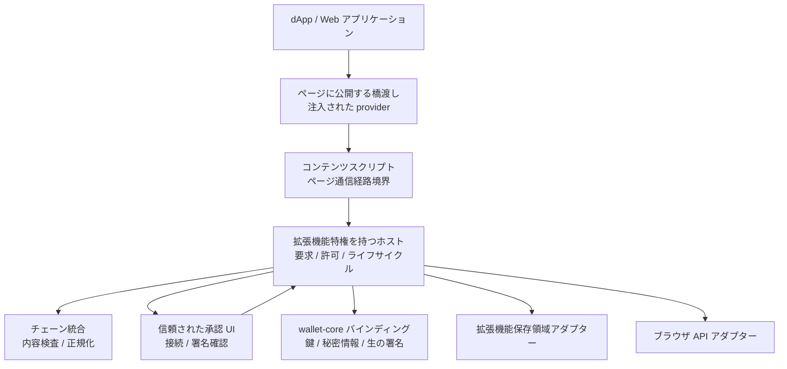

# MosaicLynx ブラウザ拡張機能基本設計

## 1. 目的

本書は、MosaicLynx ブラウザ拡張機能を、Symbol / NEM dApp からの署名要求を安全に受け取り、利用者が内容を確認して明示的に承認または拒否し、署名結果を要求元へ返すローカル Signer として設計する。

本書はブラウザ拡張機能固有のコンポーネント構成、責任分界、信頼境界、オリジン / 許可、要求ライフサイクル、信頼された UI、ロック / ロック解除、保存およびブラウザライフサイクルを定める。署名の共通意味、共通データモデル、wallet-core の暗号・鍵管理契約および Relay / モバイルのプロトコルは、本書で再定義しない。

## 2. 適用範囲と上位設計との関係

対象は、現在のブラウザ拡張機能マイルストーンにおける次の能力である。

- Web アプリケーション / dApp からの接続要求、アカウントの公開情報取得および署名要求の受付。
- ブラウザが観測した要求元文脈に基づくオリジンの識別と、オリジン単位の接続・公開許可。
- Symbol / NEM、Mainnet / Testnet、プロファイル / アカウントの整合性を保った署名対象の検証と表示。
- ブラウザ v1 の `MESSAGE_SIGN` を、既存の構造化されたメッセージ契約に従う署名操作として提供すること。任意の生バイト列署名や、解析・表示不能なメッセージの代替経路は含めない。
- 拡張機能が管理する信頼された UI での接続許可、署名内容の確認、明示的な承認 / 拒否および要求ごとの認証。
- `wallet-core` を利用した鍵管理、秘密情報処理および生の署名。
- 署名結果または安全に分類された拒否・失敗結果の、元の要求への結び付けを保った返却。

本書は次の上位資料と合わせて適用する。

- [MosaicLynx アーキテクチャ設計](./architecture.md)
- [MosaicLynx 共通セキュリティ設計](./security-design.md)
- [MosaicLynx 署名フロー基本設計](./signing-flow.md)
- [MosaicLynx 共通データモデル・インターフェース基本設計](./interfaces.md)
- [MosaicLynx ブラウザ拡張機能要件定義書](../requirements/browser-extension.md)
- [MosaicLynx コンセプトシート](../concept/concept-sheet.md)

共通設計と本書が重なる場合、共通のセキュリティ上の不変条件、署名意味、要求 / 応答の意味および wallet-core の責任境界は上位設計を優先する。本書は、それらをブラウザの実行文脈、UI、ライフサイクルおよびローカル Signer の責務へ適用する。

## 3. 設計前提

### 3.1 ブラウザ拡張機能の位置付け

ブラウザ拡張機能は単独の資産管理ウォレットやノードクライアントではなく、Web アプリケーション / dApp と Signer の間にある利用者向けの署名クライアントである。秘密情報を Web ページへ渡さず、署名対象を Signer 自身が検証・表示し、利用者の明示的な意思決定を成立させることを中心責務とする。

ブラウザ拡張機能は次を担わない。

- 署名済みトランザクションのアナウンス、ノード選択、残高・履歴取得または継続的なネットワーク状態管理。
- Relay を使ったモバイルリモート署名。Relay はモバイル経路の内容を解釈しない通信経路であり、ブラウザ拡張機能のローカル署名経路には含めない。
- dApp が用意した表示文言、トランザクション要約、site ブランド表示または Web ページ内の承認 UI を署名判断の根拠とすること。
- `wallet-core` の暗号、KDF、ウォレットストア、鍵導出または生の署名の独自実装。

### 3.2 初回対応範囲と拡張可能性

初回ブラウザ拡張機能マイルストーンの提供・サポート対象は Chrome とする。将来 Chromium 系以外へ展開できるよう、ブラウザ API、オリジン観測、拡張機能ライフサイクル、保存領域および信頼された UI のプラットフォーム差異はアダプター境界へ閉じ込める。ただし、対応ブラウザが変わってもセキュリティ上の不変条件、オリジンとの結び付け、明示承認および安全側での終了を緩和してはならない。

## 4. ブラウザ拡張機能の責務

ブラウザ拡張機能は、次の責務を一つの信頼されたホストの中で調整する。

1. ブラウザが観測したタブ、フレーム、文書およびオリジン文脈と、受信した要求の対応を確認する。
2. 接続要求と署名要求を区別し、オリジン、プロファイル、アカウント、チェーン、ネットワークおよび許可の対象範囲を検証する。
3. 要求の完全性、鮮度、重複、リプレイ、セッション、許可リビジョンおよびライフサイクルを管理する。
4. チェーン固有の統合を使ってトランザクション / メッセージを解析、検証、正規化および内容検査する。
5. 利用者にオリジン、チェーン、ネットワーク、アカウント、署名対象および確認可能な影響を提示する。
6. 拡張機能が管理する信頼された UI で、接続許可または要求ごとの承認 / 拒否と認証を受け取る。
7. `Authentication`、`Signing-capable unlock`、対象プロファイル / チェーン / ネットワーク / アカウントに対する `Account authorization` および `Explicit user approval` を、同一要求・呼び出し元文脈・プロファイル・アカウント・チェーン / ネットワーク・操作・厳密な対象・鮮度文脈に対する独立した必須条件として成立・再確認する。
8. 承認対象と実際に `wallet-core` へ渡すペイロード、アカウント、チェーン、ネットワークおよび呼び出し元が一致することを署名前に再検証する。
9. `wallet-core` のバインディングを介して署名し、戻り値を検証して元要求へ対応付ける。
10. ロック、ロック解除、手動ロック、待機、ブラウザ再起動、拡張機能再読み込みおよび文脈消失に伴う安全側の状態遷移を管理する。
11. アカウント、プロファイル、許可、セッションおよび settings のアプリケーション上の関連付けを管理する。

ブラウザ固有の処理の調整と暗号学的なコアは分離する。ブラウザ拡張機能が実装する署名処理とは、チェーン固有の内容検査済みの承認対象を wallet-core の契約へ渡し、結果を安全に受け取るまでの境界を指す。暗号処理そのものをブラウザ拡張機能の独自責務とはしない。

ブラウザ特権を持つ層はブラウザ Signer として、上記4条件の成立、署名前の再確認、失効および成功結果への帰属を担う唯一の Signer 側の処理の調整責任主体である。Provider、コンテンツスクリプト、SDK、dApp または wallet-core が、4条件を成立・変更・免除・迂回することはできない。

## 5. コンポーネント構成


```mermaid
flowchart TB
    D[dApp / Web アプリケーション]
    P[ページに公開する橋渡し<br/>注入された provider]
    C[コンテンツスクリプト<br/>ページ通信経路境界]
    H[拡張機能特権を持つホスト<br/>要求 / 許可 / ライフサイクル]
    I[チェーン統合<br/>内容検査 / 正規化]
    U[信頼された承認 UI<br/>接続 / 署名確認]
    W[wallet-core バインディング<br/>鍵 / 秘密情報 / 生の署名]
    S[拡張機能保存領域アダプター]
    B[ブラウザ API アダプター]

    D --> P --> C --> H
    H --> I
    H --> U
    U --> H
    H --> W
    H --> S
    H --> B
```

### 5.1 ページに公開する橋渡し

Web ページに公開する Provider または注入された橋渡しを担う。dApp が拡張機能の存在と公開 API を検出し、接続・署名要求を送るためのページに公開する境界である。

- Web ページの実行文脈にあるため、常に信頼されていない入力 / 信頼されていないコードとして扱う。
- 秘密情報、ウォレットストア、内部アカウント参照、許可判断、認証状態を保持・返却しない。
- dApp から渡されたオリジン、アカウント、表示文言、トランザクション要約を検証済み情報として昇格させない。
- 応答は要求対応付けを保つが、応答の正当性をページに公開する橋渡し自身が決定しない。

拡張機能の検出可能性は接続または署名対応能力の許可を意味しない。検出結果、API の存在または `ready` 通知だけでアカウント情報や署名能力を公開してはならない。

### 5.2 コンテンツスクリプト

ページ文脈と拡張機能特権を持つホストの間で、要求 / 応答を搬送する境界である。

- Web ページから受けた入力を最小限の構造検査後、特権を持つホストへ渡す。
- ブラウザが観測した文脈とページが申告する値を混同しない。
- 秘密情報、復号済み Vault、署名可能状態または信頼された UI の状態を公開しない。
- 拡張機能文脈の停止、文書破棄、ページ遷移または通信切断を検知できない・報告できない場合、署名を継続する根拠にしない。

コンテンツスクリプトが分離された world 等で動作しても、コンテンツスクリプト自体を信頼された Signer とみなさない。最終的な呼び出し元、オリジン、許可、要求完全性および署名判断は特権を持つホストが担う。

### 5.3 拡張機能特権を持つホスト

拡張機能の信頼されたアプリケーション層であり、サービスワーカー等の実行形態には依存しない論理責務として定義する。

- ブラウザ API から得た送信者、最上位の文書、タブ / フレーム、オリジンおよび文脈識別情報を検証する。
- 要求受付、許可 / セッション結び付け、アカウント選択、ライフサイクル、承認処理の調整および応答配送を担う。
- ブラウザ Signer として、認証、署名可能な状態へのロック解除、対象プロファイル / チェーン / ネットワーク / アカウントに対するアカウントの利用認可および利用者による明示的な承認の4条件を独立に成立・再確認する。この4条件は接続、許可、対応能力、セッション、通常の `UNLOCKED`、前回認証、アカウント選択、Provider / SDK 状態または wallet-core の状態から推論しない。
- チェーン統合の内容検査結果を信頼された UI に渡し、UI の結果を要求識別情報に結び付けする。
- `wallet-core` の入力を準備し、承認対象との一致を再検証してバインディングアダプターを呼び出す。
- `wallet-core` から返されたエラー、警告、検証失敗、ストア完全性失敗または結果不明を成功に変換しない。

サービスワーカーの停止・再生成を前提に署名承認を安全に復元しない。サービスワーカーは経路選択や一時処理の調整のホストになり得るが、長寿命のロック解除済み秘密情報、承認済み要求の自動再開または署名対応能力の継続をその寿命に依存させない。

### 5.4 プロファイル / アカウント / 許可管理

プロファイル、アプリケーションアカウント、接続許可および現在の settings の関連付けを管理する。これは wallet-core のウォレットストアや鍵枠そのものではない。

アプリケーションプロファイルは作成時に一つのチェーンと一つのネットワークに固定する。Symbol と NEM の両方を利用する場合はチェーンごとに別プロファイルを管理し、同一プロファイルに異なるチェーンのアカウント、許可、既定アカウントまたは署名認可を登録しない。

- 外部へ公開するアカウントは公開識別情報に限定する。
- アカウントのチェーンがプロファイルの固定チェーンと一致しない場合は、アカウント、許可または認可を成立させない。
- 外部要求のアカウント識別子は、特権を持つホストが許可、プロファイル、チェーン、ネットワークおよび Signer 識別情報と照合するための補助情報であり、外部要求元が秘密鍵を直接選択する対応能力ではない。
- アプリケーションアカウントの関連付け、利用者が確認したアカウントの選択および対象プロファイル / チェーン / ネットワークに対するアカウントの利用認可は特権を持つホストのアプリケーション / Signer 判断権限とする。アカウント選択、公開アカウントキャッシュ、許可または wallet-core の暗号学的な識別情報はアカウントの利用認可の代替ではない。
- プロファイルの変更、アカウントの削除・除外、チェーン / ネットワークの変更または許可の失効は、該当するセッションと未完了認可を失効させる。

### 5.5 チェーン統合 / 内容検査

Symbol と NEM のチェーン固有のアダプターが、受信ペイロードを対象チェーン / ネットワークの意味に従って解析、検証、正規化し、利用者向けの確認モデルを生成する。

この層は次を共通規則へ押し込めない。

- Symbol と NEM のトランザクションスキーマ、アドレス、ネットワーク定数、ハッシュ、署名バイト列。
- Symbol アグリゲートと NEM マルチシグのトランザクションモデル。
- アグリゲート、連署署名、部分トランザクション、構造化されたメッセージのチェーン固有の対応範囲。

内容検査で扱えないフィールド、不明型 / バージョン、正規化不能、対象外のチェーン / ネットワークまたは表示不能な影響がある場合、警告を表示して通常署名へ進めない。

### 5.6 信頼された承認 UI

接続許可、アカウント公開の選択、署名対象の確認、認証および承認 / 拒否を拡張機能が管理する UI で行う。Web ページの DOM、Web ページが提示した確認文言または dApp の modal は承認領域ではない。

UI は少なくとも次を、要求ごとに同じ確認対象として提示する。

- 要求元の検証済みオリジン。
- Symbol / NEM のチェーンと Mainnet / Testnet のネットワーク。
- 署名に用いるプロファイル / アカウントと公開識別情報。
- トランザクション / メッセージの種別、内容および Signer が検証できる影響。
- `MESSAGE_SIGN` では構造化されたメッセージのドメイン、目的、メッセージ内容、ノンス、発行された / 期限切れ、要求鮮度およびリプレイに関わる文脈。
- アグリゲート / 連署署名の場合の親、埋め込み / 内部トランザクション、選択済みの Signer 役割等、対象を理解するために必要な全体文脈。

表示情報は要求から拡張機能自身が導出する。オリジンの表示名前、アイコン、dApp の説明、外部からの要約は補助表示に留め、署名対象の判断権限にしない。

## 6. 信頼境界

```text
信頼されていないページ境界
  Web ページ / dApp / 注入された橋渡し / コンテンツスクリプト
             │  要求と応答は信頼されていない入力
             ▼
拡張機能信頼されたホスト境界
  ブラウザで観測した文脈
  オリジン / 許可 / セッション / 要求完全性
  プロファイル / アカウント / チェーン / ネットワーク
  内容検査 / 確認 / 認証 / 署名可能な状態へのロック解除
  アカウントの利用認可 / 明示的な承認 / ライフサイクル
             │ 承認済みと revalidated 生のペイロードのみ
             ▼
wallet-core 論理的な / バインディング境界
  ウォレットストア / 鍵管理 / 秘密情報処理 / 生の署名
```

信頼は段階的であり、wallet-core を信頼することは呼び出し元検証、利用者承認またはトランザクションの意味表示を wallet-core に委譲することを意味しない。逆に、拡張機能信頼されたホストは秘密鍵・ニーモニック・復号済み Vault を Web ページ、Provider、コンテンツスクリプトまたは応答へ渡さない。

ブラウザ Signer は、同一の要求、ブラウザで観測した呼び出し元 / オリジン、タブ / フレーム / 文書、プロファイル、アカウント、チェーン / ネットワーク、操作、厳密な対象または構造化されたメッセージ、鮮度に対して、認証、署名可能な状態へのロック解除、アカウントの利用認可、利用者による明示的な承認の4条件を独立に成立させる。いずれかを確認できない場合は署名せず、成功結果も返さない。

ブラウザ API、ブラウザ保存領域および拡張機能実行環境はプラットフォーム境界である。ブラウザが提供する文脈情報を利用するが、ブラウザの API が返した外部由来の文字列をそれだけで信頼された Signer 入力としない。観測された文脈と要求の相関を特権を持つホストが検証する。

## 7. Web アプリケーション接続とオリジンとの結び付け

### 7.1 接続の基本フロー

```text
検出拡張機能
  → 接続要求
  → ブラウザで観測したオリジン / 文脈検証
  → 信頼された接続承認
  → オリジン / プロファイル / アカウント / チェーン / ネットワーク許可
  → 公開アカウント情報情報公開
```

拡張機能が検出されたことと、アカウント情報または署名対応能力が使えることは分離する。未許可オリジンからの要求は、検証可能な場合は署名要求としてではなく接続要求として扱い、信頼された UI で接続許可が成立するまで署名確認へ進めない。

初回マイルストーンの外部 dApp 要求は、最上位の閲覧文脈の HTTPS オリジンを原則とする。開発用途のループバックオリジンは要求定義に従って扱う。`file:`、`data:`、内容を解釈しないオリジン、ブラウザ内部ページ、他の拡張機能オリジンおよび iframe / 子フレームの外部 dApp 要求は受け付けない。これらはサイトの善性や本人性を保証する判断ではなく、要求の呼び出し元文脈を一意に結び付けるための境界である。

### 7.2 オリジンと要求の結び付け

署名要求は、少なくとも次の論理的な認可組に結び付けする。

```text
観測された呼び出し元 / オリジン
  + タブ / フレーム / 文書文脈
  + 要求識別情報
  + セッション識別情報
  + 許可対象範囲とリビジョン
  + プロファイル / アカウント
  + チェーン / ネットワーク
  + 操作と対応能力文脈
  + 厳密な署名対象 / 構造化されたメッセージ文脈
  + 要求鮮度と完全性
  + 認証 / 署名可能な状態へのロック解除 / アカウントの利用認可 / 利用者による明示的な承認文脈
```

`requestId` は相関のための識別子であり、この結び付けの代替ではない。Web ページが自己申告するオリジン、タブ、アカウント、チェーン、ネットワークまたは requestId と、ブラウザが観測した文脈が一致しない場合は拒否する。

この結び付けに含まれる4条件は互いに独立した必須条件であり、接続、許可、対応能力、セッション、通常の `UNLOCKED`、前回認証、アカウント選択、Provider 状態、SDK 状態、dApp 自己申告またはコンテンツスクリプトメタデータの存在から成立したとみなしてはならない。wallet-core のパスワード検証、ストア検証 / 復号または署名成功も、ブラウザ Signer の4条件を代替しない。

次の状態変化は、旧要求 / 認可を失効させる。

- オリジン、最上位の文書、タブ、フレームまたは文書文脈の変更。
- ページ遷移、ページ接続解除、コンテンツスクリプト / 拡張機能文脈の消失。
- プロファイル、アカウント、チェーン、ネットワーク、許可対象範囲または許可リビジョンの変更。
- 要求ペイロード、親、埋め込みトランザクション、メッセージ、Signer または期待される Signer の変更。
- 要求の期限切れ、重複、リプレイ、古くなったセッションまたは対応能力文脈の変更。

認証、署名可能な状態へのロック解除、アカウントの利用認可、利用者による明示的な承認のいずれかが失効、ロック済み、古くなった、不明または再確認不能になった場合も、関連する認可と承認を失効させる。変化後の新しい文脈が安全に見える場合でも、古い認可を継続せず安全側での終了とする。

### 7.3 応答結び付けと漏えい防止

応答の対応付けと成功結果は、元要求、呼び出し元 / オリジン、タブ / フレーム / 文書、Signer、プロファイル、アカウント、チェーン / ネットワーク、操作、厳密な署名対象またはその信頼されたダイジェストおよび鮮度に対応させる。成功とするには、署名時点の認証、署名可能な状態へのロック解除、アカウントの利用認可、利用者による明示的な承認の4条件と承認文脈も同じ結び付けとして安全に確認できなければならない。現在の文書文脈が元要求と対応しない場合、応答をその文書へ返さず、古くなった応答として破棄または配送不明に分類する。

異なるオリジンのページ、別タブの文書、別セッション、別プロファイルまたは新しい要求に、旧要求の応答、署名済みペイロード、内部参照、エラー文脈または承認結果を流用してはならない。署名済み結果の配送だけが不明な場合も、同じ対象を再署名してはならない。

## 8. 許可 / セッションモデル

### 8.1 許可の概念分離

細かな許可分類体系は下位仕様へ委譲するが、少なくとも次の対応能力を概念上分離する。

| 対応能力                      | 意味                                         | ブラウザ拡張機能での扱い                                 |
| ----------------------------- | -------------------------------------------- | -------------------------------------------------------- |
| 接続                          | オリジンが拡張機能と接続関係を持つ           | 信頼された UI で明示作成・変更・失効。署名権限を含まない |
| アカウント / アドレス情報公開 | 許可したアカウントの公開識別情報を取得できる | アドレス、公開鍵等の公開情報だけを対象範囲内で返す       |
| 署名要求                      | 署名要求を受付・確認できる                   | 許可があっても要求ごとの確認、承認 / 拒否、認証が必要    |

許可はオリジン単位を基本とし、少なくともプロファイル、アカウント、チェーン、ネットワークと結び付ける。オリジン単位の接続済み状態を、別プロファイル、別アカウント、別チェーン / ネットワークまたは別オリジンへ暗黙に拡張しない。

接続許可は包括的な署名許可ではなく、許可の存在だけで署名を実行してはならない。利用者は拡張機能管理下の UI で許可を変更・撤回でき、失効または対象範囲 / リビジョンの変更時点で該当セッションと未完了認可を無効化する。

接続、許可、対応能力、セッション、アカウント選択、公開アカウント情報公開および Provider 状態は、4条件のいずれでもなく、署名認可の成立・変更・免除を行う判断権限ではない。アカウントの利用認可は、対象プロファイル / チェーン / ネットワーク / アカウントと要求に対して特権を持つホストが独立に確認する。

### 8.2 セッション

セッションは、接続済みオリジンとブラウザ文脈、許可対象範囲、プロファイル / アカウント、チェーン / ネットワークおよび対応能力文脈を相関させる短期のアプリケーション状態である。セッションは次のいずれでもない。

- 秘密鍵、ニーモニック、復号鍵またはウォレットストア。
- 永続的な署名許可。
- 利用者の署名ごとの認証または承認の代替。
- 認証、署名可能な状態へのロック解除、アカウントの利用認可または利用者による明示的な承認の代替。

ブラウザ再起動、拡張機能再読み込み、文書ページ遷移、文脈消失、許可失効、プロファイル / アカウントの変更および古くなった判定時はセッションを失効させる。セッションを復元できない場合は、古い承認を再利用せず、新しい接続 / 署名要求と確認を要求する。

## 9. アカウント / プロファイル / ネットワーク管理

プロファイルはネットワークを固定するアプリケーション上の境界として扱い、アカウントはプロファイルとチェーン固有の識別情報に対応付ける。Symbol と NEM の識別情報、アドレス、公開鍵および署名意味を暗黙に共通化しない。

Web アプリケーションに公開可能なアカウント情報は、許可により明示的に許可された公開情報だけとする。代表的には次を含み得る。

- チェーン / ネットワーク。
- アドレス。
- 公開鍵。
- アプリケーションが外部へ返すために定めたアカウント識別子。

内部アカウント参照、wallet-core 鍵枠、秘密鍵、ニーモニック、シード、復号済み Vault、プロファイルパスワードおよび署名用の秘密情報は公開情報ではない。外部要求元がアカウント識別子を指定しても、特権を持つホストが許可、プロファイル、チェーン、ネットワーク、期待される Signer および現在のアカウントの識別情報を検証して解決する。

アカウントの選択または wallet-core の暗号学的な識別情報の一致は、対象プロファイル / チェーン / ネットワーク / アカウントに対するアカウントの利用認可の成立を意味しない。ブラウザ特権を持つ層が、他の3条件と独立したアカウントの利用認可を同一要求文脈で成立・再確認する。

署名前に、要求されたチェーン / ネットワークとプロファイル、アカウントの識別情報、ペイロードの Signer、期待される Signer およびリリース対応能力が一致することを確認する。Mainnet 対応能力は適用されるリリース証跡 / Mainnet 判定条件に従い、判定条件未達成または判定不能のビルドを Mainnet 署名有効として扱わない。

## 10. 署名要求処理

ブラウザ拡張機能固有の処理境界は、共通署名フローの Signer 側で次のように適用する。

```text
受信
  → 検証ブラウザ文脈と要求
  → 解決オリジン / 許可 / セッション / アカウント
  → 内容検査チェーン / ネットワーク / 対象
  → 提示 in 信頼された UI
  → 成立させる独立した四つの判定条件条件に対する the 同じ結び付け文脈
  → 明示的な承認または拒否 + 要求ごとの認証
  → 再検証すべての四つの条件と対象
  → 呼び出し wallet-core
  → 検証結果と配送宛先 the 結び付いた要求元
```

ブラウザ特権を持つ層は、このフローにおけるブラウザ Signer 側の唯一の処理の調整責任主体である。認証、署名可能な状態へのロック解除、対象プロファイル / チェーン / ネットワーク / アカウントに対するアカウントの利用認可、利用者による明示的な承認は、接続、許可、対応能力、セッション、通常の `UNLOCKED`、前回認証、アカウント選択、Provider / SDK 状態、dApp 自己申告、コンテンツスクリプトメタデータまたは wallet-core の処理結果から代替・推論しない。

### 10.1 受付 / 検証

受信時点では要求、params、オリジン、アカウント、チェーン、ネットワーク、表示情報、セッションおよび Web ページの状態をすべて信頼されていないとする。特権を持つホストは次を確認する。

- ブラウザで観測した呼び出し元文脈と要求の対応。
- 接続可能なオリジン形式、最上位の閲覧文脈および現在の文書。
- 要求識別情報、期限、重複、リプレイ、完全性およびプロトコル / 対応能力バージョン。
- 許可対象範囲 / リビジョン、セッション、プロファイル / アカウント、チェーン / ネットワーク。
- 操作がトランザクション署名、メッセージ署名、連署署名等の対応候補であること。

受信時の許可、セッション、アカウント選択、通常の `UNLOCKED` または Provider / SDK の状態は、4条件の成立を意味しない。特権を持つホストは各条件を同じ要求文脈に結び付け、承認前後および署名直前に独立して確認できる状態を維持する。

検証できない要求、unsolicited 要求、許可のない署名要求、対象範囲外のアカウント、誤ったネットワーク、古くなったセッションまたは不一致の呼び出し元は承認 UI の署名操作へ進めない。検証可能な未許可オリジンは接続要求としてのみ扱う。

### 10.2 内容検査 / 確認モデル

Signer は生のペイロードを単に表示して「署名」を求める通常 UI を採用しない。チェーン固有の統合がペイロードを解析し、署名対象から確認モデルを導出し、対象のセキュリティに関わるフィールドと影響を利用者が理解できる形で提示する。

署名前に少なくとも次を対応する。

- 要求の呼び出し元 / オリジン、セッション、許可、アカウント、チェーン、ネットワーク。
- 操作、トランザクション / メッセージの識別情報、ペイロードまたは親の完全性。
- トランザクションの型 / バージョン、受信者、資産 / 数量、手数料、期限、メッセージ、状態 / 許可変更等、対象に適用されるセキュリティに関わるフィールド。
- 署名済み結果が元の要求、対象、アカウント、チェーン、ネットワークおよび操作に対応するための対応付け情報。

外部ノード、Relay または dApp から取得した補助情報の失敗を、署名対象の事実を推測して補完する理由にしてはならない。必須情報をペイロードから安全に生成・表示できない場合は `INSPECTION_FAILED` 相当で不合格終了済みとする。

`MESSAGE_SIGN` はトランザクション署名と別の構造化された操作として内容検査する。ブラウザ Signer は、ブラウザで観測した呼び出し元 / オリジン、タブ / フレーム / 文書、プロファイル、アカウント、チェーン / ネットワーク、操作、ドメイン、目的、メッセージ内容、ノンス、発行された / 期限切れ、要求鮮度およびリプレイ状態を、同一のメッセージ署名文脈として扱う。信頼された UI の表示内容と実際の署名入力は、Signer が内容検査した同じ信頼された構造化されたメッセージモデルから導出する。

構造化されたメッセージを安全に解析・表示できない場合、またはメッセージ文脈の一つでも検証不能、期限切れ、重複、再送された、古くなった、オリジン間の、ドメイン間の、目的間のとなる場合は署名しない。任意の生バイト列、内容検査できないメッセージ、解析失敗または不明構造化されたメッセージを生の代替経路や警告のみで署名してはならない。ノンスのバイト長さ、厳密なシリアライズ、ドメイン区切り文字エンコーディング、厳密な期限切れ window および API フィールドは下位仕様へ委譲する。

`MESSAGE_SIGN` にもトランザクション署名と同じ共通4条件、署名直前の再検証、結果との結び付けおよび安全側での終了を適用し、message-specific 文脈の確認だけでこれらを免除しない。

### 10.3 承認 / 署名

承認は単独の真偽値ではなく、同一要求・呼び出し元 / オリジン・タブ / フレーム / 文書、セッション、許可リビジョン、プロファイル、アカウント、チェーン / ネットワーク、操作、厳密な対象または構造化されたメッセージ、内容検査結果、鮮度、リプレイ状態および対応能力文脈に対する一回限りの認可とする。認証、署名可能な状態へのロック解除、アカウントの利用認可、利用者による明示的な承認は、互いに独立した必須条件としてこの文脈に結び付けする。

承認後、wallet-core 呼び出し直前に次を再検証する。

1. 要求、呼び出し元 / オリジン、タブ / フレーム / 文書、プロファイル、アカウント、チェーン / ネットワーク、操作および厳密な対象または構造化されたメッセージが承認時と一致している。
2. 承認時の許可対象範囲 / リビジョン、セッション、鮮度およびリプレイ状態が現在の文脈と一致している。
3. 認証、署名可能な状態へのロック解除、対象プロファイル / チェーン / ネットワーク / アカウントに対するアカウントの利用認可および利用者による明示的な承認の4条件が、当該要求 / 対象に対して独立に成立し、失効・ロック済み・古くなった・不明でない。
4. トランザクション / メッセージの内容検査、正規化、署名状態、ドメイン、目的、ノンス、発行された / 期限切れおよび対応能力 / プロトコル文脈が有効である。
5. ブラウザ文脈と応答受信者が元要求に対応し、Signer 識別情報と期待される Signer が一致している。

再検証に失敗した場合、承認済みでも署名せず認可を失効させる。4条件の一つでも成立・継続を確認できない場合も同じ扱いとする。署名ごとに利用者認証を要求し、接続、許可、セッション、以前の承認、前回の認証、アカウント選択または通常の `UNLOCKED` を別要求へ流用しない。

## 11. 承認 UI の基本設計

### 11.1 信頼された UI の性質

署名確認は拡張機能の管理下にある信頼された UI で行う。Web アプリケーションの DOM 内に表示されたオリジン、トランザクション内容、承認 / 拒否ボタンは、拡張機能の承認証拠として扱わない。

信頼された UI は、外部要求に含まれる表示文字列をそのまま安全な UI として解釈せず、特権を持つホストが検証済みのモデルを渡して表示する。外部入力の注入、HTML / スクリプト解釈、リモートコードまたはページ CSS による UI 偽装が、表示・承認状態・署名権限を変更できない構造とする。

### 11.2 表示と操作

利用者の判断に必要な情報を省略してはならない。オリジンは利用者が dApp を見分けられる表示と、紛らわしい Unicode 等を確認するための安全な補助表示を持ち得るが、表示形式の詳細は下位仕様へ委譲する。

接続 UI では、接続元、対象プロファイル / アカウント、チェーン / ネットワーク、公開する情報および接続対象範囲を示す。署名 UI では、同じ確認対象に対する承認 / 拒否と認証を一要求単位で行う。承認操作の前後で対象が変わった場合は成功にせず、再確認を要求する。

UI を閉じる、期限が過ぎる、拡張機能文脈が失われる、プロファイルが変わる、または認証に失敗する場合は、未署名の要求を拒否・失効・期限切れとして終了する。署名生成自体の結果が不明な場合は、確定した拒否や成功に変換しない。

## 12. 要求ライフサイクル

共通署名フローの状態モデルをブラウザ拡張機能の要求に適用する。名称は下位インターフェースで versioned に定義するが、意味は次のとおりとする。

```text
RECEIVED
  → VALIDATED
  → INSPECTED
  → AWAITING_USER
  → AUTHORIZED
  → SIGNING
  → SUCCEEDED
```

各状態の責任境界は次のとおりである。

| 状態            | ブラウザ拡張機能での意味                                                                                                                           |
| --------------- | -------------------------------------------------------------------------------------------------------------------------------------------------- |
| `RECEIVED`      | ブラウザ文脈を伴う外部要求を受け取った。まだ信頼も署名可否も確定していない                                                                         |
| `VALIDATED`     | 呼び出し元、オリジン、許可、セッション、プロファイル / アカウント、チェーン / ネットワーク、期限および形式を確認した                               |
| `INSPECTED`     | チェーン固有のに解析 / 検証 / 正規化し、確認モデルを生成した                                                                                       |
| `AWAITING_USER` | 信頼された UI に同一要求の確認対象を提示し、利用者の操作を待っている                                                                               |
| `AUTHORIZED`    | 同一要求 / 呼び出し元 / プロファイル / アカウント / チェーン / ネットワーク / 操作 / 対象文脈に対して、4条件が独立に成立した一回限りで短寿命の認可 |
| `SIGNING`       | 再検証済み対象を wallet-core へ渡し、署名結果を待っている                                                                                          |
| `SUCCEEDED`     | 署名結果を検証し、プロファイル、Signer、要求結び付け、署名時点の4条件および承認文脈を保った成功結果を確定した                                      |

終端状態は、少なくとも `REJECTED`、`FAILED`、`EXPIRED`、`INVALIDATED` および `CANCELLED` の意味で、利用者拒否、検証 / 内容検査失敗、許可拒否済み、認証失敗、期限切れ、文脈無効化、wallet-core エラー、キャンセルまたは古くなった応答に対応する。終端状態から `AWAITING_USER`、`AUTHORIZED` または `SIGNING` へ戻してはならない。

署名ライフサイクルと結果配送処理結果の区分は分離する。署名済み結果の配送だけが不明な場合は `SUCCEEDED + DELIVERY_UNKNOWN` として扱い、既存結果の再配送・照会が下位契約で可能な場合だけそれを行う。同じ対象を新たに署名しない。署名生成自体が成功・未署名のいずれかを確定できない場合は `RESULT_UNKNOWN` とし、自動再試行も再署名も行わない。

`SUCCEEDED` は wallet-core の暗号学的な成功だけでは成立しない。元要求、ブラウザで観測した呼び出し元 / オリジン、タブ / フレーム / 文書、Signer、プロファイル、アカウント、チェーン / ネットワーク、操作、厳密な対象または信頼されたダイジェスト、署名時点の認証、署名可能な状態へのロック解除、アカウントの利用認可、利用者による明示的な承認および承認文脈を同じ結び付けとして安全に確認できる場合だけ確定する。いずれかが消失した、古くなった、失効済み、ロック済み、不一致、文脈消失または不明の場合は成功としない。

## 13. wallet-core 統合

```text
拡張機能特権を持つホスト
  ├─ 呼び出し元 / 許可 / 内容検査 / 承認 / 認証 / ロック解除
  ├─ プロファイル / アカウントに関する判断権限とアカウントの利用認可
  ├─ 四条件判定条件と署名時の再検証
  ├─ 対象と確認モデルの結び付け
  └─ wallet-core バインディングアダプター
          │ 承認済み, revalidated 入力
          ▼
      wallet-core
  ├─ ウォレットストア / 鍵ライフサイクル
  ├─ 秘密情報処理 / 鍵導出
  └─ 生バイト署名
```

ブラウザ拡張機能は `wallet-core` の固定された外部契約を利用する。WASM 等のホスト統合であっても、UI、オリジン、許可、トランザクション内容検査、承認ポリシーを wallet-core に移さない。バインディングは論理 / API 境界であり、同一実行環境内のメモリコピーや JavaScript バッファーが自動的に隔離されることを意味しないため、ホスト側も秘密バイトの入力・出力・ライフサイクルを必要最小限にする。

MosaicLynx が wallet-core へ渡せるのは、信頼されたホストが検証し、利用者が確認し、4条件を成立させ、署名前に再検証したペイロードと必要なチェーン / アカウント文脈だけである。wallet-core のパスワード検証、ストア検証 / 復号または暗号学的な署名成功は、ブラウザ Signer の認証、署名可能な状態へのロック解除、アカウントの利用認可、利用者による明示的な承認またはブラウザレベルの成功結果を証明しない。wallet-core のエラー、警告、検証失敗、結び付けエラー、ストア完全性失敗および結果不明は、安全な署名成功として扱わない。秘密情報をエラー、ログ、診断、遠隔計測データ、応答または UI の不要な表示へ含めない。

ウォレットストアの内部形式、KDF、AEAD、鍵導出、ゼロ化、バインディング DTO、ホストメモリの具体的な消去および移行は wallet-core 契約・下位設計へ委譲する。

## 14. 保存領域 / 秘密情報処理

保存の分類と基本方針を次に示す。具体的なブラウザ保存領域 API、鍵名、レコード配置および移行は定義しない。

| 分類                                       | 基本保持範囲                             | 設計方針                                                                                                                                               |
| ------------------------------------------ | ---------------------------------------- | ------------------------------------------------------------------------------------------------------------------------------------------------------ |
| 暗号化された秘密情報 / ウォレットストア    | 永続的な                                 | wallet-core が定める保護形式の内容を解釈しないデータとして保持する。Web ページ、Provider、コンテンツスクリプトから参照不能とする                       |
| 復号された秘密情報 / ニーモニック / 署名鍵 | メモリのみ                               | 署名可能な状態へのロック解除 / 署名の必要期間だけ扱い、ロック、処理完了、文脈消失で無効化する。永続保存、セッション保存領域、URL、通知、ログを禁止する |
| プロファイル / アカウントメタデータ        | 永続的な                                 | 公開識別情報とアプリケーションメタデータを保持する。秘密情報、復号済み Vault、内部鍵資料を含めない                                                     |
| 許可 / 対象範囲 / リビジョン               | 永続的な                                 | オリジン、プロファイル、アカウント、チェーン、ネットワークおよびリビジョンを結び付けし、失効 / 変更を反映する                                          |
| Settings                                   | 永続的な                                 | language、theme、利用者が設定するロックポリシー等の非秘密設定に限定する                                                                                |
| セッション / 認可 / 認証状態               | セッション範囲を限定した、原則メモリのみ | ブラウザ再起動、拡張機能再読み込み、文脈消失で無効化する。永続復旧に使わない                                                                           |
| 一時的な署名要求 / 承認モデル              | メモリのみ                               | 要求の期限内に限り保持する。UI 終了、再起動、ページ遷移、重複または古くなったで破棄する                                                                |

拡張機能保存領域に保存された暗号化されたウォレットストアの存在、wallet-core のストア検証 / 復号、通常の `UNLOCKED` またはアカウント選択を、署名可能な状態へのロック解除や共通署名判定条件の成立と解釈しない。復号状態を長寿命の共有状態、Provider、コンテンツスクリプト、URL、クリップボード、通知または長期キャッシュに置かない。

## 15. ロック / ロック解除ライフサイクル

### 15.1 基本状態

ブラウザ拡張機能は、少なくとも `LOCKED` と利用者認証後の一時的な署名可能な状態を持つ。署名可能な状態へのロック解除は共通4条件の一つだが、通常の `UNLOCKED`、wallet-core パスワード検証、ストア検証 / 復号またはアカウント選択とは別の条件として扱う。具体的な状態名、認証方式およびタイムアウトは下位仕様・wallet-core / プラットフォーム契約へ委譲する。

- 拡張機能起動直後、ブラウザ再起動、拡張機能再読み込み、サービスワーカー再生成、更新後の安全性未確認時は `LOCKED` とする。
- 外部要求、Provider 接続、許可の存在または承認 UI の起動だけでロック解除しない。
- ロック解除は利用者が信頼された UI で主体的に開始し、署名ごとに要求固有の認証を要求する。ロック解除の成立だけではアカウントの利用認可または利用者による明示的な承認を満たさない。
- 手動ロック、待機タイムアウト、許可失効、プロファイル / アカウント変更、セキュリティ anomaly または文脈消失でロックし、復号済み秘密情報と一時認証状態を無効化する。署名可能な状態へのロック解除を含む共通4条件の関連認可と承認も失効させる。
- ロック中は公開メタデータの表示や接続管理を許可できるが、秘密情報アクセスと署名は許可しない。

### 15.2 承認 UI 起動時

承認 UI はロック済み状態でも未処理要求の存在を表示できるが、表示されていること自体は署名権限ではない。利用者がオリジン、プロファイル、アカウント、チェーン、ネットワーク、操作、対象を確認した後、同じ信頼された UI 内で4条件を独立に成立させ、署名直前の再検証に成功した場合だけ wallet-core を呼び出す。認証前に要求が期限切れ、文脈消失、許可変更、アカウントの利用認可変更または対象変更となった場合は署名しない。

ロック解除、承認、署名が別の実行文脈にまたがる場合も、復号済み秘密情報や認可を Web ページに渡さない。UI の再表示は旧認可の復元ではなく、要求の現在性と結び付けを再確認する処理である。

## 16. アグリゲート / 連署署名 / 部分トランザクション

トランザクションプロトコルの詳細は [署名フロー基本設計](./signing-flow.md)、チェーン互換性、チェーン固有の統合および wallet-core 契約へ委譲する。ブラウザ拡張機能では、利用者が何に署名するのかを理解できることを追加の設計条件とする。

### 16.1 アグリゲート完了 / Bonded

Symbol アグリゲート完了 / Bonded は外側トランザクションだけを表示して承認させない。対応範囲では、外側と埋め込みトランザクション全体、Signer、受信者、資産 / 数量、手数料、期限、名前空間、メタデータ、判断権限 / 許可変更、トランザクションハッシュ、既存連署署名、期待される Signer / 役割等のセキュリティに関わる文脈を同じ署名対象として内容検査・確認する。

アグリゲートの一部、Signer、資産影響、権限変更または対象識別情報を安全に解析・表示できない場合は署名しない。Bonded / 部分トランザクションであることだけを根拠にノードから親を取得・補完して署名することも許可しない。

### 16.2 連署署名

連署署名の署名対象は分離された連署署名バイト列だけではなく、連署署名が追加される親トランザクション全体と選択済みの連署者の関係である。親全体、埋め込み / 内部トランザクション、既存署名 / 連署署名、重複 / 既に署名済み、期待される役割、期限、チェーン / ネットワークおよびアカウントを確認できる場合だけ候補とする。

ハッシュ、内容を解釈しない識別子、ハッシュ + 要約、外部照会または外部から与えられた部分フィールドだけでは親全体の確認モデルを構成できないため、通常の署名フローで署名しない。

### 16.3 部分トランザクション

部分トランザクションは共通の署名基本機構ではなく、チェーン / ネットワーク / 受け渡し文脈上の未完成状態である。Signer に渡された情報だけで親、埋め込み / 内部内容、既存の署名、期待される Signer、期限および影響を検証・表示できない場合は、ノード検索・監視・補完を前提とせず不合格終了済みとする。

NEM マルチシグ / 連署署名は Symbol アグリゲートと同じ構造へ変換せず、NEM 固有の統合に委譲する。共通化するのはライフサイクル、承認、結び付け、結果対応付けおよび安全側での終了だけである。

## 17. 並行する要求処理

複数要求が同時に存在しても、利用者が別要求を誤認して承認できないことを優先する。

- 各要求に独立した識別情報、オリジン、タブ / フレーム / 文書文脈、セッション、許可リビジョン、プロファイル、アカウント、チェーン / ネットワーク、操作、対象、内容検査モデル、4条件の成立文脈および有効期限を持たせる。
- 同時に複数の承認を曖昧な一つの UI 操作へまとめない。一括処理署名や承認の使い回しは、本書から暗黙に許可しない。
- 前面の承認対象を一つに限定し、他の要求は独立した待機・拒否・期限切れのいずれかとして扱う。キューまたは拒否の選択、上限、公平性および排他アルゴリズムは下位仕様へ委譲する。
- 同一オリジンからの複数要求でも要求識別情報と対象を省略しない。オリジンが同じであることは承認の使い回しを許可しない。
- 異なるオリジンの要求を同じ承認、アカウント選択、許可または応答チャネルに混在させない。

一つの要求が `AUTHORIZED` または `SIGNING` になった後、別要求の操作でその対象、セッション、許可、プロファイル、アカウント、4条件または認証状態を上書きしてはならない。要求の最大同時数、キュー永続化および UI の通知方式は下位仕様で定める。

## 18. 失敗 / 復旧

失敗の詳細なエラーコード、通信上のエラー、再試行回数および UI 文言は [interfaces.md](./interfaces.md) と下位仕様へ委譲する。基本動作は次のとおりである。

| 事象                                              | ブラウザ拡張機能の基本動作                                                                                                                             |
| ------------------------------------------------- | ------------------------------------------------------------------------------------------------------------------------------------------------------ |
| 不正な形式の / 未対応の要求                       | `VALIDATED` または `INSPECTED` に進めず、安全な失敗を返す。署名しない                                                                                  |
| unsolicited 要求 / 許可拒否済み                   | 署名 UI に進めず、必要なら接続要求としてのみ扱う                                                                                                       |
| アカウントロック済み / 認証失敗                   | 署名可能な状態へのロック解除、認証、アカウントの利用認可または利用者による明示的な承認のいずれかが欠けるため署名を開始せず、認証状態を成功とみなさない |
| 誤ったチェーン / ネットワーク / アカウント        | 認可を成立させず、対象を自動切替しない                                                                                                                 |
| 期限切れ / 重複 / リプレイ / 古くなったセッション | 要求を終端とし、古い承認を再利用しない                                                                                                                 |
| 利用者拒否済み                                    | 署名を呼ばず拒否結果を元要求へ返す                                                                                                                     |
| 承認 UI 終了済み / タブ disconnected              | 未署名ならキャンセル / 期限切れとして終了する。署名結果が不明なら `RESULT_UNKNOWN` を維持する                                                          |
| wallet-core エラー / 警告 / ストア失敗            | 署名成功として返さず、秘密情報をエラー / ログに含めない                                                                                                |
| ブラウザ / 拡張機能再起動                         | `LOCKED` とし、セッション、承認、一時的な要求を再利用しない                                                                                            |
| Web アプリケーション接続解除 / ページ遷移         | 旧応答を新しい文書へ返さず、必要なら配送処理結果の区分を不明とする                                                                                     |
| 古くなった応答                                    | 応答を破棄し、別要求、別オリジンまたは別セッションに返さない                                                                                           |
| 並行する要求競合                                  | 要求間の混同を避け、対象ごとに待機・拒否・期限切れとする                                                                                               |

Relay、ノード、外部 API の障害、補助情報の取得失敗または部分的な UI 状態を理由に、内容検査、承認、認証、オリジンとの結び付け、アカウント / ネットワーク検証を省略しない。復旧後も旧認可を自動再開せず、新しい要求と必要な再確認を要求する。

## 19. ブラウザ互換性 / プラットフォームアダプター

初回は Chrome の実行・配布制約に合わせるが、ブラウザ固有処理は次のアダプター境界へ限定する。

- ページ注入 / Provider 接続。
- コンテンツスクリプトと特権を持つホストのメッセージ通信経路。
- ブラウザで観測したオリジン、タブ、フレーム、文書およびページ遷移文脈。
- 拡張機能実行環境 / サービスワーカーライフサイクル。
- 信頼された UI の起動、フォーカス、終了および文脈消失。
- 暗号化されたストア、メタデータ、許可、セッションの保存・復元。
- 更新、再読み込み、許可およびホスト対応能力の検出。

Firefox 等への展開時は、各ブラウザの API 差異をアダプターで吸収し、上位の要求 / 許可 / 承認モデルを変更しない。ブラウザが要求元文脈を確実に観測できない、信頼された UI を拡張機能管理下に置けない、またはライフサイクル消失後の承認を安全に無効化できない場合、その対応能力は無効化し、安全条件を満たさない継続で署名を許可しない。

マニフェストの完全な内容、許可名、内容セキュリティポリシー、ブラウザ API 呼び出し順、最低対応バージョンおよび Firefox 固有の挙動は下位仕様へ委譲する。

## 20. セキュリティ上の不変条件

共通セキュリティ設計および共通署名フローの不変条件を、ブラウザ拡張機能へ次のように適用する。すべて MUST であり、下位仕様・実装・運用がこれを弱めてはならない。

1. Web アプリケーション、Web ページ、Provider、コンテンツスクリプトおよび Relay は秘密鍵、ニーモニック、プロファイルパスワード、復号済みウォレットストアその他の秘密情報にアクセスできない。
2. Web アプリケーションは拡張機能の信頼された承認 UI、承認状態、署名判断権限または認証状態を制御できない。
3. ブラウザ特権を持つ層はブラウザ Signer として、認証、署名可能な状態へのロック解除、対象プロファイル / チェーン / ネットワーク / アカウントに対するアカウントの利用認可および利用者による明示的な承認の4条件を唯一の Signer 側の処理の調整責任主体として成立・再確認する。4条件は互いに独立した必須条件である。
4. 接続、許可、対応能力、セッション、通常の `UNLOCKED`、前回認証、アカウント選択、Provider 状態、SDK 状態、dApp 自己申告、コンテンツスクリプトメタデータ、wallet-core パスワード検証、ストア検証 / 復号および wallet-core 署名成功は、4条件またはブラウザレベルの成功の代替ではない。
5. 要求、呼び出し元 / オリジン、タブ / フレーム / 文書、プロファイル、アカウント、チェーン / ネットワーク、操作、厳密な対象または構造化されたメッセージ、鮮度および4条件の成立文脈を同一の結び付けとして扱う。
6. Web ページが自己申告するオリジン、アカウント、チェーン、ネットワーク、表示名前、トランザクション要約または要求識別情報を、ブラウザが観測した文脈の代替にしない。
7. 解析、検証、正規化、内容検査または表示ができない未対応・解析不能・危険・曖昧な要求は、通常フローで署名しない。
8. 利用者が確認した確認モデルと、実際に wallet-core へ渡すペイロード、アカウント、チェーン、ネットワーク、Signer および操作を署名前に一致させる。
9. `MESSAGE_SIGN` は構造化されたメッセージ操作とし、ドメイン、目的、メッセージ内容、ノンス、発行された / 期限切れ、要求鮮度、リプレイ状態および4条件を同じメッセージ署名文脈に結び付けする。UI と署名入力は同じ信頼された構造化されたメッセージモデルから導出し、任意の生の、内容検査できない、不明または解析失敗の代替経路署名を許可しない。
10. 期限切れ、消費済み、重複、再送された、古くなったまたは無効化済み要求 / 認可は再利用できない。
11. オリジン、プロファイル、アカウント、チェーン / ネットワーク、操作、対象、メッセージ文脈および対象の影響を署名前に信頼された UI で確認可能にする。
12. アグリゲート、埋め込み / 内部トランザクション、親、既存の署名 / 連署署名および期待される Signer を全体確認できない場合、連署署名やアグリゲート署名を行わない。
13. ブラウザ再起動、拡張機能再読み込み、サービスワーカー再起動、ページ遷移、タブ / フレーム変更、プロファイル / アカウント / チェーン / ネットワーク変更、許可変更または文脈消失により、古い承認、認証、アカウントの利用認可または署名可能な状態へのロック解除を自動復元・実行しない。
14. 成功結果は元要求、呼び出し元、Signer、プロファイル、アカウント、チェーン / ネットワーク、操作、厳密な対象または信頼されたダイジェスト、署名時点の4条件および承認文脈を確認できる場合だけ返す。文脈消失、古くなった、失効済み、ロック済み、不一致または不明は成功にしない。
15. 応答は元要求の呼び出し元、プロファイル、アカウント、チェーン / ネットワーク、文脈、対象および操作にだけ返す。オリジン間の応答漏えい、古くなった応答再利用、別文書への結果流用を防ぐ。
16. `RESULT_UNKNOWN` は署名生成自体の不明に限り、`DELIVERY_UNKNOWN` は確定済み結果の配送不明として分離する。いずれの場合も配送失敗を再署名の根拠にしない。
17. 復号された秘密情報は不要に長時間保持せず、Web ページ文脈、長期保存領域、URL、クリップボード、通知、ログ、遠隔計測データおよびエラーに出さない。
18. ブラウザ固有の UI / オリジン / 許可 / ライフサイクル処理と、wallet-core の暗号学的なコア / 生の署名を分離する。wallet-core のパスワード検証、ストア検証 / 復号および暗号学的な署名成功をブラウザレベルの成功と混同しない。
19. 複数要求の呼び出し元、プロファイル、アカウント、許可、承認、4条件、対象、wallet-core 結果または応答受信者を共有・合成・流用しない。
20. セキュリティを確認できない場合、処理を中断して不合格終了済みとし、復旧時に旧認可を自動再開しない。Provider、コンテンツスクリプト、SDK、dApp、Relay または wallet-core はこの判断を変更・免除・迂回できない。

## 21. 他コンポーネントとの責任分界

| コンポーネント                             | ブラウザ拡張機能との境界                                                                                                                                                                                                                                                                                                                       |
| ------------------------------------------ | ---------------------------------------------------------------------------------------------------------------------------------------------------------------------------------------------------------------------------------------------------------------------------------------------------------------------------------------------- |
| dApp / Web アプリケーション                | 要求を作成し、署名結果を独立検証し、アナウンス等のネットワーク処理を担う。拡張機能の UI、オリジン検証、秘密情報を信頼・操作しない                                                                                                                                                                                                              |
| 拡張機能特権を持つホスト / ブラウザ Signer | ブラウザで観測した呼び出し元、プロファイル / アカウントに関する判断権限、アカウントの利用認可、内容検査、信頼された UI、共通4条件、署名前再検証、wallet-core 処理の調整、結果との結び付けおよびライフサイクル無効化を唯一の Signer 側の責任主体として担う。Provider、コンテンツスクリプト、SDK、dApp または wallet-core へこの判断を委譲しない |
| Provider / コンテンツスクリプト            | ページに公開する通信経路と要求 / 応答 forwarding のみを担う。呼び出し元の信頼性判断、プロファイル / アカウントの利用認可、認証、署名可能な状態へのロック解除、明示的な承認、内容検査または署名判断を持たない                                                                                                                                   |
| SDK / Provider API                         | 通信方式に依存しないな要求 / 応答 / エラー契約を提供する。Signer の意味上の内容検査、承認、認証、秘密情報を担わない                                                                                                                                                                                                                            |
| モバイルアプリ                             | リモート署名の別 Signer。ブラウザ拡張機能の UI / 保存領域 / ライフサイクルを共有しない。共通プロトコル・データモデルは共通設計へ集約する                                                                                                                                                                                                       |
| Relay                                      | モバイル経路の内容を解釈しない通信経路。ブラウザ拡張機能の署名要求を Relay 経由へ自動代替経路せず、署名・内容検査・承認・秘密情報を担わない                                                                                                                                                                                                    |
| wallet-core                                | ウォレットストア、鍵ライフサイクル、秘密情報処理、チェーン固有の鍵操作、生の署名を担う。呼び出し元、オリジン、許可、プロファイル / アカウントの利用認可、UI、利用者承認またはブラウザレベルの成功を担わない                                                                                                                                    |
| Symbol / NEM 統合                          | チェーン固有の解析、検証、正規化、構造化されたメッセージ / トランザクション内容検査および対応済みの対象範囲を担う。共通4条件、ライフサイクル、承認および結果判断権限はブラウザ拡張機能ホストが調整する                                                                                                                                         |
| ブラウザ / OS                              | 実行環境、タブ / 文書、保存領域、UI ホスト等のプラットフォーム対応能力を提供する。MosaicLynx の許可、承認、署名意味の判断権限ではない                                                                                                                                                                                                          |
| リリース / 根拠責任主体                    | Mainnet 対応能力のリリース証跡 / 判定条件を管理する。署名要求の内容検査、承認または署名を担わない                                                                                                                                                                                                                                              |

利用者拒否、検証失敗、結果不明または呼び出し元 / 文脈不一致の後に、SDK、Relay、モバイル等へ自動代替経路して確認境界を迂回しない。

## 22. 下位仕様への委譲事項

本書で基本方針だけを定め、次を詳細仕様へ委譲する。

- Provider API、RPC メソッド、通信上のスキーマ、シリアライズ、バージョン管理、エラーコード全表および応答配送 / 取得契約。
- マニフェストの完全な JSON、ブラウザ許可名、CSP、ホスト許可、API 呼び出し順および Chrome / Firefox の最低バージョン。
- 注入されたスクリプト、コンテンツスクリプト、実行環境メッセージの具体プロトコル、サイズ制限、タイムアウト、再試行およびキューアルゴリズム。
- オリジンの正規化、Unicode 表示規則、フレーム / ページ遷移観測方式、文脈識別情報の具体形式。
- 許可分類体系の細分、セッションレコード、リビジョン、失効の原子性および UI の操作詳細。
- アカウント / プロファイルの公開 DTO、内部参照の形式、プロファイル移行およびバックアップ / 復元のプラットフォーム範囲。
- 暗号化されたウォレットストア、KDF、AEAD、バインディング DTO、秘密情報バイトの一時ライフサイクル、ゼロ化および wallet-core 移行。
- Symbol / NEM のトランザクション型 / バージョン、構造化されたメッセージの厳密なフィールド・シリアライズ・エンコーディング、アグリゲート、連署署名、部分トランザクション、NEM マルチシグの対応済みの対象範囲、表示フィールドおよび固定ベクター。
- 信頼された UI の画面遷移、レイアウト、文言、アクセシビリティ、ローカライズ、認証 UI、window / 側パネルの選択。
- 自動ロックの時間値、認証失敗の頻度上限、更新時の移行 / ロールバック、クリップボード / スクリーンショットポリシー。
- ブラウザ互換性、リリース証跡、Mainnet 判定条件、更新 / 事故応答および公開停止の運用手順。
- 詳細なテスト事例、E2E harness、ファジング、性能目標および遠隔計測データの設計。

上記を決める場合も、[security-design.md](./security-design.md) の秘密情報・認証・安全側での終了、[signing-flow.md](./signing-flow.md) の認可 / 対象結び付け、[interfaces.md](./interfaces.md) の共通契約および wallet-core の外部契約を弱めてはならない。

## 23. 未決事項

本書では次を勝手に確定しない。

- Chrome 初回マイルストーンの具体的最低バージョン、配布チャネル、マニフェストバージョンおよび Mainnet 判定条件のビルド時の / 実行環境境界。
- Firefox 等への展開時期、対応範囲およびブラウザごとの信頼された UI / ライフサイクル対応能力。
- Provider / SDK の具体 API、オリジン証明、セッションプロトコル、応答配送不明後の照会・再配送契約。
- アグリゲート完了 / Bonded、部分トランザクション、Symbol 連署署名および NEM マルチシグ / 連署署名の公開操作と対応範囲。
- `MESSAGE_SIGN` のブラウザ API への具体的な接続方法、厳密な API 名・フィールド名・通信上の表現、構造化されたメッセージの厳密なシリアライズ、ノンス形式、期限切れ window およびバージョン協議詳細。`MESSAGE_SIGN` の提供、構造化された内容検査、共通4条件、メッセージ文脈結び付け、リプレイ / 文脈間のリプレイ防止および生の / 内容検査できない代替経路禁止は本書の設計前提とする。
- wallet-core バインディングのブラウザホスト統合、秘密バイトの一時保持、ストア移行、エラー対応付けおよびセキュリティ保証の詳細。
- 許可の細かな対象範囲、セッション永続化、キュー / 並行処理ポリシー、auto-lock 時間、UI の具体方式。
- プロファイル全体バックアップ / 復元のブラウザ拡張機能固有範囲とリリース操作の詳細。

これらが未決であっても、内容を確認しない署名、許可による自動署名、オリジンとの結び付けの省略、古い承認の再利用、Relay / dApp への秘密情報移管または安全条件を満たさない継続の復旧を許可する根拠にはならない。

## 24. 追跡可能性

重要な設計判断との対応を次に示す。AGENTS.md および `.agents/project-context.md` は作業補助資料であり、製品設計の根拠には含めない。

| 責務・不変条件                                                         | 上位 / 共通根拠                                                                                                                                                                                                                                                                                | 下流契約 / 責任主体                                                                                                                                                                                                                                                                                                                                                                                                               | 本書での適用                         |
| ---------------------------------------------------------------------- | ---------------------------------------------------------------------------------------------------------------------------------------------------------------------------------------------------------------------------------------------------------------------------------------------- | --------------------------------------------------------------------------------------------------------------------------------------------------------------------------------------------------------------------------------------------------------------------------------------------------------------------------------------------------------------------------------------------------------------------------------- | ------------------------------------ |
| ブラウザ拡張機能をローカル Signer とし、Web ページと秘密情報を分離する | [コンセプトシート](../concept/concept-sheet.md) §6、§9–§13；[ブラウザ拡張機能要件](../requirements/browser-extension.md) BR-002、BR-006、BR-009；[アーキテクチャ](./architecture.md) §5、§6.3、§6.8                                                                                            | [ブラウザ拡張機能仕様](../specifications/browser-extension.md) §3–§4、§19；特権を持つホストがブラウザ Signer、wallet-core が秘密情報・生の署名責任主体                                                                                                                                                                                                                                                                            | §3–§6、§13–§14、§21                  |
| 呼び出し元 / オリジンの信頼性判断                                      | [ブラウザ拡張機能要件](../requirements/browser-extension.md) BR-003、BR-004、BR-008；[アーキテクチャ](./architecture.md) §6.3；[セキュリティ設計](./security-design.md) §9；[署名フロー](./signing-flow.md) §18；[インターフェース](./interfaces.md) §4.1、§5                                  | [ブラウザ拡張機能仕様](../specifications/browser-extension.md) §6–§7、§21；[SDK 要件](../requirements/sdk.md) SDK-FR-005；[SDK 設計](./sdk.md) §9；[Web トランザクション受け渡し](../specifications/web-transaction-handoff-spec.md) §5–§6；最終責任主体はブラウザで観測した文脈を検証する特権を持つホスト                                                                                                                        | §5.1–§5.3、§7、§20–§21               |
| Provider / コンテンツスクリプト判断権限を持たないこと                  | [ブラウザ拡張機能要件](../requirements/browser-extension.md) BR-006；[アーキテクチャ](./architecture.md) §6.2–§6.3；[セキュリティ設計](./security-design.md) §11.3；[インターフェース](./interfaces.md) §4.1、§7.1–§7.2                                                                        | [ブラウザ拡張機能仕様](../specifications/browser-extension.md) §4、§6；[SDK 要件](../requirements/sdk.md) §3.2、SDK-SEC-001〜004；[SDK 設計](./sdk.md) §4、§6–§8；Provider / コンテンツスクリプトは通信経路のみで、判断権限は特権を持つホスト                                                                                                                                                                                     | §5.1–§5.3、§21                       |
| 共通4条件判定条件                                                      | [共通要件](../requirements/requirements.md) CR-016、CR-AC-017；[アーキテクチャ](./architecture.md) §6.9；[セキュリティ設計](./security-design.md) §7–§8；[署名フロー](./signing-flow.md) §8、§16、§23；[インターフェース](./interfaces.md) §8–§9                                               | [ブラウザ拡張機能仕様](../specifications/browser-extension.md) §9、§11、§17–§18；[署名プロトコル](../specifications/signing-protocol.md) §8；[プロファイル / アカウント仕様](../specifications/profile-account-spec.md) §20；成立・再確認の責任主体は特権を持つホスト                                                                                                                                                             | §4–§6、§8–§12、§15、§20–§21          |
| プロファイル / アカウントに関する判断権限とアカウントの利用認可        | [共通要件](../requirements/requirements.md) CR-005、CR-009、CR-013、CR-016、CR-017、CR-AC-020；[ブラウザ拡張機能要件](../requirements/browser-extension.md) BR-004、BR-009；[アーキテクチャ](./architecture.md) §6.6、§6.8–§6.9；[インターフェース](./interfaces.md) §6                        | [プロファイル / アカウント仕様](../specifications/profile-account-spec.md) §2、§3、§11、§12、§20、§26；[ブラウザ拡張機能仕様](../specifications/browser-extension.md) §9–§10、§25；wallet-core は暗号学的な識別情報 / ストア責任主体であり、アプリケーションアカウントの利用認可責任主体ではない                                                                                                                                  | §5.4、§7–§10、§15、§20–§21           |
| 構造化された `MESSAGE_SIGN` とメッセージリプレイ境界                   | [共通要件](../requirements/requirements.md) CR-007-MSG、CR-AC-006；[SDK 要件](../requirements/sdk.md) SDK-FR-007；[セキュリティ設計](./security-design.md) §8.3；[署名フロー](./signing-flow.md) §14、§16、§23；[インターフェース](./interfaces.md) §6.3、§9                                   | [ブラウザ拡張機能仕様](../specifications/browser-extension.md) §16；[署名プロトコル](../specifications/signing-protocol.md) §15、§20；[Web トランザクション受け渡し](../specifications/web-transaction-handoff-spec.md) §2、§5；[チェーン互換性仕様](../specifications/chain-compatibility-spec.md) §6.3；構造化された内容検査と信頼された UI / 署名入力の同一モデルはブラウザ Signer 責任主体                                    | §2、§10–§12、§20、§23                |
| チェーン / ネットワーク内容検査                                        | [共通要件](../requirements/requirements.md) CR-005、CR-NFR-005；[ブラウザ拡張機能要件](../requirements/browser-extension.md) BR-005；[アーキテクチャ](./architecture.md) §6.7；[署名フロー](./signing-flow.md) §9–§15、§24；[インターフェース](./interfaces.md) §4.1、§6                       | [チェーン互換性仕様](../specifications/chain-compatibility-spec.md) §3–§6；[ブラウザ拡張機能仕様](../specifications/browser-extension.md) §10–§15；チェーン固有の統合が解析 / 正規化 / 意味上の内容検査責任主体、特権を持つホストが判定条件 / ライフサイクル責任主体                                                                                                                                                              | §5.5、§9–§11、§16、§20–§21           |
| アグリゲート / 連署署名内容検査                                        | [ブラウザ拡張機能要件](../requirements/browser-extension.md) BR-005；[署名フロー](./signing-flow.md) §10–§13、§24；[セキュリティ設計](./security-design.md) §8；[インターフェース](./interfaces.md) §6.3                                                                                       | [チェーン互換性仕様](../specifications/chain-compatibility-spec.md) §4；[署名プロトコル](../specifications/signing-protocol.md) §11–§14；[ブラウザ拡張機能仕様](../specifications/browser-extension.md) §15；親全体の内容検査責任主体はチェーン統合、署名判断責任主体は特権を持つホスト                                                                                                                                           | §10.2、§16、§20                      |
| 結果との結び付けと `RESULT_UNKNOWN` / `DELIVERY_UNKNOWN`               | [共通要件](../requirements/requirements.md) CR-006、CR-NFR-012、CR-AC-004；[署名フロー](./signing-flow.md) §20–§22；[インターフェース](./interfaces.md) §6.4、§9–§10                                                                                                                           | [ブラウザ拡張機能仕様](../specifications/browser-extension.md) §22；[インターフェース仕様](../specifications/interfaces.md) §10；[Web トランザクション受け渡し](../specifications/web-transaction-handoff-spec.md) §7、§10；署名時の文脈の検証責任主体は特権を持つホスト、公開応答対応付け責任主体は SDK / Provider 境界                                                                                                          | §7.3、§10.2–§10.3、§12、§18、§20–§22 |
| ライフサイクル無効化と並行する要求分離                                 | [ブラウザ拡張機能要件](../requirements/browser-extension.md) BR-007、BR-008；[共通要件](../requirements/requirements.md) CR-NFR-009〜CR-NFR-011；[アーキテクチャ](./architecture.md) §3、§6.3、§11；[セキュリティ設計](./security-design.md) §10；[署名フロー](./signing-flow.md) §7、§21、§23 | [ブラウザ拡張機能仕様](../specifications/browser-extension.md) §20–§24；[SDK 設計](./sdk.md) §13–§16、§21；サービスワーカー / ページ遷移はプラットフォームアダプター、要求分離と失効の判断は特権を持つホスト                                                                                                                                                                                                                      | §7.2–§7.3、§12、§15、§17–§18、§20    |
| 自動代替経路禁止                                                       | [共通要件](../requirements/requirements.md) CR-007、CR-011、CR-015、CR-AC-015；[署名フロー](./signing-flow.md) §21、§23；[セキュリティ設計](./security-design.md) §15、§17                                                                                                                     | [SDK 要件](../requirements/sdk.md) SDK-FR-009〜011、SDK-SEC-006〜007；[SDK 設計](./sdk.md) §17、§21–§22；[Web トランザクション受け渡し](../specifications/web-transaction-handoff-spec.md) §6；[署名プロトコル](../specifications/signing-protocol.md) §19；[Relay 設計](./relay.md) §29；Signer / SDK / Relay は確認境界を迂回しない                                                                                             | §3、§7.3、§18、§21–§23               |
| wallet-core 生の署名 / 秘密情報境界                                    | [共通要件](../requirements/requirements.md) CR-008、CR-013、CR-NFR-004；[アーキテクチャ](./architecture.md) §6.8–§6.9；[セキュリティ設計](./security-design.md) §5–§6、§12；[インターフェース](./interfaces.md) §4.1–§5                                                                        | [wallet-core 要件](../../_snwc/docs/requirements/requirements.md) §2；[wallet-core 仕様](../../_snwc/docs/specifications/specification.md) §2、§7、§12–§13；[バインディング判断](../../_snwc/docs/decisions/binding-implementation.md) の「決定」「共通境界」「WASM / ブラウザセキュリティ契約」；wallet-core はストア / 秘密情報 / 暗号学的な識別情報 / 生の署名責任主体、特権を持つホストは呼び出し元 / 承認 / 判定条件責任主体 | §5.3、§6、§13–§15、§20–§22           |
| Relay 内容を解釈しない境界                                             | [共通要件](../requirements/requirements.md) CR-011、CR-015；[アーキテクチャ](./architecture.md) §6.5、§7；[セキュリティ設計](./security-design.md) §11.1；[インターフェース](./interfaces.md) §4.1、§7.3                                                                                       | [Relay 要件](../requirements/relay.md)；[Relay 設計](./relay.md) §3、§29；[Web トランザクション受け渡し](../specifications/web-transaction-handoff-spec.md) §6–§7、§13；Relay 責任主体は内容を解釈しない通信経路 / 構造上の検証のみで、ブラウザローカルパスへの代替経路や意味上の署名を担わない                                                                                                                                   | §3、§6、§18、§21–§22                 |
| Mainnet 判定条件                                                       | [ブラウザ拡張機能要件](../requirements/browser-extension.md) BR-013；[共通要件](../requirements/requirements.md) CR-NFR-006、CR-AC-008；[セキュリティ設計](./security-design.md) §16；[アーキテクチャ](./architecture.md) §16–§17                                                              | [ADR 0001](../adr/0001-mainnet-evidence-lite.md)；リリース証跡ポリシー / リリース操作が根拠と判定条件の責任主体。判定条件未達成・判定不能時は Mainnet 対応能力を無効化する                                                                                                                                                                                                                                                        | §9、§19、§22–§23                     |

既存の `apps/extension` は実装・検証の参照対象であり、本書の設計判断を上書きする正本ではない。実装と本書または上位資料の間に差異がある場合は、要求・承認済み設計・wallet-core 契約を確認し、差異を別途解消する。
