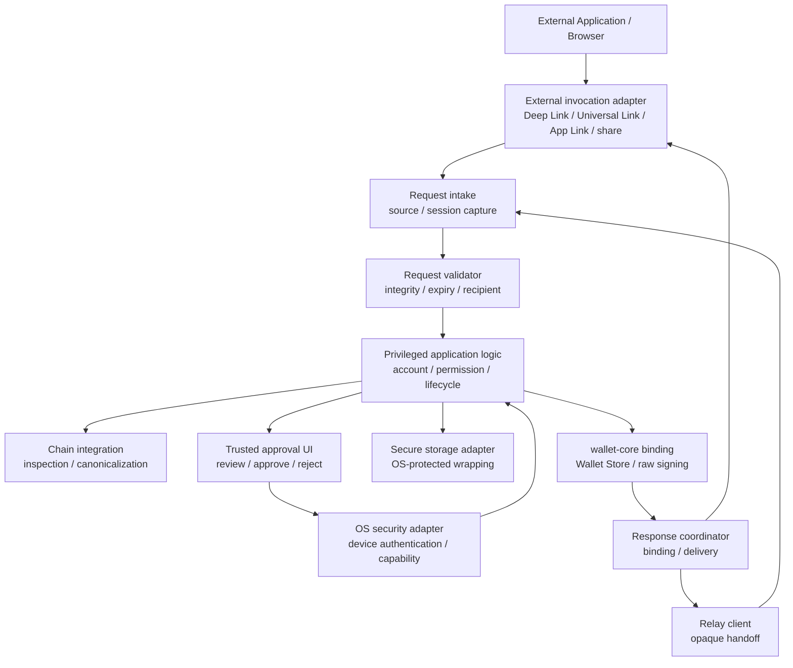

# MosaicLynx Mobile App 基本設計

## 1. 目的

本書は、MosaicLynx Mobile App を、端末上で秘密情報を保護しながら、外部から受け取った Symbol / NEM の署名要求を検証し、利用者が内容を確認して明示的に承認または拒否し、署名結果を返す Mobile Signer として設計する。

Mobile App は、スマートフォンの OS security boundary、アプリ lifecycle、device authentication、外部起動経路および Relay handoff を扱う。共通の request / response semantics、署名状態、security policy、Chain / Network の意味および wallet-core の暗号・鍵管理責任は、既存の共通設計を参照し、本書で独自 protocol として再定義しない。

## 2. 適用範囲と上位設計との関係

対象は、iOS / Android の Mobile milestone における次の能力である。

- Profile / Account の Application 管理と Chain / Network の選択・表示。
- スマートフォンブラウザ、外部アプリ、OS link および Relay からの署名要求の受信。
- 外部 invocation context、handoff session、request、permission、Account、Chain / Network および期限の検証。
- App が管理する trusted UI での署名対象の表示、明示的 approve / reject および device authentication。
- `wallet-core` の Binding を利用した Wallet Store、秘密情報処理および raw signing。
- local signing と Relay 経由の remote handoff を同じ Signer の責任境界へ統合し、元 request に binding した結果を返すこと。

本書は次の資料と合わせて適用する。

- [MosaicLynx アーキテクチャ設計](./architecture.md)
- [MosaicLynx 共通セキュリティ設計](./security-design.md)
- [MosaicLynx 署名フロー基本設計](./signing-flow.md)
- [MosaicLynx 共通データモデル・インターフェース基本設計](./interfaces.md)
- [MosaicLynx Browser Extension 基本設計](./browser-extension.md)
- [MosaicLynx スマホアプリ要件](../requirements/mobile-app.md)
- [MosaicLynx 共通要件](../requirements/requirements.md)
- [MosaicLynx Relay 要件](../requirements/relay.md)
- [MosaicLynx SDK 要件](../requirements/sdk.md)
- [MosaicLynx Concept Sheet](../concept/concept-sheet.md)

要求・共通設計・本書が重なる場合、外部要求、共通 security invariant、署名 semantics、共通 interface および wallet-core の外部契約を優先する。本書は、それらを iOS / Android の OS 境界、App lifecycle、外部 invocation、Relay client および Mobile UI へ適用する。

## 3. 設計前提

### 3.1 Mobile App の位置付け

Mobile App は、端末上で利用者の署名判断を成立させる local Signer である。Relay を使う場合も、Relay は request / response を運ぶ transport であり、Mobile App が復号・検証・表示・承認・署名を行う。

Mobile App は次を担わない。

- Relay server の session 保管、opaque envelope の中継、TTL、rate limit、HTTP / Redis 管理または server-side authorization。
- dApp に代わる announce、node 選択、残高・履歴取得または継続的な network state 管理。
- SDK の公開 API、transport 選択、Web page integration または dApp 側の結果検証。
- OS の Keychain / Keystore / Secure Enclave / StrongBox を wallet-core の暗号・Wallet Store・raw signing の代替として独自実装すること。
- 外部アプリ、ブラウザ、Relay または通知の表示文言を承認の根拠とすること。

### 3.2 Android / iOS の位置付け

Android milestone と iOS milestone は個別に評価する。一方の OS の lifecycle、storage、authentication、hardware-backed capability または linking capability を他方で利用可能と推測しない。共通化するのは domain、request model、approval policy、結果・失敗の意味および wallet-core 境界であり、OS API と UI 実装ではない。

### 3.3 OS security boundary の限界

OS の device lock、secure storage および user-presence capability は、Mobile App の秘密情報保護を支える境界である。ただし、OS が提供する capability は端末、設定、OS 状態および配布 build により異なり得る。利用可能性を実行時に確認できない、保護状態を維持できない、または capability の範囲を表示できない場合は、より強い保護を保証したり、署名を継続したりしない。

Hardware-backed protection の利用可否、非対応端末での fallback、Mainnet capability への適用条件は requirements と release gate の未決事項として扱う。全端末で hardware-backed direct signing が利用できること、またはその不在だけで App 全体を利用不可にすることは、本書では決めない。

## 4. Mobile App の責務

Mobile App は、次の責務を一つの trusted host の中で調整する。

1. 外部 invocation、Relay handoff および App lifecycle から得た入力を untrusted input として受け取る。
2. source context、request / response identity、session、permission、期限、Profile / Account、Chain / Network および intended recipient を検証する。
3. connection / pairing、Profile / Account、permission、lock / unlock および request lifecycle を Application として管理する。
4. chain-specific integration を使って transaction / message を parse、validate、canonicalize および inspection する。
5. 外部アプリや Relay ではなく、App が管理する trusted UI で利用者へ署名対象と影響を提示する。
6. 利用者の明示的な approve / reject と、署名に必要な device authentication を別の条件として取得する。
7. approval 対象と wallet-core に渡す payload、Account、Chain、Network、request identity、operation および response context が一致することを署名前に再検証する。
8. `wallet-core` Binding を介して署名し、結果を検証して共通 interface の response として元 request へ返す。
9. foreground、background、suspended、process termination、device lock / unlock および OS kill に伴う安全側の lifecycle を管理する。
10. OS security adapter と secure storage adapter を通じて、暗号化された Wallet Store と一時的な秘密情報の lifecycle を管理する。

Mobile App は、Relay、SDK、OS、wallet-core のどれかへ利用者承認や外部入力検証を無条件に委譲しない。

## 5. 論理コンポーネント構成



### 5.1 UI / Application shell

App の lifecycle、foreground / background 表示、Profile / Account 画面、trusted approval surface、lock 状態および利用者操作を統合する。外部アプリまたは Relay の UI を App の承認画面へ埋め込まず、外部由来の文字列・画像・branding を安全な UI の根拠にしない。

Application shell は、App の起動や foreground 復帰を署名承認とみなさない。外部起動後に表示するのは request の検証結果または安全な失敗状態であり、approve は利用者の個別操作で成立する。

### 5.2 External invocation adapter

OS link、external app handoff、share 等の platform-specific な受信境界を担当する。Deep Link、Universal Link、App Link、Intent、共有データおよびそれらの metadata を request として受け取るが、送信元が正規であることや request が安全であることを自動的に確定しない。

OS link の種類、association、callback、URL schema、Intent payload および platform API の詳細は adapter と下位仕様へ閉じ込める。adapter が取得した source context は、privileged application logic が request identity、期限、integrity および intended recipient と照合するための入力である。

### 5.3 Relay client

Relay との接続、session / request の取得、opaque envelope の送信、response の登録・取得および共通 protocol に沿った transport lifecycle を担う。Relay client は Relay server の semantic authority ではなく、Mobile App 内で受信した ciphertext や metadata を検証前に application request へ昇格させない。

Relay client は次を行わない。

- transaction / message の意味解析、利用者向け表示、approve / reject または署名。
- Relay から届いたことだけを根拠とする request の承認。
- Relay の delivery success を署名成功とみなすこと。
- Relay の credential、E2E session secret、Wallet Store または signing secret の混同。

### 5.4 Request intake / validator

受信時に external invocation context、Relay session、request identity、source、intended recipient、expiry、generation / session context、integrity および request body を捕捉・検証する。Deep Link と Relay の二つの経路から同じ request が来ても、identity と context が一致しない限り一つの request に統合しない。

validator は validation 前に payload の semantic meaning、Account 選択または approval state を確定しない。未検証の request は、署名対象、trusted UI model、wallet-core input または成功 response へ変換しない。

### 5.5 Privileged application logic

Mobile App の最終的な orchestration と policy 適用を担当する。source / session、permission、Profile / Account、Chain / Network、inspection result、approval、device authentication、lifecycle、wallet-core call および response correlation を同じ request identity に結び付ける。

Application logic は wallet-core の opaque Store を保存・受け渡しできるが、その内部形式を解釈・編集しない。Profile、表示名、Account の選択、permission / pairing、OS capability 表示および request 状態は Application の責任として管理する。

### 5.6 Chain integration

Symbol と NEM の transaction / message を chain-specific に parse、validate、canonicalize し、利用者向け confirmation model を生成する。Symbol Aggregate と NEM multisig、address、network、hash、signing bytes および supported type / version を一つの独自規則へ統合しない。

未対応 type / version、parse / validate 不能、canonicalization 不能、表示不能な field、wrong Chain / Network または影響を完全に確認できない request は、警告だけで通常署名へ進めない。

### 5.7 Trusted approval UI

App が管理する foreground の確認領域で、request source、Network、Account、purpose、transaction / message 内容、warning、approval 操作および device authentication を扱う。外部アプリ、ブラウザ、Relay の表示文言、Approve ボタンまたは transaction summary は承認の証拠ではない。

### 5.8 OS security / secure storage adapter

OS の device authentication、device lock 状態、secure storage、protected credential / key、hardware-backed capability および画面露出 capability を Application へ抽象化する。OS の返す success を signing approval に変換せず、OS capability の有無を利用者への表示と signing policy に反映する。

### 5.9 wallet-core binding

Mobile App と wallet-core の API / data ownership 境界を担う薄い adapter である。Native / WASM 等の具体 Binding は下位仕様へ委譲するが、Binding が鍵導出、暗号、password authorization、Wallet Store 解釈または raw signing を Mobile Application と重複実装しないことを前提とする。

## 6. Trust Boundary

```text
external / untrusted boundary
  Browser / external application / Deep Link / Intent / share
  Relay / handoff metadata / network observation
             │ all external input
             ▼
Mobile request intake boundary
  source context / session / request identity capture
  structural validation / expiry / recipient / integrity
             │ validated request context only
             ▼
Mobile privileged application boundary
  Profile / Account / Chain / Network / permission
  semantic inspection / lifecycle / response correlation
             │ confirmation model derived by Mobile App
             ▼
Mobile trusted approval UI
  human-readable review / explicit approval / device authentication
             │ approved and revalidated target only
             ▼
wallet-core logical / Binding boundary
  Wallet Store / secret processing / key operation / raw signing
             │ protected storage and user-presence support
             ▼
OS security boundary
  device lock / protected credential or key / hardware-backed capability
```

OS security boundaryは Mobile App の全責任を代替しない。OS が caller、request integrity、transaction の意味または利用者の意思を保証するとは扱わない。wallet-core を信頼することも、wallet-core が利用者承認や external invocation の検証を代行することを意味しない。

Binding が Native process または WASM execution context を提供しても、host の memory、runtime、buffer copy、screen、OS log または crash report から秘密情報を自動的に隔離するとは限らない。Mobile App は Web / external application / Relay へ Binding を公開せず、秘密情報を必要最小限の host lifecycle で扱う。

## 7. External Invocation / Deep Link

### 7.1 共通受信原則

Mobile App の起動は request の受信を意味し得るが、approve、unlock または signing の意味を持たない。App が起動した時点で、受信した外部 input は未検証であり、次を確認するまで approval UI の署名操作へ渡さない。

- request identity、session / handoff identity および intended recipient。
- external source context と request の対応。
- request integrity、期限、generation / freshness、duplicate、replay および consumed 状態。
- Profile / Account、Chain / Network、operation、signing target および permission / pairing context。
- App の現在 lifecycle、lock 状態、device security capability および request がまだ有効であること。

検証できない external invocation は、安全なエラーまたは App の通常画面へ遷移させ、signing request として処理しない。未許可または unsolicited request は、接続・pairing の候補となり得ても、署名承認へ暗黙に昇格しない。

### 7.2 Link / handoff 方式の扱い

custom URL scheme、Universal Link、Android App Link、share / Intent および QR 等は、Mobile App を起動または request handoff を始める transport 候補である。方式の採否、具体 schema、association、proof、callback および UX は `MR-OPEN-002` と下位仕様へ委譲する。

- custom URL scheme は他アプリによる登録・起動競合を想定し、scheme で正規送信元を確定しない。
- Universal Link / App Link は OS による routing / association の情報として扱い、request 内容、Origin、session または署名者の正当性をそれだけで確定しない。
- QR、共有データまたは Intent を採用する場合も、入力は untrusted とし、通常の request validation、expiry、replay protection、approval binding を適用する。QR / offline signing の採否や protocol を本書で追加しない。
- 通知や OS wake-up が利用される場合も、通知 payload は request の trust anchor または signing payload ではない。Push notification の採否・契約は既存要求が確定した場合だけ下位仕様で定める。

External invocation に private key、Mnemonic、Profile password、復号済み Wallet Store、署名用秘密情報、E2E session secret または長期的な unlock credential を含めない。request を指す最小の identifier が含まれる場合も、App が current session、recipient、integrity および expiry を検証するまで使用しない。

### 7.3 Source の表示と検証

trusted UI は、external invocation の transport 名だけでなく、request source / relying context、Chain、Network、Account および operation を利用者に示す。source の表示名、icon、URL、アプリ名または domain は、request 内容の確認を補助する情報であり、サイトやアプリの善性・本人性・非侵害を保証する表示にしてはならない。

Mobile Mainnet の origin proof 等、共通 handoff 契約が追加の source verification を要求する場合、Mobile App はその proof を request integrity、Origin、expected signer および release capability とともに検証する。proof がない、期限切れ、key 不一致または検証不能な場合は、適用される policy に従い未検証表示または署名拒否とする。proof の protocol、登録鍵、serialization および表示文言は本書で再定義しない。

## 8. Relay Integration

### 8.1 Relay の位置付け

Relay は、dApp / SDK と Mobile App の間で E2E 保護された request / response を短期間受け渡す untrusted transport である。Relay から届いたという事実を、request の真正性、transaction の安全性、利用者の意思または署名能力の trust anchor にしない。

Mobile App は Relay から受け取った envelope / metadata を検証し、復号・semantic inspection・表示・approve / reject・device authentication・signing を App 側で行う。Relay は transaction / message を解釈せず、秘密情報を扱わず、署名せず、announce しない。

### 8.2 Mobile 側の検証境界

Relay request を approval UI へ渡す前に、Mobile App は少なくとも次を確認する。

- Relay session、request identity、response correlation および current generation / handoff context。
- request の expiry、consumed / cancelled 状態、重複、replay、late delivery および state loss。
- intended recipient が当該 Mobile App / Profile / session に対応すること。
- request の暗号学的完全性、request digest、direction、Chain / Network、operation および payload の対応。
- Relay が提供した metadata と request body の整合性。Relay の自己申告を semantic authority としない。

復号・integrity 検証に失敗した ciphertext は、plaintext として UI、domain object、log、diagnostic または wallet-core input へ渡さない。Relay state loss、old generation、session expiry または request identity 不一致後は、古い request / approval を復元せず、新しい handoff context、request identity、暗号化 envelope および利用者承認を必要とする。

### 8.3 Response binding

Mobile App が返す response は、元 request の session、request identity、source / relying context、Profile / Account、Chain / Network、operation、target digest または chain-specific equivalent に binding する。Relay が response を受け付けたことだけで署名成功を確定しない。

署名済み result の生成が確定して配送だけが不明な場合は、共通設計の delivery disposition に従い、既存 result の再配送・照会だけを候補とする。同じ target の再署名を行わない。署名生成自体が不明な `RESULT_UNKNOWN` の場合も、古い request を自動再実行しない。

Mobile App 独自の Relay protocol、envelope、暗号 parameter、endpoint、TTL、token、ACK、polling および storage state は、[interfaces.md](./interfaces.md)、[Relay 要件](../requirements/relay.md)、SDK / handoff 仕様へ委譲する。

## 9. Profile / Account / Network 管理

Profile は Mainnet / Testnet を固定する Application 上の境界として扱う。Account は Profile と Chain-specific identity に関連付け、Symbol と NEM の public key、address、network および signing semantics を暗黙に共通化しない。

Mobile App は、外部 request に含まれる Account identifier、expected signer または public identity を補助情報として扱い、内部 key slot や秘密鍵を外部指定で直接選択しない。trusted UI で利用者が選択・確認した Account と、payload の signer、expected signer、Chain、Network が一致することを検証する。

外部へ公開可能な情報は、共通 permission / handoff 契約で明示的に許可された public identity に限る。address、public key、Chain、Network、許可された account identifier 等を含み得るが、private key、Mnemonic、seed、Profile password、復号済み Store、wallet-core 内部 reference または署名用秘密情報は含めない。

Profile、Account、permission / pairing、Chain / Network、OS capability または Wallet Store の revision が変更・削除・無効化された場合、該当 session と未完了 authorization を失効させる。Profile の変更だけで request の Account や Network を自動切替して署名してはならない。

## 10. Device Authentication

### 10.1 認証の役割

Mobile App は、OS-provided user authentication、device passcode / PIN、biometric 等を、App unlock または署名前の user-presence 確認のために利用できる。ただし、authentication success と signing approval は異なる条件である。

```text
request validation / inspection
  → trusted UI で内容確認
  → 利用者の明示的な approve intent
  → device authentication / user presence
  → 署名前の binding 再検証
  → wallet-core signing
```

利用者が内容を確認せずに認証だけ成功した場合、または認証済み状態が別 request へ流用された場合、署名を開始しない。認証は「この利用者が現在 App を操作している」ことを補助するが、どの payload に署名するかを決める authority ではない。

### 10.2 Fallback と capability

Biometric を唯一の recovery mechanism としない。生体認証が利用できない、失敗する、端末設定が変わる、device lock が解除されていない、OS が user-presence を確認できない場合は、あらかじめ定めた認証方式だけを trusted UI から選択できる。未定義の fallback、認証失敗の自動 bypass、前回の成功状態の無期限利用は許可しない。

認証方式、再認証頻度、失敗時の rate limit、PIN / passcode と Profile password の役割、biometric fallback および OS capability の表示は `MR-OPEN-004` と下位仕様へ委譲する。利用者へ「生体認証があるから秘密鍵が hardware にのみ存在する」等、実際に検証できない保証を表示しない。

### 10.3 認証状態の lifecycle

認証成功の結果は一時的な authentication context として扱い、App restart、process termination、device lock、security capability loss、idle timeout、manual lock、Profile change または request context loss で無効化する。認証 context を persistent storage、URL、Relay、external app または response へ保存しない。

## 11. Secret Protection / Secure Storage

### 11.1 概念モデル

```text
wallet-core
  encrypted Wallet Store / Profile password / key material processing
          ▲
          │ limited host input and output
Mobile App privileged host
  storage / authentication / lifecycle / memory handling
          ▲
          │ OS-protected access or wrapping
OS security boundary
  protected credential / key / device user presence
```

役割は次のように分ける。

- **Encrypted Wallet Store**: wallet-core が定める保護形式の opaque data。Mobile App は内部 format、KDF、AEAD、key index または暗号文を独自解釈・再実装せず、保存・置換・version 整合性を管理する。
- **Key-encryption key / wrapping key**: OS-backed integration を採用する場合に、encrypted Wallet Store または必要な保護鍵へのアクセスを OS user-presence / protected credential と結び付ける概念的な役割。具体的な key hierarchy、wrapping、移行および hardware-backed 条件は wallet-core / platform 下位設計へ委譲する。
- **OS-protected credential / key**: Keychain、Keystore 等の OS 保護 capability を利用する場合の platform 管理対象。OS が返す capability と失敗状態を Mobile App が確認し、wallet-core の責任と混同しない。
- **Decrypted secret in memory**: 署名、復号、import、初回受渡し等に必要な最短期間だけ、privileged host / Binding 境界で扱う一時情報。UI state、Relay、external invocation、long-lived cache、log または response に保持しない。

Hardware-backed protection が利用可能でも、Symbol / NEM の raw signing がその hardware key で直接実行できるとは限らない。Mobile App は実際の wallet-core Binding と platform capability の組み合わせを検証し、hardware-backed direct signing や hardware wallet 相当の保証へ自動昇格しない。

### 11.2 保存と破棄

Wallet Store の保存、replacement、atomicity、migration、Profile password の認可および秘密情報処理は wallet-core の契約を正本とする。Mobile App は次を基本とする。

- 平文 Mnemonic、private key、Profile password、復号済み Store を persistent storage に保存しない。
- Binding 呼び出し後、approval 完了後、lock、background policy、device lock、process termination、エラーまたは context loss のタイミングで一時秘密情報と認証 context を無効化する。
- memory copy、native / WASM buffer、OS log、crash report、screen capture、recent-app preview、clipboard、notification および analytics への不要な露出を避ける。
- OS capability の喪失、Store integrity failure、Binding error または復元状態の不明時は、秘密情報を推測・補完せず署名可能状態を解除する。

## 12. Signing Request 処理

Mobile App 固有の責務を、共通署名フローの Signer 側へ次のように適用する。

```text
receive external / Relay request
  → capture source and handoff context
  → validate identity / integrity / expiry / recipient
  → resolve Profile / Account / Chain / Network
  → inspect and derive confirmation model
  → show in trusted foreground UI
  → explicit approve or reject
  → device authentication
  → revalidate approval binding
  → call wallet-core
  → validate result and bind response
```

### 12.1 Reception / validation

外部 request、Deep Link parameter、Relay message、source metadata、Account、Chain、Network、表示文字列および期限を untrusted input として扱う。request validator は、接続・pairing・署名 request を区別し、署名へ進める前に request identity、source context、session、permission、integrity、freshness、Profile / Account および Chain / Network を検証する。

未許可、unsolicited、malformed、unsupported、expired、replayed、duplicate、wrong recipient、wrong session、wrong Network、wrong Account または source を一意に確認できない request は、通常の approval UI へ渡さず安全に終了する。

### 12.2 Inspection / presentation

Signer 自身が request / payload から human-readable な confirmation model を生成する。外部アプリ、ブラウザ、Relay が渡す transaction description、summary、app name、icon、warning または approve 文言を、署名対象の authority にしない。

利用者が少なくとも確認できる情報は次である。

- request source / relying context、handoff session の識別情報および検証状態。
- Symbol / NEM の Chain、Mainnet / Testnet の Network、Profile / Account、public identity。
- signing purpose、transaction / message の type / version、対象 payload、recipients、assets / amount、fee、deadline、message、権限・状態変更等の適用可能な security-relevant field。
- Aggregate の outer / embedded transaction、parent、既存 signature / cosignature、expected signer / role。
- cosignature の selected cosigner、parent 全体、重複・期限・target binding。
- 外部 state を検証できない、未対応、表示に制限がある等の warning。

解析不能、表示不能、未対応または曖昧な field が security-relevant である場合、warning のみで bypass できる通常署名経路を設けず、fail closed とする。

### 12.3 Approval / signing

Approval は boolean ではなく、request identity、source / session、Profile / Account、Chain / Network、operation、signing target、inspection result、permission / capability context および freshness に binding した一回限りの authorization である。

利用者が trusted UI で approve intent を示した後、device authentication を実行し、wallet-core 呼び出し直前に次を再検証する。

1. source、session、request identity、intended recipient、response channel および期限が変わっていない。
2. Profile、Account、Chain、Network、permission / pairing revision および device security capability が承認時と一致している。
3. payload、parent、embedded / inner transaction、message、signer、expected signer、existing signature / cosignature が変わっていない。
4. inspection、canonicalization、confirmation model、operation および target binding が一致している。
5. App が foreground の trusted UI と signing coordinator を維持し、別 request の操作で state が置き換わっていない。

いずれかが確認できない場合、認証成功後であっても authorization を失効させ、署名を呼び出さない。具体的な digest algorithm、serialization、request schema および result schema は共通 interfaces / protocol と下位仕様へ委譲する。

## 13. Approval UI

### 13.1 Trusted foreground surface

署名承認は Mobile App が制御する foreground UI で行う。外部アプリ、ブラウザ、Relay、通知、OS link の表示領域に approve / reject を委譲しない。外部コンテンツを UI に表示する場合も、text、URL、icon、画像、markup、deep link parameter をそのまま executable content として扱わない。

App が background、suspended、device locked、画面遷移中または process 状態不明の場合、承認済み request をそのまま署名しない。foreground に戻った場合も、request を再検証し、内容を再表示し、必要な明示 approval と device authentication を新たに成立させる。

### 13.2 表示の責務

Trusted UI の責務は、利用者が「どの source から、どの Chain / Network の、どの Account で、何に対して署名するか」を判断できる状態を作ることである。表示 layout、文言、accessibility、localization、screen capture policy および OS-specific UI は下位仕様へ委譲するが、確認情報の省略により blind signing を成立させてはならない。

Mainnet / Testnet、Symbol / NEM、Account、recipient、amount、fee、deadline、message、Aggregate / cosignature の parent context、warning および source verification status を利用者が混同しないよう、context を同じ approval target に binding する。

## 14. Request Lifecycle / State Transition

共通署名フローの state model を Mobile App に適用する。device authentication は Mobile 固有の内部 substep であり、共通 protocol の新しい署名 primitive や独自 wire state を意味しない。

```text
RECEIVED
  → VALIDATED
  → INSPECTED
  → AWAITING_USER
  → AUTHORIZED
  → AUTHENTICATING
  → SIGNING
  → SUCCEEDED
```

| State            | Mobile App での意味                                                                                                        |
| ---------------- | -------------------------------------------------------------------------------------------------------------------------- |
| `RECEIVED`       | external invocation または Relay から request を受け取った。まだ trust も署名可否も確定していない                          |
| `VALIDATED`      | source、session、request identity、integrity、expiry、recipient、permission、Profile / Account、Chain / Network を確認した |
| `INSPECTED`      | chain-specific parse / validate / canonicalize と confirmation model 生成を完了した                                        |
| `AWAITING_USER`  | foreground の trusted UI に確認対象を表示し、利用者の操作を待っている                                                      |
| `AUTHORIZED`     | 利用者が同じ request の signing intent を明示した。一回限りで短寿命の authorization                                        |
| `AUTHENTICATING` | request-specific device authentication / user presence を実行している                                                      |
| `SIGNING`        | 再検証済み target を wallet-core へ渡し、結果を待っている                                                                  |
| `SUCCEEDED`      | signature result を検証し、元 request への対応を確定した                                                                   |

Terminal state は `REJECTED`、`FAILED`、`EXPIRED`、`INVALIDATED` および `CANCELLED` の意味で、利用者拒否、検証失敗、認証失敗、期限切れ、context loss、wallet-core error、OS security failure、background / termination または stale response に対応する。Terminal state から `AWAITING_USER`、`AUTHORIZED`、`AUTHENTICATING` または `SIGNING` へ戻してはならない。

署名 lifecycle と response delivery disposition は分離する。署名生成が確定したが Relay / external channel への配送だけ不明な場合は `SUCCEEDED + DELIVERY_UNKNOWN` とし、既存 result の再配送・照会だけを候補とする。署名生成自体が不明な場合は `RESULT_UNKNOWN` とし、自動再署名を行わない。

## 15. App Lifecycle / Request Restoration

### 15.1 Cold start / foreground

- cold start、App restart、更新後または process recreation 後は `LOCKED` とし、以前の authentication context、authorization、approval および signing operation を復元しない。
- foreground で外部 invocation / Relay request を受け取った場合も、受信 → 検証 → inspection → trusted UI 表示の順で処理する。App が foreground であることを approval とみなさない。
- foreground 復帰時に pending request を再表示する場合、source、request identity、expiry、payload、Profile / Account、Chain / Network、permission、device state を再検証し、内容を再表示したうえで新しい approval と device authentication を要求する。

### 15.2 Background / suspended

background または suspended へ移行した時点で、未完了 authorization と approval を原則として無効化する。opaque な request reference、expiry および必要最小限の session metadata を保持できる場合も、署名対象や認証状態を復元してはならない。

background で通知・Relay polling・OS wake-up が発生しても、署名を実行しない。foreground の trusted UI が利用可能になり、現在の request を再検証して利用者が再確認・再承認した後だけ、署名候補へ進める。

### 15.3 Device lock / unlock

device lock、OS user-presence の喪失または protected storage capability の変化を検知したら、Mobile App は signing-capable state を解除し、復号済み秘密情報と authentication context を無効化する。device unlock 後も自動的に `UNLOCKED` や `AUTHORIZED` へ戻さず、trusted UI で再認証し、request を再検証する。

### 15.4 Process termination / OS kill

OS による process termination、App 強制終了、クラッシュまたは端末再起動後に、未確認・承認済み・署名中の request から署名を自動再開しない。

- 署名前の request は、安全に期限切れ・失効または再表示対象として扱う。再表示する場合も新しい approval と authentication が必要である。
- wallet-core 呼び出し中に process が終了し、署名生成の成否を確定できない場合は `RESULT_UNKNOWN` とし、同一 target を再署名しない。
- 署名結果が確定しているが response delivery だけ不明な場合は `DELIVERY_UNKNOWN` とし、既存 result の再送・照会だけを行う。
- Relay state loss、session expiry、外部 page disposal または source context の消失後に、古い request identity / ciphertext / approval を再利用しない。

## 16. Lock / Unlock Lifecycle

Mobile App は、少なくとも `LOCKED`、認証後の一時的な `UNLOCKED` / signing-capable state および terminal / unavailable state を論理的に持つ。具体的な state 名、timeout 値、認証方式および platform policy は下位仕様へ委譲する。

| 事象                      | 基本動作                                                                        |
| ------------------------- | ------------------------------------------------------------------------------- |
| App 起動 / cold start     | `LOCKED`。外部 request があっても自動 unlock しない                             |
| foreground 復帰           | request と security context を再検証し、必要な再表示・再認証を行う              |
| device unlock             | App の自動署名や authorization 復元を行わない。必要なら trusted UI で再認証する |
| idle timeout              | authentication context、decrypted secret、authorization を無効化する            |
| manual lock               | 即時に signing-capable state を解除し、未完了 approval を失効させる             |
| approval 前               | public request を表示できても、署名 capability は与えない                       |
| signing 前                | explicit approval、device authentication、target / context 再検証をすべて満たす |
| process restart / OS kill | 旧 approval、auth、signing operation を自動復元しない                           |

Approval UI 起動時に App が locked でも、request の存在や public information を表示することはできる。ただし、内容確認、明示 approval、device authentication、署名前再検証がすべて成立するまで wallet-core を呼び出さない。外部 request の受信だけで unlock を開始しない。

## 17. Foreground / Background Policy

利用者の明示承認を要する署名操作は、trusted UI が利用可能な foreground context で行う。background execution の制約を回避するため、通知、Relay callback、silent wake、headless task または stale UI を署名実行の代替にしない。

署名処理中の background 移行は、platform が安全に処理状態と結果を確定できる場合を除き、結果不明または失敗として扱う。結果を推測して success / reject に変換せず、必要なら既存 result の delivery disposition だけを扱う。

秘密情報は、App が background へ移行しただけで無期限に復号状態を保持しない。screen preview、notification、最近使った App 一覧、screen capture、clipboard 等の platform 露出については、実際に防止できる範囲を超える保証を表示せず、具体的な privacy policy は `MR-OPEN-007` と下位仕様へ委譲する。

## 18. wallet-core Integration

```text
Mobile UI / Application
  ├─ source / session / permission / Profile / Account
  ├─ Chain / Network inspection and confirmation
  ├─ explicit approval / device authentication
  ├─ lifecycle / response correlation
  └─ wallet-core Binding adapter
          │ approved, revalidated raw bytes and context
          ▼
wallet-core
  ├─ Wallet Store / Profile password authorization
  ├─ chain-specific key lifecycle
  ├─ secret processing / cryptographic operations
  └─ raw payload signing
          │ protected storage support is host/platform responsibility
          ▼
OS security adapter / protected storage
```

`wallet-core` は Mobile App の UI、外部 invocation、Relay、permission、transaction / message の意味解釈または利用者承認を担わない。Mobile App は wallet-core の raw signing primitive を、inspection と trusted approval の後にだけ呼び出す。wallet-core が transaction を解釈しないことを理由に、Mobile App が内容確認を省略してはならない。

Native / WASM Binding の具体方式は、wallet-core の外部契約に従う。Binding は型、buffer、ownership、error / warning および lifecycle の橋渡しに限定し、Application 独自の暗号、password bypass、key derivation、Wallet Store 編集または signing を追加しない。

Mobile App は、WASM が JavaScript と同じ execution context で動作し得ること、Native Binding でも host buffer・runtime・OS log の保護が自動保証されないことを前提にする。React Native 等の UI layer、native / WASM binding、wallet-core を別責務として扱い、WebView や外部アプリへ Binding を公開しない。

## 19. Storage Classification

具体的な database、storage API、record schema、key 名、migration format は下位仕様へ委譲する。基本の保持範囲は次のとおりである。

| 分類                                                 | 基本保持範囲            | 方針                                                                                                                  |
| ---------------------------------------------------- | ----------------------- | --------------------------------------------------------------------------------------------------------------------- |
| encrypted Wallet Store                               | persistent              | wallet-core の opaque Store として保存する。内部を Mobile App が解釈・編集しない                                      |
| OS-protected credential / wrapping key               | persistent / OS-managed | OS security boundary に保持し、hardware-backed capability の有無と失敗状態を App が確認する                           |
| Profile / Account metadata                           | persistent              | public identity、表示情報、Chain / Network 関連付けを保持する。秘密情報を含めない                                     |
| permission / pairing metadata                        | persistent              | source / session scope、Account、Chain / Network、revision、revoke 状態を保持できる。署名 approval や auth を含めない |
| Relay session / handoff metadata                     | session scoped          | expiry、session / request reference、intended recipient 等を短期保持できる。状態復元時も再検証を必須とする            |
| settings                                             | persistent              | language、theme、非秘密の platform / lock policy 等に限定する                                                         |
| transient request envelope / pending reference       | session scoped          | expiry 内の opaque data または参照に限る。process restart 後の自動 approval 復元に使わない                            |
| approval / authorization / device-auth context       | memory only             | request ごとに短寿命で保持し、background、lock、restart、context loss で破棄する                                      |
| decrypted secret / password / private key / mnemonic | memory only             | 必要な処理期間だけ扱い、Binding 呼び出し完了・lock・error・termination で無効化する                                   |

Persistent な request metadata が存在することを `AUTHORIZED`、`UNLOCKED`、署名成功または署名再開可能と解釈してはならない。Backup / restore、端末移行および OS-protected key の移行は v1 の共通必須能力とせず、提供する場合の復元対象・署名能力・保護レベルを利用者へ明示する。

## 20. Aggregate / Cosignature / Partial

Transaction protocol の詳細は [署名フロー基本設計](./signing-flow.md)、Chain compatibility、chain-specific integration および wallet-core 契約へ委譲する。Mobile App では、画面サイズや background interruption があっても、利用者が署名対象の全体を理解できない状態を通常署名として扱わない。

### 20.1 Aggregate Complete / Bonded

Symbol Aggregate Complete / Bonded は outer transaction の概要だけを表示して承認させない。対応範囲では、outer、embedded transaction 全体、signer、recipient、asset / amount、fee、deadline、namespace、metadata、authority / permission change、transactions hash、既存 cosignature および expected signer / role を同じ signing target として inspection・confirmation する。

embedded transaction の一部、影響、signer、target identity または required context を parse・表示できない場合は署名しない。Bonded / Partial であることだけを理由に、node や Relay から parent を取得・補完して署名することも許可しない。

### 20.2 Cosignature

Cosignature の signing target は detached bytes だけではなく、cosignature が追加される parent transaction 全体と selected cosigner の関係である。parent 全体、embedded / inner transaction、existing signatures / cosignatures、duplicate / already signed、expected role、expiry、Chain / Network および Account を確認できる場合だけ候補とする。

hash、opaque identifier、hash + summary、external lookup または部分 field だけでは parent 全体の confirmation model を構成できない。Mobile App はそれらを通常の blind signing に変換しない。

### 20.3 Partial / NEM-specific context

Partial は共通の署名 primitive ではなく、Chain / Network / handoff 上の未完成状態である。Mobile App に渡された context だけで parent、embedded / inner contents、既存署名、expected signer、期限および影響を検証・表示できない場合、追加取得や推測補完を署名条件にしない。

NEM multisig / cosignature は Symbol Aggregate と同じ構造へ変換せず、NEM-specific integration に委譲する。共通化するのは request lifecycle、approval、Account / Chain / Network binding、result correlation および fail-closed だけである。

## 21. Concurrent Request Handling

複数の Relay request、Deep Link request、同一 session の request または異なる Account / Network の request が届いても、利用者が対象を取り違えないことを優先する。

- 各 request は独立した request identity、source context、session、expiry、Profile / Account、Chain / Network、operation、target、inspection result および response channel を持つ。
- Deep Link と Relay が同時に到着しても、request identity と handoff context を確認せず同一 request として統合しない。
- foreground の approval target は一つに限定する。追加 request は独立した待機、拒否または期限切れとして扱い、複数 request を一つの approve 操作にまとめない。
- 同じ session、同じ source、同じ Account であっても approval、device authentication、target および response を使い回さない。
- Account / Network の切替、Profile 変更、permission revoke または別 request の操作によって active approval を上書きしない。

queue、reject、上限、fairness、排他制御および UI 通知の具体 algorithm は下位仕様へ委譲するが、どの方式でも request substitution、approval confusion、account substitution、response misdelivery を成立させてはならない。

## 22. Failure / Recovery

詳細な error code、wire error、retry count および UI 文言は共通 interfaces / protocol と下位仕様へ委譲する。Mobile App の基本動作は次のとおりである。

| 事象                                          | 基本動作                                                                                   |
| --------------------------------------------- | ------------------------------------------------------------------------------------------ |
| malformed / unsupported request               | validation / inspection で停止し、署名しない                                               |
| invalid Deep Link / App Link / Intent / share | source または request identity を確定せず、signing request として扱わない                  |
| invalid Relay message / AEAD / digest         | plaintext、approval model、wallet-core input に変換せず失敗する                            |
| expired / replay / duplicate / consumed       | request を terminal とし、古い approval や identity を再利用しない                         |
| wrong source / recipient / session            | permission / pairing や Account を自動切替せず拒否する                                     |
| wrong Account / Chain / Network               | trusted UI へ署名対象として進めず、安全に終了する                                          |
| App locked / device authentication failure    | signing を開始しない。認証 success を approval とみなさない                                |
| user rejection                                | wallet-core を呼ばず、拒否を元 request へ binding して返す                                 |
| user closes App / approval UI                 | 未署名なら cancel / expired / invalidated とする。署名結果不明なら `RESULT_UNKNOWN` とする |
| background / device lock / OS suspension      | authorization、auth context、decrypted secret を無効化し、復帰後に再検証・再承認する       |
| process termination / OS kill                 | 旧 approval、auth、signing operation を自動復元しない                                      |
| wallet-core / Binding / Store failure         | success とせず、秘密情報を error / log / diagnostic に含めない                             |
| Relay disconnect / state loss                 | delivery 成否を署名成功とせず、旧 session / ciphertext を再利用しない                      |
| stale response                                | 別 request、別 source、別 session または別 document へ返さない                             |
| concurrent request conflict                   | request ごとの独立性を維持し、混同を避けて待機・拒否・期限切れとする                       |

fail-open の recovery、暗黙的 approve、自動 unlock、自動再署名、古い ciphertext / approval の再利用または Relay failure を理由とした検証省略は行わない。復旧後に request を再表示できる場合も、新しい確認と authentication が必要である。

## 23. Platform Compatibility / OS Adapter

iOS / Android の差異は、Mobile App の共通 Application model と OS adapter の境界で扱う。

- external invocation、link association、share / Intent、foreground / background、suspended、process kill。
- device lock、biometric / passcode、user-presence、secure storage、protected credential / key。
- screen capture、recent-app preview、notification、clipboard、crash / diagnostic の露出。
- Native / WASM Binding の host integration、buffer ownership、memory lifecycle。
- Store migration、App update、backup / restore、OS capability report、Mainnet gate。

OS version、個別 API method、background task 設定、database、native module、build configuration および compatibility matrix は本書で固定しない。OS が reliable source context、trusted foreground approval、protected storage または lifecycle invalidation を提供できない場合、その capability を署名可能状態として公開せず fail closed とする。

## 24. Security Invariants

共通セキュリティ設計および共通署名フローの invariant を、Mobile App に次のように適用する。すべて MUST であり、下位仕様・実装・運用がこれを弱めてはならない。

1. External Application、Browser、Deep Link、Intent、share、Relay、network および notification からの input は、検証前はすべて untrusted とする。
2. App の起動、Deep Link の受信、Relay message の取得、通知の受信または OS authentication success だけで署名しない。
3. 利用者の明示的な approval なしに署名しない。device authentication と signing approval を混同しない。
4. request、source、session、permission、response、Profile / Account、Chain / Network および signing target を一つの authorization context に binding する。
5. Relay を trust anchor とせず、Relay の delivery success、metadata、session 存在または transport credential を request の semantic authority にしない。
6. 外部 invocation の URL、scheme、association、アプリ名、icon、Origin または表示文言を、request integrity、サイトの善性または利用者の意図の単独の根拠にしない。
7. Trusted UI で確認した source、Account、Network、purpose、transaction / message context と、wallet-core が実際に署名する payload を署名前に一致させる。
8. unsupported、unparseable、ambiguous、部分的または表示不能な signing request を通常フローで署名しない。
9. expired、consumed、replayed、duplicate、stale または invalidated request / approval / authentication context を再利用しない。
10. background、suspended、device lock、process restart、OS kill または context loss 後に古い approval、auth、signing operation を自動復元しない。
11. background state、notification、headless wake-up または Relay callback だけで implicit signing を行わない。
12. private key、Mnemonic、Profile password、decrypted Wallet Store、E2E session secret および auth context を external application、Browser、Relay、URL、notification、log、diagnostic、analytics または telemetry へ渡さない。
13. encrypted Wallet Store、OS-protected credential / key および decrypted secret の役割と lifecycle を分離し、OS capability を確認できない場合に保護保証を過大表示しない。
14. wallet-core 外で暗号 primitive、key derivation、Wallet Store encryption、password authorization または raw signing を独自実装しない。
15. device authentication、wallet-core、Relay、OS または response delivery が不明・失敗した場合は fail closed とし、復旧時に旧 request の暗黙的再実行をしない。

## 25. Browser Extension / Relay / SDK / wallet-core との責任分界

| コンポーネント           | Mobile App との境界                                                                                                                                                                                                       |
| ------------------------ | ------------------------------------------------------------------------------------------------------------------------------------------------------------------------------------------------------------------------- |
| Browser Extension        | 共通の signing flow、interfaces、security policy、result / failure semantics を共有する。Browser observed context、Extension UI、Browser storage、Service Worker lifecycle は Mobile に持ち込まない                       |
| dApp / Web Application   | SDK を通じて request を作成し、result を独立検証し、announce 等の network 処理を担う。外部 UI、通知、Relay delivery を承認証拠にしない                                                                                    |
| SDK                      | Web Application 向けの transport-independent API、request / response、error、handoff を提供する。Mobile の semantic inspection、approval、device authentication、secret processing を担わない                             |
| Relay server             | opaque request / response transport、structural validation、短期 state、delivery を担う。署名対象を解釈せず、秘密情報・approval・署名・announce を担わない                                                                |
| wallet-core              | Wallet Store、Profile password authorization、key lifecycle、secret processing、chain-specific key operation、raw signing を担う。UI、source、permission、device authentication、transaction meaning、approval を担わない |
| OS / platform            | process lifecycle、external invocation、device lock、user-presence、secure storage / hardware-backed capability の候補を提供する。MosaicLynx の request validity、approval、署名 semantics を決めない                     |
| Symbol / NEM integration | chain-specific parse、validate、canonicalization、inspection および supported scope を担う。Mobile の共通 lifecycle、OS adapter、approval policy は担わない                                                               |

利用者拒否、検証失敗、結果不明、Relay state loss または response delivery unknown の後に、別 transport、別 Signer または別 request へ自動 fallback して approval 境界を迂回しない。

## 26. 下位仕様への委譲事項

本書で基本方針だけを定め、次を詳細仕様へ委譲する。

- custom URL scheme、Universal Link、Android App Link、Intent、share、QR、callback、association、origin proof、request / response schema および完全な handoff protocol。
- Relay の envelope、暗号方式、AAD、key exchange、session / request / response state、generation、TTL、token、ACK、polling、rate limit および API。
- iOS / Android の具体 API、OS version、permission、background task、notification、screen capture、recent-app preview、clipboard および privacy policy。
- device authentication の API、biometric / passcode / PIN の組合せ、fallback、retry / rate limit、user-presence の要求頻度および lock timeout。
- hardware-backed capability の検出、OS-protected wrapping、key hierarchy、非対応端末の fallback、Mainnet capability / release gate への適用。
- wallet-core Native / WASM Binding、React Native host integration、buffer ownership、secret memory lifecycle、Store replacement、migration、backup / restore。
- Profile / Account / permission / pairing の公開 DTO、内部 reference、session persistence、revision および revoke の atomicity。
- Symbol / NEM の transaction type / version、message format、Aggregate、cosignature、Partial、NEM multisig の supported scope、表示 field および固定 vector。
- trusted UI の画面遷移、layout、文言、accessibility、localization、source display、warning、認証 UI および lifecycle UI。
- concurrent request の queue / reject algorithm、同時実行上限、fairness、timeout、retry および delivery retrieval。
- App Store / Google Play 配布、update / rollback、OS support、release evidence、capability report、incident response および公開停止。
- 詳細な error code、test case、E2E、fault injection、性能目標および telemetry。

上記を決める場合も、[security-design.md](./security-design.md) の Secret isolation・device / App authentication・fail-closed、[signing-flow.md](./signing-flow.md) の authorization / target binding、[interfaces.md](./interfaces.md) の共通契約および wallet-core の外部契約を弱めてはならない。

## 27. 未決事項

本書では次を勝手に確定しない。

- iOS / Android の対象 OS version、端末範囲、配布 channel および個別 milestone の完了条件。
- Deep Link、Universal Link、App Link、custom scheme、QR、share / Intent の採否、優先順位、schema、association および source proof。
- Relay の主経路・代替経路、pairing UX、session recovery、generation、response retrieval および Relay unavailable 時の挙動。
- PIN、OS passcode、biometric、Profile password の役割、fallback、失敗時処理、再認証頻度および lock timeout。
- Secure storage、hardware-backed protection、OS-protected wrapping、非対応端末の fallback、直接 hardware signing の capability および Mainnet gate 条件。
- wallet-core Binding の Mobile host integration、Native / WASM 選択、React Native 連携、secret byte の一時 lifecycle、Store migration。
- pending request を再表示する条件、OS kill 後の request recovery、background / suspended 中の保持方針、delivery unknown 後の照会契約。
- Profile 全体 backup / restore、端末移行、端末紛失、アプリ削除および OS 保護状態喪失時の復元可能性。
- screen capture、notification、recent-app preview、clipboard、crash / diagnostic の platform policy。

これらが未決であっても、Relay を trust anchor にすること、device authentication だけで自動署名すること、古い approval を復元すること、blind signing、外部受け渡しへの Secret 埋込みまたは fail-open recovery を許可する根拠にはならない。

## 28. Traceability

重要な設計判断との対応を次に示す。AGENTS.md および `.agents/project-context.md` は作業補助資料であり、製品設計の根拠には含めない。

| 設計判断                                                                                    | 主な根拠                                                                                                                                                                                                                                | 本書での適用                    |
| ------------------------------------------------------------------------------------------- | --------------------------------------------------------------------------------------------------------------------------------------------------------------------------------------------------------------------------------------- | ------------------------------- |
| Mobile App を local Signer とし、外部要求・Relay を信頼しない                               | [Concept Sheet](../concept/concept-sheet.md) §6、§9–§13；[Mobile App 要件](../requirements/mobile-app.md) §2、MR-002、MR-004、MR-012                                                                                                    | §3、§4、§6、§7、§8              |
| Mobile host、trusted UI、wallet-core、OS security の境界を分離する                          | [architecture.md](./architecture.md) §5.2、§6.4、§6.8、§8–§12；[Mobile App 要件](../requirements/mobile-app.md) MR-007、MR-008                                                                                                          | §5、§6、§11、§18、§25           |
| External invocation は起動経路であって approval / trust anchor ではない                     | [Mobile App 要件](../requirements/mobile-app.md) MR-002、MR-003、MR-004；[interfaces.md](./interfaces.md) §4–§5                                                                                                                         | §7、§12、§13、§24               |
| Relay は opaque / untrusted transport に留め、Mobile が検証・表示・承認・署名する           | [architecture.md](./architecture.md) §5.2、§6.5、§12；[Relay 要件](../requirements/relay.md)；[handoff specification](../specifications/web-transaction-handoff-spec.md)                                                                | §8、§22、§25                    |
| Device authentication と approval を分離し、lifecycle 後に復元しない                        | [security-design.md](./security-design.md) §7、§8、§15、§17；[Mobile App 要件](../requirements/mobile-app.md) MR-005、MR-006                                                                                                            | §10、§14–§17、§24               |
| Encrypted Wallet Store、OS protection、decrypted secret の責任を分ける                      | [architecture.md](./architecture.md) §8–§9；[Mobile App 要件](../requirements/mobile-app.md) MR-007〜MR-010；[wallet-core README](../../_snwc/README.md)；[wallet-core specification](../../_snwc/docs/specifications/specification.md) | §6、§11、§18、§19、§24          |
| 共通 signing flow、Aggregate / cosignature / Partial、approval binding を Mobile へ適用する | [signing-flow.md](./signing-flow.md) §7–§18、§21–§25；[interfaces.md](./interfaces.md) §6–§10；[Mobile App 要件](../requirements/mobile-app.md) MR-004、MR-005                                                                          | §12–§14、§20、§24               |
| Android / iOS capability と Mainnet release gate を個別に扱う                               | [Mobile App 要件](../requirements/mobile-app.md) MR-001、MR-008、MR-013、MR-OPEN-001、MR-OPEN-008；[ADR 0001](../adr/0001-mainnet-evidence-lite.md)                                                                                     | §3.2–§3.3、§10.2、§23、§26、§27 |

現在のワークスペースには Mobile App の実装は存在しない。既存の SDK、Relay 実装または下流 handoff 仕様は整合確認・後続引継ぎの資料であり、本書の上流である Concept、Requirements、承認済み共通設計および wallet-core 外部契約を上書きしない。
