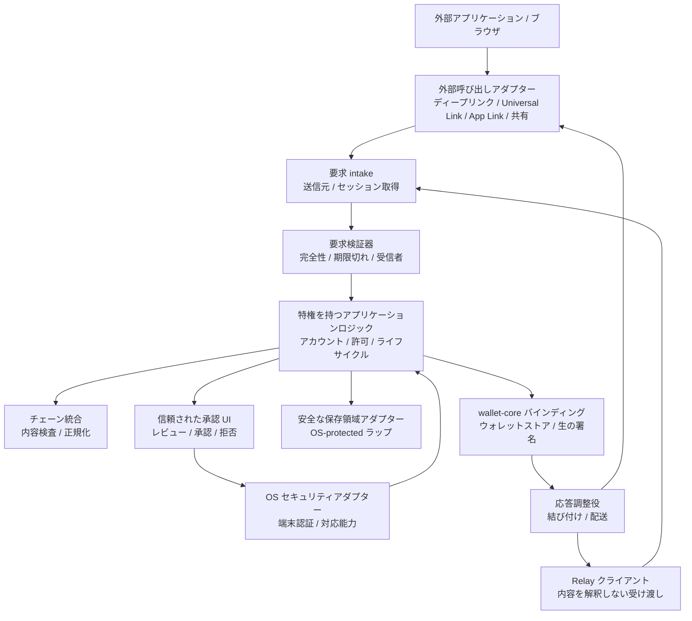

# MosaicLynx モバイルアプリ基本設計

## 1. 目的

本書は、MosaicLynx モバイルアプリを、端末上で秘密情報を保護しながら、外部から受け取った Symbol / NEM の署名要求を検証し、利用者が内容を確認して明示的に承認または拒否し、署名結果を返すモバイル Signer として設計する。

モバイルアプリは、スマートフォンの OS セキュリティ境界、アプリライフサイクル、端末認証、外部起動経路および Relay 受け渡しを扱う。共通の要求 / 応答意味、署名状態、セキュリティポリシー、チェーン / ネットワークの意味および wallet-core の暗号・鍵管理責任は、既存の共通設計を参照し、本書で独自プロトコルとして再定義しない。

## 2. 適用範囲と上位設計との関係

対象は、iOS / Android のモバイルマイルストーンにおける次の能力である。

- プロファイル / アカウントのアプリケーション管理とチェーン / ネットワークの選択・表示。
- スマートフォンブラウザ、外部アプリ、OS リンクおよび Relay からの署名要求の受信。
- 外部呼び出し文脈、受け渡しセッション、要求、許可、アカウント、チェーン / ネットワークおよび期限の検証。
- アプリが管理する信頼された UI での署名対象の表示、明示的承認 / 拒否および端末認証。
- `wallet-core` のバインディングを利用したウォレットストア、秘密情報処理および生の署名。
- ローカル署名と Relay 経由のリモート受け渡しを同じ Signer の責任境界へ統合し、元要求に結び付けした結果を返すこと。モバイル v1 の署名操作にはトランザクション署名と構造化された `MESSAGE_SIGN` を含める。

本書は次の資料と合わせて適用する。

- [MosaicLynx アーキテクチャ設計](./architecture.md)
- [MosaicLynx 共通セキュリティ設計](./security-design.md)
- [MosaicLynx 署名フロー基本設計](./signing-flow.md)
- [MosaicLynx 共通データモデル・インターフェース基本設計](./interfaces.md)
- [MosaicLynx ブラウザ拡張機能基本設計](./browser-extension.md)
- [MosaicLynx スマホアプリ要件](../requirements/mobile-app.md)
- [MosaicLynx 共通要件](../requirements/requirements.md)
- [MosaicLynx Relay 要件](../requirements/relay.md)
- [MosaicLynx SDK 要件](../requirements/sdk.md)
- [MosaicLynx コンセプトシート](../concept/concept-sheet.md)

要求・共通設計・本書が重なる場合、外部要求、共通セキュリティ上の不変条件、署名意味、共通インターフェースおよび wallet-core の外部契約を優先する。本書は、それらを iOS / Android の OS 境界、アプリライフサイクル、外部呼び出し、Relay クライアントおよびモバイル UI へ適用する。

## 3. 設計前提

### 3.1 モバイルアプリの位置付け

モバイルアプリは、端末上で利用者の署名判断を成立させるローカル Signer である。Relay を使う場合も、Relay は要求 / 応答を運ぶ通信経路であり、モバイルアプリが復号・検証・表示・承認・署名を行う。

モバイルアプリは次を担わない。

- Relay サーバーのセッション保管、内容を解釈しないエンベロープの中継、TTL、頻度上限、HTTP / Redis 管理またはサーバー側の認可。
- dApp に代わるアナウンス、ノード選択、残高・履歴取得または継続的なネットワーク状態管理。
- SDK の公開 API、通信経路選択、Web ページ統合または dApp 側の結果検証。
- OS の Keychain / Keystore / 安全な Enclave / StrongBox を wallet-core の暗号・ウォレットストア・生の署名の代替として独自実装すること。
- 外部アプリ、ブラウザ、Relay または通知の表示文言を承認の根拠とすること。

### 3.2 Android / iOS の位置付け

Android マイルストーンと iOS マイルストーンは個別に評価する。一方の OS のライフサイクル、保存領域、認証、ハードウェアで保護された対応能力または linking 対応能力を他方で利用可能と推測しない。共通化するのはドメイン、要求モデル、承認ポリシー、結果・失敗の意味および wallet-core 境界であり、OS API と UI 実装ではない。

### 3.3 OS セキュリティ境界の限界

OS の端末ロック、安全な保存領域および利用者の立ち会い対応能力は、モバイルアプリの秘密情報保護を支える境界である。ただし、OS が提供する対応能力は端末、設定、OS 状態および配布ビルドにより異なり得る。利用可能性を実行時に確認できない、保護状態を維持できない、または対応能力の範囲を表示できない場合は、より強い保護を保証したり、署名を継続したりしない。

ハードウェアで保護された保護の利用可否、非対応端末での代替経路、OS との厳密な統合は下位仕様へ委譲する。一方、Mainnet 対応能力が適用中のリリースポリシー / 根拠判定条件に従属し、判定条件が成立しない場合に Mainnet 署名を無効化することは、本書で固定する。Testnet 専用で安全に継続できる提供形態は妨げない。

## 4. モバイルアプリの責務

モバイルアプリは、次の責務を一つの信頼されたホストの中で調整する。

1. 外部呼び出し、Relay 受け渡しおよびアプリライフサイクルから得た入力を信頼されていない入力として受け取る。
2. 送信元文脈、要求 / 応答識別情報、セッション、許可、期限、プロファイル / アカウント、チェーン / ネットワークおよび意図した受信者を検証する。
3. 接続 / ペアリング、プロファイル / アカウント、許可、ロック / ロック解除および要求ライフサイクルをアプリケーションとして管理する。
4. チェーン固有の統合を使ってトランザクション / メッセージを解析、検証、正規化および内容検査する。
5. 外部アプリや Relay ではなく、アプリが管理する信頼された UI で利用者へ署名対象と影響を提示する。
6. 利用者の明示的な承認 / 拒否と、署名に必要な端末認証を別の条件として取得する。
7. 承認対象と wallet-core に渡すペイロード、アカウント、チェーン、ネットワーク、要求識別情報、操作および応答文脈が一致することを署名前に再検証する。
8. `wallet-core` バインディングを介して署名し、結果を検証して共通インターフェースの応答として元要求へ返す。
9. フォアグラウンド、バックグラウンド、中断された、プロセス終了、端末ロック / ロック解除および OS 強制終了に伴う安全側のライフサイクルを管理する。
10. OS セキュリティアダプターと安全な保存領域アダプターを通じて、暗号化されたウォレットストアと一時的な秘密情報のライフサイクルを管理する。

モバイルアプリは、Relay、SDK、OS、wallet-core のどれかへ利用者承認や外部入力検証を無条件に委譲しない。

### 4.1 共通署名ゲートの責任主体

モバイル信頼されたホストは、モバイル経路における唯一の Signer 側の処理の調整責任主体として、wallet-core の署名処理および Mobile-level 成功結果の生成へ進む前に、次の4条件をそれぞれ独立した必須条件として成立・再確認する。

1. **認証**: 対象要求 / 対象に対する利用者の認証条件が成立していること。
2. **署名可能な状態へのロック解除**: 対象プロファイルで署名能力を利用できるロック解除状態が成立していること。通常の `UNLOCKED` と同一視しない。
3. **アカウントの利用認可**: 対象プロファイル / チェーン / ネットワーク / アカウントに対する署名認可が成立していること。
4. **利用者による明示的な承認**: 利用者が同じ署名対象と確認内容を明示的に承認していること。

4条件は、同一の要求、送信元状態（検証済み / 未検証の）、検証済み受け渡し文脈、セッション / 世代、プロファイル、アカウント、チェーン / ネットワーク、操作、厳密な対象または信頼されたダイジェスト、鮮度および必要な内容検査 / 承認文脈に結び付けする。いずれか一つの成立は、他の条件の成立を意味しない。接続、許可、ペアリング、対応能力、セッション / 世代、前回認証、通常の `UNLOCKED`、OS / 端末ロック解除、生体認証成功だけ、アカウント選択、SDK 状態、Relay メタデータ / 配送、外部アプリの自己申告または受け渡しメタデータだけでは、4条件を成立させられない。wallet-core のパスワード検証、ストア検証 / 復号または署名成功も同様に代替ではない。

モバイル信頼されたホスト以外の SDK、Relay、外部アプリ、OS 受け渡しメタデータ、OS セキュリティアダプターまたは wallet-core は、4条件を成立・変更・免除・迂回できない。4条件または結び付け文脈が欠落、古くなった、失効済み、ロック済み、不明または不一致の場合、モバイル信頼されたホストは安全側での終了とし、wallet-core を呼び出さず、成功結果も返さない。

## 5. 論理コンポーネント構成


```mermaid
flowchart TB
    E[外部アプリケーション / ブラウザ]
    X[外部呼び出しアダプター<br/>ディープリンク / Universal Link / App Link / 共有]
    R[Relay クライアント<br/>内容を解釈しない受け渡し]
    I[要求 intake<br/>送信元 / セッション取得]
    V[要求検証器<br/>完全性 / 期限切れ / 受信者]
    A[特権を持つアプリケーションロジック<br/>アカウント / 許可 / ライフサイクル]
    C[チェーン統合<br/>内容検査 / 正規化]
    U[信頼された承認 UI<br/>レビュー / 承認 / 拒否]
    D[OS セキュリティアダプター<br/>端末認証 / 対応能力]
    S[安全な保存領域アダプター<br/>OS-protected ラップ]
    W[wallet-core バインディング<br/>ウォレットストア / 生の署名]
    O[応答調整役<br/>結び付け / 配送]

    E --> X --> I
    R --> I
    I --> V --> A
    A --> C
    A --> U
    U --> D
    D --> A
    A --> S
    A --> W
    W --> O
    O --> R
    O --> X
```

### 5.1 UI / アプリケーション外枠

アプリのライフサイクル、フォアグラウンド / バックグラウンド表示、プロファイル / アカウント画面、信頼された承認接点、ロック状態および利用者操作を統合する。外部アプリまたは Relay の UI をアプリの承認画面へ埋め込まず、外部由来の文字列・画像・ブランド表示を安全な UI の根拠にしない。

アプリケーション外枠は、アプリの起動やフォアグラウンド復帰を署名承認とみなさない。外部起動後に表示するのは要求の検証結果または安全な失敗状態であり、承認は利用者の個別操作で成立する。

### 5.2 外部呼び出しアダプター

OS リンク、外部アプリ受け渡し、共有等のプラットフォーム固有のな受信境界を担当する。ディープリンク、普遍的な Link、App Link、Intent、共有データおよびそれらのメタデータを要求として受け取るが、送信元が正規であることや要求が安全であることを自動的に確定しない。

OS リンクの種類、関連付け、コールバック、URL スキーマ、意図ペイロードおよびプラットフォーム API の詳細はアダプターと下位仕様へ閉じ込める。アダプターが取得した送信元文脈は、特権を持つアプリケーションロジックが要求識別情報、期限、完全性および意図した受信者と照合するための入力である。

### 5.3 Relay クライアント

Relay との接続、セッション / 要求の取得、内容を解釈しないエンベロープの送信、応答の登録・取得および共通プロトコルに沿った通信経路ライフサイクルを担う。Relay クライアントは Relay サーバーの意味上の判断権限ではなく、モバイルアプリ内で受信した暗号文やメタデータを検証前にアプリケーション要求へ昇格させない。

Relay クライアントは次を行わない。

- トランザクション / メッセージの意味解析、利用者向け表示、承認 / 拒否または署名。
- Relay から届いたことだけを根拠とする要求の承認。
- Relay の配送成功を署名成功とみなすこと。
- Relay の認証情報、E2E セッション秘密情報、ウォレットストアまたは署名秘密情報の混同。

### 5.4 要求受付 / 検証器

受信時に外部呼び出し文脈、Relay セッション、要求識別情報、送信元、Intentした受信者、期限切れ、世代 / セッション文脈、完全性および要求本文を捕捉・検証する。ディープリンクと Relay の二つの経路から同じ要求が来ても、識別情報と文脈が一致しない限り一つの要求に統合しない。

検証器は検証前にペイロードの意味上の意味、アカウント選択または承認状態を確定しない。未検証の要求は、署名対象、信頼された UI モデル、wallet-core 入力または成功応答へ変換しない。

### 5.5 特権を持つアプリケーションロジック

モバイルアプリの最終的な処理の調整とポリシー適用を担当する。送信元 / セッション、許可、プロファイル / アカウント、チェーン / ネットワーク、内容検査結果、承認、端末認証、ライフサイクル、wallet-core 呼び出しおよび応答対応付けを同じ要求識別情報に結び付ける。

アプリケーションロジックは wallet-core の内容を解釈しないストアを保存・受け渡しできるが、その内部形式を解釈・編集しない。プロファイル、表示名、アカウントの選択、許可 / ペアリング、OS 対応能力表示および要求状態はアプリケーションの責任として管理する。モバイル信頼されたホストは、4条件の成立、結び付け、署名前再検証、ライフサイクル無効化、wallet-core 結果検証および応答処理結果の区分を一つの要求文脈に対して調整する唯一の Signer 側の責任主体である。

### 5.6 チェーン統合

Symbol と NEM のトランザクション / メッセージをチェーン固有のに解析、検証、正規化し、利用者向け確認モデルを生成する。Symbol アグリゲートと NEM マルチシグ、アドレス、ネットワーク、ハッシュ、署名バイト列および対応済みの型 / バージョンを一つの独自規則へ統合しない。

未対応型 / バージョン、解析 / 検証不能、正規化不能、表示不能なフィールド、誤ったチェーン / ネットワークまたは影響を完全に確認できない要求は、警告だけで通常署名へ進めない。

#### 5.6.1 構造化された `MESSAGE_SIGN`

モバイル v1 は、トランザクション署名とは別操作として構造化された `MESSAGE_SIGN` を提供する。これは任意の生バイト列署名ではなく、既存の構造化されたメッセージ契約に従うメッセージ署名である。モバイル Signer はメッセージを内容検査し、信頼された UI の表示内容と wallet-core へ渡す署名入力を、同一の信頼された構造化されたメッセージモデルから導出する。

`MESSAGE_SIGN` の署名文脈は、検証済み / 未検証の送信元状態、検証済み受け渡し文脈、プロファイル、アカウント、チェーン / ネットワーク、`operation = MESSAGE_SIGN`、ドメイン、目的、メッセージ内容、ノンス、発行された / 期限切れ、要求鮮度およびメッセージ単位のリプレイ状態を同じ文脈として結び付けする。送信元状態や受け渡しメタデータは外部から検証済みへ昇格させず、メッセージ単位のノンス / 期限切れ / ドメイン / 目的と要求単位のリプレイ保護を別層としてもれなく検証する。厳密なフィールド、通信上のスキーマ、シリアライズ、ノンス形式および有効期間は下位仕様に委譲する。

解析失敗、不明形式、内容検査できない内容、期限切れ、重複、リプレイ、送信元間の / オリジン間の、ドメイン間のまたは目的間のメッセージは署名しない。表示不能なメッセージを生バイト列へ代替経路したり、メッセージ署名をトランザクション署名、別操作または別通信経路の成功へ自動変換したりしない。`MESSAGE_SIGN` にも共通4条件、明示的な承認、署名前再検証、結果との結び付けおよび安全側での終了を適用する。

### 5.7 信頼された承認 UI

アプリが管理するフォアグラウンドの確認領域で、要求送信元、ネットワーク、アカウント、目的、トランザクション / メッセージ内容、警告、承認操作および端末認証を扱う。外部アプリ、ブラウザ、Relay の表示文言、承認ボタンまたはトランザクション要約は承認の証拠ではない。

### 5.8 OS セキュリティ / 安全な保存領域アダプター

OS の端末認証、端末ロック状態、安全な保存領域、保護された認証情報 / 鍵、ハードウェアで保護された対応能力および画面露出対応能力をアプリケーションへ抽象化する。OS の返す成功を署名承認に変換せず、OS 対応能力の有無を利用者への表示と署名ポリシーに反映する。

### 5.9 wallet-core バインディング

モバイルアプリと wallet-core の API / データ所有責任境界を担う薄いアダプターである。ネイティブ / WASM 等の具体バインディングは下位仕様へ委譲するが、バインディングが鍵導出、暗号、パスワード認可、ウォレットストア解釈または生の署名をモバイルアプリケーションと重複実装しないことを前提とする。

## 6. 信頼境界

```text
外部 / 信頼されていない境界
  ブラウザ / 外部アプリケーション / ディープリンク / Intent / 共有
  Relay / 受け渡しメタデータ / ネットワーク観測
             │ すべての外部入力
             ▼
モバイル要求 intake 境界
  送信元文脈 / セッション / 要求識別情報取得
  構造上の検証 / 期限切れ / 受信者 / 完全性
             │ validated 要求文脈のみ
             ▼
モバイル特権を持つアプリケーション境界
  プロファイル / アカウント / チェーン / ネットワーク / 許可
  意味上の内容検査 / ライフサイクル / 応答対応付け
             │ 確認モデル導出された by モバイルアプリ
             ▼
モバイル信頼された承認 UI
  human-readable レビュー / 明示的な承認 / 端末認証
             │ 承認済みと revalidated 対象のみ
             ▼
wallet-core 論理的な / バインディング境界
  ウォレットストア / 秘密情報処理 / 鍵操作 / 生の署名
             │ 保護された保存領域と利用者の立ち会いサポート
             ▼
OS セキュリティ境界
  端末ロック / 保護された認証情報または鍵 / ハードウェアで保護された対応能力
```

OS セキュリティ境界はモバイルアプリの全責任を代替しない。OS が呼び出し元、要求完全性、トランザクションの意味または利用者の意思を保証するとは扱わない。wallet-core を信頼することも、wallet-core が利用者承認や外部呼び出しの検証を代行することを意味しない。

バインディングがネイティブプロセスまたは WASM 実行文脈を提供しても、ホストのメモリ、実行環境、バッファーコピー、画面、OS ログまたは異常終了報告書から秘密情報を自動的に隔離するとは限らない。モバイルアプリは Web / 外部アプリケーション / Relay へバインディングを公開せず、秘密情報を必要最小限のホストライフサイクルで扱う。

## 7. 外部呼び出し / ディープリンク

### 7.1 共通受信原則

モバイルアプリの起動は要求の受信を意味し得るが、承認、ロック解除または署名の意味を持たない。アプリが起動した時点で、受信した外部入力は未検証であり、次を確認するまで承認 UI の署名操作へ渡さない。

- 要求識別情報、セッション / 受け渡し識別情報および意図した受信者。
- 外部送信元文脈と要求の対応。
- 要求完全性、期限、世代 / 鮮度、重複、リプレイおよび消費済み状態。
- プロファイル / アカウント、チェーン / ネットワーク、操作、署名対象および許可 / ペアリング文脈。
- アプリの現在ライフサイクル、ロック状態、端末セキュリティ対応能力および要求がまだ有効であること。

検証できない外部呼び出しは、安全なエラーまたはアプリの通常画面へ遷移させ、署名要求として処理しない。未許可または unsolicited 要求は、接続・ペアリングの候補となり得ても、署名承認へ暗黙に昇格しない。

### 7.2 リンク / 受け渡し方式の扱い

独自の URL 方式、普遍的な Link、Android App Link、共有 / Intentおよび QR 等は、モバイルアプリを起動または要求受け渡しを始める通信経路候補である。方式の採否、具体スキーマ、関連付け、証明、コールバックおよび UX は `MR-OPEN-002` と下位仕様へ委譲する。

- 独自の URL 方式は他アプリによる登録・起動競合を想定し、方式で正規送信元を確定しない。
- 普遍的な Link / App Link は OS による経路選択 / 関連付けの情報として扱い、要求内容、オリジン、セッションまたは署名者の正当性をそれだけで確定しない。
- QR、共有データまたは意図を採用する場合も、入力は信頼されていないとし、通常の要求検証、期限切れ、リプレイ保護、承認との結び付けを適用する。QR / オフライン署名の採否やプロトコルを本書で追加しない。
- 通知や OS 復帰が利用される場合も、通知ペイロードは要求の信頼アンカーまたは署名ペイロードではない。プッシュ通知の採否・契約は既存要求が確定した場合だけ下位仕様で定める。

外部呼び出しに秘密鍵、ニーモニック、プロファイルパスワード、復号済みウォレットストア、署名用秘密情報、E2E セッション秘密情報または長期的なロック解除認証情報を含めない。要求を指す最小の識別子が含まれる場合も、アプリが現在のセッション、受信者、完全性および期限切れを検証するまで使用しない。

### 7.3 送信元の表示と検証

信頼された UI は、外部呼び出しの通信経路名だけでなく、要求送信元 / 依拠する文脈、チェーン、ネットワーク、アカウントおよび操作を利用者に示す。送信元の表示名、アイコン、URL、アプリ名またはドメインは、要求内容の確認を補助する情報であり、サイトやアプリの善性・本人性・非侵害を保証する表示にしてはならない。

モバイル Mainnet のオリジン証明等、共通受け渡し契約が追加の送信元検証を要求する場合、モバイルアプリはその証明を要求完全性、オリジン、期待される Signer およびリリース対応能力とともに検証する。証明がない、期限切れ、鍵不一致または検証不能な場合は、適用されるポリシーに従い未検証表示または署名拒否とする。証明のプロトコル、登録鍵、シリアライズおよび表示文言は本書で再定義しない。

## 8. Relay 統合

### 8.1 Relay の位置付け

Relay は、dApp / SDK とモバイルアプリの間で E2E 保護された要求 / 応答を短期間受け渡す信頼されていない通信経路である。Relay から届いたという事実を、要求の真正性、トランザクションの安全性、利用者の意思または署名能力の信頼アンカーにしない。

モバイルアプリは Relay から受け取ったエンベロープ / メタデータを検証し、復号・意味上の内容検査・表示・承認 / 拒否・端末認証・署名をアプリ側で行う。Relay はトランザクション / メッセージを解釈せず、秘密情報を扱わず、署名せず、アナウンスしない。

### 8.2 モバイル側の検証境界

Relay 要求を承認 UI へ渡す前に、モバイルアプリは少なくとも次を確認する。

- Relay セッション、要求識別情報、応答対応付けおよび現在の世代 / 受け渡し文脈。
- 要求の期限切れ、消費済み / キャンセル済み状態、重複、リプレイ、遅延した配送および状態消失。
- 意図した受信者が当該モバイルアプリ / プロファイル / セッションに対応すること。
- 要求の暗号学的完全性、要求ダイジェスト、方向、チェーン / ネットワーク、操作およびペイロードの対応。
- Relay が提供したメタデータと要求本文の整合性。Relay の自己申告を意味上の判断権限としない。

復号・完全性検証に失敗した暗号文は、平文として UI、ドメインオブジェクト、ログ、診断または wallet-core 入力へ渡さない。Relay 状態消失、旧世代、セッション期限切れまたは要求識別情報不一致後は、古い要求 / 承認を復元せず、新しい受け渡し文脈、要求識別情報、暗号化エンベロープおよび利用者承認を必要とする。

### 8.3 応答結び付け

モバイルアプリが成功応答を返せるのは、wallet-core の暗号学的な成功だけでなく、次の対応をモバイル信頼されたホストが安全に確認できる場合に限る。

- 元の要求と要求識別情報 / 対応付け、および検証済み / 未検証の送信元状態と検証済み受け渡し文脈。
- Signer 識別情報、プロファイル、アカウント、チェーン / ネットワーク、操作および厳密な対象 / 信頼されたダイジェスト。
- 署名時点の認証、署名可能な状態へのロック解除、対象プロファイル / チェーン / ネットワーク / アカウントに対するアカウントの利用認可、利用者による明示的な承認の4条件。
- 4条件が成立した承認文脈、内容検査結果、鮮度および応答受信者 / 処理結果の区分。

文脈消失、古くなった、失効済み、ロック済み、送信元不一致、プロファイル / アカウント不一致、チェーン / ネットワーク不一致、対象不一致、Signer 不一致、署名時点の判定条件文脈不明または結果処理結果の区分不明の場合は成功としない。wallet-core のパスワード検証、ストア検証 / 復号または署名成功だけでも Mobile-level 成功にはならない。モバイルアプリは wallet-core の返却値をそのまま転送せず、上記を結果検証してから元要求に結び付けした応答を生成する。

署名済み結果の生成が確定して配送だけが不明な場合は、共通設計の配送処理結果の区分に従い、既存結果の再配送・照会だけを候補とする。同じ対象の再署名を行わない。署名生成自体が不明な `RESULT_UNKNOWN` の場合も、古い要求を自動再実行しない。`RESULT_UNKNOWN` と `DELIVERY_UNKNOWN`、および既知結果の再送 / 照会と再署名を混同しない。

モバイルアプリ独自の Relay プロトコル、エンベロープ、暗号パラメーター、エンドポイント、TTL、トークン、受領確認、ポーリングおよび保存領域状態は、[interfaces.md](./interfaces.md)、[Relay 要件](../requirements/relay.md)、SDK / 受け渡し仕様へ委譲する。

## 9. プロファイル / アカウント / ネットワーク管理

プロファイルは一つのチェーンと Mainnet / Testnet の一つのネットワークを固定するアプリケーション上の境界として扱う。アカウント、既定アカウント、許可および署名認可はプロファイルの固定チェーン / ネットワークに一致するものだけを関連付ける。Symbol と NEM の両方を利用する場合はチェーンごとに別プロファイルを使用し、Symbol と NEM の公開鍵、アドレス、ネットワークおよび署名意味を一つのプロファイル内の文脈へ混在させない。

モバイルアプリは、外部要求に含まれるアカウント識別子、期待される Signer または公開識別情報を補助情報として扱い、内部鍵枠や秘密鍵を外部指定で直接選択しない。信頼された UI で利用者が選択・確認したアカウントと、ペイロードの Signer、期待される Signer、チェーン、ネットワークが一致することを検証する。

外部へ公開可能な情報は、共通許可 / 受け渡し契約で明示的に許可された公開識別情報に限る。アドレス、公開鍵、チェーン、ネットワーク、許可されたアカウント識別子等を含み得るが、秘密鍵、ニーモニック、シード、プロファイルパスワード、復号済みストア、wallet-core 内部参照または署名用秘密情報は含めない。

プロファイル、アカウント、許可 / ペアリング、チェーン / ネットワーク、OS 対応能力、ウォレットストアのリビジョン、送信元文脈、セッション / 世代、操作、対象または鮮度が変更・削除・無効化された場合、該当セッションと未完了認可を失効させる。プロファイルの変更だけで要求のアカウントやネットワークを自動切替して署名してはならない。

## 10. 端末認証

### 10.1 認証の役割

モバイルアプリは、OS-provided 利用者認証、端末パスコード / PIN、生体認証等を、アプリロック解除または署名前の利用者の立ち会い確認のために利用できる。ただし、認証成功と署名承認は異なる条件である。

```text
要求検証 / 内容検査
  → 信頼された UI で内容確認
  → 利用者の明示的な承認意図
  → 端末認証 / 利用者存在
  → 署名前の結び付け再検証
  → wallet-core 署名
```

利用者が内容を確認せずに認証だけ成功した場合、または認証済み状態が別要求へ流用された場合、署名を開始しない。認証は「この利用者が現在アプリを操作している」ことを補助するが、署名可能な状態へのロック解除、アカウントの利用認可、利用者による明示的な承認またはどのペイロードに署名するかを決める判断権限ではない。

### 10.2 代替経路と対応能力

生体認証を唯一の復旧仕組みとしない。生体認証が利用できない、失敗する、端末設定が変わる、端末ロックが解除されていない、OS が利用者の立ち会いを確認できない場合は、あらかじめ定めた認証方式だけを信頼された UI から選択できる。未定義の代替経路、認証失敗の自動迂回、前回の成功状態の無期限利用は許可しない。

認証方式、再認証頻度、失敗時の頻度上限、PIN / パスコードとプロファイルパスワードの役割、生体認証代替経路および OS 対応能力の表示は `MR-OPEN-004` と下位仕様へ委譲する。利用者へ「生体認証があるから秘密鍵がハードウェアにのみ存在する」等、実際に検証できない保証を表示しない。

### 10.3 認証状態のライフサイクル

認証成功の結果は、共通4条件のうち認証にだけ対応する、一時的な要求に結び付いた認証文脈として扱う。これは署名可能な状態へのロック解除、アカウントの利用認可または利用者による明示的な承認を成立させない。アプリ再起動、プロセス終了、端末ロック、セキュリティ対応能力消失、待機タイムアウト、手動ロック、プロファイル変更または要求文脈消失で無効化する。認証文脈を永続的な保存領域、URL、Relay、外部アプリまたは応答へ保存しない。

## 11. 秘密情報保護 / 安全な保存領域

### 11.1 概念モデル

```text
wallet-core
  暗号化されたウォレットストア / プロファイルパスワード / 鍵資料処理
          ▲
          │ limited ホスト入力と出力
モバイルアプリ特権を持つホスト
  保存領域 / 認証 / ライフサイクル / メモリ処理
          ▲
          │ OS-protected アクセスまたはラップ
OS セキュリティ境界
  保護された認証情報 / 鍵 / 端末利用者存在
```

役割は次のように分ける。

- **暗号化されたウォレットストア**: wallet-core が定める保護形式の内容を解釈しないデータ。モバイルアプリは内部形式、KDF、AEAD、鍵索引または暗号文を独自解釈・再実装せず、保存・置換・バージョン整合性を管理する。
- **Key-encryption 鍵 / ラップ鍵**: OS-backed 統合を採用する場合に、暗号化されたウォレットストアまたは必要な保護鍵へのアクセスを OS 利用者の立ち会い / 保護された認証情報と結び付ける概念的な役割。具体的な鍵 hierarchy、ラップ、移行およびハードウェアで保護された条件は wallet-core / プラットフォーム下位設計へ委譲する。
- **OS で保護された認証情報 / 鍵**: Keychain、Keystore 等の OS 保護対応能力を利用する場合のプラットフォーム管理対象。OS が返す対応能力と失敗状態をモバイルアプリが確認し、wallet-core の責任と混同しない。
- **復号された秘密情報 in メモリ**: 署名、復号、インポート、初回受渡し等に必要な最短期間だけ、特権を持つホスト / バインディング境界で扱う一時情報。UI 状態、Relay、外部呼び出し、long-lived キャッシュ、ログまたは応答に保持しない。

ハードウェアで保護された保護が利用可能でも、Symbol / NEM の生の署名がそのハードウェア鍵で直接実行できるとは限らない。モバイルアプリは実際の wallet-core バインディングとプラットフォーム対応能力の組み合わせを検証し、ハードウェアで保護された直接の署名やハードウェアウォレット相当の保証へ自動昇格しない。

### 11.2 保存と破棄

ウォレットストアの保存、置き換え、原子性、移行、プロファイルパスワードの認可および秘密情報処理は wallet-core の契約を正本とする。モバイルアプリは次を基本とする。

- 平文ニーモニック、秘密鍵、プロファイルパスワード、復号済みストアを永続的な保存領域に保存しない。
- バインディング呼び出し後、承認完了後、ロック、バックグラウンドポリシー、端末ロック、プロセス終了、エラーまたは文脈消失のタイミングで一時秘密情報と認証文脈を無効化する。
- メモリコピー、ネイティブ / WASM バッファー、OS ログ、異常終了報告書、画面取得、最近使ったアプリプレビュー、クリップボード、通知および利用状況分析への不要な露出を避ける。
- OS 対応能力の喪失、ストア完全性失敗、バインディングエラーまたは復元状態の不明時は、秘密情報を推測・補完せず署名可能状態を解除する。

## 12. 署名要求処理

モバイルアプリ固有の責務を、共通署名フローの Signer 側へ次のように適用する。

```text
受信外部 / Relay 要求
  → 取得送信元と受け渡し文脈
  → 検証識別情報 / 完全性 / 期限切れ / 受信者
  → 解決プロファイル / アカウント / チェーン / ネットワーク
  → 内容検査と derive 確認モデル
  → show in 信頼されたフォアグラウンド UI
  → 明示的な承認または拒否
  → 端末認証
  → 再検証承認との結び付け
  → 呼び出し wallet-core
  → 検証結果と bind 応答
```

### 12.1 受付 / 検証

外部要求、ディープリンクパラメーター、Relay メッセージ、送信元メタデータ、アカウント、チェーン、ネットワーク、表示文字列および期限を信頼されていない入力として扱う。要求検証器は、接続・ペアリング・署名要求を区別し、署名へ進める前に要求識別情報、送信元文脈、セッション、許可、完全性、鮮度、プロファイル / アカウントおよびチェーン / ネットワークを検証する。

未許可、unsolicited、不正な形式の、未対応の、期限切れ、再送された、重複、誤った受信者、誤ったセッション、誤ったネットワーク、誤ったアカウントまたは送信元を一意に確認できない要求は、通常の承認 UI へ渡さず安全に終了する。

### 12.2 内容検査 / 表示

Signer 自身が要求 / ペイロードから人が読めるな確認モデルを生成する。外部アプリ、ブラウザ、Relay が渡すトランザクション説明、要約、アプリ名前、アイコン、警告または承認文言を、署名対象の判断権限にしない。

利用者が少なくとも確認できる情報は次である。

- 要求送信元 / 依拠する文脈、受け渡しセッションの識別情報および検証状態。
- Symbol / NEM のチェーン、Mainnet / Testnet のネットワーク、プロファイル / アカウント、公開識別情報。
- 署名目的、トランザクション / メッセージの型 / バージョン、対象ペイロード、受信者、資産 / 数量、手数料、期限、メッセージ、権限・状態変更等の適用可能なセキュリティに関わるフィールド。
- アグリゲートの外側 / 埋め込みトランザクション、親、既存署名 / 連署署名、期待される Signer / 役割。
- 連署署名の選択済みの連署者、親全体、重複・期限・対象結び付け。
- 外部状態を検証できない、未対応、表示に制限がある等の警告。

解析不能、表示不能、未対応または曖昧なフィールドがセキュリティに関わるである場合、警告のみで迂回できる通常署名経路を設けず、不合格終了済みとする。

#### 12.2.1 構造化された `MESSAGE_SIGN`

`MESSAGE_SIGN` では、Signer が検証した構造化されたメッセージモデルを内容検査、信頼された UI 表示および署名入力の唯一の共通の源とする。少なくとも次のメッセージ署名文脈を一つの結び付けとして扱う。

- 検証済み / 未検証の送信元状態と検証済み受け渡し文脈。
- プロファイル、アカウント、チェーン / ネットワークおよび `operation = MESSAGE_SIGN`。
- ドメイン、目的、メッセージ内容、ノンス、発行された / 期限切れ、要求鮮度およびリプレイ状態。
- 共通4条件、承認文脈、内容検査結果および厳密な対象 / 信頼されたダイジェスト。

Signer は外部アプリの表示文言、SDK / Relay メタデータまたは OS 受け渡しの自己申告からメッセージモデルや署名入力を別々に生成しない。任意の生バイト列、解析失敗 / 内容検査できないメッセージの生の代替経路、不明形式の代替経路署名、期限切れ / 重複 / リプレイ署名、送信元間の / オリジン間のリプレイ、ドメイン間のリプレイおよび目的間のリプレイは許可しない。メッセージ署名の厳密な契約は [インターフェース仕様 §9.4](../specifications/interfaces.md) と [署名プロトコル §15](../specifications/signing-protocol.md) に委譲する。

### 12.3 承認 / 署名

承認は真偽値ではなく、要求識別情報、送信元状態、検証済み受け渡し文脈、セッション / 世代、プロファイル / アカウント、チェーン / ネットワーク、操作、厳密な署名対象 / 信頼されたダイジェスト、内容検査結果、許可 / 対応能力文脈および鮮度に結び付けした一回限りの認可である。`AUTHORIZED` は利用者による明示的な承認だけを表す状態ではなく、認証、署名可能な状態へのロック解除、アカウントの利用認可および利用者による明示的な承認の4条件が、同じ結び付け文脈に対して独立してすべて成立した場合だけ成立する。接続、許可、ペアリング、対応能力、セッション、通常の `UNLOCKED`、前回認証、OS / 端末ロック解除、アカウント選択、SDK / Relay 状態または wallet-core のパスワード / ストア検証 / 署名成功を4条件の代替にしない。

利用者が信頼された UI で承認意図を示した後、端末認証を実行し、wallet-core 呼び出し直前に次を再検証する。

1. 送信元、セッション、要求識別情報、意図した受信者、応答チャネルおよび期限が変わっていない。
2. プロファイル、アカウント、チェーン、ネットワーク、許可 / ペアリングリビジョンおよび端末セキュリティ対応能力が承認時と一致している。
3. ペイロード、親、埋め込み / 内部トランザクション、メッセージ、Signer、期待される Signer、既存の署名 / 連署署名が変わっていない。
4. 内容検査、正規化、確認モデル、操作および対象結び付けが一致している。
5. アプリがフォアグラウンドの信頼された UI と署名調整役を維持し、別要求の操作で状態が置き換わっていない。
6. 認証、署名可能な状態へのロック解除、対象プロファイル / チェーン / ネットワーク / アカウントに対するアカウントの利用認可および利用者による明示的な承認の4条件が、当該要求 / 厳密な対象に対してそれぞれ成立し、失効・ロック済み・古くなった・不明ではない。

いずれかが確認できない場合、認証成功後であっても認可を失効させ、署名を呼び出さない。4条件を外部主体や wallet-core の結果から補完してはならない。具体的なダイジェストアルゴリズム、シリアライズ、要求スキーマおよび結果スキーマは共通インターフェース / プロトコルと下位仕様へ委譲する。

## 13. 承認 UI

### 13.1 信頼されたフォアグラウンド接点

署名承認はモバイルアプリが制御するフォアグラウンド UI で行う。外部アプリ、ブラウザ、Relay、通知、OS リンクの表示領域に承認 / 拒否を委譲しない。外部コンテンツを UI に表示する場合も、テキスト、URL、アイコン、画像、markup、ディープリンクパラメーターをそのまま実行ファイル内容として扱わない。

アプリがバックグラウンド、中断された、端末ロック済み、画面遷移中またはプロセス状態不明の場合、承認済み要求をそのまま署名しない。フォアグラウンドに戻った場合も、要求を再検証し、内容を再表示し、必要な明示承認と端末認証を新たに成立させる。

### 13.2 表示の責務

信頼された UI の責務は、利用者が「どの送信元から、どのチェーン / ネットワークの、どのアカウントで、何に対して署名するか」を判断できる状態を作ることである。表示配置、文言、アクセシビリティ、ローカライズ、画面取得ポリシーおよび OS-specific UI は下位仕様へ委譲するが、確認情報の省略により内容を確認しない署名を成立させてはならない。

Mainnet / Testnet、Symbol / NEM、アカウント、受信者、数量、手数料、期限、メッセージ、アグリゲート / 連署署名の親文脈、警告および送信元検証状態を利用者が混同しないよう、文脈を同じ承認対象に結び付けする。

## 14. 要求ライフサイクル / 状態遷移

共通署名フローの状態モデルをモバイルアプリに適用する。端末認証はモバイル固有の内部内部手順であり、共通プロトコルの新しい署名基本機構や独自通信上の状態を意味しない。

```text
RECEIVED
  → VALIDATED
  → INSPECTED
  → AWAITING_USER
  → AUTHENTICATING
  → AUTHORIZED
  → SIGNING
  → SUCCEEDED
```

| 状態             | モバイルアプリでの意味                                                                                                         |
| ---------------- | ------------------------------------------------------------------------------------------------------------------------------ |
| `RECEIVED`       | 外部呼び出しまたは Relay から要求を受け取った。まだ信頼も署名可否も確定していない                                              |
| `VALIDATED`      | 送信元、セッション、要求識別情報、完全性、期限切れ、受信者、許可、プロファイル / アカウント、チェーン / ネットワークを確認した |
| `INSPECTED`      | チェーン固有の解析 / 検証 / 正規化と確認モデル生成を完了した                                                                   |
| `AWAITING_USER`  | フォアグラウンドの信頼された UI に確認対象を表示し、利用者の操作を待っている                                                   |
| `AUTHENTICATING` | 要求固有の端末認証 / 利用者存在を実行している                                                                                  |
| `AUTHORIZED`     | 同じ要求 / 対象 / プロファイル文脈に対して、4条件が独立してすべて成立した。一回限りで短寿命の認可                              |
| `SIGNING`        | 再検証済み対象を wallet-core へ渡し、結果を待っている                                                                          |
| `SUCCEEDED`      | Signer 識別情報、元要求 / 対象、署名時点の4条件および承認文脈を含む署名結果の対応を検証した                                    |

終端状態は `REJECTED`、`FAILED`、`EXPIRED`、`INVALIDATED` および `CANCELLED` の意味で、利用者拒否、検証失敗、認証失敗、期限切れ、文脈消失、wallet-core エラー、OS セキュリティ失敗、バックグラウンド / 終了または古くなった応答に対応する。終端状態から `AWAITING_USER`、`AUTHORIZED`、`AUTHENTICATING` または `SIGNING` へ戻してはならない。

署名ライフサイクルと応答配送処理結果の区分は分離する。署名生成が確定したが Relay / 外部チャネルへの配送だけ不明な場合は `SUCCEEDED + DELIVERY_UNKNOWN` とし、既存結果の再配送・照会だけを候補とする。署名生成自体が不明な場合は `RESULT_UNKNOWN` とし、自動再署名を行わない。

## 15. アプリライフサイクル / 要求復旧

送信元状態、検証済み受け渡し文脈、セッション / 世代、プロファイル、アカウント、チェーン / ネットワーク、操作、対象、鮮度または共通4条件のいずれかが変化・喪失・失効・不明になった場合、モバイル信頼されたホストは関連する承認、認証、署名可能な状態へのロック解除、アカウントの利用認可および署名文脈をまとめて失効させる。安全に同一文脈を再確認できない限り、安全側での終了とし、旧認可や結果を別文脈へ帰属させない。

### 15.1 初回開始 / フォアグラウンド

- 初回開始、アプリ再起動、更新後またはプロセス再作成後は `LOCKED` とし、以前の認証文脈、認可、承認および署名操作を復元しない。
- フォアグラウンドで外部呼び出し / Relay 要求を受け取った場合も、受信 → 検証 → 内容検査 → 信頼された UI 表示の順で処理する。アプリがフォアグラウンドであることを承認とみなさない。
- フォアグラウンド復帰時に保留中の要求を再表示する場合、送信元、要求識別情報、期限切れ、ペイロード、プロファイル / アカウント、チェーン / ネットワーク、許可、端末状態を再検証し、内容を再表示したうえで新しい承認と端末認証を要求する。

### 15.2 バックグラウンド / 中断された

バックグラウンドまたは中断されたへ移行した時点で、未完了認可と承認を原則として無効化する。内容を解釈しないな要求参照、期限切れおよび必要最小限のセッションメタデータを保持できる場合も、署名対象や認証状態を復元してはならない。

バックグラウンドで通知・Relay ポーリング・OS 復帰が発生しても、署名を実行しない。フォアグラウンドの信頼された UI が利用可能になり、現在の要求を再検証して利用者が再確認・再承認した後だけ、署名候補へ進める。

### 15.3 端末ロック / ロック解除

端末ロック、OS 利用者の立ち会いの喪失または保護された保存領域対応能力の変化を検知したら、モバイルアプリは署名可能な状態を解除し、復号済み秘密情報と認証文脈を無効化する。端末ロック解除後も自動的に `UNLOCKED` や `AUTHORIZED` へ戻さず、信頼された UI で再認証し、要求を再検証する。

### 15.4 プロセス終了 / OS 強制終了

OS によるプロセス終了、アプリ強制終了、クラッシュまたは端末再起動後に、未確認・承認済み・署名中の要求から署名を自動再開しない。

- 署名前の要求は、安全に期限切れ・失効または再表示対象として扱う。再表示する場合も新しい承認と認証が必要である。
- wallet-core 呼び出し中にプロセスが終了し、署名生成の成否を確定できない場合は `RESULT_UNKNOWN` とし、同一対象を再署名しない。
- 署名結果が確定しているが応答配送だけ不明な場合は `DELIVERY_UNKNOWN` とし、既存結果の再送・照会だけを行う。
- Relay 状態消失、セッション期限切れ、外部ページ破棄または送信元文脈の消失後に、古い要求識別情報 / 暗号文 / 承認を再利用しない。

## 16. ロック / ロック解除ライフサイクル

モバイルアプリは、少なくとも `LOCKED`、認証後の一時的な `UNLOCKED` / 署名可能な状態および終端 / 利用不能状態を論理的に持つ。具体的な状態名、タイムアウト値、認証方式およびプラットフォームポリシーは下位仕様へ委譲する。

| 事象                         | 基本動作                                                                       |
| ---------------------------- | ------------------------------------------------------------------------------ |
| アプリ起動 / 初回開始        | `LOCKED`。外部要求があっても自動ロック解除しない                               |
| フォアグラウンド復帰         | 要求とセキュリティ文脈を再検証し、必要な再表示・再認証を行う                   |
| 端末ロック解除               | アプリの自動署名や認可復元を行わない。必要なら信頼された UI で再認証する       |
| 待機タイムアウト             | 認証文脈、復号された秘密情報、認可を無効化する                                 |
| 手動ロック                   | 即時に署名可能な状態を解除し、未完了承認を失効させる                           |
| 承認前                       | 公開要求を表示できても、署名対応能力は与えない                                 |
| 署名前                       | 4条件の独立した成立、対象 / 文脈再検証および信頼された UI の継続をすべて満たす |
| プロセス再起動 / OS 強制終了 | 旧承認、認証、署名操作を自動復元しない                                         |

承認 UI 起動時にアプリがロック済みでも、要求の存在や公開情報を表示することはできる。ただし、内容確認、4条件の独立した成立、署名前再検証がすべて成立するまで wallet-core を呼び出さない。外部要求の受信だけでロック解除を開始せず、通常の `UNLOCKED` や端末ロック解除だけで署名可能な状態に遷移しない。

## 17. フォアグラウンド / バックグラウンドポリシー

利用者の明示承認を要する署名操作は、信頼された UI が利用可能なフォアグラウンド文脈で行う。バックグラウンド実行の制約を回避するため、通知、Relay コールバック、利用者に知らせない wake、画面を持たないタスクまたは古くなった UI を署名実行の代替にしない。

署名処理中のバックグラウンド移行は、プラットフォームが安全に処理状態と結果を確定できる場合を除き、結果不明または失敗として扱う。結果を推測して成功 / 拒否に変換せず、必要なら既存結果の配送処理結果の区分だけを扱う。

秘密情報は、アプリがバックグラウンドへ移行しただけで無期限に復号状態を保持しない。画面プレビュー、通知、最近使ったアプリ一覧、画面取得、クリップボード等のプラットフォーム露出については、実際に防止できる範囲を超える保証を表示せず、具体的なプライバシーポリシーは `MR-OPEN-007` と下位仕様へ委譲する。

## 18. wallet-core 統合

```text
モバイル UI / アプリケーション
  ├─ 送信元 / セッション / 許可 / プロファイル / アカウント
  ├─ チェーン / ネットワーク内容検査と確認
  ├─ 明示的な承認 / 端末認証
  ├─ ライフサイクル / 応答対応付け
  └─ wallet-core バインディングアダプター
          │ 承認済み, revalidated 生バイト列と文脈
          ▼
wallet-core
  ├─ ウォレットストア / プロファイルパスワード認可
  ├─ チェーン固有の鍵ライフサイクル
  ├─ 秘密情報処理 / 暗号学的な操作
  └─ 生のペイロード署名
          │ 保護された保存領域サポート is host/platform 責務
          ▼
OS セキュリティアダプター / 保護された保存領域
```

`wallet-core` はモバイルアプリの UI、外部呼び出し、Relay、許可、トランザクション / メッセージの意味解釈または利用者承認を担わない。モバイルアプリは wallet-core の生の署名基本機構を、内容検査と信頼された承認の後にだけ呼び出す。wallet-core がトランザクションを解釈しないことを理由に、モバイルアプリが内容確認を省略してはならない。

ネイティブ / WASM バインディングの具体方式は、wallet-core の外部契約に従う。バインディングは型、バッファー、所有責任、エラー / 警告およびライフサイクルの橋渡しに限定し、アプリケーション独自の暗号、パスワード迂回、鍵導出、ウォレットストア編集または署名を追加しない。

モバイルアプリは、WASM が JavaScript と同じ実行文脈で動作し得ること、ネイティブバインディングでもホストバッファー・実行環境・OS ログの保護が自動保証されないことを前提にする。React ネイティブ等の UI 層、ネイティブ / WASM バインディング、wallet-core を別責務として扱い、WebView や外部アプリへバインディングを公開しない。

## 19. 保存領域分類

具体的なデータベース、保存領域 API、レコードスキーマ、鍵名、移行形式は下位仕様へ委譲する。基本の保持範囲は次のとおりである。

| 分類                                                    | 基本保持範囲             | 方針                                                                                                                         |
| ------------------------------------------------------- | ------------------------ | ---------------------------------------------------------------------------------------------------------------------------- |
| 暗号化されたウォレットストア                            | 永続的な                 | wallet-core の内容を解釈しないストアとして保存する。内部をモバイルアプリが解釈・編集しない                                   |
| OS で保護された認証情報 / ラップ鍵                      | 永続的な / OS-managed    | OS セキュリティ境界に保持し、ハードウェアで保護された対応能力の有無と失敗状態をアプリが確認する                              |
| プロファイル / アカウントメタデータ                     | 永続的な                 | 公開識別情報、表示情報、チェーン / ネットワーク関連付けを保持する。秘密情報を含めない                                        |
| 許可 / ペアリングメタデータ                             | 永続的な                 | 送信元 / セッション対象範囲、アカウント、チェーン / ネットワーク、リビジョン、失効状態を保持できる。署名承認や認証を含めない |
| Relay セッション / 受け渡しメタデータ                   | セッション範囲を限定した | 期限切れ、セッション / 要求参照、意図した受信者等を短期保持できる。状態復元時も再検証を必須とする                            |
| settings                                                | 永続的な                 | language、theme、非秘密のプラットフォーム / ロックポリシー等に限定する                                                       |
| 一時的な要求エンベロープ / 保留中の参照                 | セッション範囲を限定した | 期限切れ内の内容を解釈しないデータまたは参照に限る。プロセス再起動後の自動承認復元に使わない                                 |
| 承認 / 認可 / device-auth 文脈                          | メモリのみ               | 要求ごとに短寿命で保持し、バックグラウンド、ロック、再起動、文脈消失で破棄する                                               |
| 復号された秘密情報 / パスワード / 秘密鍵 / ニーモニック | メモリのみ               | 必要な処理期間だけ扱い、バインディング呼び出し完了・ロック・エラー・終了で無効化する                                         |

永続的な要求メタデータが存在することを `AUTHORIZED`、`UNLOCKED`、署名成功または署名再開可能と解釈してはならない。バックアップ / 復元、端末移行および OS で保護された鍵の移行は v1 の共通必須能力とせず、提供する場合の復元対象・署名能力・保護レベルを利用者へ明示する。

## 20. アグリゲート / 連署署名 / 部分トランザクション

トランザクションプロトコルの詳細は [署名フロー基本設計](./signing-flow.md)、チェーン互換性、チェーン固有の統合および wallet-core 契約へ委譲する。モバイルアプリでは、画面サイズやバックグラウンド中断があっても、利用者が署名対象の全体を理解できない状態を通常署名として扱わない。

### 20.1 アグリゲート完了 / Bonded

Symbol アグリゲート完了 / Bonded は外側トランザクションの概要だけを表示して承認させない。対応範囲では、外側、埋め込みトランザクション全体、Signer、受信者、資産 / 数量、手数料、期限、名前空間、メタデータ、判断権限 / 許可変更、トランザクションハッシュ、既存連署署名および期待される Signer / 役割を同じ署名対象として内容検査・確認する。

埋め込みトランザクションの一部、影響、Signer、対象識別情報または必須文脈を解析・表示できない場合は署名しない。Bonded / 部分トランザクションであることだけを理由に、ノードや Relay から親を取得・補完して署名することも許可しない。

### 20.2 連署署名

連署署名の署名対象は分離されたバイト列だけではなく、連署署名が追加される親トランザクション全体と選択済みの連署者の関係である。親全体、埋め込み / 内部トランザクション、既存の署名 / cosignatures、重複 / 既に署名済み、期待される役割、期限切れ、チェーン / ネットワークおよびアカウントを確認できる場合だけ候補とする。

ハッシュ、内容を解釈しない識別子、ハッシュ + 要約、外部照会または部分フィールドだけでは親全体の確認モデルを構成できない。モバイルアプリはそれらを通常の内容を確認しない署名に変換しない。

### 20.3 部分トランザクション / NEM 固有の文脈

部分トランザクションは共通の署名基本機構ではなく、チェーン / ネットワーク / 受け渡し上の未完成状態である。モバイルアプリに渡された文脈だけで親、埋め込み / 内部内容、既存署名、期待される Signer、期限および影響を検証・表示できない場合、追加取得や推測補完を署名条件にしない。

NEM マルチシグ / 連署署名は Symbol アグリゲートと同じ構造へ変換せず、NEM 固有の統合に委譲する。共通化するのは要求ライフサイクル、承認、アカウント / チェーン / ネットワーク結び付け、結果対応付けおよび安全側での終了だけである。

## 21. 並行する要求処理

複数の Relay 要求、ディープリンク要求、同一セッションの要求または異なるアカウント / ネットワークの要求が届いても、利用者が対象を取り違えないことを優先する。

- 各要求は独立した要求識別情報、送信元文脈、セッション、期限切れ、プロファイル / アカウント、チェーン / ネットワーク、操作、対象、内容検査結果および応答チャネルを持つ。
- ディープリンクと Relay が同時に到着しても、要求識別情報と受け渡し文脈を確認せず同一要求として統合しない。
- フォアグラウンドの承認対象は一つに限定する。追加要求は独立した待機、拒否または期限切れとして扱い、複数要求を一つの承認操作にまとめない。
- 同じセッション、同じ送信元、同じアカウントであっても承認、端末認証、対象および応答を使い回さない。
- アカウント / ネットワークの切替、プロファイル変更、許可失効または別要求の操作によって有効な承認を上書きしない。

キュー、拒否、上限、公平性、排他制御および UI 通知の具体アルゴリズムは下位仕様へ委譲するが、どの方式でも要求差し替え、承認 confusion、アカウント差し替え、応答 misdelivery を成立させてはならない。

## 22. 失敗 / 復旧

詳細なエラーコード、通信上のエラー、再試行回数および UI 文言は共通インターフェース / プロトコルと下位仕様へ委譲する。モバイルアプリの基本動作は次のとおりである。

| 事象                                            | 基本動作                                                                                     |
| ----------------------------------------------- | -------------------------------------------------------------------------------------------- |
| 不正な形式の / 未対応の要求                     | 検証 / 内容検査で停止し、署名しない                                                          |
| 無効なディープリンク / App Link / Intent / 共有 | 送信元または要求識別情報を確定せず、署名要求として扱わない                                   |
| 無効な Relay メッセージ / AEAD / ダイジェスト   | 平文、承認モデル、wallet-core 入力に変換せず失敗する                                         |
| 期限切れ / リプレイ / 重複 / 消費済み           | 要求を終端とし、古い承認や識別情報を再利用しない                                             |
| 誤った送信元 / 受信者 / セッション              | 許可 / ペアリングやアカウントを自動切替せず拒否する                                          |
| 誤ったアカウント / チェーン / ネットワーク      | 信頼された UI へ署名対象として進めず、安全に終了する                                         |
| アプリロック済み / 端末認証失敗                 | 署名を開始しない。認証成功を承認とみなさない                                                 |
| 利用者拒否                                      | wallet-core を呼ばず、拒否を元要求へ結び付けして返す                                         |
| 利用者 closes アプリ / 承認 UI                  | 未署名ならキャンセル / 期限切れ / 無効化済みとする。署名結果不明なら `RESULT_UNKNOWN` とする |
| バックグラウンド / 端末ロック / OS 中断         | 認可、認証文脈、復号された秘密情報を無効化し、復帰後に再検証・再承認する                     |
| プロセス終了 / OS 強制終了                      | 旧承認、認証、署名操作を自動復元しない                                                       |
| wallet-core / バインディング / ストア失敗       | 成功とせず、秘密情報をエラー / ログ / 診断に含めない                                         |
| Relay 接続解除 / 状態消失                       | 配送成否を署名成功とせず、旧セッション / 暗号文を再利用しない                                |
| 古くなった応答                                  | 別要求、別送信元、別セッションまたは別文書へ返さない                                         |
| 並行する要求競合                                | 要求ごとの独立性を維持し、混同を避けて待機・拒否・期限切れとする                             |

安全条件を満たさない継続の復旧、暗黙的承認、自動ロック解除、自動再署名、古い暗号文 / 承認の再利用または Relay 失敗を理由とした検証省略は行わない。復旧後に要求を再表示できる場合も、新しい確認と認証が必要である。

## 23. プラットフォーム互換性 / OS アダプター

iOS / Android の差異は、モバイルアプリの共通アプリケーションモデルと OS アダプターの境界で扱う。

### 23.1 Mainnet 対応能力判定条件

Mainnet 署名対応能力は、適用中の Mainnet リリースポリシー / 根拠判定条件が成立した場合にだけ有効にする。モバイルアプリは判定条件状態を署名対応能力の前提として扱い、次のいずれかがある場合は Mainnet 署名対応能力を無効化して安全側での終了とする。

- 必須根拠の欠落、不一致、無効なまたは期限切れ。
- 根拠の署名検証失敗、信頼された鍵 / 信頼送信元の不備。
- 適用ポリシーの判定不能、または判定条件状態不明。

判定条件不成立または不明の場合も、同じビルド / アプリで安全に Testnet 専用を継続できる余地は維持する。OS ロック解除、生体認証成功、ハードウェアで保護された対応能力の存在、安全な保存領域対応能力、アプリストア / Google Play への配布成功、アプリの正常起動、Relay 接続成功または wallet-core 署名対応能力は Mainnet 判定条件の代替ではない。根拠形式、実行環境強制メソッド、OS API、ハードウェア対応表およびリリース補助ツールは、既存リリースポリシーと下位仕様へ委譲する。

- 外部呼び出し、リンク関連付け、共有 / Intent、フォアグラウンド / バックグラウンド、中断された、プロセス強制終了。
- 端末ロック、生体認証 / パスコード、利用者の立ち会い、安全な保存領域、保護された認証情報 / 鍵。
- 画面取得、最近使ったアプリプレビュー、通知、クリップボード、異常終了 / 診断の露出。
- ネイティブ / WASM バインディングのホスト統合、バッファー所有責任、メモリライフサイクル。
- ストア移行、アプリ更新、バックアップ / 復元、OS 対応能力報告書、Mainnet 判定条件。

OS バージョン、個別 API メソッド、バックグラウンドタスク設定、データベース、ネイティブモジュール、ビルド構成および互換性対応表は本書で固定しない。OS が reliable 送信元文脈、信頼されたフォアグラウンド承認、保護された保存領域またはライフサイクル無効化を提供できない場合、その対応能力を署名可能状態として公開せず不合格終了済みとする。

## 24. セキュリティ上の不変条件

共通セキュリティ設計および共通署名フローの不変条件を、モバイルアプリに次のように適用する。すべて MUST であり、下位仕様・実装・運用がこれを弱めてはならない。

1. 外部アプリケーション、ブラウザ、ディープリンク、Intent、共有、Relay、ネットワークおよび通知からの入力は、検証前はすべて信頼されていないとする。
2. アプリの起動、ディープリンクの受信、Relay メッセージの取得、通知の受信または OS 認証成功だけで署名しない。
3. 利用者の明示的な承認なしに署名しない。端末認証と署名承認を混同しない。
4. 要求、送信元、セッション、許可、応答、プロファイル / アカウント、チェーン / ネットワークおよび署名対象を一つの認可文脈に結び付けする。
5. Relay を信頼アンカーとせず、Relay の配送成功、メタデータ、セッション存在または通信経路認証情報を要求の意味上の判断権限にしない。
6. 外部呼び出しの URL、方式、関連付け、アプリ名、アイコン、オリジンまたは表示文言を、要求完全性、サイトの善性または利用者の意図の単独の根拠にしない。
7. 信頼された UI で確認した送信元、アカウント、ネットワーク、目的、トランザクション / メッセージ文脈と、wallet-core が実際に署名するペイロードを署名前に一致させる。
8. 未対応の、unparseable、曖昧な、部分的または表示不能な署名要求を通常フローで署名しない。
9. 期限切れ、消費済み、再送された、重複、古くなったまたは無効化済み要求 / 承認 / 認証文脈を再利用しない。
10. バックグラウンド、中断された、端末ロック、プロセス再起動、OS 強制終了または文脈消失後に古い承認、認証、署名操作を自動復元しない。
11. バックグラウンド状態、通知、画面を持たない復帰または Relay コールバックだけで暗黙の署名を行わない。
12. 秘密鍵、ニーモニック、プロファイルパスワード、復号されたウォレットストア、E2E セッション秘密情報および認証文脈を外部アプリケーション、ブラウザ、Relay、URL、通知、ログ、診断、利用状況分析または遠隔計測データへ渡さない。
13. 暗号化されたウォレットストア、OS で保護された認証情報 / 鍵および復号された秘密情報の役割とライフサイクルを分離し、OS 対応能力を確認できない場合に保護保証を過大表示しない。
14. wallet-core 外で暗号基本機構、鍵導出、ウォレットストア暗号化、パスワード認可または生の署名を独自実装しない。
15. 端末認証、wallet-core、Relay、OS または応答配送が不明・失敗した場合は不合格終了済みとし、復旧時に旧要求の暗黙的再実行をしない。
16. Mainnet 署名対応能力は、適用中のリリースポリシー / 根拠判定条件が成立した場合だけ有効にする。必須根拠の欠落、不一致、無効な、期限切れ、署名検証失敗、信頼された鍵 / 信頼送信元の不備、ポリシー判定不能または判定条件状態不明の場合は Mainnet 対応能力を無効化し、Testnet 専用を安全に継続できる場合を除いて安全側での終了とする。OS ロック解除、生体認証、ハードウェアで保護された / 安全な保存領域対応能力、ストア配布成功、アプリ起動、Relay 接続または wallet-core 署名成功を判定条件の代替にしない。

## 25. ブラウザ拡張機能 / Relay / SDK / wallet-core との責任分界

| コンポーネント              | モバイルアプリとの境界                                                                                                                                                                             |
| --------------------------- | -------------------------------------------------------------------------------------------------------------------------------------------------------------------------------------------------- |
| ブラウザ拡張機能            | 共通の署名フロー、インターフェース、セキュリティポリシー、結果 / 失敗意味を共有する。ブラウザ観測された文脈、拡張機能 UI、ブラウザ保存領域、サービスワーカーライフサイクルはモバイルに持ち込まない |
| dApp / Web アプリケーション | SDK を通じて要求を作成し、結果を独立検証し、アナウンス等のネットワーク処理を担う。外部 UI、通知、Relay 配送を承認証拠にしない                                                                      |
| SDK                         | Web アプリケーション向けの通信方式に依存しない API、要求 / 応答、エラー、受け渡しを提供する。モバイルの意味上の内容検査、承認、端末認証、秘密情報処理を担わない                                    |
| Relay サーバー              | 内容を解釈しない要求 / 応答通信経路、構造上の検証、短期状態、配送を担う。署名対象を解釈せず、秘密情報・承認・署名・アナウンスを担わない                                                            |
| wallet-core                 | ウォレットストア、プロファイルパスワード認可、鍵ライフサイクル、秘密情報処理、チェーン固有の鍵操作、生の署名を担う。UI、送信元、許可、端末認証、トランザクション意味、承認を担わない               |
| OS / プラットフォーム       | プロセスライフサイクル、外部呼び出し、端末ロック、利用者の立ち会い、安全な保存領域 / ハードウェアで保護された対応能力の候補を提供する。MosaicLynx の要求有効性、承認、署名意味を決めない           |
| Symbol / NEM 統合           | チェーン固有の解析、検証、正規化、内容検査および対応済みの対象範囲を担う。モバイルの共通ライフサイクル、OS アダプター、承認ポリシーは担わない                                                      |
| リリース / 根拠ポリシー     | 適用ポリシーに基づく根拠、信頼送信元および判定条件状態を管理・判定する。モバイル対応能力は判定結果を消費するが、判定条件を独自に免除・置換しない                                                   |

利用者拒否、検証失敗、結果不明、Relay 状態消失または応答配送不明の後に、別通信経路、別 Signer または別要求へ自動代替経路して承認境界を迂回しない。

## 26. 下位仕様への委譲事項

本書で基本方針だけを定め、次を詳細仕様へ委譲する。

- 独自の URL 方式、普遍的な Link、Android App Link、Intent、共有、QR、コールバック、関連付け、オリジン証明、要求 / 応答スキーマおよび完全な受け渡しプロトコル。
- Relay のエンベロープ、暗号方式、AAD、鍵交換、セッション / 要求 / 応答状態、世代、TTL、トークン、受領確認、ポーリング、頻度上限および API。
- iOS / Android の具体 API、OS バージョン、許可、バックグラウンドタスク、通知、画面取得、最近使ったアプリプレビュー、クリップボードおよびプライバシーポリシー。
- 端末認証の API、生体認証 / パスコード / PIN の組合せ、代替経路、再試行 / 頻度上限、利用者の立ち会いの要求頻度およびロックタイムアウト。
- ハードウェアで保護された対応能力の検出、OS で保護されたラップ、鍵 hierarchy、非対応端末の代替経路、Mainnet 判定条件の厳密な根拠統合および実行環境強制。
- wallet-core ネイティブ / WASM バインディング、React ネイティブホスト統合、バッファー所有責任、秘密情報メモリライフサイクル、ストア置き換え、移行、バックアップ / 復元。
- プロファイル / アカウント / 許可 / ペアリングの公開 DTO、内部参照、セッション永続化、リビジョンおよび失効の原子性。
- Symbol / NEM のトランザクション型 / バージョン、メッセージ形式、アグリゲート、連署署名、部分トランザクション、NEM マルチシグの対応済みの対象範囲、表示フィールドおよび固定ベクター。
- 信頼された UI の画面遷移、配置、文言、アクセシビリティ、ローカライズ、送信元表示、警告、認証 UI およびライフサイクル UI。
- 並行する要求のキュー / 拒否アルゴリズム、同時実行上限、公平性、タイムアウト、再試行および配送取得。
- アプリストア / Google Play 配布、更新 / ロールバック、OS サポート、リリース証跡、対応能力報告書、事故応答および公開停止。
- 詳細なエラーコード、テスト事例、E2E、障害注入、性能目標および遠隔計測データ。

上記を決める場合も、[security-design.md](./security-design.md) の秘密情報の分離・端末 / アプリ認証・安全側での終了、[signing-flow.md](./signing-flow.md) の認可 / 対象結び付け、[interfaces.md](./interfaces.md) の共通契約および wallet-core の外部契約を弱めてはならない。

## 27. 未決事項

本書では次を勝手に確定しない。

- iOS / Android の対象 OS バージョン、端末範囲、配布チャネルおよび個別マイルストーンの完了条件。
- ディープリンク、普遍的な Link、App Link、独自の方式、QR、共有 / Intentの採否、優先順位、スキーマ、関連付けおよび送信元証明。
- Relay の主経路・代替経路、ペアリング UX、セッション復旧、世代、応答取得および Relay 利用不能時の挙動。
- PIN、OS パスコード、生体認証、プロファイルパスワードの役割、代替経路、失敗時処理、再認証頻度およびロックタイムアウト。
- 安全な保存領域、ハードウェアで保護された保護、OS で保護されたラップ、非対応端末の代替経路、直接ハードウェア署名の対応能力、およびリリース証跡の厳密な形式 / 実行環境統合。Mainnet 判定条件の存在、判定条件不成立時の対応能力無効化および安全側での終了は未決事項ではない。
- wallet-core バインディングのモバイルホスト統合、ネイティブ / WASM 選択、React ネイティブ連携、秘密情報バイトの一時ライフサイクル、ストア移行。
- 保留中の要求を再表示する条件、OS 強制終了後の要求復旧、バックグラウンド / 中断された中の保持方針、配送不明後の照会契約。
- プロファイル全体バックアップ / 復元、端末移行、端末紛失、アプリ削除および OS 保護状態喪失時の復元可能性。
- 画面取得、通知、最近使ったアプリプレビュー、クリップボード、異常終了 / 診断のプラットフォームポリシー。

これらが未決であっても、Relay を信頼アンカーにすること、端末認証だけで自動署名すること、古い承認を復元すること、内容を確認しない署名、外部受け渡しへの秘密情報埋込みまたは安全条件を満たさない継続復旧を許可する根拠にはならない。

## 28. 追跡可能性

重要な設計判断を、責務、不変条件、責任主体および下流の委譲境界ごとに対応付ける。AGENTS.md および `.agents/project-context.md` は作業補助資料であり、製品設計の根拠には含めない。`docs/specifications/mobile-app.md` は存在しないため、モバイル固有の下流境界は既存の共通仕様、受け渡し、プロファイル / アカウント、チェーン、wallet-core およびリリース資料へ割り当てる。

| 責務 / 不変条件                                                | 上流要求                                                                             | アーキテクチャ / セキュリティ / 署名フロー / インターフェース / ブラウザ拡張機能                                                                                                                                                                            | モバイル設計本文                           | 下流契約 / 責任主体                                                                                                                                                                                                                                                                                                                                                                                            | 詳細委譲境界                                                                                                                                                                                                     |
| -------------------------------------------------------------- | ------------------------------------------------------------------------------------ | ----------------------------------------------------------------------------------------------------------------------------------------------------------------------------------------------------------------------------------------------------------- | ------------------------------------------ | -------------------------------------------------------------------------------------------------------------------------------------------------------------------------------------------------------------------------------------------------------------------------------------------------------------------------------------------------------------------------------------------------------------- | ---------------------------------------------------------------------------------------------------------------------------------------------------------------------------------------------------------------- |
| モバイル信頼されたホスト / Signer 判断権限                     | `CR-003`、`CR-007`、`CR-016`、`CR-AC-017`；`MR-004`〜`MR-006`、`MR-012`              | [アーキテクチャ](./architecture.md) §6.4、§6.9；[セキュリティ設計](./security-design.md) §8、§17；[署名フロー](./signing-flow.md) §2.1、§4、§8；[インターフェース](./interfaces.md) §7.3、§8；[ブラウザ拡張機能](./browser-extension.md) §4、§10、§21       | §3、§4、§4.1、§5.5、§12〜§18、§24〜§25     | モバイル信頼されたホストが唯一の Signer 側の処理の調整責任主体。SDK / Relay は Signer ではないこと：[SDK 設計](./sdk.md) §4、§6；[Relay 設計](./relay.md) §3、§5；[署名プロトコル](../specifications/signing-protocol.md) §18                                                                                                                                                                                  | OS UI、バインディング、API、保存領域およびエラーの具体方式は下位設計へ委譲するが、Signer 判断権限は移さない。                                                                                                    |
| 検証済み受け渡し送信元判断権限                                 | `CR-001`、`CR-NFR-008`；`MR-002`、`MR-003`、`MR-012`                                 | [アーキテクチャ](./architecture.md) §5.2、§6.4；[セキュリティ設計](./security-design.md) §9、§11；[署名フロー](./signing-flow.md) §5、§7；[インターフェース](./interfaces.md) §7.3、§8；[ブラウザ拡張機能](./browser-extension.md) §7                       | §7、§8.2、§12.1、§12.2.1                   | モバイルホストが受け渡し送信元、送信元状態、セッション、完全性、鮮度、受信者を検証：[受け渡し仕様](../specifications/web-transaction-handoff-spec.md) §7、§7.4；SDK / Relay は搬送・構造検証のみ                                                                                                                                                                                                               | ディープリンク、App Link、オリジン証明、世代、エンベロープおよびプラットフォーム関連付けの厳密な契約は受け渡し / Relay 仕様へ委譲する。                                                                          |
| 外部アプリ / SDK / Relay / OS メタデータ判断権限を持たないこと | `CR-011`、`CR-015`、`CR-NFR-001`；`MR-002`、`MR-012`                                 | [アーキテクチャ](./architecture.md) §3、§6.2、§6.5、§6.9；[セキュリティ設計](./security-design.md) §3、§11；[署名フロー](./signing-flow.md) §4、§17〜§19；[インターフェース](./interfaces.md) §7；[ブラウザ拡張機能](./browser-extension.md) §5.2、§6       | §3.1、§5.2〜§5.3、§6〜§8、§13、§24〜§25    | モバイル信頼されたホストが最終検証・承認・署名責任主体。SDK は統合、Relay は内容を解釈しない通信経路、OS メタデータは信頼されていない入力：[SDK 設計](./sdk.md) §4、§7；[Relay 設計](./relay.md) §5、§6；[受け渡し仕様](../specifications/web-transaction-handoff-spec.md) §7.4                                                                                                                                | 自己申告呼び出し元、メタデータ、配送、接続、通知または OS 成功を信頼アンカー / 判定条件にしない。                                                                                                                |
| 共通4条件判定条件                                              | `CR-016`、`CR-AC-017`、`CR-NFR-003`、`CR-NFR-004`                                    | [アーキテクチャ](./architecture.md) §6.9；[セキュリティ設計](./security-design.md) §7、§8、§17；[署名フロー](./signing-flow.md) §4、§16、§23；[インターフェース](./interfaces.md) §9.1；[ブラウザ拡張機能](./browser-extension.md) §10、§15、§20            | §4.1、§10、§12.3、§14〜§16、§24            | モバイルホストが認証、署名可能な状態へのロック解除、アカウントの利用認可、利用者による明示的な承認を成立・署名前再確認・結果帰属：[プロファイル / アカウント仕様](../specifications/profile-account-spec.md) §20；[署名プロトコル](../specifications/signing-protocol.md) §8、§16；[受け渡し仕様](../specifications/web-transaction-handoff-spec.md) §7.4                                                      | 4条件は同一要求 / 送信元状態 / 受け渡し / session-generation / プロファイル / アカウント / Chain-Network / 操作 / 厳密な対象 / 鮮度に結び付け。認証方式、許可構造、OS API は下位へ委譲するが、代替・迂回は不可。 |
| プロファイル / アカウントに関する判断権限                      | `CR-005`、`CR-009`、`CR-017`、`CR-AC-003`、`CR-AC-020`；`MR-004`、`MR-007`〜`MR-010` | [アーキテクチャ](./architecture.md) §6.6〜§6.8；[セキュリティ設計](./security-design.md) §6、§9；[署名フロー](./signing-flow.md) §5、§9、§16；[インターフェース](./interfaces.md) §6.2、§8；[ブラウザ拡張機能](./browser-extension.md) §9                   | §9、§18〜§19、§24〜§25                     | アプリケーション / モバイルが一つのチェーン / ネットワークに固定したプロファイル、アカウントの表示・選択・関連付けを所有：[プロファイル / アカウント仕様](../specifications/profile-account-spec.md) §1〜§25；wallet-core は暗号学的な識別情報 / ストア：[wallet-core 要件](../../_snwc/docs/requirements/requirements.md) §2、§4；[wallet-core 仕様](../../_snwc/docs/specifications/specification.md) §3、§7 | プロファイル内の文脈、固定チェーン / ネットワーク、チェーン固有の識別情報、公開情報と内容を解釈しないストアの厳密なモデルはプロファイル / チェーン / wallet-core 契約へ委譲する。                                |
| アカウントの利用認可                                           | `CR-016`、`CR-AC-017`；`MR-004`、`MR-006`、`MR-007`                                  | [アーキテクチャ](./architecture.md) §6.6、§6.9；[セキュリティ設計](./security-design.md) §8、§9；[署名フロー](./signing-flow.md) §5、§16；[インターフェース](./interfaces.md) §8、§9.1；[ブラウザ拡張機能](./browser-extension.md) §8〜§10                  | §4.1、§9、§10.3、§12.3、§14〜§16、§21、§24 | モバイルアプリケーション / Signer が対象プロファイル / チェーン / ネットワーク / アカウントの認可を所有：[プロファイル / アカウント仕様](../specifications/profile-account-spec.md) §20、§25、§26；[署名プロトコル](../specifications/signing-protocol.md) §8.3、§16                                                                                                                                           | アカウント選択、許可対象範囲 / リビジョン、失効、プロファイル関連付けの厳密な表現はプロファイル / アカウントと下位仕様へ委譲し、選択だけで認可としない。                                                         |
| 構造化された `MESSAGE_SIGN`                                    | `CR-007-MSG`、`CR-AC-006`、`SDK-FR-007`；`MR-004`                                    | [アーキテクチャ](./architecture.md) §6.7、§6.9；[セキュリティ設計](./security-design.md) §8.3；[署名フロー](./signing-flow.md) §6.1、§14〜§16；[インターフェース](./interfaces.md) §6.3、§9.1；[ブラウザ拡張機能](./browser-extension.md) §10、§16          | §2、§5.6.1、§12.2.1、§12.3、§20、§24       | モバイル v1 の `MESSAGE_SIGN` をモバイル Signer が内容検査 / 承認 / 署名 / 結果検証：[インターフェース仕様](../specifications/interfaces.md) §9.4；[署名プロトコル](../specifications/signing-protocol.md) §15〜§17；[受け渡し仕様](../specifications/web-transaction-handoff-spec.md) §2.3、§7.1                                                                                                              | 構造化されたメッセージのフィールド、エンコーディング、ノンス、期限切れ、シリアライズ、署名形式は既存仕様へ委譲。生の / 内容検査できない代替経路は不可。                                                          |
| チェーン / ネットワーク内容検査                                | `CR-005`、`CR-NFR-005`、`CR-AC-003`；`MR-004`、`MR-007`                              | [アーキテクチャ](./architecture.md) §6.7；[セキュリティ設計](./security-design.md) §8、§17；[署名フロー](./signing-flow.md) §9〜§14、§24；[インターフェース](./interfaces.md) §6.2、§9.5、§8；[ブラウザ拡張機能](./browser-extension.md) §10、§16           | §5.6、§9、§12.2、§13.2、§20、§24           | モバイルホストのチェーン固有の統合が Symbol / NEM、Mainnet / Testnet、対象、役割を内容検査：[チェーン互換性仕様](../specifications/chain-compatibility-spec.md) §3〜§6；[署名プロトコル](../specifications/signing-protocol.md) §9〜§15                                                                                                                                                                        | スキーマ、型 / バージョン、アドレス、ハッシュ、署名バイト列、固定ベクターおよび対応済みの対象範囲はチェーン互換性へ委譲する。                                                                                    |
| アグリゲート / 連署署名                                        | `CR-007-TX`、`CR-AC-005`、`CR-AC-003`；`MR-004`                                      | [アーキテクチャ](./architecture.md) §6.7；[セキュリティ設計](./security-design.md) §8；[署名フロー](./signing-flow.md) §10〜§13；[インターフェース](./interfaces.md) §6.3、§9.5；[ブラウザ拡張機能](./browser-extension.md) §16                             | §12.2、§20、§24                            | モバイルホストが親 / 埋め込み / 内部、既存の署名 / 連署署名、選択済みの Signer / 役割を全体内容検査：[チェーン互換性仕様](../specifications/chain-compatibility-spec.md) §4〜§5；[署名プロトコル](../specifications/signing-protocol.md) §10〜§14；wallet-core は承認済み生の対象を署名                                                                                                                        | アグリゲート、NEM マルチシグ、連署署名の厳密な対応済みの対象範囲、フィールドおよび結果はチェーン /下位仕様へ委譲。ハッシュのみ / incomplete 対象は署名しない。                                                   |
| ライフサイクル無効化                                           | `CR-010`、`CR-NFR-010`、`CR-NFR-011`、`MR-005`、`MR-006`                             | [アーキテクチャ](./architecture.md) §6.4、§6.9；[セキュリティ設計](./security-design.md) §7、§10、§15；[署名フロー](./signing-flow.md) §7.3、§16；[インターフェース](./interfaces.md) §6.3、§9；[ブラウザ拡張機能](./browser-extension.md) §12、§15         | §9、§14〜§17、§21〜§22、§24                | モバイルホスト / プラットフォームがロック、バックグラウンド、プロセス消失、プロファイル / アカウント / Chain-Network / 送信元 / session-generation 変更を検知して旧文脈を失効：[プロファイル / アカウント仕様](../specifications/profile-account-spec.md) §19、§20；[受け渡し仕様](../specifications/web-transaction-handoff-spec.md) §7.1、§11                                                                | 保留中の参照、復旧、世代、再表示および OS ライフサイクルの厳密なポリシーは下位仕様へ委譲するが、旧承認 / 認証の自動復元は禁止。                                                                                  |
| 並行する要求分離                                               | `CR-NFR-011`、`CR-AC-014`、`MR-005`                                                  | [セキュリティ設計](./security-design.md) §10.2；[署名フロー](./signing-flow.md) §4、§7；[インターフェース](./interfaces.md) §6.3；[ブラウザ拡張機能](./browser-extension.md) §17；[SDK 設計](./sdk.md) §5.8、§16                                            | §5.4、§12.3、§21、§22、§24                 | モバイル要求調整役が要求ごとの文脈、承認、認証、対象、結果、応答チャネルを分離：[署名プロトコル](../specifications/signing-protocol.md) §5、§7、§16；[受け渡し仕様](../specifications/web-transaction-handoff-spec.md) §7.1、§7.2                                                                                                                                                                              | キュー、排他、上限、公平性、タイムアウトおよび配送取得の詳細アルゴリズムは下位仕様へ委譲する。                                                                                                                   |
| 結果との結び付け                                               | `CR-006`、`CR-NFR-009`、`CR-NFR-012`、`CR-AC-004`、`CR-AC-012`                       | [アーキテクチャ](./architecture.md) §3、§6.4；[セキュリティ設計](./security-design.md) §8、§15、§17；[署名フロー](./signing-flow.md) §7.4、§16、§20；[インターフェース](./interfaces.md) §6.4、§8、§9；[ブラウザ拡張機能](./browser-extension.md) §7.3、§10 | §8.3、§12.3、§14、§15.4、§22、§24          | モバイルホストが元の要求、送信元 / 受け渡し、Signer、プロファイル、アカウント、チェーン / ネットワーク、操作、厳密な対象、署名時4条件、承認文脈を結果検証：[インターフェース仕様](../specifications/interfaces.md) §9.6、§10.3；[署名プロトコル](../specifications/signing-protocol.md) §16、§19；[受け渡し仕様](../specifications/web-transaction-handoff-spec.md) §7.2                                       | 署名エンコーディング、ハッシュ、応答通信上の、SDK / dApp の独立検証および配送 API は既存下流契約へ委譲。                                                                                                         |
| `RESULT_UNKNOWN` / `DELIVERY_UNKNOWN`                          | `CR-012`、`CR-NFR-010`〜`CR-NFR-012`、`RR-NFR-002`                                   | [アーキテクチャ](./architecture.md) §3、§6.5；[セキュリティ設計](./security-design.md) §15、§17；[署名フロー](./signing-flow.md) §7.3、§7.4、§19；[インターフェース](./interfaces.md) §6.4、§9；[ブラウザ拡張機能](./browser-extension.md) §18              | §8.3、§14、§15.4、§22、§25                 | モバイルホストは署名結果不明を `RESULT_UNKNOWN`、確定結果の配送不明を `DELIVERY_UNKNOWN` として分離：[インターフェース仕様](../specifications/interfaces.md) §10.3；[署名プロトコル](../specifications/signing-protocol.md) §19；[受け渡し仕様](../specifications/web-transaction-handoff-spec.md) §7.2、§10                                                                                                   | 既知結果の再送 / 照会と再署名、配送失敗と結果不明の具体的処理結果の区分は受け渡し / Relay / SDK へ委譲する。                                                                                                     |
| 自動代替経路禁止                                               | `CR-011`、`CR-AC-009`、`CR-AC-015`；`SDK-SEC-002`、`SDK-COMP-003`                    | [アーキテクチャ](./architecture.md) §5.5；[セキュリティ設計](./security-design.md) §15；[署名フロー](./signing-flow.md) §4、§7、§19；[インターフェース](./interfaces.md) §9；[ブラウザ拡張機能](./browser-extension.md) §18                                 | §7、§8、§12、§15、§22、§25                 | モバイル / SDK / Relay がセキュリティ境界を迂回する自動通信経路・操作・ Signer 代替経路を禁止：[SDK 設計](./sdk.md) §16〜§17、§21；[Relay 設計](./relay.md) §13；[受け渡し仕様](../specifications/web-transaction-handoff-spec.md) §6、§10                                                                                                                                                                     | 利用者が明示的に開始する新しい要求 / 通信経路選択と、自動再試行 / 代替経路の具体差異は SDK / 受け渡しの下流契約へ委譲する。                                                                                      |
| wallet-core 生の署名 / 秘密情報境界                            | `CR-008`、`CR-013`、`CR-NFR-002`、`CR-NFR-004`；`MR-003`、`MR-007`〜`MR-010`         | [アーキテクチャ](./architecture.md) §6.6、§6.8；[セキュリティ設計](./security-design.md) §6、§12、§13；[署名フロー](./signing-flow.md) §2.2、§17；[インターフェース](./interfaces.md) §7.5、§8；[ブラウザ拡張機能](./browser-extension.md) §13〜§14         | §3.1、§5.9、§6、§11、§18〜§19、§24〜§25    | wallet-core がウォレットストア、秘密情報、鍵識別情報、生の署名を所有し、モバイルホストが処理の調整 / 承認を所有：[wallet-core 要件](../../_snwc/docs/requirements/requirements.md) §2、§4、§7；[wallet-core 仕様](../../_snwc/docs/specifications/specification.md) §7、§9、§12、§13；[バインディング判断](../../_snwc/docs/decisions/binding-implementation.md) §1、§3                                        | バインディング、バッファー所有責任、ゼロ化、ストア形式、鍵導出、暗号処理、生のペイロードの厳密な契約は wallet-core へ委譲。                                                                                      |
| バックアップ / 移行責務                                        | `CR-014`、`MR-009`、`MR-010`、`MR-AC-008`、`MR-AC-011`                               | [アーキテクチャ](./architecture.md) §6.6、§6.8；[セキュリティ設計](./security-design.md) §6、§13；[インターフェース](./interfaces.md) §6.2、§8；[ブラウザ拡張機能](./browser-extension.md) §14                                                              | §11、§19、§23、§27                         | アプリケーションがプロファイルメタデータ、バックアップ / 移行の利用者責任と内容を解釈しないストアの受渡しを管理し、wallet-core はコア管理データを所有：[プロファイル / アカウント仕様](../specifications/profile-account-spec.md) §16〜§18；[モバイルアプリ要件](../requirements/mobile-app.md) MR-009、MR-010；[wallet-core 要件](../../_snwc/docs/requirements/requirements.md) §2.4、§2.5、§4               | バックアップ形式、復元対象、端末移行、OS ラップ、ストア移行、UI / サポートの厳密な契約はプロファイル / wallet-core / モバイル下流へ委譲し、v1 必須能力へ拡張しない。                                             |
| Mainnet 判定条件                                               | `CR-NFR-006`、`CR-AC-008`、`MR-013`、`MR-AC-009`                                     | [アーキテクチャ](./architecture.md) §3、§6.9；[セキュリティ設計](./security-design.md) §16、§17；[署名フロー](./signing-flow.md) §4；[インターフェース](./interfaces.md) §9；[ブラウザ拡張機能](./browser-extension.md) §20                                 | §3.3、§23.1、§24〜§27                      | リリース / 根拠ポリシー責任主体が現在のポリシーを評価し、モバイルは判定条件状態に従って対応能力を無効化：[ADR 0001](../adr/0001-mainnet-evidence-lite.md)；[Mainnet リリース証跡](../release/mainnet-release-evidence.md)；[根拠ポリシー](../evidence/evidence-policy.json)；[モバイルストアリリース](../mobile/mobile-store-release.md)                                                                       | 根拠形式、信頼された鍵一覧、評価器、実行環境強制、プラットフォーム対応表およびリリース補助ツールの厳密な詳細はリリース / プラットフォーム下流へ委譲する。                                                        |

現在のワークスペースにはモバイルアプリの実装は存在しない。既存の SDK、Relay 実装または下流受け渡し仕様は整合確認・後続引継ぎの資料であり、本書の上流であるコンセプト、要件、承認済み共通設計および wallet-core 外部契約を上書きしない。
