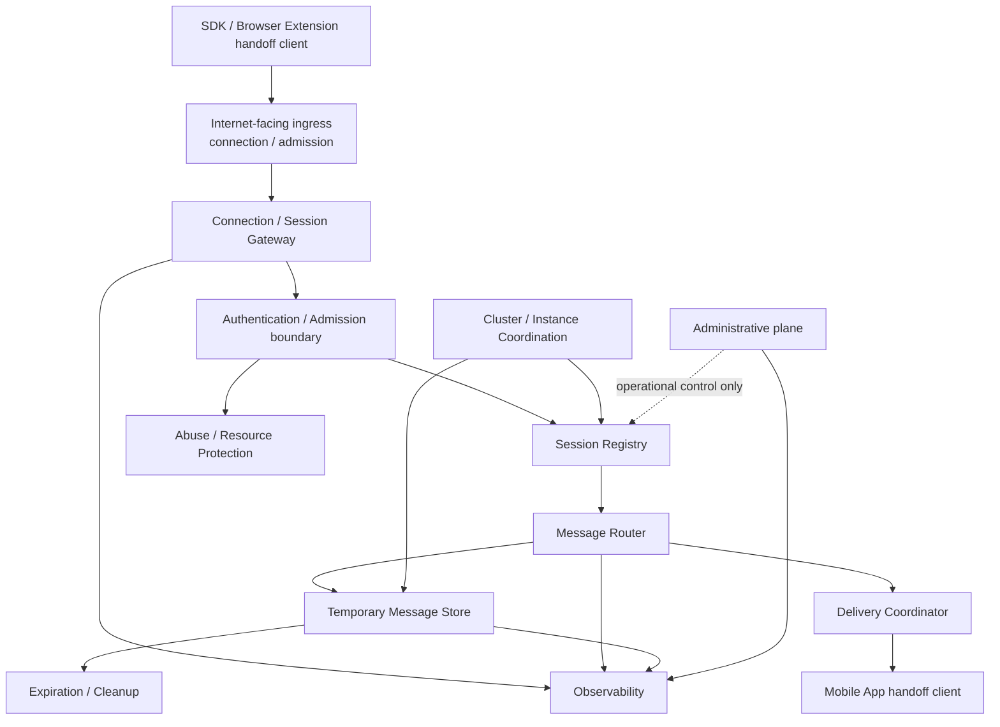

# MosaicLynx Relay 基本設計

## 1. 目的

本書は、MosaicLynx Relay を、Browser Extension / SDK 側と Mobile App の間で署名要求・署名結果その他の handoff message を一時的に中継する transport / delivery infrastructure として設計する。

Relay は利用者の署名判断を行う主体ではない。Relay の侵害、誤動作、再送、順序変更、重複配送、遅延、取りこぼしまたは一時的な状態消失が発生しても、秘密鍵の取得、利用者の無確認署名、request の差し替えまたは別 session への response 誤配送へ直結しないことを設計目標とする。

## 2. 適用範囲と上位設計との関係

対象は Relay 固有の次の能力である。

- Browser Extension / SDK 側と Mobile App の間の handoff session / channel の成立支援。
- request / response の routing、短期 buffering、delivery、acknowledgement および client connection lifecycle。
- envelope の外形、サイズ、version、session / request / result correlation、期限、generation および transport authorization の structural validation。
- duplicate、replay、stale state、expiration、disconnect、restart、overload および resource exhaustion に対する transport-level の安全側処理。
- bounded retention、最小限の observability、client-facing data plane と administrative plane の分離。

本書は次の資料と合わせて適用する。

- [MosaicLynx アーキテクチャ設計](./architecture.md)
- [MosaicLynx 共通セキュリティ設計](./security-design.md)
- [MosaicLynx 署名フロー基本設計](./signing-flow.md)
- [MosaicLynx 共通データモデル・インターフェース基本設計](./interfaces.md)
- [MosaicLynx Browser Extension 基本設計](./browser-extension.md)
- [MosaicLynx Mobile App 基本設計](./mobile-app.md)
- [MosaicLynx Relay 要件](../requirements/relay.md)
- [MosaicLynx SDK 要件](../requirements/sdk.md)
- [MosaicLynx 共通要件](../requirements/requirements.md)
- [MosaicLynx Concept Sheet](../concept/concept-sheet.md)

Concept、Requirements、共通設計および client 設計と本書が重なる場合、Relay の非信頼モデル、client-side validation、利用者承認、wallet-core 境界および fail-closed を優先する。本書は共通 protocol、暗号形式、署名 lifecycle または Mobile の approval logic を再定義しない。

## 3. Relay の位置付け

### 3.1 Relay は transport provider である

Relay は、Web Application 側の SDK / handoff client と Mobile App の間で、短期間の request / response を配送する。Relay が保持・配送する message は、既存の protocol が定める E2E 保護された opaque envelope を基本とし、Relay は request / response の plaintext を復号、解釈、表示または変更しない。

MosaicLynx v1 の Relay handoff は transaction signing と message signing の双方を受け渡し対象とする。Relay は両 operation を semantic に区別して署名可否を判断するのではなく、対応する transport protocol version、envelope の外形および participant 間の routing context を確認して、opaque envelope を transport-level に受け渡す。外側で確認できる transport protocol version、envelope kind または構造が未知・不整合である場合は fail-closed にできる。一方、opaque envelope 内の unknown operation、transaction / message format またはその他の semantic な非対応は Relay の判定対象ではなく、復号した Mobile App / Browser Extension の Signer が validation failure / unsupported として判断する。Relay は operation conversion、semantic downgrade、transaction / message conversion または semantic rejection を行わない。

### 3.2 Relay が担う責任

- session / channel の成立、参加者の admission および participant role の管理。
- sender と intended recipient の間の message routing。
- online または一時的に offline の client に対する bounded buffering と delivery coordination。
- request / response correlation に必要な transport metadata の検証・保持・配送。
- expiry、cancel、acknowledgement、consumption および terminal state に基づく短期データの破棄。
- duplicate / replay / stale state を transport-level で抑止するための検査と、client-side idempotency が働く delivery semantics の提供。
- connection、reconnect、disconnect、session expiration および instance failure に伴う transport lifecycle の管理。
- connection flooding、session flooding、oversized message、message flooding、storage exhaustion、identifier guessing 等への resource / abuse control。
- availability、delivery failure、expiration、resource pressure および admission failure の最小限の observability。

### 3.3 Relay が担わない責任

Relay は次を担わない。

- private key、Mnemonic、Profile password、復号済み Wallet Store、E2E session secret または signing secret の受信、復号、保持、導出または出力。
- transaction / message の parse、semantic validation、human-readable presentation、account ownership の最終判定または blind signing の許可判断。
- 利用者の approve / reject、device authentication、signing authorization または approval state の保持・復元。
- wallet-core の代替、raw signing、署名結果の生成・変更・承認。
- dApp / Web Application の trust 判定、Origin / relying context の最終検証、Mobile App の intended recipient / Account 選択。
- transaction announce、node 選択、blockchain state、balance、履歴または user account service。
- 長期履歴、analytics、広告、課金または利用者向け account management。

Relay の transport status、delivery success または session state は、transaction safety、user approval、署名の正当性または signed result の意味を表さない。

## 4. コンポーネント構成



### 4.1 Connection / Session Gateway

client connection、session create / join / reconnect、participant role、transport capability および protocol version の入口を管理する。Gateway は接続を受け付けても、その client が署名 request を承認済みであるとは扱わない。

### 4.2 Authentication / Admission boundary

Relay endpoint authorization credential、session participation credential、request submit authority および resource admission を transport の範囲で確認する。認証済み client を trusted Signer、Account owner または利用者として扱わない。

外側の不正な形式、期限切れ、unknown transport protocol version、unknown envelope kind、必須 transport metadata の不整合、session scope 外、participant role 不一致、過大 message、rate / quota 超過または transport state 不一致は、plaintext の意味解釈なしに拒否する。ここでいう version、kind および metadata は operation-independent な transport-visible 情報に限る。

### 4.3 Session Registry

session / channel の lifecycle、participant、role、generation、expiry、current transport state および routing context を管理する。Session Registry は signing authorization、user approval、Account permission または Wallet Store を保持しない。

### 4.4 Message Router

session、participant role、message identity、recipient context および request / response correlation に基づき、opaque envelope を宛先へ渡す。Router は payload semantics を解釈せず、transaction type、message contents、recipient account または approval state を推測しない。

### 4.5 Temporary Message Store

未配送または配送待ちの opaque envelope と、delivery に必要な最小限の metadata を bounded に保持する。Store は履歴 DB、backup、長期 replay database または signing audit store ではない。

### 4.6 Delivery Coordinator

online client への送信、一時 disconnect 時の再取得・再配送、acknowledgement、同一 message の重複送信および response の競合を transport state として調整する。`DELIVERED` や `ACKNOWLEDGED` は transport event であり、Mobile App の validation、approval または signing 完了を意味しない。

### 4.7 Expiration / Cleanup

session、message、credential metadata および terminal state の期限を監視し、期限切れ・cancel・consumed・state loss 後の active data を破棄する。具体的な TTL、cleanup interval、tombstone および削除方式は下位仕様へ委譲するが、indefinite retention は許可しない。

### 4.8 Abuse / Resource Protection

connection、session、message、body size、buffer、reconnect および identifier lookup に、bounded な admission control、rate limit、quota または拒否制御を適用できる境界を持つ。DoS 対策のために payload semantics を解釈したり、署名可否を判断したりしない。

### 4.9 Observability

transport availability、active connection / session の概数、delivery disposition、expiration、admission rejection、storage pressure、instance health および system error を、必要最小限の分類で観測する。request plaintext、encrypted payload 全文、credential raw 値、E2E secret、Account と source の不要な紐付けは観測対象にしない。

### 4.10 Cluster / Instance Coordination

複数 instance が同じ logical session と temporary message state を扱えるよう、session ownership、状態遷移、delivery race、expiration および failover を協調する。共有状態の一貫性を確認できない場合は、delivery や state transition を推測で進めず、安全側に拒否・停止する。

### 4.11 Administrative plane

client-facing data plane と administrative plane を分離する。Administrative plane は health、capacity、instance control、operational disable、session invalidation 等の運用目的に限定し、通常運用で request / response plaintext、opaque payload、E2E secret、credential raw 値を閲覧・改変する必要を持たない。管理権限は client admission や signing authorization と同一視しない。

## 5. Trust Boundary

```text
 external / untrusted caller
  Web Application / dApp
             │ public request input
             ▼
 SDK
  non-Signer / transport orchestration / correlation
             ├──────── local direct path ────────► Browser Extension
             │                                    trusted local Signer boundary
             │                                    validation / four conditions / approval / signing
             │
             └──────── remote handoff ───────────► Relay
                                                  opaque transport / delivery coordination
                                                        │ untrusted delivery
                                                        ▼
                                                  Mobile App
                                                   trusted remote Signer boundary
                                                   validation / four conditions / approval / signing

 Browser local signing does not insert Relay into the local path. Browser Extension と Mobile App はそれぞれの trusted Signer boundary で、受信した untrusted input を検証し、共通4条件、semantic inspection、explicit approval および signing を管理する。
```

SDK は Authentication、Signing-capable unlock、Account authorization、Explicit user approval、semantic inspection、signing または secret handling の authority を持たない。SDK の request / response orchestration と correlation は、Browser Extension または Mobile App の Signer authority を代替しない。

Relay 内部でも、Internet-facing ingress、application routing、persistence、cluster coordination および operator / administration plane を分ける。管理者または infrastructure operator が Relay の server process を制御できても、通常の Relay data plane から signing secret、E2E session secret、plaintext payload または user approval を取得できない構造を目標とする。

Relay にとって `accepted`、`stored`、`delivered`、`acknowledged` は transport state であり、Mobile App にとっての `VALIDATED`、`INSPECTED`、`AUTHORIZED`、`SIGNING` または `SUCCEEDED` ではない。

## 6. Session / Channel Model

### 6.1 Session の意味

Relay session は、SDK / Browser Extension 側の participant と Mobile App 側の participant が、一定期間、request / response を交換する transport context である。Session は次を識別・束ねる。

- sender / recipient の participant role。
- request と response が所属する routing channel。
- session identity、generation、protocol context、expiry および transport authorization context。
- active / terminal な connection と message delivery state。

Session は Profile、Account、Origin の本人性、user approval、signing authorization、Wallet Store または device authentication を表さない。session identifier は通常の routing identifier であり、authorization secret と同一視しない。identifier を知っているだけで message の取得、session join、recipient impersonation または response injection ができてはならない。

### 6.2 Participant と channel

最低限、Web-side participant と Mobile-side participant を別 role として扱い、同じ session 内でも request direction と response direction を区別する。Sender、recipient、session、request および response の相関が明示できない message は受け付けない。

Relay は participant identity を transport の admission / routing context として扱うが、その participant が dApp、正規 App、Account owner または利用者本人であることを最終確定しない。Origin proof、App association、request authenticity および user approval は client-side contract の責任である。

### 6.3 Session の期限・失効・再関連付け

Session は bounded lifetime を持ち、expiry、cancel、credential revoke、protocol incompatibility、state loss、generation change、abuse shutdown または administrative invalidation で失効できる。

Client reconnect は、現在有効な session と participant role を再認証して再関連付けする transport 操作である。reconnect により旧 request、旧 approval、旧 authentication、旧 signing operation または旧 response を自動復元しない。session が期限切れ・失効・generation 不一致の場合は、fresh session / handoff と新しい client-side validation を必要とする。

Client replacement は既存 participant の暗黙的な権限移譲ではない。旧 connection と新 connection の関係を protocol が確認できない場合、旧 participant を失効させ、新しい session または明示的に再検証された参加として扱う。

## 7. Authentication / Admission Boundary

Relay における認証・認可は、signing authorization から分離する。

| 層                                  | Relay が確認する範囲                                                           | Relay が確定しない範囲                                    |
| ----------------------------------- | ------------------------------------------------------------------------------ | --------------------------------------------------------- |
| transport connection authentication | 接続に必要な protocol / transport 条件、credential の形式・有効性              | dApp / App の善性、利用者本人、Account ownership          |
| session participation               | session、participant role、generation、expiry、join / reconnect scope          | user approval、Profile permission、署名権限               |
| message submission admission        | 送信者が該当 session / direction で message を送れること、size、version、state | transaction の安全性、Account 選択、signing target        |
| message delivery                    | routing context、recipient、correlation、delivery state                        | recipient が payload を承認したこと、semantic success     |
| signing authorization               | Relay の責任外                                                                 | Mobile App / Browser Extension / client の responsibility |
| user approval                       | Relay の責任外                                                                 | trusted UI、device authentication、wallet-core 呼び出し   |

`authenticated client = approved signing request` という変換を行わない。Transport credential、session identifier、request identity および E2E secret は別分類であり、Relay は signing capability を与える credential を要求・保持しない。

Admission failure は、session や message の存在を不要に推測できる情報を返さない形で処理する。具体的な HTTP status、error code、token format、constant-time comparison および credential verification は protocol / security specification へ委譲する。

## 8. Message Model

Relay が扱う message の論理要素は次のとおりである。これは完全な wire schema ではなく、routing と lifecycle に必要な概念を定める。Relay の構造検証は operation-independent であり、opaque payload 内の signing operation の意味を必要としない。

```text
message identity
  + session / channel association
  + sender / recipient role and context
  + envelope / message kind
  + protocol version / capability context
  + created-at / expiry context
  + request / response correlation
  + generation / transport state
  + opaque payload or envelope
```

### 8.1 Message kind

Relay は request、response、transport control、acknowledgement、cancel 等の transport-level kind を区別できる。MosaicLynx v1 の handoff 対象が transaction signing と message signing の双方であることは既決だが、Relay は opaque request 内の operation を読み取らず、両者の semantic な対応可否を判定しない。

未知の transport message kind、transport protocol version、operation-independent な必須構造または transport capability は Relay が fail-closed できる。opaque request 内の unknown operation、unsupported transaction / message format、`MESSAGE_SIGN` の domain / purpose その他の semantic format は Signer 側の validation failure / unsupported とする。Relay はそれらを既知の operation に変換せず、semantic downgrade、transaction / message conversion または Relay-originated semantic rejection を行わない。

### 8.2 Opaque payload と metadata

Payload は client-side E2E protection の opaque envelope として扱う。Relay が確認できる structural information は、outer protocol version、envelope kind、envelope shape / size、session、participant role、direction、message identity、request / response correlation、expiry、generation、transport credential / admission、routing eligibility および transport lifecycle state の最小範囲に限定する。

Mobile App / Browser Extension の Signer は、opaque payload を復号した後に、transaction signing / message signing の operation semantics、transaction / message format、`MESSAGE_SIGN` domain / purpose、Chain / Network、Account、signer、transaction / message contents、approval、permission および signing target semantics を検証する。Relay は encrypted payload 内のこれらを読む必要がなく、semantic validation または reject authority を持たない。

外側の transport metadata に operation hint 等が存在する場合でも、それは routing / compatibility の補助情報にとどまり、Signer の semantic authority を代替しない。hint の有無および wire representation は下位仕様へ委譲する。Relay は metadata から transaction recipient、amount、message contents、Account ownership、approval、risk または semantic safety を推測せず、metadata が plaintext の意味内容を再構成できるほど拡大してはならない。

## 9. Message Lifecycle

Relay が管理するのは transport lifecycle であり、Signing Request の lifecycle ではない。

```text
SUBMITTED
  → TRANSPORT_VALIDATED
  → STORED / PENDING
  → AVAILABLE
  → DELIVERED
  → ACKNOWLEDGED / CONSUMED
```

各状態は次の意味を持つ。

| State                     | Relay における意味                                                                                |
| ------------------------- | ------------------------------------------------------------------------------------------------- |
| `SUBMITTED`               | client から message を受け取った。まだ relay acceptance は確定していない                          |
| `TRANSPORT_VALIDATED`     | 外形、size、version、session、direction、identity、expiry、generation および admission を確認した |
| `STORED / PENDING`        | bounded temporary store に保持し、recipient の取得・接続を待っている                              |
| `AVAILABLE`               | recipient が有効な transport context で取得可能である                                             |
| `DELIVERED`               | Relay が recipient channel または取得応答へ message を渡した。Application 処理は未確定            |
| `ACKNOWLEDGED / CONSUMED` | protocol が定める transport receipt / terminal consumption を記録した。署名承認・署名成功ではない |

Terminal condition は `EXPIRED`、`CANCELLED`、`REJECTED`、`DROPPED`、`STATE_LOST` または protocol が定める transport failure とする。ここでの `REJECTED` は Relay の transport admission / lifecycle 上の拒否を指し、user rejection、Signer の semantic validation failure または署名結果の disposition を意味しない。Terminal message は有効な handoff として再配送しない。

Relay が同一 envelope を複数回配送しても、client が message identity、request identity、expiry、generation、integrity および既消費状態を検証する。Relay の lifecycle state を Signing Request state として Mobile App または Browser Extension に通知しない。

## 10. Delivery Semantics

Relay は exactly-once delivery または exactly-once application processing を保証しない。基本方針は、bounded な retryable / best-effort delivery であり、再接続・polling・instance failover により重複配送が発生し得るものとする。

### 10.1 Signing result と transport disposition の authority

`RESULT_UNKNOWN` は、Signer が signing generation 自体の結果を成功・未署名のどちらとも安全に確定できない場合だけに成立する。例として、Wallet Core 呼び出し中の Mobile process loss や、signing generation 中の trusted Signer lifecycle loss がある。これは Signer-side の signing-result disposition であり、Relay の transport state ではない。

Relay は signing generation を観測しないため、Relay outage、Relay restart、Relay state loss、storage failure、network partition、recipient offline、response timeout または reconnect failure だけを根拠に、`RESULT_UNKNOWN` を生成・推測・確定してはならない。Signer が生成した `RESULT_UNKNOWN` を Relay が opaque response として搬送することはできるが、Relay はその意味の authority にならない。

Signer 側で署名結果がすでに確定している一方、既知の result を相手へ届けられたか確定できない場合は、Signing Flow の `DELIVERY_UNKNOWN` の意味に従う。`DELIVERY_UNKNOWN` も Signer-side の result delivery disposition であり、Relay は response delivery の transport 状態からそれを生成・推測・確定しない。Relay が直接扱うのは `unavailable`、`pending`、delivery failure、`expired`、`dropped`、`state lost` 等の transport-level disposition である。

- Relay は application processing の完了、利用者の approval、署名生成または dApp の result validation を観測・保証しない。
- 同じ message identity / envelope の再取得・再送は、client-side idempotency が働く前提で許容する。
- Relay が同じ response を再受理する場合でも、同一内容の transport retry と異なる response の差し替えを区別する。異なる response は、state / correlation validation failure として拒否する。
- `DELIVERED`、`ACKNOWLEDGED`、`CONSUMED` は transport status に限り、`AUTHORIZED`、`SIGNING`、`SUCCEEDED` または `USER_REJECTED` を意味しない。
- response delivery retry / redelivery は、署名生成の retry と分離する。既知の signed result が存在する場合の候補は、既存 result の resend、retrieval または lookup であり、同じ target の再署名ではない。

Relay が一時 offline の participant 向けに buffering できない場合は、失敗・期限切れとして扱う。buffering のために indefinite retention、client-side signing state または approval state を保持しない。

### 10.2 Retry と fresh handoff の分離

- Relay state loss、delivery failure、response timeout または recipient offline は、それ自体では re-sign の根拠にならない。
- fresh handoff を作ることと、新しい signature を生成することを同義にしない。新しい signing operation が必要な場合は、Signer 側で新しい request と、Authentication、Signing-capable unlock、Account authorization、Explicit user approval の4条件を改めて成立させる。
- `RESULT_UNKNOWN` から automatic re-sign しない。known result の `DELIVERY_UNKNOWN` または Relay の transport failure からも automatic re-sign しない。
- security failure、user rejection、authorization failure または permission failure を transport retry に変換しない。これらを別 transport、別 Provider または別 Signer へ自動 fallback して承認境界を迂回してはならない。

## 11. Replay / Duplicate Handling

### 11.1 Relay 側の抑止

Relay は transport-level で可能な範囲の replay / duplicate abuse を抑止する。

- active session 内で同一 message identity の不整合な再 submit を拒否する。
- expired、cancelled、consumed、invalidated または generation 不一致の message を delivery 対象にしない。
- session / request / response の方向・recipient・correlation が異なる message を同一 channel へ混在させない。
- 同一内容の acknowledgement、cancel または response retry は protocol が許す範囲で冪等に扱う。
- 旧 generation の session / identity を current generation の active state として復活させない。

Relay は過去の全 ciphertext を保存して replay 判定する責務を持たない。state loss 後に old ciphertext が一時的に transport 外形を満たして保存され得る場合でも、Mobile App の generation-bound integrity validation が承認・署名・success への到達を防ぐ。Relay の structural validation と client-side replay / integrity validation を同じ責務にしない。

### 11.2 Client 側の最終保証

Mobile App / Browser Extension の Signer は、受信した message を元 request / response と独立に検証し、request identity、session、generation、expiry、payload integrity、source / recipient、Account、Chain / Network、operation および approval binding を含む client-side context によって最終的な replay / duplicate protection を成立させる。SDK は non-Signer として request / response identity、transport correlation および自身の orchestration context を扱うが、semantic validation、Account / Chain / Network の最終判断、approval binding または signing authority を持たない。

Relay の duplicate suppression が成功したことを、client-side replay protection の代替にしない。

## 12. Expiration / Retention

### 12.1 Session / message retention

Relay の retention は、transport handoff に必要な最短の bounded lifetime に限定する。

- **Session lifetime**: participant、routing、authorization context および message delivery を許可する期間。expiry、cancel、revoke、generation change または state loss で失効する。
- **Message lifetime**: request / response を recipient が取得・送信できる期間。client が延長して indefinite にしない。
- **Temporary buffering**: offline または reconnect のための短期保持。payload history、分析、長期 retry queue として利用しない。
- **Delivered / consumed state**: transport の重複抑止と terminal transition に必要な最小限だけを保持し、可能な限り速やかに purge する。
- **Operational log retention**: transport event、分類済み failure、health、resource pressure の最小情報だけを運用 policy に従って保持する。payload、credential raw 値または E2E secret を含めない。

具体的な TTL、削除 interval、tombstone、backup、purge retry、storage failure 時の保持範囲は詳細仕様・運用設計へ委譲する。要求にない固定 TTL を本書で決めない。

### 12.2 Terminal state

正常完了、user rejection の transport response、cancel、expiry、validation failure、timeout、Relay restart、state loss その他の Relay transport terminal condition の後に、古い request / response / credential metadata を有効な handoff として再利用できないようにする。Relay の terminal state は signing lifecycle の `RESULT_UNKNOWN`、`DELIVERY_UNKNOWN`、user rejection または semantic validation failure を生成・確定しない。

Relay restart または state loss 後は、旧 pending session を復元せず、current generation を切り替える。Relay state loss や delivery failure は、それ自体では re-sign の根拠にならない。Signer 側に既知の signed result がある場合の候補は、response の redelivery、既存 result の resend、retrieval または lookup であり、再署名ではない。fresh handoff を作る場合も、新しい signature の生成を意味しない。

新しい signing operation が必要な場合は、Signer 側で新しい request と fresh validation、Authentication、Signing-capable unlock、Account authorization および Explicit user approval の4条件を成立させる。`RESULT_UNKNOWN`、`DELIVERY_UNKNOWN`、Relay state loss または transport failure から automatic re-sign してはならず、security failure、user rejection、authorization failure または permission failure を transport retry に変換してはならない。

## 13. Sensitive Data / Payload Protection

### 13.1 Relay が扱い得る情報の分類

| 分類                 | 例                                                                                                                   | 基本方針                                                                                                   |
| -------------------- | -------------------------------------------------------------------------------------------------------------------- | ---------------------------------------------------------------------------------------------------------- |
| Secret               | private key、Mnemonic、Profile password、Wallet Store key、E2E session secret、derived encryption material           | Relay は受信、復号、導出、保持、hash 化、ログ出力しない                                                    |
| Transport credential | Relay endpoint authorization credential、session participation credential                                            | 必要最小限の verification representation として扱い、raw 値を log / history / error / analytics に出さない |
| Opaque payload       | E2E request / response envelope、ciphertext、nonce 等の transport envelope                                           | bounded temporary state に限って扱う。backup、長期履歴、payload logging を行わない                         |
| Sensitive metadata   | session / request identity、recipient context、permission / pairing context、generation、expiry、connection metadata | routing に必要な範囲に限定し、cross-session leakage と不要な公開を防ぐ                                     |
| Operational metadata | delivery timestamp、state、size、latency、instance、failure category、resource pressure                              | 正規化された最小情報だけを observability と運用に利用する                                                  |

Relay の API response、storage、backup、log、diagnostic、analytics、telemetry、error、APM / WAF capture または admin view に、plaintext transaction、message content、decrypted request / response、Signer summary、private key、Mnemonic、Profile password、E2E secret、credential raw 値を出してはならない。

### 13.2 Transport TLS と end-to-end protection

Transport TLS は client と Relay 間の通信経路保護であり、Relay を trust anchor にするものではない。既存 protocol が定める E2E envelope は、Relay operator、Relay process、storage、intermediate network または侵害された transport component が payload を復号・改変しても、client が検出できる責任境界を支える。

Relay は独自の暗号方式、key exchange、MAC、nonce、AAD、digest または E2E envelope を新設しない。Relay が行うのは、既存 protocol の opaque envelope に対する構造、size、version、expiry、generation、authorization、correlation および lifecycle の transport validation だけである。

Relay が payload を差し替え、順序変更、重複、遅延または誤配送した場合、Mobile App / Browser Extension の Signer は request / response identity、integrity、expiry、source / recipient、target binding および application semantics を検証して拒否する。SDK は request / response identity、transport correlation および expiry 等の自身の orchestration context を確認し、Signer の semantic validation を代替しない。Relay の delivery success は改ざん検出や signed result の正当性を保証しない。

## 14. Client Connection Lifecycle

```text
CONNECTING
  → ADMITTED
  → JOINED
  → ACTIVE
  → DISCONNECTED / RECONNECTING
  → REJOINED or EXPIRED
```

### 14.1 Initial connection

初期接続では、client が transport capability、protocol version、credential、session / participant context を提示し、Relay が接続・admission・resource 条件を確認する。接続成功は、署名 request の validation、Account permission、user approval または device authentication を意味しない。

### 14.2 Reconnect / temporary disconnect

一時 disconnect や network transition 後は、current session、participant role、expiry、generation、credential および message state を再確認して再接続する。再接続中の message は重複・遅延・順序変更を前提にし、client が identity / expiry / integrity を確認するまで application processing へ渡さない。

Reconnect が失敗した場合は、request / response を成功扱いにせず、Relay は `unavailable`、`pending`、delivery failure、expiry または state loss 等の transport-level disposition として扱う。Reconnect failure、recipient offline または response 未取得だけから、Relay は `RESULT_UNKNOWN` や `DELIVERY_UNKNOWN` を生成・推測・確定しない。Signer 側で既知の signed result の配送だけが不明な場合は、Signing Flow の `DELIVERY_UNKNOWN` に従い、既存 result の redelivery / resend / retrieval / lookup として扱う。新しい handoff を開始する場合は、古い message / approval を再利用せず、fresh handoff と新しい signing operation を同義にしない。

### 14.3 Browser / App restart

Browser restart、Mobile App restart、Relay process restart または instance replacement は、Relay 上の signing authorization を復元する契機ではない。Relay は signing authorization を保持しないため、client は必要に応じて fresh session / request、再検証、新しい approval を開始する。

## 15. Browser Extension / SDK Integration

Web Application は SDK を介して request を開始する。SDK は non-Signer の transport / provider orchestration、handoff context の受け渡しおよび request / response correlation を担い、caller / Origin / relying context、operation、Chain / Network、Account、semantic inspection、approval、signing または secret handling の authority を持たない。Browser Extension または Mobile App の trusted Signer が、受信後にこれらの context と target を最終検証し、必要な client-side E2E boundary を維持する。SDK は Relay の transport 差異を抽象化できるが、Signer の責任を Relay または SDK へ委譲しない。

Relay は、SDK / Browser Extension が作成した protocol message を、Mobile App へ transport-level に配送する。Relay が request creator、transaction inspector、approval presenter、Account authority または result validator になることはない。

Relay から返された transport response を受け取った SDK は、元の request、session、request identity および response correlation を transport / orchestration の範囲で対応付ける。Browser Extension または Mobile App の Signer と dApp は、operation、signed result / rejection、Chain / Network、Account および expected signer への対応を独立検証する。SDK はこの semantic validation や署名の正当性を代替せず、Relay の response delivery を署名の正当性の根拠にしない。

## 16. Mobile App Integration

Mobile App は Relay を opaque / untrusted transport として扱う。Relay の message はすべて untrusted input として、Mobile App が次を検証してから trusted UI へ渡す。

- source / handoff session / request identity / intended recipient。
- generation、expiry、replay、duplicate、integrity および request / response correlation。
- Profile / Account、Chain / Network、permission / pairing、operation および payload binding。
- semantic inspection、confirmation model、explicit approval、device authentication および wallet-core input。

Relay は Mobile App に「検証不要」「safe transaction」「verified request」「approved request」等の状態を渡す設計にしない。Relay が返せる status は、accepted、stored、available、delivered、acknowledged、expired、cancelled、rejected、unavailable 等の transport status に限定する。

Mobile App が background、process termination、OS kill、state loss または Relay disconnect から復帰する場合、Relay の古い state / message が存在しても、古い approval、authorization、authentication または signing operation を自動復元しない。必要なら新しい handoff と新しい利用者承認を要求する。

## 17. Response Routing

署名結果、user rejection、validation failure、result unknown または delivery failure の response は、元 request の session、request identity、direction、sender / recipient role、operation、generation および response correlation に binding して配送する。

Relay は次を transport-level で防ぐ。

- cross-session response leakage。
- 別 recipient への response delivery。
- request と response の差し替え。
- stale session / expired request への遅延 response。
- 同一 response identity に対する異なる response の上書き。
- 別 participant の acknowledgement / cancel による state transition。

Relay が上記を構造的に検知できない場合でも、client が response identity、request digest / target binding、Account、Chain / Network、expected signer、operation および status を検証して安全側に終了できなければならない。Relay は signed result の意味、署名 validity、user approval または transaction safety を確定しない。

## 18. Concurrency

Relay は複数 session、participant、connection、request、response および instance を同時に扱う。基本方針は、処理順を暗黙に署名順序へ変換せず、message identity と session / participant binding を保持することである。

- 同一 session の複数 request は、それぞれ独立した identity、expiry、direction、delivery state を持つ。
- 同一 client の複数 connection は同じ participant と無条件にみなさず、protocol が許す reconnect / replacement として検証する。
- response と disconnect、expiry と delivery、acknowledgement と cleanup、submit と duplicate、instance failover と state transition の競合を、atomic な logical transition として扱う。
- cross-session contamination、recipient substitution、state の巻き戻しまたは terminal message の再活性化を許さない。
- queue、lock、CAS、leader、ownership および retry の具体 algorithm は下位仕様へ委譲する。

Relay が同時 request を順序付けても、その順序を Mobile App の approval 順序、transaction nonce、signing operation または user intent として解釈しない。

## 19. Horizontal Scaling / Multi-instance

Relay は単一 process に固定せず、複数 instance を配置できる論理境界を持つ。

### 19.1 Stateless にできる領域

- connection-level request parsing、外形・size・version の構造検査。
- authentication credential の検証処理。ただし検証に必要な shared secret / key material の管理は安全な運用境界に置く。
- health、capacity、request admission の一部。
- client channel への transport delivery の一部。ただし session state と整合している場合に限る。

### 19.2 Shared state が必要な領域

- session / participant / role / generation の registry。
- pending opaque envelope、response state、acknowledgement、cancel、consumed、expiry および terminal state。
- duplicate / conflict を抑止する logical identity と delivery coordination。

Shared state が利用できない、整合性を確認できない、instance 間で generation が一致しないまたは split-brain が疑われる場合、Relay は新規 handoff、state transition、delivery を安全側に停止・拒否する。別 instance へ送るだけで authorization や message validity を引き継がない。

### 19.3 Failover / reconnect

Instance failover は client reconnect を必要とし得る。Failover 後に session state の継続性を保証できない場合は current generation を切り替え、旧 session / request identity を復活させず、client に fresh handoff と新しい approval を要求させる。Failover のために payload history、署名 authorization または client secret を共有しない。

具体的な Redis / database / broker、load balancing、sticky session、replication、consistency、leader election および cluster topology は下位仕様・運用設計へ委譲する。

## 20. Availability / Redundancy

Relay の availability は重要だが、availability のために署名対象検証、client-side integrity、explicit approval、secret isolation、expiry または request / response binding を弱めない。

- instance failure、persistence failure、network partition、storage unavailable、overload、rolling restart または full outage は、安全側の `unavailable`、`pending`、delivery failure、timeout、expiry、dropped または state lost 等の transport-level disposition へ分類する。これらだけを根拠に、Relay は signing result の `RESULT_UNKNOWN` や `DELIVERY_UNKNOWN` を生成・推測・確定しない。
- Relay が利用不能でも、Mobile App は検証不能な request を署名せず、SDK / Browser Extension は失敗を成功と区別する。
- Relay は delivery のために、古い approval、署名対象、Wallet Store、E2E secret または client-side authentication state を復旧・推測しない。
- redundancy は、shared session / generation state、duplicate delivery、split-brain、failover 後の replay を解決できる場合だけ採用する。
- 要求にない federation、decentralized relay network、permissionless relay discovery または multi-Relay signing fallback は追加しない。

Multi-Relay を将来採用する場合も、Relay 間で signing authority を共有せず、client が明示した新しい transport context、session、generation、integrity および approval binding を必要とする。具体的な topology は未決事項である。

既知の signed result が Signer 側に存在する場合、Relay の障害から導かれる候補は response の redelivery、既存 result の resend、retrieval または lookup であり、re-sign ではない。新しい signing operation が必要な場合は、Signer 側で新しい request と4条件および explicit approval を成立させる。Relay availability、connection、delivery state または health は、Mainnet signing capability や release / evidence gate の根拠にならない。

## 21. Abuse / Resource Exhaustion

Internet-facing Relay は、payload semantics を解釈せずに次の abuse を抑止できる admission / resource boundary を持つ。

- connection flooding、session flooding、message flooding、reconnect storm。
- oversized message、nested / malformed envelope、storage exhaustion、long polling / connection exhaustion。
- recipient enumeration、session / request identifier guessing、credential brute force。
- duplicate submit、acknowledgement flooding、response replacement、expired message flooding。
- 一つの participant / source / network context による過剰な resource 占有。

rate limit、quota、body size、buffer limit、connection limit、admission backoff、uniform rejection、identifier lookup の漏えい抑止を利用できる設計とする。具体値、window、algorithm、WAF および provider は下位仕様・運用設計へ委譲する。

DoS 対策が必要でも、Relay が transaction semantics、Account ownership、Origin の善性、risk score または signing policy を解釈することを要求しない。負荷や abuse により delivery が失敗することは許容し得るが、検証・approval を省略して成功させることは許容しない。

## 22. Identifier Guessing / Enumeration

Session、request、recipient、participant および transport credential の identifier を、単独の knowledge で authorization secret として使わない。Identifier の推測により、次が成立してはならない。

- 他 participant の message 取得。
- session join、session hijack、participant impersonation。
- response injection、request replacement、acknowledgement / cancel の横取り。
- session、recipient、request existence、Account または source の不要な enumeration。

Relay は authentication / admission context、participant role、session、credential、generation、request identity および delivery state を組み合わせて確認する。エラー・status・timing の差から private session の存在を不要に推測できない応答方針は下位 protocol で定める。

## 23. Administrative Plane

Administrative plane は client-facing data plane から分離し、運用者が次を行うための管理責務に限定する。

- instance health、capacity、resource pressure、connection / session の概況確認。
- Relay の一時停止、drain、generation rotation、session invalidation、緊急削除または abuse response。
- security incident、storage failure、state loss、deployment failure の運用対応。

Administrative plane は通常運用として signing payload、plaintext、opaque envelope、E2E secret、credential raw 値、Account、Origin または user approval を閲覧・改変しない。管理者による session invalidation は transport state を停止するが、署名を拒否・承認したこと、Account owner を判定したことまたは wallet state を変更したことを意味しない。

具体的 admin API、role、approval workflow、audit record、break-glass、key management および incident response は運用設計へ委譲する。

## 24. Observability / Audit / Logging

### 24.1 Observability

Relay は、運用と security response に必要な範囲で次を観測できる。

- instance health、availability、active connection / session の概数。
- message accepted / rejected、delivered、acknowledged、expired、cancelled、dropped、unavailable の disposition。
- routing latency、buffer pressure、storage availability、reconnect、resource exhaustion、admission rejection。
- generation change、state loss、invalid protocol version、credential failure、cross-session validation failure の分類。

観測値は必要最小限に正規化し、message payload、signed payload、transaction / message plaintext、private key、Mnemonic、Profile password、E2E secret、credential raw 値、Account / Origin の不要な組合せを含めない。具体的な metric 名、label、sampling、retention、alert threshold および dashboard は運用仕様へ委譲する。

### 24.2 Logging / audit

ログは transport event、security-relevant admission failure、system error、resource control、administrative operation に限定する。Debug、APM、WAF、crash report、trace、analytics および telemetry も同じ secret / payload non-logging policy に従う。

Audit は、必要な管理操作と system state transition の証跡に限り、user signing payload や secret material の長期保存を正当化しない。Relay は履歴サービス、取引監査サービスまたは利用者行動分析サービスにならない。

## 25. Failure / Recovery

| 事象                                                      | Relay の基本動作                                                                                                                                                                  |
| --------------------------------------------------------- | --------------------------------------------------------------------------------------------------------------------------------------------------------------------------------- |
| malformed / unknown transport version / structure         | 外側の transport validation で fail-closed に拒否し、既知の別 operation へ変換しない                                                                                              |
| unknown signing operation / semantic format               | Relay は opaque request を復号・意味解釈・semantic reject せず、Signer 側の validation failure / unsupported の結果を opaque に搬送する                                           |
| authentication / admission failure                        | session / message を受け付けず、不要な存在情報を返さない                                                                                                                          |
| invalid recipient / session / direction                   | routing せず、cross-session delivery を防ぐ                                                                                                                                       |
| expired / stale / replayed message                        | delivery / storage / state transition を行わず transport terminal とする                                                                                                          |
| duplicate submit / response                               | 同一内容の transport retry は protocol に従って冪等化し、異なる内容は conflict / rejection とする                                                                                 |
| storage failure / persistence corruption                  | message を success とせず、検証・delivery を停止または transport failure にする。署名結果の disposition は推測しない                                                              |
| instance crash / restart / state loss                     | old state を無条件に復元せず、generation を切り替え、fresh handoff を必要とする。state loss 自体を re-sign の根拠にしない                                                         |
| network partition / recipient offline                     | `pending`、bounded buffering、delivery failure、expiry または `unavailable` とする。indefinite retention しない                                                                   |
| sender / recipient disconnect                             | current connection を失効・再接続対象とし、approval / signing state を作らない                                                                                                    |
| response delivery failure / response timeout              | `delivery failure` 等の transport disposition として扱い、signature generation、`RESULT_UNKNOWN` または `DELIVERY_UNKNOWN` を推測しない。既知 result は redelivery 等の候補とする |
| Signer-originated `RESULT_UNKNOWN` / `DELIVERY_UNKNOWN`   | Relay はその opaque response を搬送できるが、各 disposition の意味を生成・推測・確定しない                                                                                        |
| security failure / user rejection / authorization failure | transport retry に変換せず、別 transport、別 Provider または別 Signer への automatic fallback を行わない                                                                          |
| overload / abuse detection                                | admission / resource を制限し、検証・approval を省略せず安全側に失敗する                                                                                                          |

Security-critical validation、session consistency、generation binding、expiry または routing integrity を実行できない場合、Relay は message を拒否・破棄・delivery failure とする。Relay の復旧処理が Mobile App の approval、wallet-core signing、dApp の result validation を再開させてはならない。

Relay の transport failure、state loss、delivery failure、response timeout または reconnect failure は、signing generation の成功・未署名を示さない。response delivery retry / redelivery は signing retry と分離する。既知の signed result がある場合の候補は resend、retrieval または lookup であり、再署名ではない。fresh handoff を開始することも、新しい signature の生成を意味しない。新しい signing operation が必要な場合は、Signer 側で新しい request と Authentication、Signing-capable unlock、Account authorization、Explicit user approval の4条件を成立させる。`RESULT_UNKNOWN` から automatic re-sign せず、security failure、user rejection、authorization failure または permission failure を transport retry に変換しない。

## 26. Restart / State Recovery

Relay restart、persistence loss、cluster failover または deployment replacement 後に、次を行わない。

- expired、cancelled、consumed または deleted message の有効化。
- stale session、old participant、old request identity または old generation の current state への復元。
- signing authorization、user approval、device authentication、Wallet Store または client secret の再構築。
- old ciphertext history がないことを理由とした無条件の有効化。

Relay は current generation context を切り替え、旧 active session の継続性を保証しない。新しい handoff は current generation、fresh session / request identity、transport authorization の再検証、fresh envelope および client-side の新しい approval を伴う。Relay が旧 ciphertext を構造上受け取れても、Mobile App が client-side integrity / generation validation に失敗した request を承認・署名・success へ進めない。

ここでいう fresh handoff は新しい署名を自動生成することを意味しない。Relay state loss だけでは re-sign の根拠にならず、既知の signed result がある場合は redelivery、resend、retrieval または lookup を候補とする。新しい signing operation が必要な場合だけ、Signer 側で新しい request、fresh validation、4条件および explicit approval を成立させる。

## 27. Protocol Versioning / Compatibility

Relay は外側の transport protocol version、envelope kind、必須 transport metadata、envelope structure および lifecycle compatibility を確認し、対応できない transport version / kind / structure を安全に拒否する。これは operation-independent な structural validation であり、Relay は encrypted payload 内の signing operation、transaction / message format または semantic context を読む必要がない。

unknown signing operation、unsupported transaction / message format、`MESSAGE_SIGN` domain / purpose、Chain / Network、Account、signer、contents、approval、permission または signing target semantics は、復号後の Mobile App / Browser Extension の Signer が validation failure / unsupported として判断する。Interfaces が定める request / response semantics、operation、identity、correlation、error / result の意味は client と共通設計の責任であり、Relay は routing に必要な範囲で transport version を扱うだけである。

Backward compatibility は security invariant を弱めない範囲に限る。unknown outer protocol version、必須 transport metadata、duplicate key、外側の形式不整合または protocol ambiguity は、明示的な下位仕様がない限り拒否する。opaque payload 内の unknown signing operation / semantic format は Relay の semantic rejection ではなく Signer の validation failure / unsupported とし、互換性を理由に operation conversion、semantic downgrade、plaintext handling、長期 retention、client-side approval bypass または旧 credential の無期限受理を追加しない。

## 28. Security Invariants

共通セキュリティ設計、Relay 要件および client 設計の invariant を Relay に次のように適用する。すべて MUST であり、下位仕様・実装・運用がこれを弱めてはならない。

1. Relay は signing authority、wallet、transaction validator、policy engine、account authority または user approval authority ではない。
2. Relay は trust anchor ではない。Relay の応答、delivery、保存状態、credential validation または availability だけで署名を成立させない。
3. Relay connection authentication、session participation、message submission admission、signing authorization および user approval を別の責務として扱う。
4. Relay は private key、Mnemonic、Profile password、decrypted Wallet Store、E2E session secret、derived encryption material または signing secret を受信・復号・保持・導出・ログ出力しない。
5. Relay が message を受理、保存、配送または acknowledgement したことは、request authenticity、approval、signing success または transaction safety を意味しない。
6. Relay は opaque envelope を operation-independent な outer transport / structural validation の範囲で扱い、encrypted payload 内の operation semantics、transaction / message format、`MESSAGE_SIGN` domain / purpose、Chain / Network、Account、signer、contents、approval、permission、signing target semantics または blind signing policy を解釈・検証しない。これらの semantic validation と reject authority は Signer 側にある。
7. session identifier、request identity、recipient identifier または transport credential の knowledge だけで、message 取得、session hijack、recipient impersonation、response injection または cross-session delivery が成立しない。
8. expired、consumed、cancelled、replayed、duplicate、stale、invalidated または old generation の message / session を有効な delivery 対象にしない。
9. Relay の重複配送、順序変更、遅延または再送が発生しても、client-side request identity、integrity、expiry、approval binding および replay protection により二重署名へ直結しない。
10. session / request / response / participant / recipient の routing context を binding し、cross-session、cross-recipient、stale response leakage を許さない。
11. Relay restart、state loss、instance failover、reconnect または generation change 後に、古い session、message、approval、signing authorization または secret を危険な形で復活させない。
12. message、credential、session metadata、routing metadata、log、telemetry、diagnostic および admin view は、必要最小限の bounded retention とし、payload / sensitive data を恒常的に記録しない。
13. Relay の availability、horizontal scaling、abuse mitigation または failover のために、client-side validation、explicit approval、secret isolation、expiry または response binding を弱めない。
14. security-critical validation、session consistency、generation context または routing integrity を確認できない場合は fail closed とする。
15. Relay が侵害されても、Relay 単独で秘密鍵取得、E2E payload 復号、利用者の無断署名または client-side approval bypass が成立しない。
16. Transport status と transaction safety status、delivery success と signature success、acknowledgement と user approval、session membership と Account authorization を混同しない。Signer-originated な `RESULT_UNKNOWN` は signing generation の結果不明、`DELIVERY_UNKNOWN` は既知 result の配送不明であり、Relay の transport failure から生成・推測・確定しない。
17. Relay state loss、delivery failure、response timeout、recipient offline または reconnect failure は、それ自体では re-sign の根拠にならない。既知 result の候補は response delivery retry、redelivery、resend、retrieval または lookup であり、`RESULT_UNKNOWN` から automatic re-sign しない。
18. 外側の unknown transport version / envelope structure は fail-closed にするが、opaque payload 内の unknown signing operation / semantic format は Signer 側の validation failure / unsupported とする。Relay は operation conversion、semantic downgrade、transaction / message conversion または semantic rejection を行わない。

## 29. Browser Extension / SDK / Mobile App / wallet-core との責任分界

| 主体              | 担う責任                                                                                                                                                                                                                                                                                            | Relay / 他主体に委譲しない責任                                                                                                                                                                                                                                                                                                                                                                                                                                                                                      |
| ----------------- | --------------------------------------------------------------------------------------------------------------------------------------------------------------------------------------------------------------------------------------------------------------------------------------------------- | ------------------------------------------------------------------------------------------------------------------------------------------------------------------------------------------------------------------------------------------------------------------------------------------------------------------------------------------------------------------------------------------------------------------------------------------------------------------------------------------------------------------- |
| SDK               | Web Application integration、transport / Provider orchestration、request / response correlation、handoff context の受け渡し、transport / Provider / Relay error の normalization、transport-level failure category の公開、および Signer-originated result / disposition の意味を変更しない受け渡し | signing generation result の確定、`RESULT_UNKNOWN` / `DELIVERY_UNKNOWN` の生成・推測・確定、Relay outage・timeout・response absence・recipient offline・state loss・reconnect failure・delivery failure からの result disposition の生成、transport failure の signing result への昇格・再解釈、signing result correctness authority、semantic validation、Authentication、Signing-capable unlock、Account authorization、Explicit user approval、signing、secret handling、Signer の最終 caller / source authority |
| Browser Extension | Browser-observed caller / Origin、local request validation、transaction / message semantic inspection、trusted UI、Authentication、Signing-capable unlock、Account authorization、Explicit user approval、local signing および result validation                                                    | Relay の delivery、SDK の状態または Web page の表示を approval・署名・Origin authority の根拠にしない。Browser local signing に Relay を挿入しない                                                                                                                                                                                                                                                                                                                                                                  |
| Relay             | opaque transport、session / routing、temporary delivery state、expiration、connection lifecycle、operation-independent structural validation、resource / abuse control、operational observability                                                                                                   | request semantics、transaction / message inspection、`MESSAGE_SIGN` semantics、approval、Account authority、signing、wallet-core、Signer result correctness、client-side replay / integrity の最終保証                                                                                                                                                                                                                                                                                                              |
| Mobile App        | remote handoff の source / recipient / session / integrity / expiry validation、semantic inspection、trusted UI、device authentication、Authentication、Signing-capable unlock、Account authorization、Explicit user approval、signing および response validation                                   | Relay の transport status を approval、safe transaction、署名結果の正当性または Mainnet capability として扱わない                                                                                                                                                                                                                                                                                                                                                                                                   |
| wallet-core       | Wallet Store、secret processing、key lifecycle、cryptographic operation、raw signing                                                                                                                                                                                                                | Relay、SDK、UI、source、permission、transaction / message meaning、user approval、device authentication                                                                                                                                                                                                                                                                                                                                                                                                             |
| Interfaces        | protocol semantics、request / response contract、versioning、identity / correlation、result / failure の意味                                                                                                                                                                                        | Relay が独自の semantic protocol、operation conversion、signing state を発明しない                                                                                                                                                                                                                                                                                                                                                                                                                                  |

SDK は non-Signer であり、4条件、semantic validation、secret handling または signing capability を持たない。Browser Extension は Relay を経由しない local Signer、Mobile App は Relay を経由する remote Signer の trusted boundary である。Relay は両 Signer の結果 correctness authority ではない。Relay は、Browser Extension、SDK、Mobile App の client-side security boundary を薄める transport であってはならない。利用者拒否、validation failure、result unknown、Relay unavailable または state loss の後に、別 transport、別 Provider、別 Signer または別 request へ自動 fallback して承認境界を迂回しない。

## 30. 下位仕様への委譲事項

本書で基本方針だけを定め、次を詳細仕様・protocol specification・運用設計へ委譲する。

- HTTP / HTTPS、WebSocket、polling、streaming、endpoint、method、header、status、body schema、wire encoding および frame format。
- session / request / response / participant / recipient identifier の形式、credential token、transport authentication、authorization representation および verification algorithm。
- E2E envelope、暗号方式、key exchange、nonce、AAD、digest、generation proof、request / response binding および App Link / client-side handoff。
- exact TTL、retry interval、backoff、acknowledgement、cancel、delivery retry、polling、cleanup interval、tombstone、purge および retention 値。
- persistence schema、opaque storage layout、atomic state transition、CAS、queue、lock、instance ownership、cluster coordination、replication および consistency mechanism。
- horizontal scaling、load balancing、failover、health check、deployment topology、backup / restore、disaster recovery、rolling restart および infrastructure provider。
- connection / session / message rate limit、quota、body / buffer size、resource budget、identifier enumeration countermeasure および abuse response の具体値。
- administrative API、operator role、break-glass、audit record、incident response および access review。
- metric 名、label、trace、log field、sampling、alert threshold、retention、dashboard および privacy filtering。
- SDK / Browser Extension / Mobile App の semantic validation、approval UI、device authentication、wallet-core Binding、Chain-specific schema、固定 vector および E2E test。
- 完全な error code、compatibility negotiation、client-facing retry policy、delivery unknown 後の result retrieval / resend 契約。ただし、`RESULT_UNKNOWN` / `DELIVERY_UNKNOWN` の意味、Relay が transport failure からこれらを生成・推測・確定しないこと、response delivery retry と signing retry の分離、automatic re-sign / fallback の禁止は本書および上位設計で固定する。

委譲先は、[security-design.md](./security-design.md) の Secret isolation・bounded retention・fail-closed、[signing-flow.md](./signing-flow.md) の authorization / target binding、[interfaces.md](./interfaces.md) の共通 protocol semantics、[Mobile App 基本設計](./mobile-app.md) の client-side validation・approval および wallet-core 外部契約を弱めてはならない。

## 31. 未決事項

Requirements、Architecture または共通 handoff 仕様で未確定の事項だけを、本書の未決事項として扱う。

- `RR-OPEN-001`: transaction signing と message signing が Relay v1 の handoff 対象であること、すなわち operation scope 自体は既決である。未決なのは external handoff contract、milestone completion condition および SDK / Mobile boundary の残余詳細であり、operation scope を未決へ戻すものではない。
- `RR-OPEN-002`: external failure code、failure mapping、timing および retry contract の具体的な定義。`RESULT_UNKNOWN` は signing generation の結果不明、`DELIVERY_UNKNOWN` は known result の配送不明、transport failure は Relay の transport disposition として分離し、response delivery retry と signing retry を分け、automatic re-sign を禁止することは未決へ戻さない。
- Relay の具体 transport 方式、client authentication mechanism、session / pairing contract および transport authorization representation。
- persistence が必要な opaque state の範囲、multi-instance topology、shared state の consistency、failover および state loss 後の generation 運用。
- exact retention / TTL、削除・再利用不能の方式、operational log retention および backup / disaster recovery scope。
- multi-Relay / redundancy の採否。要求にない federation、decentralized relay network または automatic signing fallback は本書の対象外である。
- admin plane の運用範囲、access governance、incident response および production support policy。

これらが未決であっても、Relay を trust anchor、signing authority、payload validator、approval engine、wallet または長期保管サービスにすること、client-side replay / integrity / approval validation を省略すること、または availability のため security invariant を弱めることは許可しない。Signing-generation `RESULT_UNKNOWN`、known-result `DELIVERY_UNKNOWN`、transport failure、response delivery retry と signing retry の分離、automatic re-sign prohibition および automatic fallback prohibition は、未決事項ではなく本書が維持する設計境界である。

## 32. Traceability

重要な設計判断との対応を次に示す。AGENTS.md および `.agents/project-context.md` は作業補助資料であり、製品設計の根拠には含めない。

| 責務・設計判断                                                       | 上流・共通 Design / Requirement                                                                                                                                                                                                                                            | downstream owner                                                                                                                                             | 本書での適用                      |
| -------------------------------------------------------------------- | -------------------------------------------------------------------------------------------------------------------------------------------------------------------------------------------------------------------------------------------------------------------------- | ------------------------------------------------------------------------------------------------------------------------------------------------------------ | --------------------------------- |
| opaque / untrusted transport と non-Signer boundary                  | [Relay 要件](../requirements/relay.md) §2、RR-003、RR-009、RR-NFR-001；[security-design.md](./security-design.md) §11.1；[architecture.md](./architecture.md) §6.5、§8；[signing-flow.md](./signing-flow.md) §2.1、§2.4                                                    | Relay は transport、Signer は最終検証・承認・署名                                                                                                            | §3、§5、§28、§29                  |
| structural validation と Signer semantic validation の分離           | [Relay 要件](../requirements/relay.md) RR-003、RR-005；[architecture.md](./architecture.md) §6.5〜§6.7；[interfaces.md](./interfaces.md) §7.3、§8；[mobile-app.md](./mobile-app.md) §8.2；[browser-extension.md](./browser-extension.md) §10.1                             | Relay は outer transport、Browser / Mobile Signer は operation・target・意味                                                                                 | §4、§7、§8、§16、§27、§28         |
| v1 の transaction signing / message signing と `MESSAGE_SIGN` の境界 | [Relay 要件](../requirements/relay.md) §2.1、RR-001、RR-002；[signing-flow.md](./signing-flow.md) §6.1、§14；[interfaces.md](./interfaces.md) §6.3；[mobile-app.md](./mobile-app.md) §12.2                                                                                 | operation scope は v1 で既決。Signer が operation / domain / purpose / target を検証し、Relay は意味を読まない                                               | §3.1、§8.1、§8.2、§27、§29        |
| source / caller authority と共通4条件                                | [architecture.md](./architecture.md) §6.1〜§6.5、§6.9；[security-design.md](./security-design.md) §8〜§9；[signing-flow.md](./signing-flow.md) §5、§16、§23；[browser-extension.md](./browser-extension.md) §7；[mobile-app.md](./mobile-app.md) §7〜§8                    | Browser / Mobile trusted Signer が caller、Authentication、unlock、Account authorization、approval を担う。SDK / Relay は代替しない                          | §5〜§7、§15〜§17、§28、§29        |
| session / generation / correlation binding                           | [Relay 要件](../requirements/relay.md) RR-005〜RR-007、RR-NFR-003；[interfaces.md](./interfaces.md) §5〜§7；[signing-flow.md](./signing-flow.md) §5、§7、§21                                                                                                               | Relay は transport context、Signer / client は request・target・result の最終 binding                                                                        | §6、§8〜§12、§17〜§19、§26、§28   |
| `RESULT_UNKNOWN` と `DELIVERY_UNKNOWN`                               | [Relay 要件](../requirements/relay.md) RR-004、RR-NFR-002、RR-NFR-005；[signing-flow.md](./signing-flow.md) §7.3〜§7.4、§20；[interfaces.md](./interfaces.md) §6.4、§9；[mobile-app.md](./mobile-app.md) §14〜§15                                                          | Signer が signing-generation result を確定し、known result の delivery disposition を扱う。Relay は opaque response を搬送するだけ                           | §9、§10、§12、§14、§20、§25、§30  |
| retry / redelivery / resend / lookup と no re-sign                   | [Relay 要件](../requirements/relay.md) RR-004、RR-006、RR-NFR-002、RR-NFR-005；[signing-flow.md](./signing-flow.md) §20.3、§21；[sdk.md](./sdk.md) §14、§21；[mobile-app.md](./mobile-app.md) §22                                                                          | Relay は response delivery retry / redelivery、client / Signer は known result の resend / retrieval / lookup。新しい signing は Signer の新 request と4条件 | §10、§12、§14、§20、§25、§26、§30 |
| automatic fallback prohibition                                       | [architecture.md](./architecture.md) §5.2；[security-design.md](./security-design.md) §15；[signing-flow.md](./signing-flow.md) §21、§23；[sdk.md](./sdk.md) §16〜§17、§21；[mobile-app.md](./mobile-app.md) §22                                                           | SDK、Browser、Mobile、Relay は security failure、user rejection、authorization failure、result unknown 等を別 transport / Signer へ自動変換しない            | §10、§12、§20、§25、§29、§31      |
| DoS / abuse と fail-closed                                           | [Relay 要件](../requirements/relay.md) RR-010、RR-011；[security-design.md](./security-design.md) §15；[architecture.md](./architecture.md) §16                                                                                                                            | Relay は resource / admission を制限し、Signer は検証不能時に署名しない。可用性のため4条件を緩和しない                                                       | §4.8、§19〜§25、§28               |
| secret boundary、bounded retention、logging                          | [Relay 要件](../requirements/relay.md) RR-008、RR-NFR-003、RR-NFR-004；[security-design.md](./security-design.md) §12；[architecture.md](./architecture.md) §9                                                                                                             | Relay data plane / operation は opaque short-lived state と最小 observability を担い、wallet-core / Signer が secret を扱う                                  | §4.5、§12〜§13、§24、§28、§30     |
| Mainnet signing capability と release / evidence gate                | [architecture.md](./architecture.md) §3、§6.9、§16；[mobile-app.md](./mobile-app.md) §23.1、§25；[ADR 0001](../adr/0001-mainnet-evidence-lite.md)；[mainnet release evidence](../release/mainnet-release-evidence.md)；[evidence policy](../evidence/evidence-policy.json) | release / evidence policy と Signer が gate を担う。Relay health、connection、delivery state は根拠にならない                                                | §20、§28、§29、§31                |
| SDK / Browser Extension / Mobile App / Relay の別 responsibility     | [architecture.md](./architecture.md) §6.2〜§6.5；[sdk.md](./sdk.md) §4、§6、§20〜§22；[browser-extension.md](./browser-extension.md) §4、§6、§21；[mobile-app.md](./mobile-app.md) §4、§6、§25；[interfaces.md](./interfaces.md) §4、§7                                    | SDK は non-Signer orchestration、Browser は local Signer、Mobile は remote Signer、Relay は opaque transport                                                 | §5、§15〜§16、§29〜§30            |

既存の `apps/relay`、`packages/relay-protocol`、SDK 実装および下流 handoff 仕様は、実装・整合確認・後続引継ぎの資料であり、本書の上流である Concept、Requirements、承認済み共通設計または client design を上書きしない。現行実装に generation-aware state、state-loss handling または下流仕様との未反映差分がある場合は、別工程で実装・仕様・テストを整合させる。
