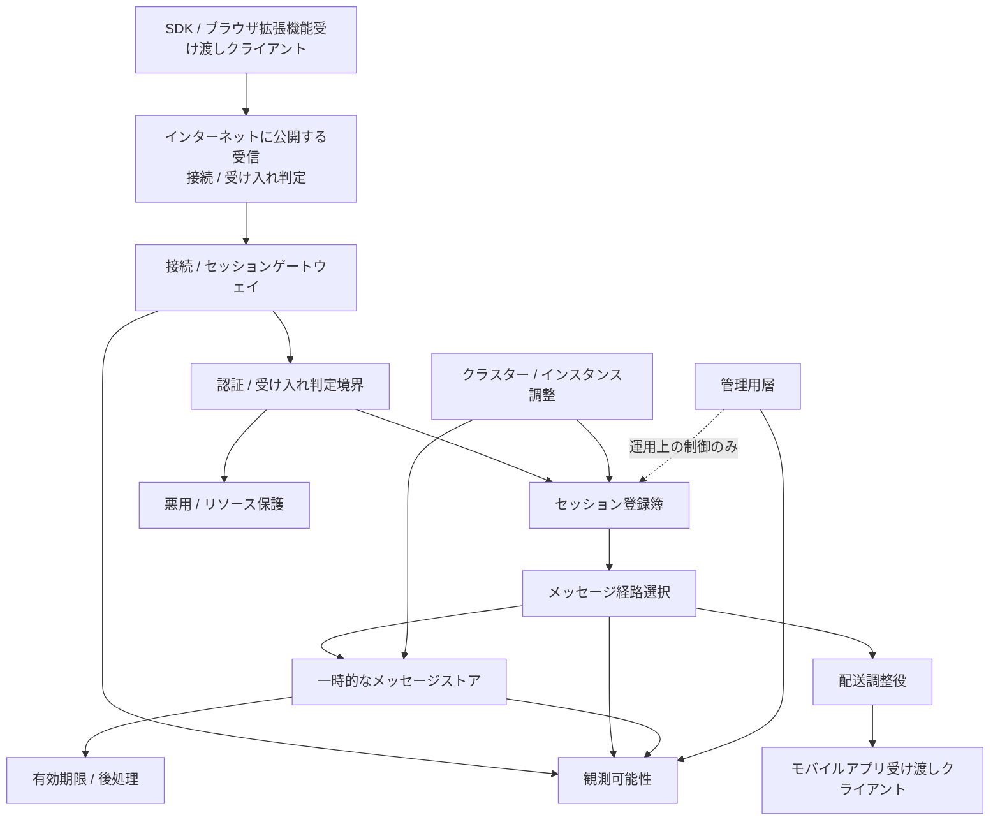

# MosaicLynx Relay 基本設計

## 1. 目的

本書は、MosaicLynx Relay を、ブラウザ拡張機能 / SDK 側とモバイルアプリの間で署名要求・署名結果その他の受け渡しメッセージを一時的に中継する通信経路 / 配送基盤として設計する。

Relay は利用者の署名判断を行う主体ではない。Relay の侵害、誤動作、再送、順序変更、重複配送、遅延、取りこぼしまたは一時的な状態消失が発生しても、秘密鍵の取得、利用者の無確認署名、要求の差し替えまたは別セッションへの応答誤配送へ直結しないことを設計目標とする。

## 2. 適用範囲と上位設計との関係

対象は Relay 固有の次の能力である。

- ブラウザ拡張機能 / SDK 側とモバイルアプリの間の受け渡しセッション / チャネルの成立支援。
- 要求 / 応答の経路選択、短期バッファリング、配送、受領確認およびクライアント接続ライフサイクル。
- エンベロープの外形、サイズ、バージョン、セッション / 要求 / 結果対応付け、期限、世代および通信経路認可の構造上の検証。
- 重複、リプレイ、古くなった状態、有効期限、接続解除、再起動、過負荷およびリソース枯渇に対する通信経路レベルの安全側処理。
- 上限のある保持、最小限の観測可能性、クライアントに公開するデータ層と管理用の層の分離。

本書は次の資料と合わせて適用する。

- [MosaicLynx アーキテクチャ設計](./architecture.md)
- [MosaicLynx 共通セキュリティ設計](./security-design.md)
- [MosaicLynx 署名フロー基本設計](./signing-flow.md)
- [MosaicLynx 共通データモデル・インターフェース基本設計](./interfaces.md)
- [MosaicLynx ブラウザ拡張機能基本設計](./browser-extension.md)
- [MosaicLynx モバイルアプリ基本設計](./mobile-app.md)
- [MosaicLynx Relay 要件](../requirements/relay.md)
- [MosaicLynx SDK 要件](../requirements/sdk.md)
- [MosaicLynx 共通要件](../requirements/requirements.md)
- [MosaicLynx コンセプトシート](../concept/concept-sheet.md)

コンセプト、要件、共通設計およびクライアント設計と本書が重なる場合、Relay の非信頼モデル、クライアント側の検証、利用者承認、wallet-core 境界および安全側での終了を優先する。本書は共通プロトコル、暗号形式、署名ライフサイクルまたはモバイルの承認ロジックを再定義しない。

## 3. Relay の位置付け

### 3.1 Relay は通信経路 provider である

Relay は、Web アプリケーション側の SDK / 受け渡しクライアントとモバイルアプリの間で、短期間の要求 / 応答を配送する。Relay が保持・配送するメッセージは、既存のプロトコルが定める E2E 保護された内容を解釈しないエンベロープを基本とし、Relay は要求 / 応答の平文を復号、解釈、表示または変更しない。

MosaicLynx v1 の Relay 受け渡しはトランザクション署名とメッセージ署名の双方を受け渡し対象とする。Relay は両操作を意味上のに区別して署名可否を判断するのではなく、対応する通信経路プロトコルバージョン、エンベロープの外形および参加者間の経路選択文脈を確認して、内容を解釈しないエンベロープを通信経路レベルのに受け渡す。外側で確認できる通信経路プロトコルバージョン、エンベロープ種別または構造が未知・不整合である場合は安全側での終了にできる。一方、内容を解釈しないエンベロープ内の不明操作、トランザクション / メッセージ形式またはその他の意味上のな非対応は Relay の判定対象ではなく、復号したモバイルアプリ / ブラウザ拡張機能の Signer が検証失敗 / 未対応のとして判断する。Relay は操作変換、意味上の格下げ、トランザクション / メッセージ変換または意味上の拒否を行わない。

### 3.2 Relay が担う責任

- セッション / チャネルの成立、参加者の受け入れ判定および参加者役割の管理。
- 送信者と意図した受信者の間のメッセージ経路選択。
- online または一時的にオフラインのクライアントに対する上限のあるバッファリングと配送調整。
- 要求 / 応答対応付けに必要な通信経路メタデータの検証・保持・配送。
- 期限切れ、キャンセル、受領確認、消費および終端状態に基づく短期データの破棄。
- 重複 / リプレイ / 古くなった状態を通信経路レベルので抑止するための検査と、クライアント側の冪等性が働く配送意味の提供。
- 接続、再接続、接続解除、セッション有効期限およびインスタンス失敗に伴う通信経路ライフサイクルの管理。
- 接続大量送信、セッション大量送信、サイズ超過のメッセージ、メッセージ大量送信、保存領域枯渇、識別子推測等へのリソース / 悪用制御。
- 利用可能性、配送失敗、有効期限、リソース負荷および受け入れ判定失敗の最小限の観測可能性。

### 3.3 Relay が担わない責任

Relay は次を担わない。

- 秘密鍵、ニーモニック、プロファイルパスワード、復号済みウォレットストア、E2E セッション秘密情報または署名秘密情報の受信、復号、保持、導出または出力。
- トランザクション / メッセージの解析、意味上の検証、人が読める表示、アカウント所有責任の最終判定または内容を確認しない署名の許可判断。
- 利用者の承認 / 拒否、端末認証、署名認可または承認状態の保持・復元。
- wallet-core の代替、生の署名、署名結果の生成・変更・承認。
- dApp / Web アプリケーションの信頼判定、オリジン / 依拠する文脈の最終検証、モバイルアプリの意図した受信者 / アカウント選択。
- トランザクションアナウンス、ノード選択、ブロックチェーン状態、残高、履歴または利用者アカウントサービス。
- 長期履歴、利用状況分析、広告、課金または利用者向けアカウント管理。

Relay の通信経路状態、配送成功またはセッション状態は、トランザクション安全性、利用者承認、署名の正当性または署名済み結果の意味を表さない。

## 4. コンポーネント構成


```mermaid
flowchart TB
    C1[SDK / ブラウザ拡張機能受け渡しクライアント]
    I[インターネットに公開する受信<br/>接続 / 受け入れ判定]
    G[接続 / セッションゲートウェイ]
    A[認証 / 受け入れ判定境界]
    R[セッション登録簿]
    M[メッセージ経路選択]
    T[一時的なメッセージストア]
    D[配送調整役]
    X[有効期限 / 後処理]
    P[悪用 / リソース保護]
    O[観測可能性]
    K[クラスター / インスタンス調整]
    C2[モバイルアプリ受け渡しクライアント]
    AP[管理用層]

    C1 --> I --> G --> A --> R
    A --> P
    R --> M --> T
    M --> D --> C2
    T --> X
    G --> O
    M --> O
    T --> O
    K --> R
    K --> T
    AP --> O
    AP -. 運用上の制御のみ .-> R
```

### 4.1 接続 / セッションゲートウェイ

クライアント接続、セッション作成 / 参加 / 再接続、参加者役割、通信経路対応能力およびプロトコルバージョンの入口を管理する。ゲートウェイは接続を受け付けても、そのクライアントが署名要求を承認済みであるとは扱わない。

### 4.2 認証 / 受け入れ判定境界

Relay エンドポイント認可認証情報、セッション participation 認証情報、要求送信判断権限およびリソース受け入れ判定を通信経路の範囲で確認する。認証済みクライアントを信頼された Signer、アカウント責任主体または利用者として扱わない。

外側の不正な形式、期限切れ、不明通信経路プロトコルバージョン、不明エンベロープ種別、必須通信経路メタデータの不整合、セッション対象範囲外、参加者役割不一致、過大メッセージ、頻度 / 割当量超過または通信経路状態不一致は、平文の意味解釈なしに拒否する。ここでいうバージョン、種別およびメタデータは操作に依存しないな transport-visible 情報に限る。

### 4.3 セッション登録簿

セッション / チャネルのライフサイクル、参加者、役割、世代、期限切れ、現在の通信経路状態および経路選択文脈を管理する。セッション登録簿は署名認可、利用者承認、アカウント許可またはウォレットストアを保持しない。

### 4.4 メッセージ経路選択

セッション、参加者役割、メッセージ識別情報、受信者文脈および要求 / 応答対応付けに基づき、内容を解釈しないエンベロープを宛先へ渡す。経路選択はペイロード意味を解釈せず、トランザクション型、メッセージ内容、受信者アカウントまたは承認状態を推測しない。

### 4.5 一時的なメッセージストア

未配送または配送待ちの内容を解釈しないエンベロープと、配送に必要な最小限のメタデータを上限のあるに保持する。ストアは履歴 DB、バックアップ、長期リプレイデータベースまたは署名監査ストアではない。

### 4.6 配送調整役

online クライアントへの送信、一時接続解除時の再取得・再配送、受領確認、同一メッセージの重複送信および応答の競合を通信経路状態として調整する。`DELIVERED` や `ACKNOWLEDGED` は通信経路イベントであり、モバイルアプリの検証、承認または署名完了を意味しない。

### 4.7 有効期限 / 後処理

セッション、メッセージ、認証情報メタデータおよび終端状態の期限を監視し、期限切れ・キャンセル・消費済み・状態消失後の有効なデータを破棄する。具体的な TTL、後処理間隔、削除記録および削除方式は下位仕様へ委譲するが、indefinite 保持は許可しない。

### 4.8 悪用 / リソース保護

接続、セッション、メッセージ、本文サイズ、バッファー、再接続および識別子照会に、上限のあるな受け入れ判定制御、頻度上限、割当量または拒否制御を適用できる境界を持つ。DoS 対策のためにペイロード意味を解釈したり、署名可否を判断したりしない。

### 4.9 観測可能性

通信経路利用可能性、有効な接続 / セッションの概数、配送処理結果の区分、有効期限、受け入れ判定拒否、保存領域負荷、インスタンス正常性およびシステムエラーを、必要最小限の分類で観測する。要求平文、暗号化されたペイロード全文、認証情報生の値、E2E 秘密情報、アカウントと送信元の不要な紐付けは観測対象にしない。

### 4.10 クラスター / インスタンス調整

複数インスタンスが同じ論理的なセッションと一時的なメッセージ状態を扱えるよう、セッション所有責任、状態遷移、配送競合、有効期限および障害時の切り替えを協調する。共有状態の一貫性を確認できない場合は、配送や状態遷移を推測で進めず、安全側に拒否・停止する。

### 4.11 管理用の層

クライアントに公開するデータ層と管理用の層を分離する。管理用の層は正常性、容量、インスタンス制御、運用上の disable、セッション無効化等の運用目的に限定し、通常運用で要求 / 応答平文、内容を解釈しないペイロード、E2E 秘密情報、認証情報生の値を閲覧・改変する必要を持たない。管理権限はクライアント受け入れ判定や署名認可と同一視しない。

## 5. 信頼境界

```text
 外部 / 信頼されていない呼び出し元
  Web アプリケーション / dApp
             │ 公開要求入力
             ▼
 SDK
  Signer ではないこと / 通信経路処理の調整 / 対応付け
             ├──────── ローカル直接のパス ────────► ブラウザ拡張機能
             │                                    信頼されたローカル Signer 境界
             │                                    検証 / 四つの条件 / 承認 / 署名
             │
             └──────── リモート受け渡し ───────────► Relay
                                                  内容を解釈しない通信経路 / 配送調整
                                                        │ 信頼されていない配送
                                                        ▼
                                                  モバイルアプリ
                                                   信頼されたリモート Signer 境界
                                                   検証 / 四つの条件 / 承認 / 署名

 ブラウザローカル署名 does ではない insert Relay into the ローカル path. ブラウザ拡張機能とモバイルアプリはそれぞれの信頼された Signer 境界で、受信した信頼されていない入力を検証し、共通4条件、意味上の内容検査、明示的な承認および署名を管理する。
```

SDK は認証、署名可能な状態へのロック解除、アカウントの利用認可、利用者による明示的な承認、意味上の内容検査、署名または秘密情報処理の判断権限を持たない。SDK の要求 / 応答処理の調整と対応付けは、ブラウザ拡張機能またはモバイルアプリの Signer 判断権限を代替しない。

Relay 内部でも、インターネットに公開する受信、アプリケーション経路選択、永続化、クラスター調整および運用者 / administration 層を分ける。管理者または基盤運用者が Relay のサーバープロセスを制御できても、通常の Relay データ層から署名秘密情報、E2E セッション秘密情報、平文ペイロードまたは利用者承認を取得できない構造を目標とする。

Relay にとって `accepted`、`stored`、`delivered`、`acknowledged` は通信経路状態であり、モバイルアプリにとっての `VALIDATED`、`INSPECTED`、`AUTHORIZED`、`SIGNING` または `SUCCEEDED` ではない。

## 6. セッション / チャネルモデル

### 6.1 セッションの意味

Relay セッションは、SDK / ブラウザ拡張機能側の参加者とモバイルアプリ側の参加者が、一定期間、要求 / 応答を交換する通信経路文脈である。セッションは次を識別・束ねる。

- 送信者 / 受信者の参加者役割。
- 要求と応答が所属する経路選択チャネル。
- セッション識別情報、世代、プロトコル文脈、期限切れおよび通信経路認可文脈。
- 有効な / 終端な接続とメッセージ配送状態。

セッションはプロファイル、アカウント、オリジンの本人性、利用者承認、署名認可、ウォレットストアまたは端末認証を表さない。セッション識別子は通常の経路選択識別子であり、認可秘密情報と同一視しない。識別子を知っているだけでメッセージの取得、セッション参加、受信者なりすましまたは応答注入ができてはならない。

### 6.2 参加者とチャネル

最低限、Web 側の参加者とモバイル側の参加者を別役割として扱い、同じセッション内でも要求方向と応答方向を区別する。送信者、受信者、セッション、要求および応答の相関が明示できないメッセージは受け付けない。

Relay は参加者識別情報を通信経路の受け入れ判定 / 経路選択文脈として扱うが、その参加者が dApp、正規アプリ、アカウント責任主体または利用者本人であることを最終確定しない。オリジン証明、アプリ関連付け、要求真正性および利用者承認はクライアント側の契約の責任である。

### 6.3 セッションの期限・失効・再関連付け

セッションは上限のある有効期間を持ち、期限切れ、キャンセル、認証情報失効、プロトコル incompatibility、状態消失、世代変更、悪用終了または管理用の無効化で失効できる。

クライアント再接続は、現在有効なセッションと参加者役割を再認証して再関連付けする通信経路操作である。再接続により旧要求、旧承認、旧認証、旧署名操作または旧応答を自動復元しない。セッションが期限切れ・失効・世代不一致の場合は、新鮮なセッション / 受け渡しと新しいクライアント側の検証を必要とする。

クライアント置き換えは既存参加者の暗黙的な権限移譲ではない。旧接続と新接続の関係をプロトコルが確認できない場合、旧参加者を失効させ、新しいセッションまたは明示的に再検証された参加として扱う。

## 7. 認証 / 受け入れ判定境界

Relay における認証・認可は、署名認可から分離する。

| 層                         | Relay が確認する範囲                                                            | Relay が確定しない範囲                                 |
| -------------------------- | ------------------------------------------------------------------------------- | ------------------------------------------------------ |
| 通信経路接続認証           | 接続に必要なプロトコル / 通信経路条件、認証情報の形式・有効性                   | dApp / アプリの善性、利用者本人、アカウント所有責任    |
| セッション participation   | セッション、参加者役割、世代、期限切れ、参加 / 再接続対象範囲                   | 利用者承認、プロファイル許可、署名権限                 |
| メッセージ送信受け入れ判定 | 送信者が該当セッション / 方向でメッセージを送れること、サイズ、バージョン、状態 | トランザクションの安全性、アカウント選択、署名対象     |
| メッセージ配送             | 経路選択文脈、受信者、対応付け、配送状態                                        | 受信者がペイロードを承認したこと、意味上の成功         |
| 署名認可                   | Relay の責任外                                                                  | モバイルアプリ / ブラウザ拡張機能 / クライアントの責務 |
| 利用者承認                 | Relay の責任外                                                                  | 信頼された UI、端末認証、wallet-core 呼び出し          |

`authenticated client = approved signing request` という変換を行わない。通信経路認証情報、セッション識別子、要求識別情報および E2E 秘密情報は別分類であり、Relay は署名対応能力を与える認証情報を要求・保持しない。

受け入れ判定失敗は、セッションやメッセージの存在を不要に推測できる情報を返さない形で処理する。具体的な HTTP 状態、エラーコード、トークン形式、constant-time 比較および認証情報検証はプロトコル / セキュリティ仕様へ委譲する。

## 8. メッセージモデル

Relay が扱うメッセージの論理要素は次のとおりである。これは完全な通信上のスキーマではなく、経路選択とライフサイクルに必要な概念を定める。Relay の構造検証は操作に依存しないであり、内容を解釈しないペイロード内の署名操作の意味を必要としない。

```text
メッセージ識別情報
  + セッション / チャネル関連付け
  + 送信者 / 受信者役割と文脈
  + エンベロープ / メッセージ種別
  + プロトコルバージョン / 対応能力文脈
  + 作成時刻 / 有効期限の文脈
  + 要求 / 応答対応付け
  + 世代 / 通信経路状態
  + 内容を解釈しないペイロードまたはエンベロープ
```

### 8.1 メッセージ種別

Relay は要求、応答、通信経路制御、受領確認、キャンセル等の通信経路レベルの種別を区別できる。MosaicLynx v1 の受け渡し対象がトランザクション署名とメッセージ署名の双方であることは既決だが、Relay は内容を解釈しない要求内の操作を読み取らず、両者の意味上のな対応可否を判定しない。

未知の通信経路メッセージ種別、通信経路プロトコルバージョン、操作に依存しないな必須構造または通信経路対応能力は Relay が安全側に終了してきる。内容を解釈しない要求内の不明操作、未対応のトランザクション / メッセージ形式、`MESSAGE_SIGN` のドメイン / 目的その他の意味上の形式は Signer 側の検証失敗 / 未対応のとする。Relay はそれらを既知の操作に変換せず、意味上の格下げ、トランザクション / メッセージ変換または Relay-originated 意味上の拒否を行わない。

### 8.2 内容を解釈しないペイロードとメタデータ

ペイロードはクライアント側の E2E 保護の内容を解釈しないエンベロープとして扱う。Relay が確認できる構造上の情報は、外側プロトコルバージョン、エンベロープ種別、エンベロープ構造 / サイズ、セッション、参加者役割、方向、メッセージ識別情報、要求 / 応答対応付け、期限切れ、世代、通信経路認証情報 / 受け入れ判定、経路選択 eligibility および通信経路ライフサイクル状態の最小範囲に限定する。

モバイルアプリ / ブラウザ拡張機能の Signer は、内容を解釈しないペイロードを復号した後に、トランザクション署名 / メッセージ署名の操作意味、トランザクション / メッセージ形式、`MESSAGE_SIGN` ドメイン / 目的、チェーン / ネットワーク、アカウント、Signer、トランザクション / メッセージ内容、承認、許可および署名対象意味を検証する。Relay は暗号化されたペイロード内のこれらを読む必要がなく、意味上の検証または拒否判断権限を持たない。

外側の通信経路メタデータに操作参考情報等が存在する場合でも、それは経路選択 / 互換性の補助情報にとどまり、Signer の意味上の判断権限を代替しない。参考情報の有無および通信上の表現は下位仕様へ委譲する。Relay はメタデータからトランザクション受信者、数量、メッセージ内容、アカウント所有責任、承認、リスクまたは意味上の安全性を推測せず、メタデータが平文の意味内容を再構成できるほど拡大してはならない。

## 9. メッセージライフサイクル

Relay が管理するのは通信経路ライフサイクルであり、署名要求のライフサイクルではない。

```text
SUBMITTED
  → TRANSPORT_VALIDATED
  → STORED / PENDING
  → AVAILABLE
  → DELIVERED
  → ACKNOWLEDGED / CONSUMED
```

各状態は次の意味を持つ。

| 状態                      | Relay における意味                                                                               |
| ------------------------- | ------------------------------------------------------------------------------------------------ |
| `SUBMITTED`               | クライアントからメッセージを受け取った。まだ relay 受け入れは確定していない                      |
| `TRANSPORT_VALIDATED`     | 外形、サイズ、バージョン、セッション、方向、識別情報、期限切れ、世代および受け入れ判定を確認した |
| `STORED / PENDING`        | 上限のある一時的なストアに保持し、受信者の取得・接続を待っている                                 |
| `AVAILABLE`               | 受信者が有効な通信経路文脈で取得可能である                                                       |
| `DELIVERED`               | Relay が受信者チャネルまたは取得応答へメッセージを渡した。アプリケーション処理は未確定           |
| `ACKNOWLEDGED / CONSUMED` | プロトコルが定める通信経路 receipt / 終端消費を記録した。署名承認・署名成功ではない              |

終端条件は `EXPIRED`、`CANCELLED`、`REJECTED`、`DROPPED`、`STATE_LOST` またはプロトコルが定める通信経路失敗とする。ここでの `REJECTED` は Relay の通信経路受け入れ判定 / ライフサイクル上の拒否を指し、利用者拒否、Signer の意味上の検証失敗または署名結果の処理結果の区分を意味しない。終端メッセージは有効な受け渡しとして再配送しない。

Relay が同一エンベロープを複数回配送しても、クライアントがメッセージ識別情報、要求識別情報、期限切れ、世代、完全性および既消費状態を検証する。Relay のライフサイクル状態を署名要求状態としてモバイルアプリまたはブラウザ拡張機能に通知しない。

## 10. 配送意味

Relay は厳密に一回のみ配送または厳密に一回のみアプリケーション処理を保証しない。基本方針は、上限のあるな再試行可能な / 可能な範囲での実行配送であり、再接続・ポーリング・インスタンス障害時の切り替えにより重複配送が発生し得るものとする。

### 10.1 署名結果と通信経路処理結果の区分の判断権限

`RESULT_UNKNOWN` は、Signer が署名生成自体の結果を成功・未署名のどちらとも安全に確定できない場合だけに成立する。例として、wallet-core 呼び出し中のモバイルプロセス消失や、署名生成中の信頼された Signer ライフサイクル消失がある。これは Signer 側の署名結果処理結果の区分であり、Relay の通信経路状態ではない。

Relay は署名生成を観測しないため、Relay 障害、Relay 再起動、Relay 状態消失、保存領域失敗、ネットワーク分割、受信者オフライン、応答タイムアウトまたは再接続失敗だけを根拠に、`RESULT_UNKNOWN` を生成・推測・確定してはならない。Signer が生成した `RESULT_UNKNOWN` を Relay が内容を解釈しない応答として搬送することはできるが、Relay はその意味の判断権限にならない。

Signer 側で署名結果がすでに確定している一方、既知の結果を相手へ届けられたか確定できない場合は、署名フローの `DELIVERY_UNKNOWN` の意味に従う。`DELIVERY_UNKNOWN` も Signer 側の結果配送処理結果の区分であり、Relay は応答配送の通信経路状態からそれを生成・推測・確定しない。Relay が直接扱うのは `unavailable`、`pending`、配送失敗、`expired`、`dropped`、`state lost` 等の通信経路レベルの処理結果の区分である。

- Relay はアプリケーション処理の完了、利用者の承認、署名生成または dApp の結果検証を観測・保証しない。
- 同じメッセージ識別情報 / エンベロープの再取得・再送は、クライアント側の冪等性が働く前提で許容する。
- Relay が同じ応答を再受理する場合でも、同一内容の通信経路再試行と異なる応答の差し替えを区別する。異なる応答は、状態 / 対応付け検証失敗として拒否する。
- `DELIVERED`、`ACKNOWLEDGED`、`CONSUMED` は通信経路状態に限り、`AUTHORIZED`、`SIGNING`、`SUCCEEDED` または `USER_REJECTED` を意味しない。
- 応答配送再試行 / 再配送は、署名生成の再試行と分離する。既知の署名済み結果が存在する場合の候補は、既存結果の再送、取得または照会であり、同じ対象の再署名ではない。

Relay が一時オフラインの参加者向けにバッファリングできない場合は、失敗・期限切れとして扱う。バッファリングのために indefinite 保持、クライアント側の署名状態または承認状態を保持しない。

### 10.2 再試行と新鮮な受け渡しの分離

- Relay 状態消失、配送失敗、応答タイムアウトまたは受信者オフラインは、それ自体では再署名の根拠にならない。
- 新鮮な受け渡しを作ることと、新しい署名を生成することを同義にしない。新しい署名操作が必要な場合は、Signer 側で新しい要求と、認証、署名可能な状態へのロック解除、アカウントの利用認可、利用者による明示的な承認の4条件を改めて成立させる。
- `RESULT_UNKNOWN` から自動再署名しない。既知の結果の `DELIVERY_UNKNOWN` または Relay の通信経路失敗からも自動再署名しない。
- セキュリティ失敗、利用者拒否、認可失敗または許可失敗を通信経路再試行に変換しない。これらを別通信経路、別 Provider または別 Signer へ自動代替経路して承認境界を迂回してはならない。

## 11. リプレイ / 重複処理

### 11.1 Relay 側の抑止

Relay は通信経路レベルので可能な範囲のリプレイ / 重複悪用を抑止する。

- 有効なセッション内で同一メッセージ識別情報の不整合な再送信を拒否する。
- 期限切れ、キャンセル済み、消費済み、無効化済みまたは世代不一致のメッセージを配送対象にしない。
- セッション / 要求 / 応答の方向・受信者・対応付けが異なるメッセージを同一チャネルへ混在させない。
- 同一内容の受領確認、キャンセルまたは応答再試行はプロトコルが許す範囲で冪等に扱う。
- 旧世代のセッション / 識別情報を現在の世代の有効な状態として復活させない。

Relay は過去の全暗号文を保存してリプレイ判定する責務を持たない。状態消失後に旧暗号文が一時的に通信経路外形を満たして保存され得る場合でも、モバイルアプリの世代に結び付いた完全性検証が承認・署名・成功への到達を防ぐ。Relay の構造上の検証とクライアント側のリプレイ / 完全性検証を同じ責務にしない。

### 11.2 クライアント側の最終保証

モバイルアプリ / ブラウザ拡張機能の Signer は、受信したメッセージを元要求 / 応答と独立に検証し、要求識別情報、セッション、世代、期限切れ、ペイロード完全性、送信元 / 受信者、アカウント、チェーン / ネットワーク、操作および承認との結び付けを含むクライアント側の文脈によって最終的なリプレイ / 重複保護を成立させる。SDK は Signer ではないこととして要求 / 応答識別情報、通信経路対応付けおよび自身の処理の調整文脈を扱うが、意味上の検証、アカウント / チェーン / ネットワークの最終判断、承認との結び付けまたは署名判断権限を持たない。

Relay の重複 suppression が成功したことを、クライアント側のリプレイ保護の代替にしない。

## 12. 有効期限 / 保持

### 12.1 セッション / メッセージ保持

Relay の保持は、通信経路受け渡しに必要な最短の上限のある有効期間に限定する。

- **セッション有効期間**: 参加者、経路選択、認可文脈およびメッセージ配送を許可する期間。期限切れ、キャンセル、失効、世代変更または状態消失で失効する。
- **メッセージ有効期間**: 要求 / 応答を受信者が取得・送信できる期間。クライアントが延長して indefinite にしない。
- **一時的なバッファリング**: オフラインまたは再接続のための短期保持。ペイロード履歴、分析、長期再試行キューとして利用しない。
- **配送済み / 消費済み状態**: 通信経路の重複抑止と終端遷移に必要な最小限だけを保持し、可能な限り速やかに削除する。
- **運用上のログ保持**: 通信経路イベント、分類済み失敗、正常性、リソース負荷の最小情報だけを運用ポリシーに従って保持する。ペイロード、認証情報生の値または E2E 秘密情報を含めない。

具体的な TTL、削除間隔、削除記録、バックアップ、削除再試行、保存領域失敗時の保持範囲は詳細仕様・運用設計へ委譲する。要求にない固定 TTL を本書で決めない。

### 12.2 終端状態

正常完了、利用者拒否の通信経路応答、キャンセル、期限切れ、検証失敗、タイムアウト、Relay 再起動、状態消失その他の Relay 通信経路終端条件の後に、古い要求 / 応答 / 認証情報メタデータを有効な受け渡しとして再利用できないようにする。Relay の終端状態は署名ライフサイクルの `RESULT_UNKNOWN`、`DELIVERY_UNKNOWN`、利用者拒否または意味上の検証失敗を生成・確定しない。

Relay 再起動または状態消失後は、旧保留中のセッションを復元せず、現在の世代を切り替える。Relay 状態消失や配送失敗は、それ自体では再署名の根拠にならない。Signer 側に既知の署名済み結果がある場合の候補は、応答の再配送、既存結果の再送、取得または照会であり、再署名ではない。新鮮な受け渡しを作る場合も、新しい署名の生成を意味しない。

新しい署名操作が必要な場合は、Signer 側で新しい要求と新鮮な検証、認証、署名可能な状態へのロック解除、アカウントの利用認可および利用者による明示的な承認の4条件を成立させる。`RESULT_UNKNOWN`、`DELIVERY_UNKNOWN`、Relay 状態消失または通信経路失敗から自動再署名してはならず、セキュリティ失敗、利用者拒否、認可失敗または許可失敗を通信経路再試行に変換してはならない。

## 13. 機微なデータ / ペイロード保護

### 13.1 Relay が扱い得る情報の分類

| 分類                       | 例                                                                                                             | 基本方針                                                                                 |
| -------------------------- | -------------------------------------------------------------------------------------------------------------- | ---------------------------------------------------------------------------------------- |
| 秘密情報                   | 秘密鍵、ニーモニック、プロファイルパスワード、ウォレットストア鍵、E2E セッション秘密情報、導出された暗号化資料 | Relay は受信、復号、導出、保持、ハッシュ化、ログ出力しない                               |
| 通信経路認証情報           | Relay エンドポイント認可認証情報、セッション participation 認証情報                                            | 必要最小限の検証表現として扱い、生の値をログ / 履歴 / エラー / 利用状況分析に出さない    |
| 内容を解釈しないペイロード | E2E 要求 / 応答エンベロープ、暗号文、ノンス等の通信経路エンベロープ                                            | 上限のある一時的な状態に限って扱う。バックアップ、長期履歴、ペイロードログ出力を行わない |
| 機微なメタデータ           | セッション / 要求識別情報、受信者文脈、許可 / ペアリング文脈、世代、期限切れ、接続メタデータ                   | 経路選択に必要な範囲に限定し、セッション間の漏えいと不要な公開を防ぐ                     |
| 運用上のメタデータ         | 配送タイムスタンプ、状態、サイズ、遅延、インスタンス、失敗分類、リソース負荷                                   | 正規化された最小情報だけを観測可能性と運用に利用する                                     |

Relay の API 応答、保存領域、バックアップ、ログ、診断、利用状況分析、遠隔計測データ、エラー、APM / WAF 取得または管理者表示に、平文トランザクション、メッセージ内容、復号された要求 / 応答、Signer 要約、秘密鍵、ニーモニック、プロファイルパスワード、E2E 秘密情報、認証情報生の値を出してはならない。

### 13.2 通信経路 TLS とエンドツーエンド保護

通信経路 TLS はクライアントと Relay 間の通信経路保護であり、Relay を信頼アンカーにするものではない。既存プロトコルが定める E2E エンベロープは、Relay 運用者、Relay プロセス、保存領域、中間のネットワークまたは侵害された通信経路コンポーネントがペイロードを復号・改変しても、クライアントが検出できる責任境界を支える。

Relay は独自の暗号方式、鍵交換、MAC、ノンス、AAD、ダイジェストまたは E2E エンベロープを新設しない。Relay が行うのは、既存プロトコルの内容を解釈しないエンベロープに対する構造、サイズ、バージョン、期限切れ、世代、認可、対応付けおよびライフサイクルの通信経路検証だけである。

Relay がペイロードを差し替え、順序変更、重複、遅延または誤配送した場合、モバイルアプリ / ブラウザ拡張機能の Signer は要求 / 応答識別情報、完全性、期限切れ、送信元 / 受信者、対象結び付けおよびアプリケーション意味を検証して拒否する。SDK は要求 / 応答識別情報、通信経路対応付けおよび期限切れ等の自身の処理の調整文脈を確認し、Signer の意味上の検証を代替しない。Relay の配送成功は改ざん検出や署名済み結果の正当性を保証しない。

## 14. クライアント接続ライフサイクル

```text
CONNECTING
  → ADMITTED
  → JOINED
  → ACTIVE
  → DISCONNECTED / RECONNECTING
  → REJOINED または EXPIRED
```

### 14.1 初期接続

初期接続では、クライアントが通信経路対応能力、プロトコルバージョン、認証情報、セッション / 参加者文脈を提示し、Relay が接続・受け入れ判定・リソース条件を確認する。接続成功は、署名要求の検証、アカウント許可、利用者承認または端末認証を意味しない。

### 14.2 再接続 / 一時的な接続解除

一時接続解除やネットワーク遷移後は、現在のセッション、参加者役割、期限切れ、世代、認証情報およびメッセージ状態を再確認して再接続する。再接続中のメッセージは重複・遅延・順序変更を前提にし、クライアントが識別情報 / 期限切れ / 完全性を確認するまでアプリケーション処理へ渡さない。

再接続が失敗した場合は、要求 / 応答を成功扱いにせず、Relay は `unavailable`、`pending`、配送失敗、期限切れまたは状態消失等の通信経路レベルの処理結果の区分として扱う。再接続失敗、受信者オフラインまたは応答未取得だけから、Relay は `RESULT_UNKNOWN` や `DELIVERY_UNKNOWN` を生成・推測・確定しない。Signer 側で既知の署名済み結果の配送だけが不明な場合は、署名フローの `DELIVERY_UNKNOWN` に従い、既存結果の再配送 / 再送 / 取得 / 照会として扱う。新しい受け渡しを開始する場合は、古いメッセージ / 承認を再利用せず、新鮮な受け渡しと新しい署名操作を同義にしない。

### 14.3 ブラウザ / アプリ再起動

ブラウザ再起動、モバイルアプリ再起動、Relay プロセス再起動またはインスタンス置き換えは、Relay 上の署名認可を復元する契機ではない。Relay は署名認可を保持しないため、クライアントは必要に応じて新鮮なセッション / 要求、再検証、新しい承認を開始する。

## 15. ブラウザ拡張機能 / SDK 統合

Web アプリケーションは SDK を介して要求を開始する。SDK は Signer ではないことの通信経路 / provider 処理の調整、受け渡し文脈の受け渡しおよび要求 / 応答対応付けを担い、呼び出し元 / オリジン / 依拠する文脈、操作、チェーン / ネットワーク、アカウント、意味上の内容検査、承認、署名または秘密情報処理の判断権限を持たない。ブラウザ拡張機能またはモバイルアプリの信頼された Signer が、受信後にこれらの文脈と対象を最終検証し、必要なクライアント側の E2E 境界を維持する。SDK は Relay の通信経路差異を抽象化できるが、Signer の責任を Relay または SDK へ委譲しない。

Relay は、SDK / ブラウザ拡張機能が作成したプロトコルメッセージを、モバイルアプリへ通信経路レベルのに配送する。Relay が要求 creator、トランザクション inspector、承認 presenter、アカウントに関する判断権限または結果検証器になることはない。

Relay から返された通信経路応答を受け取った SDK は、元の要求、セッション、要求識別情報および応答対応付けを通信経路 / 処理の調整の範囲で対応付ける。ブラウザ拡張機能またはモバイルアプリの Signer と dApp は、操作、署名済み結果 / 拒否、チェーン / ネットワーク、アカウントおよび期待される Signer への対応を独立検証する。SDK はこの意味上の検証や署名の正当性を代替せず、Relay の応答配送を署名の正当性の根拠にしない。

## 16. モバイルアプリ統合

モバイルアプリは Relay を内容を解釈しない / 信頼されていない通信経路として扱う。Relay のメッセージはすべて信頼されていない入力として、モバイルアプリが次を検証してから信頼された UI へ渡す。

- 送信元 / 受け渡しセッション / 要求識別情報 / 意図した受信者。
- 世代、期限切れ、リプレイ、重複、完全性および要求 / 応答対応付け。
- プロファイル / アカウント、チェーン / ネットワーク、許可 / ペアリング、操作およびペイロード結び付け。
- 意味上の内容検査、確認モデル、明示的な承認、端末認証および wallet-core 入力。

Relay はモバイルアプリに「検証不要」「安全なトランザクション」「検証済み要求」「承認済み要求」等の状態を渡す設計にしない。Relay が返せる状態は、受け入れ済み、保存済み、利用可能、配送済み、acknowledged、期限切れ、キャンセル済み、拒否済み、利用不能等の通信経路状態に限定する。

モバイルアプリがバックグラウンド、プロセス終了、OS 強制終了、状態消失または Relay 接続解除から復帰する場合、Relay の古い状態 / メッセージが存在しても、古い承認、認可、認証または署名操作を自動復元しない。必要なら新しい受け渡しと新しい利用者承認を要求する。

## 17. 応答経路選択

署名結果、利用者拒否、検証失敗、結果不明または配送失敗の応答は、元要求のセッション、要求識別情報、方向、送信者 / 受信者役割、操作、世代および応答対応付けに結び付けして配送する。

Relay は次を通信経路レベルので防ぐ。

- セッション間の応答漏えい。
- 別受信者への応答配送。
- 要求と応答の差し替え。
- 古くなったセッション / 期限切れ要求への遅延応答。
- 同一応答識別情報に対する異なる応答の上書き。
- 別参加者の受領確認 / キャンセルによる状態遷移。

Relay が上記を構造的に検知できない場合でも、クライアントが応答識別情報、要求ダイジェスト / 対象結び付け、アカウント、チェーン / ネットワーク、期待される Signer、操作および状態を検証して安全側に終了できなければならない。Relay は署名済み結果の意味、署名有効性、利用者承認またはトランザクション安全性を確定しない。

## 18. 並行処理

Relay は複数セッション、参加者、接続、要求、応答およびインスタンスを同時に扱う。基本方針は、処理順を暗黙に署名順序へ変換せず、メッセージ識別情報とセッション / 参加者結び付けを保持することである。

- 同一セッションの複数要求は、それぞれ独立した識別情報、期限切れ、方向、配送状態を持つ。
- 同一クライアントの複数接続は同じ参加者と無条件にみなさず、プロトコルが許す再接続 / 置き換えとして検証する。
- 応答と接続解除、期限切れと配送、受領確認と後処理、送信と重複、インスタンス障害時の切り替えと状態遷移の競合を、不可分な論理的な遷移として扱う。
- セッション間の混入、受信者差し替え、状態の巻き戻しまたは終端メッセージの再活性化を許さない。
- キュー、ロック、CAS、leader、所有責任および再試行の具体アルゴリズムは下位仕様へ委譲する。

Relay が同時要求を順序付けても、その順序をモバイルアプリの承認順序、トランザクションノンス、署名操作または利用者意図として解釈しない。

## 19. 水平スケーリング / 複数インスタンス

Relay は単一プロセスに固定せず、複数インスタンスを配置できる論理境界を持つ。

### 19.1 状態を持たない構成にできる領域

- connection-level 要求解析、外形・サイズ・バージョンの構造検査。
- 認証認証情報の検証処理。ただし検証に必要な共有の秘密情報 / 鍵資料の管理は安全な運用境界に置く。
- 正常性、容量、要求受け入れ判定の一部。
- クライアントチャネルへの通信経路配送の一部。ただしセッション状態と整合している場合に限る。

### 19.2 共有の状態が必要な領域

- セッション / 参加者 / 役割 / 世代の登録簿。
- 保留中の内容を解釈しないエンベロープ、応答状態、受領確認、キャンセル、消費済み、期限切れおよび終端状態。
- 重複 / 競合を抑止する論理的な識別情報と配送調整。

共有の状態が利用できない、整合性を確認できない、インスタンス間で世代が一致しないまたは split-brain が疑われる場合、Relay は新規受け渡し、状態遷移、配送を安全側に停止・拒否する。別インスタンスへ送るだけで認可やメッセージ有効性を引き継がない。

### 19.3 障害時の切り替え / 再接続

インスタンス障害時の切り替えはクライアント再接続を必要とし得る。障害時の切り替え後にセッション状態の継続性を保証できない場合は現在の世代を切り替え、旧セッション / 要求識別情報を復活させず、クライアントに新鮮な受け渡しと新しい承認を要求させる。障害時の切り替えのためにペイロード履歴、署名認可またはクライアント秘密情報を共有しない。

具体的な Redis / データベース / ブローカー、負荷 balancing、sticky セッション、replication、整合性、leader election およびクラスター構成は下位仕様・運用設計へ委譲する。

## 20. 利用可能性 / 冗長性

Relay の利用可能性は重要だが、利用可能性のために署名対象検証、クライアント側の完全性、明示的な承認、秘密情報の分離、期限切れまたは要求 / 応答結び付けを弱めない。

- インスタンス失敗、永続化失敗、ネットワーク分割、保存領域利用不能、過負荷、rolling 再起動または全体障害は、安全側の `unavailable`、`pending`、配送失敗、タイムアウト、期限切れ、dropped または状態消失した等の通信経路レベルの処理結果の区分へ分類する。これらだけを根拠に、Relay は署名結果の `RESULT_UNKNOWN` や `DELIVERY_UNKNOWN` を生成・推測・確定しない。
- Relay が利用不能でも、モバイルアプリは検証不能な要求を署名せず、SDK / ブラウザ拡張機能は失敗を成功と区別する。
- Relay は配送のために、古い承認、署名対象、ウォレットストア、E2E 秘密情報またはクライアント側の認証状態を復旧・推測しない。
- 冗長性は、共有のセッション / 世代状態、重複配送、split-brain、障害時の切り替え後のリプレイを解決できる場合だけ採用する。
- 要求にない federation、decentralized relay ネットワーク、permissionless relay 検出または multi-Relay 署名代替経路は追加しない。

Multi-Relay を将来採用する場合も、Relay 間で署名判断権限を共有せず、クライアントが明示した新しい通信経路文脈、セッション、世代、完全性および承認との結び付けを必要とする。具体的な構成は未決事項である。

既知の署名済み結果が Signer 側に存在する場合、Relay の障害から導かれる候補は応答の再配送、既存結果の再送、取得または照会であり、再署名ではない。新しい署名操作が必要な場合は、Signer 側で新しい要求と4条件および明示的な承認を成立させる。Relay 利用可能性、接続、配送状態または正常性は、Mainnet 署名対応能力やリリース / 根拠判定条件の根拠にならない。

## 21. 悪用 / リソース枯渇

インターネットに公開する Relay は、ペイロード意味を解釈せずに次の悪用を抑止できる受け入れ判定 / リソース境界を持つ。

- 接続大量送信、セッション大量送信、メッセージ大量送信、再接続 storm。
- サイズ超過のメッセージ、nested / 不正な形式のエンベロープ、保存領域枯渇、long ポーリング / 接続枯渇。
- 受信者列挙、セッション / 要求識別子推測、認証情報 brute force。
- 重複送信、受領確認大量送信、応答置き換え、期限切れメッセージ大量送信。
- 一つの参加者 / 送信元 / ネットワーク文脈による過剰なリソース占有。

頻度上限、割当量、本文サイズ、バッファー上限、接続上限、受け入れ判定 backoff、uniform 拒否、識別子照会の漏えい抑止を利用できる設計とする。具体値、window、アルゴリズム、WAF および provider は下位仕様・運用設計へ委譲する。

DoS 対策が必要でも、Relay がトランザクション意味、アカウント所有責任、オリジンの善性、リスク score または署名ポリシーを解釈することを要求しない。負荷や悪用により配送が失敗することは許容し得るが、検証・承認を省略して成功させることは許容しない。

## 22. 識別子推測 / 列挙

セッション、要求、受信者、参加者および通信経路認証情報の識別子を、単独の knowledge で認可秘密情報として使わない。識別子の推測により、次が成立してはならない。

- 他参加者のメッセージ取得。
- セッション参加、セッション hijack、参加者なりすまし。
- 応答注入、要求置き換え、受領確認 / キャンセルの横取り。
- セッション、受信者、要求存在、アカウントまたは送信元の不要な列挙。

Relay は認証 / 受け入れ判定文脈、参加者役割、セッション、認証情報、世代、要求識別情報および配送状態を組み合わせて確認する。エラー・状態・タイミングの差から private セッションの存在を不要に推測できない応答方針は下位プロトコルで定める。

## 23. 管理用の層

管理用の層はクライアントに公開するデータ層から分離し、運用者が次を行うための管理責務に限定する。

- インスタンス正常性、容量、リソース負荷、接続 / セッションの概況確認。
- Relay の一時停止、drain、世代ローテーション、セッション無効化、緊急削除または悪用応答。
- セキュリティ事故、保存領域失敗、状態消失、配置失敗の運用対応。

管理用の層は通常運用として署名ペイロード、平文、内容を解釈しないエンベロープ、E2E 秘密情報、認証情報生の値、アカウント、オリジンまたは利用者承認を閲覧・改変しない。管理者によるセッション無効化は通信経路状態を停止するが、署名を拒否・承認したこと、アカウント責任主体を判定したことまたはウォレット状態を変更したことを意味しない。

具体的管理者 API、役割、承認 workflow、監査レコード、break-glass、鍵管理および事故応答は運用設計へ委譲する。

## 24. 観測可能性 / 監査 / ログ出力

### 24.1 観測可能性

Relay は、運用とセキュリティ応答に必要な範囲で次を観測できる。

- インスタンス正常性、利用可能性、有効な接続 / セッションの概数。
- メッセージ受け入れ済み / 拒否済み、配送済み、acknowledged、期限切れ、キャンセル済み、dropped、利用不能の処理結果の区分。
- 経路選択遅延、バッファー負荷、保存領域利用可能性、再接続、リソース枯渇、受け入れ判定拒否。
- 世代変更、状態消失、無効なプロトコルバージョン、認証情報失敗、セッション間の検証失敗の分類。

観測値は必要最小限に正規化し、メッセージペイロード、署名済みペイロード、トランザクション / メッセージ平文、秘密鍵、ニーモニック、プロファイルパスワード、E2E 秘密情報、認証情報生の値、アカウント / オリジンの不要な組合せを含めない。具体的な metric 名、ラベル、sampling、保持、alert threshold および dashboard は運用仕様へ委譲する。

### 24.2 ログ出力 / 監査

ログは通信経路イベント、セキュリティに関わる受け入れ判定失敗、システムエラー、リソース制御、管理用の操作に限定する。デバッグ、APM、WAF、異常終了報告書、追跡、利用状況分析および遠隔計測データも同じ秘密情報 / ペイロード non-logging ポリシーに従う。

監査は、必要な管理操作とシステム状態遷移の証跡に限り、利用者署名ペイロードや秘密情報資料の長期保存を正当化しない。Relay は履歴サービス、取引監査サービスまたは利用者行動分析サービスにならない。

## 25. 失敗 / 復旧

| 事象                                                    | Relay の基本動作                                                                                                                                           |
| ------------------------------------------------------- | ---------------------------------------------------------------------------------------------------------------------------------------------------------- |
| 不正な形式の / 不明通信経路バージョン / 構造            | 外側の通信経路検証で安全側での終了に拒否し、既知の別操作へ変換しない                                                                                       |
| 不明署名操作 / 意味上の形式                             | Relay は内容を解釈しない要求を復号・意味解釈・意味上の拒否せず、Signer 側の検証失敗 / 未対応の結果を内容を解釈せずに搬送する                               |
| 認証 / 受け入れ判定失敗                                 | セッション / メッセージを受け付けず、不要な存在情報を返さない                                                                                              |
| 無効な受信者 / セッション / 方向                        | 経路選択せず、セッション間の配送を防ぐ                                                                                                                     |
| 期限切れ / 古くなった / 再送されたメッセージ            | 配送 / 保存領域 / 状態遷移を行わず通信経路終端とする                                                                                                       |
| 重複送信 / 応答                                         | 同一内容の通信経路再試行はプロトコルに従って冪等化し、異なる内容は競合 / 拒否とする                                                                        |
| 保存領域失敗 / 永続化 corruption                        | メッセージを成功とせず、検証・配送を停止または通信経路失敗にする。署名結果の処理結果の区分は推測しない                                                     |
| インスタンス異常終了 / 再起動 / 状態消失                | 旧状態を無条件に復元せず、世代を切り替え、新鮮な受け渡しを必要とする。状態消失自体を再署名の根拠にしない                                                   |
| ネットワーク分割 / 受信者オフライン                     | `pending`、上限のあるバッファリング、配送失敗、期限切れまたは `unavailable` とする。indefinite 保持しない                                                  |
| 送信者 / 受信者接続解除                                 | 現在の接続を失効・再接続対象とし、承認 / 署名状態を作らない                                                                                                |
| 応答配送失敗 / 応答タイムアウト                         | `delivery failure` 等の通信経路処理結果の区分として扱い、署名生成、`RESULT_UNKNOWN` または `DELIVERY_UNKNOWN` を推測しない。既知結果は再配送等の候補とする |
| Signer が生成した `RESULT_UNKNOWN` / `DELIVERY_UNKNOWN` | Relay はその内容を解釈しない応答を搬送できるが、各処理結果の区分の意味を生成・推測・確定しない                                                             |
| セキュリティ失敗 / 利用者拒否 / 認可失敗                | 通信経路再試行に変換せず、別通信経路、別 Provider または別 Signer への自動代替経路を行わない                                                               |
| 過負荷 / 悪用検出                                       | 受け入れ判定 / リソースを制限し、検証・承認を省略せず安全側に失敗する                                                                                      |

セキュリティ上重大な検証、セッション整合性、世代結び付け、期限切れまたは経路選択完全性を実行できない場合、Relay はメッセージを拒否・破棄・配送失敗とする。Relay の復旧処理がモバイルアプリの承認、wallet-core 署名、dApp の結果検証を再開させてはならない。

Relay の通信経路失敗、状態消失、配送失敗、応答タイムアウトまたは再接続失敗は、署名生成の成功・未署名を示さない。応答配送再試行 / 再配送は署名再試行と分離する。既知の署名済み結果がある場合の候補は再送、取得または照会であり、再署名ではない。新鮮な受け渡しを開始することも、新しい署名の生成を意味しない。新しい署名操作が必要な場合は、Signer 側で新しい要求と認証、署名可能な状態へのロック解除、アカウントの利用認可、利用者による明示的な承認の4条件を成立させる。`RESULT_UNKNOWN` から自動再署名せず、セキュリティ失敗、利用者拒否、認可失敗または許可失敗を通信経路再試行に変換しない。

## 26. 再起動 / 状態復旧

Relay 再起動、永続化消失、クラスター障害時の切り替えまたは配置置き換え後に、次を行わない。

- 期限切れ、キャンセル済み、消費済みまたは deleted メッセージの有効化。
- 古くなったセッション、旧参加者、旧要求識別情報または旧世代の現在の状態への復元。
- 署名認可、利用者承認、端末認証、ウォレットストアまたはクライアント秘密情報の再構築。
- 旧暗号文履歴がないことを理由とした無条件の有効化。

Relay は現在の世代文脈を切り替え、旧有効なセッションの継続性を保証しない。新しい受け渡しは現在の世代、新鮮なセッション / 要求識別情報、通信経路認可の再検証、新鮮なエンベロープおよびクライアント側の新しい承認を伴う。Relay が旧暗号文を構造上受け取れても、モバイルアプリがクライアント側の完全性 / 世代検証に失敗した要求を承認・署名・成功へ進めない。

ここでいう新鮮な受け渡しは新しい署名を自動生成することを意味しない。Relay 状態消失だけでは再署名の根拠にならず、既知の署名済み結果がある場合は再配送、再送、取得または照会を候補とする。新しい署名操作が必要な場合だけ、Signer 側で新しい要求、新鮮な検証、4条件および明示的な承認を成立させる。

## 27. プロトコルバージョン管理 / 互換性

Relay は外側の通信経路プロトコルバージョン、エンベロープ種別、必須通信経路メタデータ、エンベロープ構造およびライフサイクル互換性を確認し、対応できない通信経路バージョン / 種別 / 構造を安全に拒否する。これは操作に依存しないな構造上の検証であり、Relay は暗号化されたペイロード内の署名操作、トランザクション / メッセージ形式または意味上の文脈を読む必要がない。

不明署名操作、未対応のトランザクション / メッセージ形式、`MESSAGE_SIGN` ドメイン / 目的、チェーン / ネットワーク、アカウント、Signer、内容、承認、許可または署名対象意味は、復号後のモバイルアプリ / ブラウザ拡張機能の Signer が検証失敗 / 未対応のとして判断する。インターフェースが定める要求 / 応答意味、操作、識別情報、対応付け、エラー / 結果の意味はクライアントと共通設計の責任であり、Relay は経路選択に必要な範囲で通信経路バージョンを扱うだけである。

後方互換性はセキュリティ上の不変条件を弱めない範囲に限る。不明外側プロトコルバージョン、必須通信経路メタデータ、重複鍵、外側の形式不整合またはプロトコル曖昧さは、明示的な下位仕様がない限り拒否する。内容を解釈しないペイロード内の不明署名操作 / 意味上の形式は Relay の意味上の拒否ではなく Signer の検証失敗 / 未対応のとし、互換性を理由に操作変換、意味上の格下げ、平文処理、長期保持、クライアント側の承認迂回または旧認証情報の無期限受理を追加しない。

## 28. セキュリティ上の不変条件

共通セキュリティ設計、Relay 要件およびクライアント設計の不変条件を Relay に次のように適用する。すべて MUST であり、下位仕様・実装・運用がこれを弱めてはならない。

1. Relay は署名判断権限、ウォレット、トランザクション検証器、ポリシーエンジン、アカウントに関する判断権限または利用者承認判断権限ではない。
2. Relay は信頼アンカーではない。Relay の応答、配送、保存状態、認証情報検証または利用可能性だけで署名を成立させない。
3. Relay 接続認証、セッション participation、メッセージ送信受け入れ判定、署名認可および利用者承認を別の責務として扱う。
4. Relay は秘密鍵、ニーモニック、プロファイルパスワード、復号されたウォレットストア、E2E セッション秘密情報、導出された暗号化資料または署名秘密情報を受信・復号・保持・導出・ログ出力しない。
5. Relay がメッセージを受理、保存、配送または受領確認したことは、要求真正性、承認、署名成功またはトランザクション安全性を意味しない。
6. Relay は内容を解釈しないエンベロープを操作に依存しないな外側通信経路 / 構造上の検証の範囲で扱い、暗号化されたペイロード内の操作意味、トランザクション / メッセージ形式、`MESSAGE_SIGN` ドメイン / 目的、チェーン / ネットワーク、アカウント、Signer、内容、承認、許可、署名対象意味または内容を確認しない署名ポリシーを解釈・検証しない。これらの意味上の検証と拒否判断権限は Signer 側にある。
7. セッション識別子、要求識別情報、受信者識別子または通信経路認証情報の knowledge だけで、メッセージ取得、セッション hijack、受信者なりすまし、応答注入またはセッション間の配送が成立しない。
8. 期限切れ、消費済み、キャンセル済み、再送された、重複、古くなった、無効化済みまたは旧世代のメッセージ / セッションを有効な配送対象にしない。
9. Relay の重複配送、順序変更、遅延または再送が発生しても、クライアント側の要求識別情報、完全性、期限切れ、承認との結び付けおよびリプレイ保護により二重署名へ直結しない。
10. セッション / 要求 / 応答 / 参加者 / 受信者の経路選択文脈を結び付けし、セッション間の、受信者間の、古くなった応答漏えいを許さない。
11. Relay 再起動、状態消失、インスタンス障害時の切り替え、再接続または世代変更後に、古いセッション、メッセージ、承認、署名認可または秘密情報を危険な形で復活させない。
12. メッセージ、認証情報、セッションメタデータ、経路選択メタデータ、ログ、遠隔計測データ、診断および管理者表示は、必要最小限の上限のある保持とし、ペイロード / 機微なデータを恒常的に記録しない。
13. Relay の利用可能性、水平スケーリング、悪用 mitigation または障害時の切り替えのために、クライアント側の検証、明示的な承認、秘密情報の分離、期限切れまたは応答結び付けを弱めない。
14. セキュリティ上重大な検証、セッション整合性、世代文脈または経路選択完全性を確認できない場合は不合格終了済みとする。
15. Relay が侵害されても、Relay 単独で秘密鍵取得、E2E ペイロード復号、利用者の無断署名またはクライアント側の承認迂回が成立しない。
16. 通信経路状態とトランザクション安全性状態、配送成功と署名成功、受領確認と利用者承認、セッション membership とアカウントの利用認可を混同しない。Signer が生成したな `RESULT_UNKNOWN` は署名生成の結果不明、`DELIVERY_UNKNOWN` は既知結果の配送不明であり、Relay の通信経路失敗から生成・推測・確定しない。
17. Relay 状態消失、配送失敗、応答タイムアウト、受信者オフラインまたは再接続失敗は、それ自体では再署名の根拠にならない。既知結果の候補は応答配送再試行、再配送、再送、取得または照会であり、`RESULT_UNKNOWN` から自動再署名しない。
18. 外側の不明通信経路バージョン / エンベロープ構造は安全側に終了するが、内容を解釈しないペイロード内の不明署名操作 / 意味上の形式は Signer 側の検証失敗 / 未対応のとする。Relay は操作変換、意味上の格下げ、トランザクション / メッセージ変換または意味上の拒否を行わない。

## 29. ブラウザ拡張機能 / SDK / モバイルアプリ / wallet-core との責任分界

| 主体             | 担う責任                                                                                                                                                                                                                                                   | Relay / 他主体に委譲しない責任                                                                                                                                                                                                                                                                                                                                                                                                   |
| ---------------- | ---------------------------------------------------------------------------------------------------------------------------------------------------------------------------------------------------------------------------------------------------------- | -------------------------------------------------------------------------------------------------------------------------------------------------------------------------------------------------------------------------------------------------------------------------------------------------------------------------------------------------------------------------------------------------------------------------------- |
| SDK              | Web アプリケーション統合、通信経路 / Provider 処理の調整、要求 / 応答対応付け、受け渡し文脈の受け渡し、通信経路 / Provider / Relay エラーの正規化、通信経路レベルの失敗分類の公開、および Signer が生成した結果 / 処理結果の区分の意味を変更しない受け渡し | 署名生成結果の確定、`RESULT_UNKNOWN` / `DELIVERY_UNKNOWN` の生成・推測・確定、Relay 障害・タイムアウト・応答欠如・受信者オフライン・状態消失・再接続失敗・配送失敗からの結果処理結果の区分の生成、通信経路失敗の署名結果への昇格・再解釈、署名結果正確性判断権限、意味上の検証、認証、署名可能な状態へのロック解除、アカウントの利用認可、利用者による明示的な承認、署名、秘密情報処理、Signer の最終呼び出し元 / 送信元判断権限 |
| ブラウザ拡張機能 | ブラウザで観測した呼び出し元 / オリジン、ローカル要求検証、トランザクション / メッセージ意味上の内容検査、信頼された UI、認証、署名可能な状態へのロック解除、アカウントの利用認可、利用者による明示的な承認、ローカル署名および結果検証                    | Relay の配送、SDK の状態または Web ページの表示を承認・署名・オリジンの信頼性判断の根拠にしない。ブラウザローカル署名に Relay を挿入しない                                                                                                                                                                                                                                                                                       |
| Relay            | 内容を解釈しない通信経路、セッション / 経路選択、一時的な配送状態、有効期限、接続ライフサイクル、操作に依存しない構造上の検証、リソース / 悪用制御、運用上の観測可能性                                                                                     | 要求意味、トランザクション / メッセージ内容検査、`MESSAGE_SIGN` 意味、承認、アカウントに関する判断権限、署名、wallet-core、Signer 結果正確性、クライアント側のリプレイ / 完全性の最終保証                                                                                                                                                                                                                                        |
| モバイルアプリ   | リモート受け渡しの送信元 / 受信者 / セッション / 完全性 / 期限切れ検証、意味上の内容検査、信頼された UI、端末認証、認証、署名可能な状態へのロック解除、アカウントの利用認可、利用者による明示的な承認、署名および応答検証                                  | Relay の通信経路状態を承認、安全なトランザクション、署名結果の正当性または Mainnet 対応能力として扱わない                                                                                                                                                                                                                                                                                                                        |
| wallet-core      | ウォレットストア、秘密情報処理、鍵ライフサイクル、暗号学的な操作、生の署名                                                                                                                                                                                 | Relay、SDK、UI、送信元、許可、トランザクション / メッセージ意味、利用者承認、端末認証                                                                                                                                                                                                                                                                                                                                            |
| インターフェース | プロトコル意味、要求 / 応答契約、バージョン管理、識別情報 / 対応付け、結果 / 失敗の意味                                                                                                                                                                    | Relay が独自の意味上のプロトコル、操作変換、署名状態を発明しない                                                                                                                                                                                                                                                                                                                                                                 |

SDK は Signer ではないことであり、4条件、意味上の検証、秘密情報処理または署名対応能力を持たない。ブラウザ拡張機能は Relay を経由しないローカル Signer、モバイルアプリは Relay を経由するリモート Signer の信頼された境界である。Relay は両 Signer の結果正確性判断権限ではない。Relay は、ブラウザ拡張機能、SDK、モバイルアプリのクライアント側のセキュリティ境界を薄める通信経路であってはならない。利用者拒否、検証失敗、結果不明、Relay 利用不能または状態消失の後に、別通信経路、別 Provider、別 Signer または別要求へ自動代替経路して承認境界を迂回しない。

## 30. 下位仕様への委譲事項

本書で基本方針だけを定め、次を詳細仕様・プロトコル仕様・運用設計へ委譲する。

- HTTP / HTTPS、WebSocket、ポーリング、streaming、エンドポイント、メソッド、ヘッダー、状態、本文スキーマ、通信上のエンコーディングおよびフレーム形式。
- セッション / 要求 / 応答 / 参加者 / 受信者識別子の形式、認証情報トークン、通信経路認証、認可表現および検証アルゴリズム。
- E2E エンベロープ、暗号方式、鍵交換、ノンス、AAD、ダイジェスト、世代証明、要求 / 応答結び付けおよび App Link / クライアント側の受け渡し。
- 厳密な TTL、再試行間隔、backoff、受領確認、キャンセル、配送再試行、ポーリング、後処理間隔、削除記録、削除および保持値。
- 永続化スキーマ、内容を解釈しない保存領域配置、不可分な状態遷移、CAS、キュー、ロック、インスタンス所有責任、クラスター調整、replication および整合性仕組み。
- 水平スケーリング、負荷 balancing、障害時の切り替え、正常性確認、配置構成、バックアップ / 復元、disaster 復旧、rolling 再起動および基盤 provider。
- 接続 / セッション / メッセージ頻度上限、割当量、本文 / バッファーサイズ、リソース budget、識別子列挙 countermeasure および悪用応答の具体値。
- 管理用の API、運用者役割、break-glass、監査レコード、事故応答およびアクセスレビュー。
- metric 名、ラベル、追跡、ログフィールド、sampling、alert threshold、保持、dashboard およびプライバシー filtering。
- SDK / ブラウザ拡張機能 / モバイルアプリの意味上の検証、承認 UI、端末認証、wallet-core バインディング、チェーン固有のスキーマ、固定ベクターおよび E2E テスト。
- 完全なエラーコード、互換性協議、クライアントに公開する再試行ポリシー、配送不明後の結果取得 / 再送契約。ただし、`RESULT_UNKNOWN` / `DELIVERY_UNKNOWN` の意味、Relay が通信経路失敗からこれらを生成・推測・確定しないこと、応答配送再試行と署名再試行の分離、自動再署名 / 代替経路の禁止は本書および上位設計で固定する。

委譲先は、[security-design.md](./security-design.md) の秘密情報の分離・上限のある保持・安全側での終了、[signing-flow.md](./signing-flow.md) の認可 / 対象結び付け、[interfaces.md](./interfaces.md) の共通プロトコル意味、[モバイルアプリ基本設計](./mobile-app.md) のクライアント側の検証・承認および wallet-core 外部契約を弱めてはならない。

## 31. 未決事項

要件、アーキテクチャまたは共通受け渡し仕様で未確定の事項だけを、本書の未決事項として扱う。

- `RR-OPEN-001`: トランザクション署名とメッセージ署名が Relay v1 の受け渡し対象であること、すなわち操作対象範囲自体は既決である。未決なのは外部受け渡し契約、マイルストーン完了条件および SDK / モバイル境界の残余詳細であり、操作対象範囲を未決へ戻すものではない。
- `RR-OPEN-002`: 外部失敗コード、失敗対応付け、タイミングおよび再試行契約の具体的な定義。`RESULT_UNKNOWN` は署名生成の結果不明、`DELIVERY_UNKNOWN` は既知の結果の配送不明、通信経路失敗は Relay の通信経路処理結果の区分として分離し、応答配送再試行と署名再試行を分け、自動再署名を禁止することは未決へ戻さない。
- Relay の具体通信経路方式、クライアント認証仕組み、セッション / ペアリング契約および通信経路認可表現。
- 永続化が必要な内容を解釈しない状態の範囲、複数インスタンス構成、共有の状態の整合性、障害時の切り替えおよび状態消失後の世代運用。
- 厳密な保持 / TTL、削除・再利用不能の方式、運用上のログ保持およびバックアップ / disaster 復旧対象範囲。
- multi-Relay / 冗長性の採否。要求にない federation、decentralized relay ネットワークまたは自動署名代替経路は本書の対象外である。
- 管理者層の運用範囲、アクセス governance、事故応答および本番環境サポートポリシー。

これらが未決であっても、Relay を信頼アンカー、署名判断権限、ペイロード検証器、承認エンジン、ウォレットまたは長期保管サービスにすること、クライアント側のリプレイ / 完全性 / 承認検証を省略すること、または利用可能性のためセキュリティ上の不変条件を弱めることは許可しない。Signing-generation `RESULT_UNKNOWN`、確定済みの結果 `DELIVERY_UNKNOWN`、通信経路失敗、応答配送再試行と署名再試行の分離、自動再署名禁止および自動代替経路禁止は、未決事項ではなく本書が維持する設計境界である。

## 32. 追跡可能性

重要な設計判断との対応を次に示す。AGENTS.md および `.agents/project-context.md` は作業補助資料であり、製品設計の根拠には含めない。

| 責務・設計判断                                                        | 上流・共通設計 / 要求                                                                                                                                                                                                                                   | 下流責任主体                                                                                                                    | 本書での適用                      |
| --------------------------------------------------------------------- | ------------------------------------------------------------------------------------------------------------------------------------------------------------------------------------------------------------------------------------------------------- | ------------------------------------------------------------------------------------------------------------------------------- | --------------------------------- |
| 内容を解釈しない / 信頼されていない通信経路と Signer ではないこと境界 | [Relay 要件](../requirements/relay.md) §2、RR-003、RR-009、RR-NFR-001；[security-design.md](./security-design.md) §11.1；[architecture.md](./architecture.md) §6.5、§8；[signing-flow.md](./signing-flow.md) §2.1、§2.4                                 | Relay は通信経路、Signer は最終検証・承認・署名                                                                                 | §3、§5、§28、§29                  |
| 構造上の検証と Signer 意味上の検証の分離                              | [Relay 要件](../requirements/relay.md) RR-003、RR-005；[architecture.md](./architecture.md) §6.5〜§6.7；[interfaces.md](./interfaces.md) §7.3、§8；[mobile-app.md](./mobile-app.md) §8.2；[browser-extension.md](./browser-extension.md) §10.1          | Relay は外側通信経路、ブラウザ / モバイル Signer は操作・対象・意味                                                             | §4、§7、§8、§16、§27、§28         |
| v1 のトランザクション署名 / メッセージ署名と `MESSAGE_SIGN` の境界    | [Relay 要件](../requirements/relay.md) §2.1、RR-001、RR-002；[signing-flow.md](./signing-flow.md) §6.1、§14；[interfaces.md](./interfaces.md) §6.3；[mobile-app.md](./mobile-app.md) §12.2                                                              | 操作対象範囲は v1 で既決。Signer が操作 / ドメイン / 目的 / 対象を検証し、Relay は意味を読まない                                | §3.1、§8.1、§8.2、§27、§29        |
| 送信元 / 呼び出し元の信頼性判断と共通4条件                            | [architecture.md](./architecture.md) §6.1〜§6.5、§6.9；[security-design.md](./security-design.md) §8〜§9；[signing-flow.md](./signing-flow.md) §5、§16、§23；[browser-extension.md](./browser-extension.md) §7；[mobile-app.md](./mobile-app.md) §7〜§8 | ブラウザ / モバイル信頼された Signer が呼び出し元、認証、ロック解除、アカウントの利用認可、承認を担う。SDK / Relay は代替しない | §5〜§7、§15〜§17、§28、§29        |
| セッション / 世代 / 対応付け結び付け                                  | [Relay 要件](../requirements/relay.md) RR-005〜RR-007、RR-NFR-003；[interfaces.md](./interfaces.md) §5〜§7；[signing-flow.md](./signing-flow.md) §5、§7、§21                                                                                            | Relay は通信経路文脈、Signer / クライアントは要求・対象・結果の最終結び付け                                                     | §6、§8〜§12、§17〜§19、§26、§28   |
| `RESULT_UNKNOWN` と `DELIVERY_UNKNOWN`                                | [Relay 要件](../requirements/relay.md) RR-004、RR-NFR-002、RR-NFR-005；[signing-flow.md](./signing-flow.md) §7.3〜§7.4、§20；[interfaces.md](./interfaces.md) §6.4、§9；[mobile-app.md](./mobile-app.md) §14〜§15                                       | Signer が signing-generation 結果を確定し、既知の結果の配送処理結果の区分を扱う。Relay は内容を解釈しない応答を搬送するだけ     | §9、§10、§12、§14、§20、§25、§30  |
| 再試行 / 再配送 / 再送 / 照会と再署名の禁止                           | [Relay 要件](../requirements/relay.md) RR-004、RR-006、RR-NFR-002、RR-NFR-005；[signing-flow.md](./signing-flow.md) §20.3、§21；[sdk.md](./sdk.md) §14、§21；[mobile-app.md](./mobile-app.md) §22                                                       | Relay は応答配送再試行 / 再配送、クライアント / Signer は既知の結果の再送 / 取得 / 照会。新しい署名は Signer の新要求と4条件    | §10、§12、§14、§20、§25、§26、§30 |
| 自動代替経路禁止                                                      | [architecture.md](./architecture.md) §5.2；[security-design.md](./security-design.md) §15；[signing-flow.md](./signing-flow.md) §21、§23；[sdk.md](./sdk.md) §16〜§17、§21；[mobile-app.md](./mobile-app.md) §22                                        | SDK、ブラウザ、モバイル、Relay はセキュリティ失敗、利用者拒否、認可失敗、結果不明等を別通信経路 / Signer へ自動変換しない       | §10、§12、§20、§25、§29、§31      |
| DoS / 悪用と安全側での終了                                            | [Relay 要件](../requirements/relay.md) RR-010、RR-011；[security-design.md](./security-design.md) §15；[architecture.md](./architecture.md) §16                                                                                                         | Relay はリソース / 受け入れ判定を制限し、Signer は検証不能時に署名しない。可用性のため4条件を緩和しない                         | §4.8、§19〜§25、§28               |
| 秘密情報境界、上限のある保持、ログ出力                                | [Relay 要件](../requirements/relay.md) RR-008、RR-NFR-003、RR-NFR-004；[security-design.md](./security-design.md) §12；[architecture.md](./architecture.md) §9                                                                                          | Relay データ層 / 操作は内容を解釈しない短期間のみ有効な状態と最小観測可能性を担い、wallet-core / Signer が秘密情報を扱う        | §4.5、§12〜§13、§24、§28、§30     |
| Mainnet 署名対応能力とリリース / 根拠判定条件                         | [architecture.md](./architecture.md) §3、§6.9、§16；[mobile-app.md](./mobile-app.md) §23.1、§25；[共通要件](../requirements/requirements.md) `CR-NFR-006` / `OPEN-005`                                                                                  | リリース / 根拠ポリシーと Signer が判定条件を担う。Relay 正常性、接続、配送状態は根拠にならない                                 | §20、§28、§29、§31                |
| SDK / ブラウザ拡張機能 / モバイルアプリ / Relay の別責務              | [architecture.md](./architecture.md) §6.2〜§6.5；[sdk.md](./sdk.md) §4、§6、§20〜§22；[browser-extension.md](./browser-extension.md) §4、§6、§21；[mobile-app.md](./mobile-app.md) §4、§6、§25；[interfaces.md](./interfaces.md) §4、§7                 | SDK は Signer ではないこと処理の調整、ブラウザはローカル Signer、モバイルはリモート Signer、Relay は内容を解釈しない通信経路    | §5、§15〜§16、§29〜§30            |

既存の `apps/relay`、`packages/relay-protocol`、SDK 実装および下流受け渡し仕様は、実装・整合確認・後続引継ぎの資料であり、本書の上流であるコンセプト、要件、承認済み共通設計またはクライアント設計を上書きしない。現行実装に世代を考慮した状態、状態消失処理または下流仕様との未反映差分がある場合は、別工程で実装・仕様・テストを整合させる。

Mainnet の具体的な判定手順・証跡・ポリシーはリリース工程への引継ぎ事項であり、本設計の上流根拠にはしない。ADR は存在・承認状態・適用範囲を確認してから設計判断として参照する。
