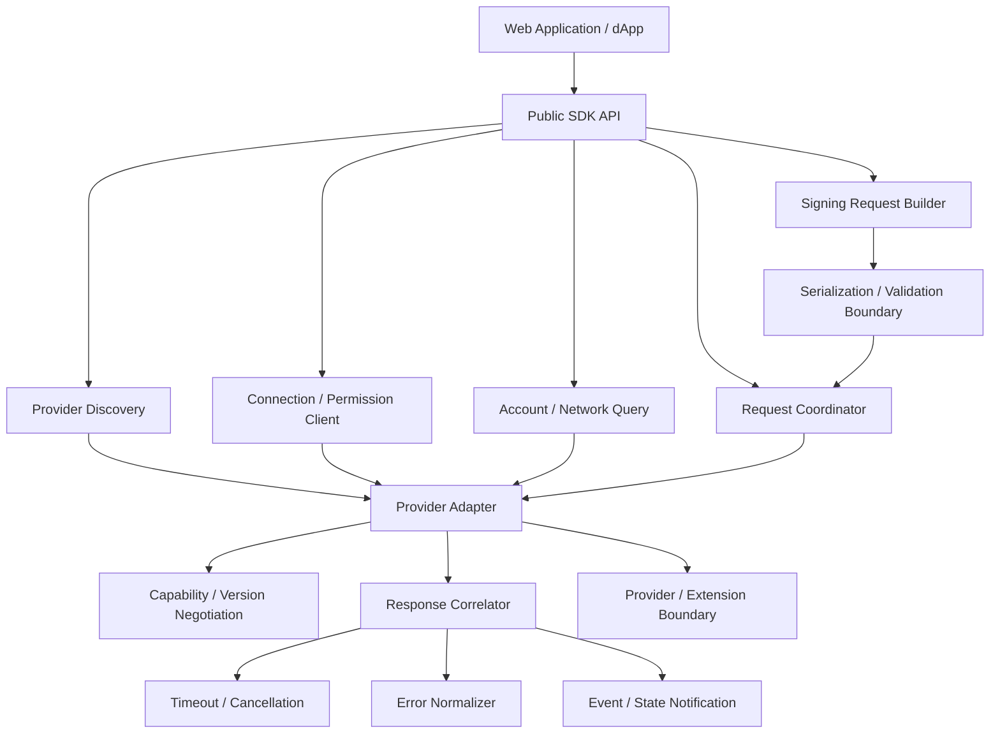

# MosaicLynx SDK 基本設計

## 1. 目的

本書は、MosaicLynx SDK を Web Application / dApp と MosaicLynx の trusted wallet context の間に置く integration layer として設計する。

SDK は Provider の利用可能性を確認し、接続・公開情報の利用・署名要求を開始し、request と response を対応付け、transport や Provider の差異を外部アプリケーションへ安全に伝える。SDK 自身は Web Application と同じ application context で動作し得るため、trusted execution boundary ではない。

SDK は wallet、signing authority、trust anchor、transaction safety judge または Relay server ではない。SDK が侵害・改変・誤用されても、private key、Mnemonic、Wallet Store、device authentication または wallet-core の cryptographic operation へ到達できず、利用者の明示的承認を経ない署名へ直結しないことを設計目標とする。

## 2. 適用範囲と上位設計との関係

対象は SDK 固有の次の能力である。

- Browser Extension または対応する MosaicLynx client の検出・能力確認。
- connection / permission 要求と、許可された公開 Account / Network 情報の取得。
- transaction signing / message signing request の構築・送信・結果受信。
- Provider / transport の抽象化、request / response correlation、timeout、cancellation および error normalization。
- protocol / capability version の確認と、unsupported / incompatible 状態の安全側処理。
- Web Application の page lifecycle、Provider disconnect、reconnect および duplicate request に対する client 側の状態管理。

本書は次の資料と合わせて適用する。

- [MosaicLynx アーキテクチャ設計](./architecture.md)
- [MosaicLynx 共通セキュリティ設計](./security-design.md)
- [MosaicLynx 署名フロー基本設計](./signing-flow.md)
- [MosaicLynx 共通データモデル・インターフェース基本設計](./interfaces.md)
- [MosaicLynx Browser Extension 基本設計](./browser-extension.md)
- [MosaicLynx Mobile App 基本設計](./mobile-app.md)
- [MosaicLynx Relay 基本設計](./relay.md)
- [MosaicLynx SDK 要件](../requirements/sdk.md)
- [MosaicLynx 共通要件](../requirements/requirements.md)
- [MosaicLynx Browser Extension 要件](../requirements/browser-extension.md)
- [MosaicLynx Mobile App 要件](../requirements/mobile-app.md)
- [MosaicLynx Relay 要件](../requirements/relay.md)
- [MosaicLynx Concept Sheet](../concept/concept-sheet.md)

Concept、Requirements、共通設計および client 設計と本書が重なる場合、SDK の非特権境界、利用者承認、Origin の trusted context による検証、共通 protocol および wallet-core 境界を優先する。本書は、Provider API、wire schema、暗号形式、Signer の approval UI または Relay protocol を再定義しない。

## 3. 設計前提

### 3.1 SDK の位置付け

SDK は次の論理位置にある。

```text
Web Application / dApp
        │ application context の要求
        ▼
MosaicLynx SDK
        │ Provider / Integration Boundary
        ▼
Browser Extension または対応する client
        │ local signing または対応 handoff
        ├──────────────► wallet-core
        └──────────────► Relay ─────► Mobile App
```

SDK は Web page と同じ trust domain に置かれ得る。SDK が正しく動作していること、Provider を検出できたこと、Provider が返した文字列または response が存在することだけで、caller、Origin、Account、署名対象または利用者承認を信頼してはならない。

### 3.2 共通 operation

SDK v1 は Requirements に従い、transaction signing と message signing を別 operation として扱う。SDK は両 operation の request construction、dispatch、correlation、結果と失敗の伝達を担うが、署名対象の意味解析、表示、承認および raw signing は Signer 側の責任である。

Aggregate transaction、multisig、cosignature、transaction construction helper および第三者 transport の公開範囲は、Requirements の未決事項を勝手に閉じない。対応 capability が確認できない operation は、別 operation、raw signing または別 transport へ暗黙に変換しない。

### 3.3 Chain / Network の分離

Symbol と NEM、Mainnet と Testnet は SDK の request、connection context、公開 Account、capability および response で明示的に区別する。SDK は chain-specific な transaction schema、address、hash、署名 byte または network constant を独自の共通表現へ置き換えず、各 chain adapter / 共通 interface の契約に従う。

## 4. SDK の責務と非責務

### 4.1 SDK が担う責務

- Provider の利用可能性、capability、supported Chain / Network および互換性の確認。
- connection / permission 要求の開始と、Provider から得た許可結果の受信。
- 許可された公開 Account / Network 情報の取得と、application-facing な形式への受け渡し。
- 外部アプリケーションが作成した signing intent の request construction、protocol boundary への変換および送信。
- request identity の付与または共通 contract に従った採用、response correlation、重複 completion の抑止。
- timeout、local cancellation、Provider disconnect、page lifecycle および stale response の安全側処理。
- Provider / Relay / transport / client 側の失敗を、外部アプリケーションが区別できる transport-level failure category を含む概念的 error category へ正規化すること。これは signing generation の結果または Signer-side の delivery disposition を SDK が確定することを意味しない。
- Provider response の構造、version、request identity、operation、Account、Chain / Network および result context の検証。
- transport の違いを、意味を変えない範囲で application-facing な共通 request / response model へ抽象化すること。
- 秘密情報を含まない最小限の状態通知・診断情報の提供。

### 4.2 SDK が担わない責務

SDK は次を担わない。

- private key、Mnemonic、Profile password、Wallet Store、復号済み秘密情報、device authentication 情報または secret credential の要求・保持・復号・出力。
- wallet unlock、device authentication、permission の最終付与、Account ownership の最終認証または利用者の approve / reject。
- transaction / message の安全性の最終判断、human-readable な trusted presentation、blind signing の許可または署名対象の承認。
- raw signing、wallet-core の暗号処理、鍵管理、秘密情報処理または signed result の生成。
- signing generation 自体の結果、または Signer が保持する known signed result の delivery disposition の確定。
- Provider、Relay、transport state、timeout、response absence、disconnect、recipient offline、reconnect failure、delivery failure または page lifecycle loss から `RESULT_UNKNOWN` / `DELIVERY_UNKNOWN` を生成・推測・確定すること。
- Browser Extension の browser-observed Origin / permission authority、Mobile App の OS security / approval、Relay server の routing / retention / operation。
- Symbol / NEM node の選択、announce、残高・履歴その他の継続的な blockchain state 管理。
- Provider、Relay、Mobile App または第三者 transport を、SDK 単独の判断で trust anchor とすること。

SDK の client-side validation は developer ergonomics と protocol safety のための早期検出であり、Signer 側の security validation、approval、表示または署名の代替ではない。

## 5. 論理コンポーネント構成



### 5.1 Public SDK API

外部アプリケーションへ、利用可能性、connection / permission、公開 Account、signing request、response、failure、cancellation および状態通知の application-facing 契約を提供する。具体的な関数名、class、Promise / event の形式および export map は下位仕様へ委譲する。

Public API は秘密情報、wallet unlock、trusted approval UI、Provider の privileged object または browser-specific internal API を公開しない。

### 5.2 Provider Discovery

Provider の存在、利用可能性および候補 capability を検出する。Web page の global object 上の値、自己申告した provider 名、表示名または単なる object の存在だけで正規性・permission・signing capability を確定しない。

fake、競合、古い、部分的または malformed な Provider が見える場合は、利用不可・不整合または検証失敗として扱う。Discovery は connection、account disclosure または signing request の開始を自動的に行わない。

### 5.3 Provider Adapter

Provider 固有の connection、request dispatch、response delivery、disconnect および event を、SDK の共通 client model へ接続する。Provider 内部の browser API、content bridge、extension runtime または Mobile / Relay handoff を Public API へ直接露出しない。

Provider Adapter は、Provider の自己申告値を共通 contract の入力として受け取るだけであり、Origin の最終保証、署名承認または wallet の秘密情報境界を代替しない。

### 5.4 Capability / Version Negotiation

SDK version、Provider / protocol version、対応 operation、Chain / Network、local / remote signing capability および必要な範囲の runtime capability を確認する。capability は「できる可能性」を表す情報であり、個別 request の authorization、Account permission、user approval または成功を意味しない。

unknown、unsupported、incompatible または判定不能な capability は安全側に unavailable / unsupported とする。古い契約を別 operation、raw signing または insecure fallback へ自動変換しない。

### 5.5 Connection / Permission Client

connection の開始、公開情報の利用要求、permission の状態照会、disconnect / revoke の連携を担う。connection、account/address disclosure、signing request を別の概念として扱い、Provider / wallet 側の permission state を正とする。SDK は permission を自己判断で付与・拡張・永続化する authority ではない。

### 5.6 Account / Network Query

許可された公開情報だけを取得し、Account、Chain、Network、public key、address または capability の application-facing 表現を提供する。private key、Mnemonic、Wallet Store、unlock credential、device authentication 情報、内部 secret identifier は扱わない。

公開情報の cache は、最新の permission、Account ownership、署名可能性または現在の signer state の証明ではない。disconnect、revoke、Profile / Account / Network context の変更後に古い公開情報を新しい署名 request の認可へ流用しない。

### 5.7 Signing Request Builder

外部アプリケーションの signing intent を、operation、Chain / Network、Account context、request identity、期限、source / relying context の binding 情報および protocol contract に沿った request へ組み立てる。SDK が自動生成する補助説明、label または metadata は untrusted supplementary data であり、trusted approval の根拠ではない。

Builder は、入力形式、明らかな不整合、unsupported operation、Chain / Network mismatch および protocol 上の不足を早期に検出してよい。ただし validation 通過は「安全」「承認済み」「署名可能」を意味しない。

### 5.8 Request Coordinator / Response Correlator

複数の request を独立した request identity、operation、Provider context および lifecycle で管理する。response は response 側の identity、元 request、Provider / session context、operation、Account、Chain / Network と対応付け、対応が確認できないものを成功として返さない。

### 5.9 Timeout / Cancellation

SDK 側の待機、request state、local callback / Promise の終了を管理する。timeout は wallet-side signing の取消し、未署名または署名済みの確定を保証しない。Provider が cancellation をサポートする場合も、SDK はその結果を別途確認し、取消し送信の受理を署名未実行の証明としない。

### 5.10 Error Normalizer

Provider、Browser Extension、Mobile App、Relay、wallet-core および transport の差異を、外部アプリケーションが安全な制御を選択できる概念的 category へ変換する。内部 stack trace、credential、secret、parser 内部情報または不要な platform detail を漏らさない。

### 5.11 Event / State Notification

Provider availability、connection state、permission context、request completion、disconnect および安全な failure state を通知し得る。通知は advisory な application event であり、通知受信、connection event または capability event を承認・署名成功・Origin verified の根拠にしない。

### 5.12 Serialization / Validation Boundary

SDK の internal model と共通 protocol representation を分離し、interfaces.md の contract に従って serialize / validate する。完全な wire schema、canonical encoding、request ID format、暗号形式および error code は下位仕様へ委譲する。

## 6. Trust Boundary

```text
untrusted application context
  Web Application / dApp / SDK code / Provider response / page data
              │ protocol input; no secret or approval authority
              ▼
SDK integration boundary
  discovery / capability / request construction / correlation / normalization
              │ validated contract input, still not trusted wallet context
              ▼
Provider / public integration boundary
  Browser Extension public Provider or supported client contract
              │ browser-observed Origin and permission are verified by wallet side
              ▼
MosaicLynx trusted host boundary
  Browser Extension / Mobile App
  request validation / inspection / trusted UI / user approval / signing orchestration
              │ approved raw target only
              ▼
wallet-core boundary
  secret handling / cryptographic operation / raw signing
```

SDK が Provider から返された data を parse、型検査または correlation したとしても、Provider の正規性、Origin の真正性、Account ownership、transaction safety または user approval を保証したことにはならない。Browser Extension は実際に観測した Origin、browser context、permission、approval UI および wallet-core 境界を管理し、Mobile App は handoff session、source、device authentication、trusted UI および signing を管理する。

SDK は Mobile App、Relay または wallet-core と直接 secret / privileged channel を持たない。Relay を利用する remote signing でも、SDK は Relay の opaque transport を通じて request / response を扱うだけであり、Relay の配送成功を trust anchor としない。

## 7. Provider Abstraction / Discovery / Capability

### 7.1 Provider の抽象責務

Provider は概念上、次を提供し得る。

- availability / discovery information。
- capability / version information。
- connection / permission request の dispatch。
- 公開 Account / Network 情報の response。
- signing request の dispatch と response delivery。
- disconnect、session state または対応する event notification。

Provider は、SDK に private context、Vault、秘密鍵、approval state または wallet-core API を公開してはならない。Provider の具体的な injected object、content bridge、extension runtime、OS link または transport adapter は Provider / platform 下位仕様へ閉じ込める。

### 7.2 Provider Discovery

Provider の検出と permission / account disclosure / signing を分離する。

- Provider が存在するだけでは、Account 情報の自動開示を開始しない。
- Provider detection は connection や signing permission を意味しない。
- fake、conflicting、malformed、部分実装または incompatible Provider を利用可能と報告しない。
- Provider が応答しない、必要な capability を返さない、version を確認できない場合は unavailable / incompatible として扱う。
- Provider の表示名、icon、Web page の global object または自己申告 Origin を trust anchor にしない。

Provider の候補が複数見える場合の選択 policy は、Requirements が明示する範囲を超えて決めない。意図しない wallet へ request を送らないため、選択できない・選択結果を確認できない状態では自動送信しない。

### 7.3 Capability

Capability は、必要最小限の粒度で次のような「対応可能性」を示す。

- connection / public account disclosure。
- transaction signing / message signing。
- supported Chain / Network。
- local signing または対応する remote handoff。
- Provider / protocol version。

Capability は permission、個別 request の適用可否、Account ownership、unlock、approval または成功結果を意味しない。capability の情報が stale、矛盾または未検証の場合は、必要な operation を開始せず再確認または安全側の失敗とする。

## 8. Connection / Permission Model

### 8.1 Connection

SDK の connection は、Provider が利用可能で、外部アプリケーションと wallet 側の公開 integration context が成立し、permission negotiation が可能な状態を表す。connection は次を意味しない。

- signing approval、wallet unlock または device authentication。
- Account ownership proof または permanent authorization。
- すべての Chain / Network、Account、operation または transport の利用許可。
- 現在も有効な permission、pending request または signing result。

Connection lifecycle と permission lifecycle は分離する。disconnect、Provider reload、page reload、browser restart、Profile / Account / Network change または session expiration 後に、SDK は古い connection を新しい request の authority として使わない。

### 8.2 Permission

permission は Provider / wallet 側が管理し、少なくとも次の概念を区別できる構造とする。

| 概念                       | 意味                               | SDK の扱い                                     |
| -------------------------- | ---------------------------------- | ---------------------------------------------- |
| connection                 | Provider / wallet と連携可能な状態 | 開始・状態伝達を行うが、署名許可とはしない     |
| account/address disclosure | 許可された公開 Account 情報の利用  | 許可結果だけを受け取り、秘密情報を要求しない   |
| signing request            | 個別 request を Signer に送ること  | request ごとに Signer 側の明示承認を必要とする |

SDK は permission を自己判断で付与、拡張、永続化または別 Origin / context へ流用しない。permission state が不明、期限切れ、revoke 済みまたは connection context と一致しない場合は request を署名成功へ進めない。

### 8.3 Disconnect / Revoke

disconnect または revoke は、新しい公開情報・署名 request が旧 permission に依存しないようにする。SDK 内の一時 state、pending request、response handler、公開情報 cache は、対応する context とともに無効化する。SDK の local state を削除したことだけで wallet 側 permission が revoke されたと推測せず、Provider の結果を正とする。

## 9. Origin / Relying Context

SDK は Web Application context の中で動作するため、SDK が観測した Origin、host、referrer、URL、caller 名、application label または dApp の自己申告を security authority としない。

Origin に関する責任を次のように分ける。

| 情報・判断                            | SDK                                | Browser Extension / Browser platform      | Mobile App / platform                            |
| ------------------------------------- | ---------------------------------- | ----------------------------------------- | ------------------------------------------------ |
| application が自己申告した context    | request の補助情報として扱う       | untrusted input として再確認              | handoff の補助情報として再確認                   |
| browser が観測した実 Origin / context | 受け渡し情報を扱い得るが保証しない | 最終検証、Origin binding、permission 適用 | 該当しない。handoff source の検証を担う          |
| handoff session / intended recipient  | correlation 情報として扱う         | 自経路の session を検証                   | session、recipient、integrity、expiry を最終検証 |
| verified Origin / caller の判断       | 表明しない                         | trusted context で判断                    | 対応する Mobile / platform contract で判断       |

SDK が Provider へ caller / Origin 情報を渡す場合も、「SDK が信頼した Origin」としてではなく、Signer が自分の trusted context で検証するための request context として扱う。Origin proof、nonce、browser API、OS API および cryptographic binding の具体方式は下位仕様へ委譲する。

## 10. Account / Network 公開

SDK が外部アプリケーションへ返す情報は、Provider / wallet 側で明示的に許可された公開情報に限定する。対象には次を含み得るが、最終的な公開契約は interfaces / Provider specification に従う。

- Chain / Network。
- address、public key、account identifier または公開 profile context。
- 対応 capability。

SDK は次を要求・保持・返却しない。

- private key、Mnemonic、wallet password、Profile password、Wallet Store または復号済み Wallet Store。
- Wallet Store encryption key、device authentication information、unlock token または E2E session secret。
- 秘密情報の導出・復号結果、内部的な鍵識別子または不要な Profile metadata。

Account disclosure は permission、Origin / relying context、Chain / Network および connection に binding する。公開 Account 情報を取得できたこと、cache に存在すること、public key が得られたことを、現在の permission、Account ownership、署名承認または最新の signer state の証明としない。

SDK は node status、残高、履歴または announce を標準責務に含めない。外部アプリケーションが必要な network 処理と署名結果の独立検証を行う。

## 11. Signing Request Handling

### 11.1 概念フロー

```text
APPLICATION_REQUEST
  → SDK_INPUT_CHECK
  → REQUEST_CONSTRUCTED
  → PROVIDER_DISPATCHED
  → PENDING
  → RESPONSE_VALIDATED
  → RESOLVED / REJECTED / FAILED
```

これは SDK の受け渡し lifecycle であり、Signer の共通 signing lifecycle を置き換えない。Signer 側では、request の validation、inspection、trusted UI、明示的 approval、必要な authentication、wallet-core signing および結果生成を行う。SDK は `AUTHORIZED`、`SIGNING` または `SUCCEEDED` を自ら生成しない。

### 11.2 Request construction

SDK は外部アプリケーションが指定した operation、Chain / Network、Account context、signing target、request identity、必要な期限および source / relying context を共通 contract に沿って Provider へ渡す。

SDK は transaction または message の安全性を判定しない。transaction / message の semantic inspection、Aggregate 内部 transaction、cosignature target、表示可能性、blind signing の可否および approval binding は Browser Extension / Mobile App と chain integration の責任である。

SDK が受け取る display text、label、description、icon、recipient 名または amount の説明は supplementary / untrusted metadata とする。これらを trusted approval UI の表示根拠や、payload の代替にしない。

### 11.3 Client-side validation

SDK は malformed input、unsupported operation、明らかな Chain / Network mismatch、必須 context の欠落、サイズまたは serialization の異常を送信前に検出してよい。これは開発者体験、通信節約および protocol robustness のための validation である。

SDK の validation を通過した request でも、Signer は caller、permission、Account、Chain / Network、payload integrity、semantic safety、表示内容、明示承認および wallet-core input を再検証する。SDK は検証済みを安全・承認済み・署名可能として外部へ表明しない。

### 11.4 Transaction / Message operation

transaction signing と message signing は operation identity を保ったまま dispatch する。未対応の transaction type / version、Aggregate、multisig、cosignature、message format または Chain / Network を、別 operation、raw signing、警告付き blind signing または別 transport へ自動変換しない。

Signer が確認・承認した target と response が対応しない、または SDK が対応を検証できない場合、SDK は success を返さず mismatch / integrity failure とする。SDK は「署名が安全だった」ことや、署名結果の network 的な有効性を単独で保証しない。

## 12. Request Identity / Correlation

SDK は各 request を、少なくとも request identity、operation、Provider / connection context および lifecycle により独立して扱う。具体的な identifier format、digest、serialization および correlation field は interfaces.md と下位仕様へ委譲する。

response success を返すには、次の対応を確認できなければならない。

- response が意図した request identity に対応する。
- response の operation が request と一致する。
- Provider / session / connection context が現在の request に対応する。
- Account、Chain / Network、signer context および必要な target binding が一致する。
- response が duplicate、stale、expired、cancelled、replayed または別 request のものではない。

対応を確認できない response、遅延 response、duplicate response または session をまたぐ response は適用せず、成功推測も行わない。request identity の衝突、同一 identity で内容が変化した request、response の correlation 不一致は安全側に終了する。

SDK の correlation は application の最終的な署名結果検証を代替しない。外部アプリケーションも、返された署名結果を元 request と独立に検証する。

## 13. Request Lifecycle

SDK の基本 lifecycle は次のとおりとする。

```text
CREATED
  → VALIDATING
  → DISPATCHED
  → PENDING
  → RESOLVED

CREATED / VALIDATING / DISPATCHED / PENDING
  → REJECTED / FAILED / TIMED_OUT / CANCELLED / CONTEXT_LOST
```

- `CREATED`: 外部アプリケーションが signing intent を SDK に渡した状態。
- `VALIDATING`: SDK が入力、capability、connection context および protocol 境界を確認している状態。
- `DISPATCHED`: Provider へ一度だけ送信した状態。送信受理は署名開始・承認を意味しない。
- `PENDING`: Provider / Signer からの response を待つ状態。
- `RESOLVED`: response の correlation と必要な構造検証が完了し、外部アプリケーションへ結果を返せる状態。
- `REJECTED`: 利用者拒否、permission denial または Provider 側の拒否を、成功と区別して返す終端状態。
- `FAILED`: invalid、unsupported、mismatch、transport、Provider または内部 failure の終端状態。
- `TIMED_OUT`: SDK の待機期限を超えた状態。wallet-side の処理結果は確定しない。
- `CANCELLED`: SDK または Provider の cancellation contract により待機を終了した状態。
- `CONTEXT_LOST`: page、Provider、connection、session、permission または Chain / Network context が失われた状態。

一つの request は一度だけ終端処理し、duplicate completion を無視または安全な duplicate として扱う。終端後に同じ request、承認、response handler、permission または connection state を新しい request へ再利用しない。

SDK の lifecycle は Signer の `RECEIVED`、`VALIDATED`、`INSPECTED`、`AWAITING_USER`、`AUTHORIZED`、`SIGNING`、`SUCCEEDED` 等の共通 signing lifecycle を保持しない。SDK が `PENDING` を保持していても、wallet-side の approval / signing status を知っていることを意味しない。

## 14. Timeout / Cancellation

### 14.1 Timeout

SDK は indefinitely pending な application wait を避けるため、request ごとに下位仕様で定める期限 policy を適用する。具体的な timeout 値、operation ごとの差、timer 実装および retry timing は定めない。

timeout 後は SDK の待機と response 適用を終了し、遅れて届いた response を別 request へ適用しない。timeout は次を保証しない。

- Signer が request を受信していないこと。
- wallet-side approval が閉じられたこと。
- device authentication が行われていないこと。
- 署名が未実行であること。
- すでに生成された signed result が存在しないこと。

したがって timeout 後に SDK は「未署名」「署名済み」または「安全に再送可能」と推測しない。再試行を行う場合は、共通仕様に従って新しい request と新しい validation / approval を必要とする。

### 14.2 Cancellation

Cancellation は少なくとも SDK の local wait、response handler および request state を終了させる意味を持つ。Provider が protocol 上の cancellation request を提供する場合、SDK はそれを明示的な transport operation として送信してよいが、受理・送信・delivery を wallet-side の cancellation completion と同一視しない。

SDK は一方的な cancellation により、Signer がすでに承認・署名した可能性を否定しない。cancellation 後の遅延 response、signed result または Signer-originated `RESULT_UNKNOWN` / `DELIVERY_UNKNOWN` は現在の request context に適用せず、下位仕様の failure / recovery contract に従う。

User rejection、mismatch、integrity failure、caller / Origin failure または replay failure を、自動 retry、別 Provider または別 transport fallback で迂回しない。transport unavailable の再接続や、利用者が明示した新規操作の開始とは区別する。

## 15. Response / Error Model

### 15.1 Response handling

SDK は success、user rejection、permission denial、unsupported、incompatible version、account locked、wrong network、timeout、connection loss、transport failure、internal failure および Signer-originated `RESULT_UNKNOWN` を、request identity とともに受け取ることがある。また、Signer が既知の signed result を保持している場合の Signer-side `DELIVERY_UNKNOWN` を delivery disposition として受け取ることがある。SDK がこれらを受け取る場合も、request / response correlation を確認し、意味を変更せず application 側へ伝達する。

`RESULT_UNKNOWN` は signing generation 自体の結果を Signer が安全に確定できない場合だけ、`DELIVERY_UNKNOWN` は Signer が既知の signed result の配送 disposition を安全に確定できない場合だけ成立する。SDK は Provider、Relay、network、transport、timeout、response absence、disconnect、recipient offline、reconnect failure、delivery failure、page lifecycle loss または SDK internal state から、いずれの disposition も生成・推測・確定しない。

Success は、request、operation、signer、Account、Chain / Network、correlation および Signer が確認・承認した target との対応を SDK が確認でき、外部アプリケーションが結果を独立検証できる正常完了を表す。Provider、Relay または Mobile App が success response を返しただけでは success としない。

### 15.2 概念的 error category

| Category                      | 意味                                                                                            | SDK の基本処理                                                                                           |
| ----------------------------- | ----------------------------------------------------------------------------------------------- | -------------------------------------------------------------------------------------------------------- |
| unavailable                   | Provider、MosaicLynx、Mobile App または対応 capability が利用できない                           | 署名成功にせず、利用不可として終了                                                                       |
| connection / permission       | 未接続、connection scope 不一致、permission denial、revoke                                      | 古い permission / Account を流用せず終了                                                                 |
| user rejection                | 利用者が拒否、approval UI を閉じた、または signing を取消した                                   | system failure と混同せず、自動 retry / fallback しない                                                  |
| invalid request               | application input、形式、size、context または protocol validation が不正                        | request を送らない、または failure として終了                                                            |
| unsupported / incompatible    | operation、Chain、Network、format、version、Provider capability が非対応                        | 別 operation / raw signing / unsafe fallback に変換しない                                                |
| mismatch / integrity / replay | caller、Origin、Account、Chain / Network、request / response、payload または freshness の不一致 | 自動再送せず、security failure として終了                                                                |
| timeout / expired / cancelled | SDK wait、request expiry、context loss または cancellation                                      | 遅延 response を適用せず、署名状態を推測しない                                                           |
| transport / relay             | Provider、Relay、network、handoff または delivery の失敗                                        | transport-level failure category として扱い、signing outcome または Signer-side disposition へ昇格しない |
| wallet-side / internal        | Signer、wallet-core、SDK または依存 component の内部失敗                                        | secret / stack trace を漏らさず、安全側に終了                                                            |

具体的な error code、exception class、message 文言、HTTP status、retry 回数および retry interval は下位仕様へ委譲する。外部アプリケーションが必要な分類を失わない範囲で、Provider / platform 固有 error の詳細を過度に公開しない。

`RESULT_UNKNOWN` と `DELIVERY_UNKNOWN` は transport / error category ではない。前者の owner は signing generation 自体の outcome を扱う Signer、後者の owner は既知の signed result の delivery disposition を扱う Signer である。SDK は実際に取得した Signer-originated disposition の correlation と意味不変の伝達だけを担い、Relay / transport failure から両 disposition を作らない。

## 16. Concurrency / Connection Loss / Page Lifecycle

### 16.1 Concurrency

SDK は同時に複数 request を扱える前提とする。account query、connection、transaction signing、message signing、cancellation および response を single global state に混在させない。

次を request 単位で分離する。

- request identity、operation、Account、Chain / Network、Provider / connection context。
- timeout、cancellation、completion handler および error state。
- response correlation、permission snapshot および page lifecycle context。

queue、single-flight、parallel dispatch、per-Provider ordering および backpressure の具体方式は下位仕様へ委譲する。ただし、別 request の response、Account query、cancellation、permission または approval state を流用してはならない。

### 16.2 Connection loss / reconnect

Provider disconnect、Extension reload、browser restart、tab navigation、page reload、SDK reinitialization または session expiration が起きた場合、SDK は pending request を自動的に成功へ復元しない。reconnect は新しい Provider / connection context の再確認であり、以前の approval、authentication、pending request または signed result の復元を意味しない。

新しい SDK instance が古い response を受け取った場合、request identity、context、expiry および session を検証し、対応しなければ破棄または stale failure とする。古い connection の response を新しい connection の request に対応付けない。

### 16.3 Page lifecycle

page load、unload、navigation、tab close、BFCache 等の browser lifecycle と duplicate SDK initialization を考慮する。page lifecycle をまたいで pending approval、permission、signed result または request identity を危険な形で自動復元しない。

page が破棄・遷移された場合、SDK の local waiting を終了し、context lost / transport failure category として扱う。これは Signer-side の `RESULT_UNKNOWN` / `DELIVERY_UNKNOWN` ではなく、SDK は page lifecycle loss から signing outcome または delivery disposition を推測・確定しない。page context の喪失は unsigned、signed、signing failed、`RESULT_UNKNOWN` または `DELIVERY_UNKNOWN` のいずれの証明でもない。復元を行う場合も、古い request / response を再利用せず、新しい application context と新しい request として開始する。

## 17. Local / Remote Signing Abstraction

SDK は、Browser Extension への直接連携と、Provider / Relay を通じた Mobile App 連携を、可能な範囲で共通の request / response semantics として外部アプリケーションへ提供する。

```text
local:
  SDK → Provider → Browser Extension → wallet-core

remote:
  SDK → Provider / handoff client → Relay → Mobile App → wallet-core
```

共通化する対象は operation、request identity、Account / Chain / Network context、success / rejection / failure の意味、Signer-originated disposition の意味および結果の相関である。共通化してはならない、または完全には隠せない差異は、latency、availability、session establishment、user activation、page / App lifecycle、timeout、cancellation、result delivery および transport / handoff failure category である。local / remote の transport 差異は `RESULT_UNKNOWN` / `DELIVERY_UNKNOWN` の生成根拠にならない。

SDK は remote signing のために Relay server の内部 protocol、credential、session store または Mobile App の privileged interface を直接公開しない。Relay が利用できない場合は transport / handoff failure category として扱い、signing success、`RESULT_UNKNOWN` または `DELIVERY_UNKNOWN` に変換しない。Mobile App 未提供・unsupported capability も利用可能として報告しない。

Signer が既知の signed result を保持している場合の delivery failure では、既存 result の redelivery、resend、retrieval または lookup を候補とする。これらは response delivery の回復であり signing retry ではないため、known result の delivery failure から再署名しない。具体的な配送・照会契約は下位仕様へ委譲する。

local が失敗したから remote へ、remote が失敗したから local へ自動 fallback する設計は、user rejection、permission / authorization failure、mismatch、integrity、caller、replay failure、`RESULT_UNKNOWN` または `DELIVERY_UNKNOWN` を迂回し得るため通常の安全動作としない。transport failure を signing retry に変換せず、Provider A failure から Provider B signing への自動切替もしない。明示的な transport 選択の範囲は Requirements の未決事項として扱う。

## 18. Versioning / Compatibility / Serialization

### 18.1 Versioning

SDK version、Provider / protocol version、capability version および対応する Signer / Mobile / Relay version の関係を、要求された範囲で確認する。version の一致だけを capability の根拠にせず、operation、Chain / Network、transport および必要な security property を確認する。

unknown、unsupported、incompatible または判定不能な version は安全に拒否または unavailable とする。version mismatch を旧 operation、raw signing、permission bypass、Origin bypass または別 transport の成功へ fallback しない。

### 18.2 Backward compatibility

互換性を提供する場合も、operation の意味、Chain / Network 境界、explicit approval、request / response binding、secret isolation および fail-closed を維持する。unknown field、unknown algorithm、deprecated operation、古い permission model または古い response を危険に無視しない。

supported version の範囲、compatibility matrix、deprecation policy、migration および release 運用は未決事項・下位仕様へ委譲する。

### 18.3 Serialization boundary

SDK の internal model、application-facing model および共通 protocol representation を分離する。serialization / deserialization の前後で operation、request identity、Chain / Network、Account、payload binding および expiry の意味を変えない。

SDK は interfaces.md の protocol semantics を再定義せず、完全な JSON Schema、wire encoding、canonical serialization、request ID format、envelope、signature format および error code を下位仕様へ委譲する。検証できない形式、曖昧な version または意味を保てない conversion は拒否する。

## 19. Secret / Logging / Runtime Policy

### 19.1 Secret handling

SDK は secret material を一切要求・保持・復号・導出・ログ出力しない。SDK の object、URL、query、event、callback、Provider message、cache、exception、debug output または telemetry に、private key、Mnemonic、password、Wallet Store、復号済み secret、device auth token、E2E secret または credential raw 値を含めない。

wallet-core は trusted wallet component 内部の cryptographic boundary であり、SDK が直接 cryptographic signing API を Web Application へ公開する構造にしない。SDK が Provider response として受け取る signed result は、秘密情報ではない範囲で扱い、外部アプリケーションによる独立検証を前提とする。

### 19.2 Logging / telemetry

診断は既定で最小限とし、必要に応じて利用者・運用者が明示的に有効化できる範囲に限定する。記録し得るのは Provider availability、capability mismatch、request state、transport 状態および抽象化した failure category 等の非秘密情報とする。

raw signing payload、full transaction / message、署名結果、private key、Mnemonic、password、approval detail、Origin、Account identifier の不要な組合せ、session secret、credential および内部 stack trace を恒常的に記録しない。SDK の logging を有効にしても、security validation、approval、secret isolation または response binding を弱めない。

### 19.3 Framework / runtime boundary

SDK core は React、Vue、Angular または特定 UI framework に依存しない。framework adapter、hook、plugin、event implementation および UI helper は必要な場合も別 package / 下位仕様へ委譲し、Public SDK API に trusted approval UI を持ち込まない。

初期対象は browser-based Web Application / TypeScript / JavaScript ecosystem とするが、正式対応 runtime、browser scope、Node.js、SSR、Web Worker および Mobile runtime の扱いは Requirements の未決事項に従う。Browser Origin、user activation、page lifecycle または Provider availability を必要とする機能を、server-side runtime でも同じ保証があるように表明しない。

配布形態、module format、package export、bundler、dependency、artifact integrity および release evidence の詳細は下位仕様・release policy へ委譲する。SDK が remote code を実行時取得して security property を成立させる設計にしない。

## 20. 責任分界

| 主体                   | 担う責任                                                                                                                                                            | SDK との境界                                                                           |
| ---------------------- | ------------------------------------------------------------------------------------------------------------------------------------------------------------------- | -------------------------------------------------------------------------------------- |
| Web Application / dApp | signing intent の生成、SDK 利用、結果の独立検証、必要な network 処理                                                                                                | SDK の結果を trust anchor とせず、秘密情報を渡さない                                   |
| SDK                    | discovery、capability / version、connection / permission client、公開情報、request construction、dispatch、correlation、timeout / cancellation、error normalization | wallet、承認主体、Origin authority、signing authority ではない                         |
| Browser Extension      | Browser-observed Origin、permission authority、Account disclosure authority、trusted approval UI、device / unlock、signing orchestration、wallet-core integration   | SDK は public Provider 境界だけを利用し、private context へ入らない                    |
| Mobile App             | handoff / source validation、OS security、device authentication、trusted approval UI、Account / Network、signing、response generation                               | SDK は Mobile の privileged channel、Relay validation、secure storage を直接制御しない |
| Relay                  | opaque transport、session / routing、短期 delivery、expiration、connection lifecycle                                                                                | SDK は Relay を trust anchor、semantic validator、signer として扱わない                |
| wallet-core            | secret processing、Wallet Store、cryptographic operation、raw signing                                                                                               | SDK / Web Application へ直接公開せず、trusted wallet component 内部に置く              |
| Interfaces             | request / response semantics、operation、identity / correlation、versioning、共通 protocol                                                                          | SDK は独自 wire contract を作らず、共通契約を適用する                                  |

接続済み、capability あり、Relay delivered、Provider success または SDK resolved は、user approval、署名成功、Origin verified、Account ownership または transaction safety を意味しない。

## 21. Failure / Recovery

| 状況                                      | SDK の基本処理                                                                                        | 禁止する復旧                                                                                          |
| ----------------------------------------- | ----------------------------------------------------------------------------------------------------- | ----------------------------------------------------------------------------------------------------- |
| Provider unavailable / incompatible       | unavailable / compatibility failure として終了                                                        | 未検証 Provider、別 operation または unsafe fallback の自動利用                                       |
| permission denied / revoked               | permission failure として終了し、古い公開情報を無効化                                                 | 接続済み・cache・capability による権限の推測                                                          |
| malformed / unsupported request           | request を送らず invalid / unsupported とする                                                         | raw signing、警告だけの bypass、別 operation への変換                                                 |
| user rejection                            | rejection として返す                                                                                  | 自動 retry、別 transport、別 Provider による迂回                                                      |
| timeout / cancellation                    | local wait を終え、遅延 response を適用しない                                                         | 未署名・署名済みの推測、古い承認の再利用                                                              |
| Provider disconnect / page lifecycle loss | context lost / transport failure として終了                                                           | stale request、permission、approval、response の自動復元                                              |
| response mismatch / replay / duplicate    | response を破棄または security failure とする                                                         | request identity を無視した適用・再送                                                                 |
| Relay / remote handoff failure            | transport / handoff failure category として終了                                                       | Relay success、signing outcome または Signer-side disposition の推測、local signing への無断 fallback |
| Signer-originated `RESULT_UNKNOWN`        | Signer が signing generation 自体の結果を確定できない disposition を、correlation 後に意味不変で伝達  | 自動 re-sign、同じ request の再開、別 transport / Provider / Signer への自動 fallback                 |
| Signer-side `DELIVERY_UNKNOWN`            | Signer が既知の signed result の配送 disposition を確定できない場合に、correlation 後に意味不変で伝達 | 既知 result の再署名、`RESULT_UNKNOWN` への変換、別 transport / Provider / Signer への自動 fallback   |
| wallet-side / internal failure            | error category を正規化し、安全側に終了                                                               | stack trace、secret、内部 status の漏洩                                                               |

Relay / Provider / transport failure だけでは、`RESULT_UNKNOWN` も `DELIVERY_UNKNOWN` も成立しない。Signer-originated disposition を実際に取得できた場合だけ、SDK は request identity、response correlation および context を確認し、意味を変更せず application 側へ伝達する。SDK の transport state、response absence、timeout、disconnect、recipient offline、reconnect failure、delivery failure または page lifecycle loss から disposition を生成・推測・確定しない。

既知の signed result に対する配送問題の候補は redelivery、resend、retrieval または lookup であり、signing retry とは分離する。known result の delivery failure、`RESULT_UNKNOWN`、`DELIVERY_UNKNOWN` または transport failure から automatic re-sign を行わない。自動 retry を行う場合も、user rejection、security / mismatch / integrity / caller / replay failure および permission / authorization failure を対象外とし、permission / authorization failure を transport retry に変換しない。local failure → remote signing、remote failure → local signing、Provider A failure → Provider B signing の自動 fallback も行わない。

新しい signing operation が必要な場合は、同じ結果や transport 状態を再利用せず、新しい request、Authentication、Signing-capable unlock、Account authorization および Explicit user approval を新たに成立させる。

## 22. SDK Security Invariants

1. SDK は private key、Mnemonic、password、Wallet Store、復号済み secret、device authentication 情報または E2E secret を要求・保持・出力しない。
2. SDK は wallet、signing authority、signing-result correctness / disposition authority、user approval authority、transaction validator または trust anchor ではない。
3. Provider detection は connection、permission、Account disclosure、unlock、approval または signing capability の確定を意味しない。
4. Capability は authorization、Account ownership、user approval または個別 request の success を意味しない。
5. connection、account/address disclosure、signing request および user approval を分離する。
6. Origin / caller の最終 security binding は Browser Extension / browser platform または Mobile App / platform の trusted context が担い、SDK の自己申告・観測を authority としない。
7. SDK validation は Signer 側の request validation、semantic inspection、trusted presentation、明示的承認および wallet-core signing の代替ではない。
8. SDK-provided display text、label、icon または description は trusted signing representation ではない。
9. request、response、operation、Account、Chain / Network、Provider context および必要な target binding は一意に correlation する。
10. stale、duplicate、replayed、expired、cancelled または別 request の response を現在の request に適用しない。
11. timeout、cancellation または page lifecycle loss は wallet-side cancellation completion、署名未実行、署名済み結果の不存在または signing outcome を保証・確定しない。
12. reconnect、Provider reload、browser restart、page reload または SDK reinitialization は古い approval、permission、pending request または signed result の自動復元を意味しない。
13. unsupported / incompatible protocol、capability、Chain / Network、operation または runtime は unsafe fallback せず安全側に失敗する。
14. user rejection、security / mismatch / integrity / caller / replay failure、permission / authorization failure、`RESULT_UNKNOWN` および `DELIVERY_UNKNOWN` を自動 retry / fallback で迂回しない。transport retry と signing retry を混同しない。
15. Relay の配送成功、response absence、Provider / connection event、SDK の resolved state または transport state は、署名成功・署名失敗・`RESULT_UNKNOWN`・`DELIVERY_UNKNOWN` または Origin verified の根拠ではない。
16. `RESULT_UNKNOWN` は Signer が signing generation 自体の結果を確定できない場合、`DELIVERY_UNKNOWN` は Signer が既知の signed result の配送 disposition を確定できない場合に限る。SDK / Provider / Relay / transport state はその生成・推測・確定の authority ではなく、SDK は取得済みの Signer-originated disposition を意味不変に伝達するだけである。
17. wallet-core、Browser Extension private context、Mobile secure storage、Relay administration plane および device authentication へ SDK から直接到達できない。
18. SDK の diagnostics、logging、cache および error normalization は、secret isolation、privacy、approval binding および fail-closed を弱めない。

## 23. 下位仕様への委譲事項

次を下位仕様、Provider contract、interfaces specification または release / test policy へ委譲する。

- TypeScript の具体 API、class / function、Promise / event semantics、公開 type および export map。
- Provider の injected object 名、browser API 呼び出し、content bridge、extension runtime、OS handoff および adapter 実装。
- connection / permission の具体 message、Origin proof、caller binding、session credential および transport 選択。
- request / response の完全 wire schema、JSON Schema、serialization、canonical encoding、request ID format、digest、signature format および error code。
- timeout 値、期限、cancellation protocol、retry timing、queue / single-flight、backpressure、cache schema および retention。
- transaction / message の chain-specific schema、Aggregate / multisig / cosignature の公開範囲、transaction construction helper および result verification の詳細。
- local / remote transport の選択順、explicit alternative UX、Mobile / Relay milestone の compatibility matrix。
- framework adapter、runtime / browser support matrix、module format、bundler、package release および semver / deprecation 運用。
- diagnostics の field allowlist、sampling、test matrix、contract test、platform E2E、release evidence および security review。

これらを委譲しても、SDK が非特権 integration layer であること、Signer 側の明示承認、Origin binding、request / response correlation、secret isolation および fail-closed は変更しない。

## 24. 未決事項

Requirements で未確定の事項は、本書では次の範囲に留める。

- Provider discovery の具体方式、fake / conflicting Provider の選択 policy および複数 Provider が見える場合の明示選択。
- cancellation が local wait の終了だけか、Provider / Signer への protocol request を含むか。
- local / remote signing の公開 abstraction、transport 選択および利用者が選ぶ代替経路。
- Aggregate、multisig、cosignature および transaction construction helper の SDK 公開範囲。
- SDK の正式対応 runtime、browser scope、Mobile runtime、配布形態および package compatibility。
- timeout、backward compatibility、deprecated feature、version negotiation および release policy の詳細。
- Browser-observed Origin、Mobile handoff source、caller proof および permission binding の具体方式。

これらが未決でも、SDK を wallet 化すること、SDK で user approval を代行すること、Origin の最終判断を SDK に移すこと、秘密情報 API を追加すること、または compatibility のために security invariant を弱めることは許可しない。

## 25. Traceability

| 設計判断                                                              | 主な根拠                                                                                                              | 本書での適用                                                                                                     |
| --------------------------------------------------------------------- | --------------------------------------------------------------------------------------------------------------------- | ---------------------------------------------------------------------------------------------------------------- |
| SDK は非特権 integration layer である                                 | [SDK 要件](../requirements/sdk.md) §1〜§4、[Architecture](./architecture.md) §3・§5.5                                 | §1〜§4、§6、§20                                                                                                  |
| Provider detection / capability は permission / approval ではない     | SDK-FR-001〜004、SDK-SEC-002・004、Browser Extension 設計 §7〜§8                                                      | §5、§7、§8、§22                                                                                                  |
| Origin の最終保証は trusted wallet context にある                     | SDK-FR-005、SDK-SEC-004、Browser Extension 設計 §7、Mobile App 設計 §7                                                | §6、§9、§20、§22                                                                                                 |
| request / response の相関と stale / replay 防止                       | SDK-FR-008・010、SDK-SEC-005・006、[Signing Flow](./signing-flow.md) §7                                               | §12〜§16、§22                                                                                                    |
| Provider / Relay / transport failure を正規化する                     | SDK-ERR-001、SDK-AC-007〜011、[Architecture](./architecture.md) §6.2、[Relay 設計](./relay.md) §29                    | §4.1、§15.2、§17、§21〜§22。SDK / transport が transport-level category を扱い、signing disposition へ昇格しない |
| local / remote transport の意味を維持する                             | SDK-FR-009、SDK-PLAT-002・003、[Relay 設計](./relay.md) §15〜§17                                                      | §17、§20、§21。transport 差異は Signer-side disposition の生成根拠にしない                                       |
| Relay は trust anchor ではない                                        | SDK-SEC-007、[Relay 要件](../requirements/relay.md)、[Relay 設計](./relay.md) §3・§5                                  | §6、§17、§20〜§22                                                                                                |
| wallet-core は trusted wallet 内部の cryptographic boundary           | SDK-SEC-001・002、[Security Design](./security-design.md) §3・§5、[wallet-core README](../../_snwc/README.md)         | §4、§6、§10、§19、§20、§22                                                                                       |
| `RESULT_UNKNOWN` / `DELIVERY_UNKNOWN` と transport failure を分離する | [Signing Flow](./signing-flow.md) §7.3〜§7.4、[Interfaces](./interfaces.md) §6.4・§7.6、[Relay 設計](./relay.md) §29  | §4、§15〜§17、§21〜§22。前者は Signer-originated / Signer-side、後者は SDK の transport-level category           |
| Signer-originated disposition を意味不変に伝達する                    | [Signing Flow](./signing-flow.md) §7.4・§20.3、[Interfaces](./interfaces.md) §6.4・§7.6、[Relay 設計](./relay.md) §29 | §15、§17、§21〜§22。SDK は correlation 後に pass-through する                                                    |
| known result の recovery と re-sign を分離する                        | [Signing Flow](./signing-flow.md) §7.4・§21、[Relay 設計](./relay.md) §25・§29                                        | §17、§21〜§22。redelivery / resend / retrieval / lookup を候補とし、transport failure から自動 re-sign しない    |
| unsupported / mismatch は安全側に終了する                             | SDK-FR-010・011、SDK-COMP-001〜004、[Interfaces](./interfaces.md)、[Signing Flow](./signing-flow.md) §7               | §7、§13〜§15、§18、§21〜§22                                                                                      |

SDK 要件に記載された具体的 requirement ID と acceptance condition は SDK specification / contract test で引き継ぐ。本書はその責任境界と基本方針を定め、Provider の具体 API、wire contract および実装を新たに確定しない。
