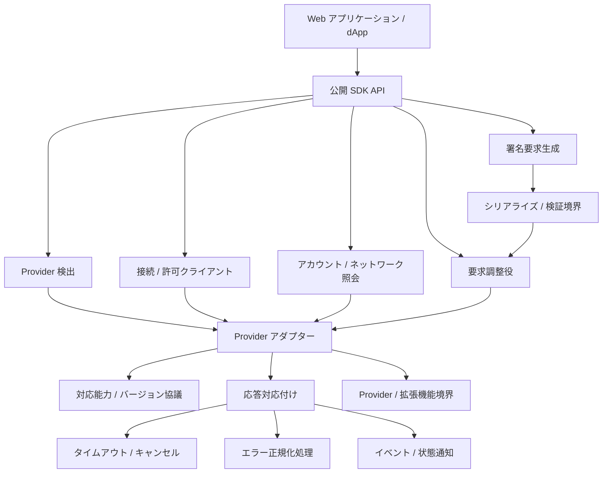

# MosaicLynx SDK 基本設計

## 1. 目的

本書は、MosaicLynx SDK を Web アプリケーション / dApp と MosaicLynx の信頼されたウォレット文脈の間に置く統合層として設計する。

SDK は Provider の利用可能性を確認し、接続・公開情報の利用・署名要求を開始し、要求と応答を対応付け、通信経路や Provider の差異を外部アプリケーションへ安全に伝える。SDK 自身は Web アプリケーションと同じアプリケーション文脈で動作し得るため、信頼された実行境界ではない。

SDK はウォレット、署名判断権限、信頼アンカー、トランザクション安全性 judge または Relay サーバーではない。SDK が侵害・改変・誤用されても、秘密鍵、ニーモニック、ウォレットストア、端末認証または wallet-core の暗号学的な操作へ到達できず、利用者の明示的承認を経ない署名へ直結しないことを設計目標とする。

## 2. 適用範囲と上位設計との関係

対象は SDK 固有の次の能力である。

- ブラウザ拡張機能または対応する MosaicLynx クライアントの検出・能力確認。
- 接続 / 許可要求と、許可された公開アカウント / ネットワーク情報の取得。
- トランザクション署名 / メッセージ署名要求の構築・送信・結果受信。
- Provider / 通信経路の抽象化、要求 / 応答対応付け、タイムアウト、キャンセルおよびエラー正規化。
- プロトコル / 対応能力バージョンの確認と、未対応の / 互換性のない状態の安全側処理。
- Web アプリケーションのページライフサイクル、Provider 接続解除、再接続および重複要求に対するクライアント側の状態管理。

本書は次の資料と合わせて適用する。

- [MosaicLynx アーキテクチャ設計](./architecture.md)
- [MosaicLynx 共通セキュリティ設計](./security-design.md)
- [MosaicLynx 署名フロー基本設計](./signing-flow.md)
- [MosaicLynx 共通データモデル・インターフェース基本設計](./interfaces.md)
- [MosaicLynx ブラウザ拡張機能基本設計](./browser-extension.md)
- [MosaicLynx モバイルアプリ基本設計](./mobile-app.md)
- [MosaicLynx Relay 基本設計](./relay.md)
- [MosaicLynx SDK 要件](../requirements/sdk.md)
- [MosaicLynx 共通要件](../requirements/requirements.md)
- [MosaicLynx ブラウザ拡張機能要件](../requirements/browser-extension.md)
- [MosaicLynx モバイルアプリ要件](../requirements/mobile-app.md)
- [MosaicLynx Relay 要件](../requirements/relay.md)
- [MosaicLynx コンセプトシート](../concept/concept-sheet.md)

コンセプト、要件、共通設計およびクライアント設計と本書が重なる場合、SDK の非特権境界、利用者承認、オリジンの信頼された文脈による検証、共通プロトコルおよび wallet-core 境界を優先する。本書は、Provider API、通信上のスキーマ、暗号形式、Signer の承認 UI または Relay プロトコルを再定義しない。

## 3. 設計前提

### 3.1 SDK の位置付け

SDK は次の論理位置にある。

```text
Web アプリケーション / dApp
        │ アプリケーション文脈の要求
        ▼
MosaicLynx SDK
        │ Provider / 統合境界
        ▼
ブラウザ拡張機能または対応するクライアント
        │ ローカル署名または対応受け渡し
        ├──────────────► wallet-core
        └──────────────► Relay ─────► モバイルアプリ
```

SDK は Web ページと同じ信頼ドメインに置かれ得る。SDK が正しく動作していること、Provider を検出できたこと、Provider が返した文字列または応答が存在することだけで、呼び出し元、オリジン、アカウント、署名対象または利用者承認を信頼してはならない。

### 3.2 共通操作

SDK v1 は要件に従い、トランザクション署名とメッセージ署名を別操作として扱う。SDK は両操作の要求組み立て、振り分け、対応付け、結果と失敗の伝達を担うが、署名対象の意味解析、表示、承認および生の署名は Signer 側の責任である。

アグリゲートトランザクション、マルチシグ、連署署名、トランザクション組み立て補助処理および第三者通信経路の公開範囲は、要件の未決事項を勝手に閉じない。対応対応能力が確認できない操作は、別操作、生の署名または別通信経路へ暗黙に変換しない。

### 3.3 チェーン / ネットワークの分離

Symbol と NEM、Mainnet と Testnet は SDK の要求、接続文脈、公開アカウント、対応能力および応答で明示的に区別する。SDK はチェーン固有のなトランザクションスキーマ、アドレス、ハッシュ、署名バイトまたはネットワーク定数を独自の共通表現へ置き換えず、各チェーンアダプター / 共通インターフェースの契約に従う。

## 4. SDK の責務と非責務

### 4.1 SDK が担う責務

- Provider の利用可能性、対応能力、対応済みのチェーン / ネットワークおよび互換性の確認。
- 接続 / 許可要求の開始と、Provider から得た許可結果の受信。
- 許可された公開アカウント / ネットワーク情報の取得と、アプリケーションに公開するな形式への受け渡し。
- 外部アプリケーションが作成した署名意図の要求組み立て、プロトコル境界への変換および送信。
- 要求識別情報の付与または共通契約に従った採用、応答対応付け、重複完了の抑止。
- タイムアウト、ローカルキャンセル、Provider 接続解除、ページライフサイクルおよび古くなった応答の安全側処理。
- Provider / Relay / 通信経路 / クライアント側の失敗を、外部アプリケーションが区別できる通信経路レベルの失敗分類を含む概念的エラー分類へ正規化すること。これは署名生成の結果または Signer 側の配送処理結果の区分を SDK が確定することを意味しない。
- Provider 応答の構造、バージョン、要求識別情報、操作、アカウント、チェーン / ネットワークおよび結果文脈の検証。
- 通信経路の違いを、意味を変えない範囲でアプリケーションに公開するな共通要求 / 応答モデルへ抽象化すること。
- 秘密情報を含まない最小限の状態通知・診断情報の提供。

### 4.2 SDK が担わない責務

SDK は次を担わない。

- 秘密鍵、ニーモニック、プロファイルパスワード、ウォレットストア、復号済み秘密情報、端末認証情報または秘密情報認証情報の要求・保持・復号・出力。
- ウォレットロック解除、端末認証、許可の最終付与、アカウント所有責任の最終認証または利用者の承認 / 拒否。
- トランザクション / メッセージの安全性の最終判断、人が読めるな信頼された表示、内容を確認しない署名の許可または署名対象の承認。
- 生の署名、wallet-core の暗号処理、鍵管理、秘密情報処理または署名済み結果の生成。
- 署名生成自体の結果、または Signer が保持する既知の署名済み結果の配送処理結果の区分の確定。
- Provider、Relay、通信経路状態、タイムアウト、応答欠如、接続解除、受信者オフライン、再接続失敗、配送失敗またはページライフサイクル消失から `RESULT_UNKNOWN` / `DELIVERY_UNKNOWN` を生成・推測・確定すること。
- ブラウザ拡張機能のブラウザで観測したオリジン / 許可判断権限、モバイルアプリの OS セキュリティ / 承認、Relay サーバーの経路選択 / 保持 / 操作。
- Symbol / NEM ノードの選択、アナウンス、残高・履歴その他の継続的なブロックチェーン状態管理。
- Provider、Relay、モバイルアプリまたは第三者通信経路を、SDK 単独の判断で信頼アンカーとすること。

SDK のクライアント側の検証は開発者 ergonomics とプロトコル安全性のための早期検出であり、Signer 側のセキュリティ検証、承認、表示または署名の代替ではない。

## 5. 論理コンポーネント構成


```mermaid
flowchart TB
    D[Web アプリケーション / dApp]
    P[公開 SDK API]
    F[Provider 検出]
    A[Provider アダプター]
    C[対応能力 / バージョン協議]
    M[接続 / 許可クライアント]
    Q[アカウント / ネットワーク照会]
    B[署名要求生成]
    R[要求調整役]
    K[応答対応付け]
    T[タイムアウト / キャンセル]
    E[エラー正規化処理]
    N[イベント / 状態通知]
    V[シリアライズ / 検証境界]
    W[Provider / 拡張機能境界]

    D --> P
    P --> F
    P --> M
    P --> Q
    P --> B
    P --> R
    F --> A
    A --> C
    M --> A
    Q --> A
    B --> V --> R
    R --> A
    A --> K
    K --> T
    K --> E
    K --> N
    A --> W
```

### 5.1 公開 SDK API

外部アプリケーションへ、利用可能性、接続 / 許可、公開アカウント、署名要求、応答、失敗、キャンセルおよび状態通知のアプリケーションに公開する契約を提供する。具体的な関数名、クラス、保証 / イベントの形式およびエクスポート対応表は下位仕様へ委譲する。

公開 API は秘密情報、ウォレットロック解除、信頼された承認 UI、Provider の特権を持つオブジェクトまたはブラウザ固有の内部 API を公開しない。

### 5.2 Provider 検出

Provider の存在、利用可能性および候補対応能力を検出する。Web ページのグローバルオブジェクト上の値、自己申告した provider 名、表示名または単なるオブジェクトの存在だけで正規性・許可・署名対応能力を確定しない。

偽の、競合、古い、部分的または不正な形式のな Provider が見える場合は、利用不可・不整合または検証失敗として扱う。検出は接続、アカウント情報公開または署名要求の開始を自動的に行わない。

### 5.3 Provider アダプター

Provider 固有の接続、要求振り分け、応答配送、接続解除およびイベントを、SDK の共通クライアントモデルへ接続する。Provider 内部のブラウザ API、内容橋渡し、拡張機能実行環境またはモバイル / Relay 受け渡しを公開 API へ直接露出しない。

Provider アダプターは、Provider の自己申告値を共通契約の入力として受け取るだけであり、オリジンの最終保証、署名承認またはウォレットの秘密情報境界を代替しない。

### 5.4 対応能力 / バージョン協議

SDK バージョン、Provider / プロトコルバージョン、対応操作、チェーン / ネットワーク、ローカル / リモート署名対応能力および必要な範囲の実行環境対応能力を確認する。対応能力は「できる可能性」を表す情報であり、個別要求の認可、アカウント許可、利用者承認または成功を意味しない。

不明、未対応の、互換性のないまたは判定不能な対応能力は安全側に利用不能 / 未対応のとする。古い契約を別操作、生の署名または insecure 代替経路へ自動変換しない。

### 5.5 接続 / 許可クライアント

接続の開始、公開情報の利用要求、許可の状態照会、接続解除 / 失効の連携を担う。接続、account/address 情報公開、署名要求を別の概念として扱い、Provider / ウォレット側の許可状態を正とする。SDK は許可を自己判断で付与・拡張・永続化する判断権限ではない。

### 5.6 アカウント / ネットワーク照会

許可された公開情報だけを取得し、アカウント、チェーン、ネットワーク、公開鍵、アドレスまたは対応能力のアプリケーションに公開する表現を提供する。秘密鍵、ニーモニック、ウォレットストア、ロック解除認証情報、端末認証情報、内部秘密情報識別子は扱わない。

公開情報のキャッシュは、最新の許可、アカウント所有責任、署名可能性または現在の Signer 状態の証明ではない。接続解除、失効、プロファイル / アカウント / ネットワーク文脈の変更後に古い公開情報を新しい署名要求の認可へ流用しない。

### 5.7 署名要求生成

外部アプリケーションの署名意図を、操作、チェーン / ネットワーク、アカウント文脈、要求識別情報、期限、送信元 / 依拠する文脈の結び付け情報およびプロトコル契約に沿った要求へ組み立てる。SDK が自動生成する補助説明、ラベルまたはメタデータは信頼されていない補足のデータであり、信頼された承認の根拠ではない。

生成は、入力形式、明らかな不整合、未対応の操作、チェーン / ネットワーク不一致およびプロトコル上の不足を早期に検出してよい。ただし検証通過は「安全」「承認済み」「署名可能」を意味しない。

### 5.8 要求調整役 / 応答対応付け

複数の要求を独立した要求識別情報、操作、Provider 文脈およびライフサイクルで管理する。応答は応答側の識別情報、元要求、Provider / セッション文脈、操作、アカウント、チェーン / ネットワークと対応付け、対応が確認できないものを成功として返さない。

### 5.9 タイムアウト / キャンセル

SDK 側の待機、要求状態、ローカルコールバック / 保証の終了を管理する。タイムアウトはウォレット側の署名の取消し、未署名または署名済みの確定を保証しない。Provider がキャンセルをサポートする場合も、SDK はその結果を別途確認し、取消し送信の受理を署名未実行の証明としない。

### 5.10 エラー正規化処理

Provider、ブラウザ拡張機能、モバイルアプリ、Relay、wallet-core および通信経路の差異を、外部アプリケーションが安全な制御を選択できる概念的分類へ変換する。内部スタック追跡、認証情報、秘密情報、パーサー内部情報または不要なプラットフォーム詳細を漏らさない。

### 5.11 イベント / 状態通知

Provider 利用可能性、接続状態、許可文脈、要求完了、接続解除および安全な失敗状態を通知し得る。通知は advisory なアプリケーションイベントであり、通知受信、接続イベントまたは対応能力イベントを承認・署名成功・オリジン検証済みの根拠にしない。

### 5.12 シリアライズ / 検証境界

SDK の内部モデルと共通プロトコル表現を分離し、interfaces.md の契約に従ってシリアライズ / 検証する。完全な通信上のスキーマ、正規エンコーディング、要求 ID 形式、暗号形式およびエラーコードは下位仕様へ委譲する。

## 6. 信頼境界

```text
信頼されていないアプリケーション文脈
  Web アプリケーション / dApp / SDK コード / Provider 応答 / ページデータ
              │ プロトコル入力; 持たない秘密情報または承認判断権限
              ▼
SDK 統合境界
  検出 / 対応能力 / 要求組み立て / 対応付け / 正規化
              │ validated 契約入力, 引き続きではない信頼されたウォレット文脈
              ▼
Provider / 公開統合境界
  ブラウザ拡張機能公開 Provider または対応済みのクライアント契約
              │ ブラウザで観測したオリジンと許可 are 検証済み by ウォレット側
              ▼
MosaicLynx 信頼されたホスト境界
  ブラウザ拡張機能 / モバイルアプリ
  要求検証 / 内容検査 / 信頼された UI / 利用者承認 / 署名処理の調整
              │ 承認済み生の対象のみ
              ▼
wallet-core 境界
  秘密情報処理 / 暗号学的な操作 / 生の署名
```

SDK が Provider から返されたデータを解析、型検査または対応付けしたとしても、Provider の正規性、オリジンの真正性、アカウント所有責任、トランザクション安全性または利用者承認を保証したことにはならない。ブラウザ拡張機能は実際に観測したオリジン、ブラウザ文脈、許可、承認 UI および wallet-core 境界を管理し、モバイルアプリは受け渡しセッション、送信元、端末認証、信頼された UI および署名を管理する。

SDK はモバイルアプリ、Relay または wallet-core と直接秘密情報 / 特権を持つチャネルを持たない。Relay を利用するリモート署名でも、SDK は Relay の内容を解釈しない通信経路を通じて要求 / 応答を扱うだけであり、Relay の配送成功を信頼アンカーとしない。

## 7. Provider 抽象化 / 検出 / 対応能力

### 7.1 Provider の抽象責務

Provider は概念上、次を提供し得る。

- 利用可能性 / 検出情報。
- 対応能力 / バージョン情報。
- 接続 / 許可要求の振り分け。
- 公開アカウント / ネットワーク情報の応答。
- 署名要求の振り分けと応答配送。
- 接続解除、セッション状態または対応するイベント通知。

Provider は、SDK に private 文脈、Vault、秘密鍵、承認状態または wallet-core API を公開してはならない。Provider の具体的な注入されたオブジェクト、内容橋渡し、拡張機能実行環境、OS リンクまたは通信経路アダプターは Provider / プラットフォーム下位仕様へ閉じ込める。

### 7.2 Provider 検出

Provider の検出と許可 / アカウント情報公開 / 署名を分離する。

- Provider が存在するだけでは、アカウント情報の自動開示を開始しない。
- Provider 検出は接続や署名許可を意味しない。
- 偽の、競合する、不正な形式の、部分実装または互換性のない Provider を利用可能と報告しない。
- Provider が応答しない、必要な対応能力を返さない、バージョンを確認できない場合は利用不能 / 互換性のないとして扱う。
- Provider の表示名、アイコン、Web ページのグローバルオブジェクトまたは自己申告オリジンを信頼アンカーにしない。

Provider の候補が複数見える場合の選択ポリシーは、要件が明示する範囲を超えて決めない。意図しないウォレットへ要求を送らないため、選択できない・選択結果を確認できない状態では自動送信しない。

### 7.3 対応能力

対応能力は、必要最小限の粒度で次のような「対応可能性」を示す。

- 接続 / 公開アカウント情報公開。
- トランザクション署名 / メッセージ署名。
- 対応済みのチェーン / ネットワーク。
- ローカル署名または対応するリモート受け渡し。
- Provider / プロトコルバージョン。

対応能力は許可、個別要求の適用可否、アカウント所有責任、ロック解除、承認または成功結果を意味しない。対応能力の情報が古くなった、矛盾または未検証の場合は、必要な操作を開始せず再確認または安全側の失敗とする。

## 8. 接続 / 許可モデル

### 8.1 接続

SDK の接続は、Provider が利用可能で、外部アプリケーションとウォレット側の公開統合文脈が成立し、許可協議が可能な状態を表す。接続は次を意味しない。

- 署名承認、ウォレットロック解除または端末認証。
- アカウント所有責任証明または permanent 認可。
- すべてのチェーン / ネットワーク、アカウント、操作または通信経路の利用許可。
- 現在も有効な許可、保留中の要求または署名結果。

接続ライフサイクルと許可ライフサイクルは分離する。接続解除、Provider 再読み込み、ページ再読み込み、ブラウザ再起動、プロファイル / アカウント / ネットワーク変更またはセッション有効期限後に、SDK は古い接続を新しい要求の判断権限として使わない。

### 8.2 許可

許可は Provider / ウォレット側が管理し、少なくとも次の概念を区別できる構造とする。

| 概念                     | 意味                                  | SDK の扱い                                   |
| ------------------------ | ------------------------------------- | -------------------------------------------- |
| 接続                     | Provider / ウォレットと連携可能な状態 | 開始・状態伝達を行うが、署名許可とはしない   |
| account/address 情報公開 | 許可された公開アカウント情報の利用    | 許可結果だけを受け取り、秘密情報を要求しない |
| 署名要求                 | 個別要求を Signer に送ること          | 要求ごとに Signer 側の明示承認を必要とする   |

SDK は許可を自己判断で付与、拡張、永続化または別オリジン / 文脈へ流用しない。許可状態が不明、期限切れ、失効済みまたは接続文脈と一致しない場合は要求を署名成功へ進めない。

### 8.3 接続解除 / 失効

接続解除または失効は、新しい公開情報・署名要求が旧許可に依存しないようにする。SDK 内の一時状態、保留中の要求、応答ハンドラー、公開情報キャッシュは、対応する文脈とともに無効化する。SDK のローカル状態を削除したことだけでウォレット側許可が失効されたと推測せず、Provider の結果を正とする。

## 9. オリジン / 依拠する文脈

SDK は Web アプリケーション文脈の中で動作するため、SDK が観測したオリジン、ホスト、referrer、URL、呼び出し元名、アプリケーションラベルまたは dApp の自己申告をセキュリティ判断権限としない。

オリジンに関する責任を次のように分ける。

| 情報・判断                          | SDK                                | ブラウザ拡張機能 / ブラウザプラットフォーム | モバイルアプリ / プラットフォーム              |
| ----------------------------------- | ---------------------------------- | ------------------------------------------- | ---------------------------------------------- |
| アプリケーションが自己申告した文脈  | 要求の補助情報として扱う           | 信頼されていない入力として再確認            | 受け渡しの補助情報として再確認                 |
| ブラウザが観測した実オリジン / 文脈 | 受け渡し情報を扱い得るが保証しない | 最終検証、オリジンとの結び付け、許可適用    | 該当しない。受け渡し送信元の検証を担う         |
| 受け渡しセッション / 意図した受信者 | 対応付け情報として扱う             | 自経路のセッションを検証                    | セッション、受信者、完全性、期限切れを最終検証 |
| 検証済みオリジン / 呼び出し元の判断 | 表明しない                         | 信頼された文脈で判断                        | 対応するモバイル / プラットフォーム契約で判断  |

SDK が Provider へ呼び出し元 / オリジン情報を渡す場合も、「SDK が信頼したオリジン」としてではなく、Signer が自分の信頼された文脈で検証するための要求文脈として扱う。オリジン証明、ノンス、ブラウザ API、OS API および暗号学的な結び付けの具体方式は下位仕様へ委譲する。

## 10. アカウント / ネットワーク公開

SDK が外部アプリケーションへ返す情報は、Provider / ウォレット側で明示的に許可された公開情報に限定する。対象には次を含み得るが、最終的な公開契約はインターフェース / Provider 仕様に従う。

- チェーン / ネットワーク。
- アドレス、公開鍵、アカウント識別子または公開プロファイル文脈。
- 対応対応能力。

SDK は次を要求・保持・返却しない。

- 秘密鍵、ニーモニック、ウォレットパスワード、プロファイルパスワード、ウォレットストアまたは復号済みウォレットストア。
- ウォレットストア暗号化鍵、端末認証情報、ロック解除トークンまたは E2E セッション秘密情報。
- 秘密情報の導出・復号結果、内部的な鍵識別子または不要なプロファイルメタデータ。

アカウント情報公開は許可、オリジン / 依拠する文脈、チェーン / ネットワークおよび接続に結び付けする。公開アカウント情報を取得できたこと、キャッシュに存在すること、公開鍵が得られたことを、現在の許可、アカウント所有責任、署名承認または最新の Signer 状態の証明としない。

SDK はノード状態、残高、履歴またはアナウンスを標準責務に含めない。外部アプリケーションが必要なネットワーク処理と署名結果の独立検証を行う。

## 11. 署名要求処理

### 11.1 概念フロー

```text
APPLICATION_REQUEST
  → SDK_INPUT_CHECK
  → REQUEST_CONSTRUCTED
  → PROVIDER_DISPATCHED
  → PENDING
  → RESPONSE_VALIDATED
  → RESOLVED / REJECTED / FAILED
```

これは SDK の受け渡しライフサイクルであり、Signer の共通署名ライフサイクルを置き換えない。Signer 側では、要求の検証、内容検査、信頼された UI、明示的承認、必要な認証、wallet-core 署名および結果生成を行う。SDK は `AUTHORIZED`、`SIGNING` または `SUCCEEDED` を自ら生成しない。

### 11.2 要求組み立て

SDK は外部アプリケーションが指定した操作、チェーン / ネットワーク、アカウント文脈、署名対象、要求識別情報、必要な期限および送信元 / 依拠する文脈を共通契約に沿って Provider へ渡す。

SDK はトランザクションまたはメッセージの安全性を判定しない。トランザクション / メッセージの意味上の内容検査、アグリゲート内部トランザクション、連署署名対象、表示可能性、内容を確認しない署名の可否および承認との結び付けはブラウザ拡張機能 / モバイルアプリとチェーン統合の責任である。

SDK が受け取る表示テキスト、ラベル、説明、アイコン、受信者名または数量の説明は補足の / 信頼されていないメタデータとする。これらを信頼された承認 UI の表示根拠や、ペイロードの代替にしない。

### 11.3 クライアント側の検証

SDK は不正な形式の入力、未対応の操作、明らかなチェーン / ネットワーク不一致、必須文脈の欠落、サイズまたはシリアライズの異常を送信前に検出してよい。これは開発者体験、通信節約およびプロトコル robustness のための検証である。

SDK の検証を通過した要求でも、Signer は呼び出し元、許可、アカウント、チェーン / ネットワーク、ペイロード完全性、意味上の安全性、表示内容、明示承認および wallet-core 入力を再検証する。SDK は検証済みを安全・承認済み・署名可能として外部へ表明しない。

### 11.4 トランザクション / メッセージ操作

トランザクション署名とメッセージ署名は操作識別情報を保ったまま振り分けする。未対応のトランザクション型 / バージョン、アグリゲート、マルチシグ、連署署名、メッセージ形式またはチェーン / ネットワークを、別操作、生の署名、警告付き内容を確認しない署名または別通信経路へ自動変換しない。

Signer が確認・承認した対象と応答が対応しない、または SDK が対応を検証できない場合、SDK は成功を返さず不一致 / 完全性失敗とする。SDK は「署名が安全だった」ことや、署名結果のネットワーク的な有効性を単独で保証しない。

## 12. 要求識別情報 / 対応付け

SDK は各要求を、少なくとも要求識別情報、操作、Provider / 接続文脈およびライフサイクルにより独立して扱う。具体的な識別子形式、ダイジェスト、シリアライズおよび対応付けフィールドは interfaces.md と下位仕様へ委譲する。

応答成功を返すには、次の対応を確認できなければならない。

- 応答が意図した要求識別情報に対応する。
- 応答の操作が要求と一致する。
- Provider / セッション / 接続文脈が現在の要求に対応する。
- アカウント、チェーン / ネットワーク、Signer 文脈および必要な対象結び付けが一致する。
- 応答が重複、古くなった、期限切れ、キャンセル済み、再送されたまたは別要求のものではない。

対応を確認できない応答、遅延応答、重複応答またはセッションをまたぐ応答は適用せず、成功推測も行わない。要求識別情報の衝突、同一識別情報で内容が変化した要求、応答の対応付け不一致は安全側に終了する。

SDK の対応付けはアプリケーションの最終的な署名結果検証を代替しない。外部アプリケーションも、返された署名結果を元要求と独立に検証する。

## 13. 要求ライフサイクル

SDK の基本ライフサイクルは次のとおりとする。

```text
CREATED
  → VALIDATING
  → DISPATCHED
  → PENDING
  → RESOLVED

CREATED / VALIDATING / DISPATCHED / PENDING
  → REJECTED / FAILED / TIMED_OUT / CANCELLED / CONTEXT_LOST
```

- `CREATED`: 外部アプリケーションが署名意図を SDK に渡した状態。
- `VALIDATING`: SDK が入力、対応能力、接続文脈およびプロトコル境界を確認している状態。
- `DISPATCHED`: Provider へ一度だけ送信した状態。送信受理は署名開始・承認を意味しない。
- `PENDING`: Provider / Signer からの応答を待つ状態。
- `RESOLVED`: 応答の対応付けと必要な構造検証が完了し、外部アプリケーションへ結果を返せる状態。
- `REJECTED`: 利用者拒否、許可拒否または Provider 側の拒否を、成功と区別して返す終端状態。
- `FAILED`: 無効な、未対応の、不一致、通信経路、Provider または内部失敗の終端状態。
- `TIMED_OUT`: SDK の待機期限を超えた状態。ウォレット側の処理結果は確定しない。
- `CANCELLED`: SDK または Provider のキャンセル契約により待機を終了した状態。
- `CONTEXT_LOST`: ページ、Provider、接続、セッション、許可またはチェーン / ネットワーク文脈が失われた状態。

一つの要求は一度だけ終端処理し、重複完了を無視または安全な重複として扱う。終端後に同じ要求、承認、応答ハンドラー、許可または接続状態を新しい要求へ再利用しない。

SDK のライフサイクルは Signer の `RECEIVED`、`VALIDATED`、`INSPECTED`、`AWAITING_USER`、`AUTHORIZED`、`SIGNING`、`SUCCEEDED` 等の共通署名ライフサイクルを保持しない。SDK が `PENDING` を保持していても、ウォレット側の承認 / 署名状態を知っていることを意味しない。

## 14. タイムアウト / キャンセル

### 14.1 タイムアウト

SDK は indefinitely 保留中のなアプリケーション待機を避けるため、要求ごとに下位仕様で定める期限ポリシーを適用する。具体的なタイムアウト値、操作ごとの差、timer 実装および再試行タイミングは定めない。

タイムアウト後は SDK の待機と応答適用を終了し、遅れて届いた応答を別要求へ適用しない。タイムアウトは次を保証しない。

- Signer が要求を受信していないこと。
- ウォレット側の承認が閉じられたこと。
- 端末認証が行われていないこと。
- 署名が未実行であること。
- すでに生成された署名済み結果が存在しないこと。

したがってタイムアウト後に SDK は「未署名」「署名済み」または「安全に再送可能」と推測しない。再試行を行う場合は、共通仕様に従って新しい要求と新しい検証 / 承認を必要とする。

### 14.2 キャンセル

キャンセルは少なくとも SDK のローカル待機、応答ハンドラーおよび要求状態を終了させる意味を持つ。Provider がプロトコル上のキャンセル要求を提供する場合、SDK はそれを明示的な通信経路操作として送信してよいが、受理・送信・配送をウォレット側のキャンセル完了と同一視しない。

SDK は一方的なキャンセルにより、Signer がすでに承認・署名した可能性を否定しない。キャンセル後の遅延応答、署名済み結果または Signer が生成した `RESULT_UNKNOWN` / `DELIVERY_UNKNOWN` は現在の要求文脈に適用せず、下位仕様の失敗 / 復旧契約に従う。

利用者拒否、不一致、完全性失敗、呼び出し元 / オリジン失敗またはリプレイ失敗を、自動再試行、別 Provider または別通信経路代替経路で迂回しない。通信経路利用不能の再接続や、利用者が明示した新規操作の開始とは区別する。

## 15. 応答 / エラーモデル

### 15.1 応答処理

SDK は成功、利用者拒否、許可拒否、未対応の、互換性のないバージョン、アカウントロック済み、誤ったネットワーク、タイムアウト、接続消失、通信経路失敗、内部失敗および Signer が生成した `RESULT_UNKNOWN` を、要求識別情報とともに受け取ることがある。また、Signer が既知の署名済み結果を保持している場合の Signer 側の `DELIVERY_UNKNOWN` を配送処理結果の区分として受け取ることがある。SDK がこれらを受け取る場合も、要求 / 応答対応付けを確認し、意味を変更せずアプリケーション側へ伝達する。

`RESULT_UNKNOWN` は署名生成自体の結果を Signer が安全に確定できない場合だけ、`DELIVERY_UNKNOWN` は Signer が既知の署名済み結果の配送処理結果の区分を安全に確定できない場合だけ成立する。SDK は Provider、Relay、ネットワーク、通信経路、タイムアウト、応答欠如、接続解除、受信者オフライン、再接続失敗、配送失敗、ページライフサイクル消失または SDK 内部状態から、いずれの処理結果の区分も生成・推測・確定しない。

成功は、要求、操作、Signer、アカウント、チェーン / ネットワーク、対応付けおよび Signer が確認・承認した対象との対応を SDK が確認でき、外部アプリケーションが結果を独立検証できる正常完了を表す。Provider、Relay またはモバイルアプリが成功応答を返しただけでは成功としない。

### 15.2 概念的エラー分類

| 分類                                     | 意味                                                                                                 | SDK の基本処理                                                                           |
| ---------------------------------------- | ---------------------------------------------------------------------------------------------------- | ---------------------------------------------------------------------------------------- |
| 利用不能                                 | Provider、MosaicLynx、モバイルアプリまたは対応対応能力が利用できない                                 | 署名成功にせず、利用不可として終了                                                       |
| 接続 / 許可                              | 未接続、接続対象範囲不一致、許可拒否、失効                                                           | 古い許可 / アカウントを流用せず終了                                                      |
| 利用者拒否                               | 利用者が拒否、承認 UI を閉じた、または署名を取消した                                                 | システム失敗と混同せず、自動再試行 / 代替経路しない                                      |
| 無効な要求                               | アプリケーション入力、形式、サイズ、文脈またはプロトコル検証が不正                                   | 要求を送らない、または失敗として終了                                                     |
| 未対応の / 互換性のない                  | 操作、チェーン、ネットワーク、形式、バージョン、Provider 対応能力が非対応                            | 別操作 / 生の署名 / 安全でない代替経路に変換しない                                       |
| 不一致 / 完全性 / リプレイ               | 呼び出し元、オリジン、アカウント、チェーン / ネットワーク、要求 / 応答、ペイロードまたは鮮度の不一致 | 自動再送せず、セキュリティ失敗として終了                                                 |
| タイムアウト / 期限切れ / キャンセル済み | SDK 待機、要求期限切れ、文脈消失またはキャンセル                                                     | 遅延応答を適用せず、署名状態を推測しない                                                 |
| 通信経路 / relay                         | Provider、Relay、ネットワーク、受け渡しまたは配送の失敗                                              | 通信経路レベルの失敗分類として扱い、署名結果または Signer 側の処理結果の区分へ昇格しない |
| ウォレット側の / 内部                    | Signer、wallet-core、SDK または依存コンポーネントの内部失敗                                          | 秘密情報 / スタック追跡を漏らさず、安全側に終了                                          |

具体的なエラーコード、例外クラス、メッセージ文言、HTTP 状態、再試行回数および再試行間隔は下位仕様へ委譲する。外部アプリケーションが必要な分類を失わない範囲で、Provider / プラットフォーム固有エラーの詳細を過度に公開しない。

`RESULT_UNKNOWN` と `DELIVERY_UNKNOWN` は通信経路 / エラー分類ではない。前者の責任主体は署名生成自体の結果を扱う Signer、後者の責任主体は既知の署名済み結果の配送処理結果の区分を扱う Signer である。SDK は実際に取得した Signer が生成した処理結果の区分の対応付けと意味不変の伝達だけを担い、Relay / 通信経路失敗から両処理結果の区分を作らない。

## 16. 並行処理 / 接続消失 / ページライフサイクル

### 16.1 並行処理

SDK は同時に複数要求を扱える前提とする。アカウント照会、接続、トランザクション署名、メッセージ署名、キャンセルおよび応答を単一のグローバル状態に混在させない。

次を要求単位で分離する。

- 要求識別情報、操作、アカウント、チェーン / ネットワーク、Provider / 接続文脈。
- タイムアウト、キャンセル、完了ハンドラーおよびエラー状態。
- 応答対応付け、許可スナップショットおよびページライフサイクル文脈。

キュー、同一処理の重複実行抑止、並列振り分け、per-Provider 順序および負荷制御の具体方式は下位仕様へ委譲する。ただし、別要求の応答、アカウント照会、キャンセル、許可または承認状態を流用してはならない。

### 16.2 接続消失 / 再接続

Provider 接続解除、拡張機能再読み込み、ブラウザ再起動、タブページ遷移、ページ再読み込み、SDK 再初期化またはセッション有効期限が起きた場合、SDK は保留中の要求を自動的に成功へ復元しない。再接続は新しい Provider / 接続文脈の再確認であり、以前の承認、認証、保留中の要求または署名済み結果の復元を意味しない。

新しい SDK インスタンスが古い応答を受け取った場合、要求識別情報、文脈、期限切れおよびセッションを検証し、対応しなければ破棄または古くなった失敗とする。古い接続の応答を新しい接続の要求に対応付けない。

### 16.3 ページライフサイクル

ページ負荷、unload、ページ遷移、タブ終了、BFCache 等のブラウザライフサイクルと重複 SDK 初期化を考慮する。ページライフサイクルをまたいで保留中の承認、許可、署名済み結果または要求識別情報を危険な形で自動復元しない。

ページが破棄・遷移された場合、SDK のローカル waiting を終了し、文脈消失した / 通信経路失敗分類として扱う。これは Signer 側の `RESULT_UNKNOWN` / `DELIVERY_UNKNOWN` ではなく、SDK はページライフサイクル消失から署名結果または配送処理結果の区分を推測・確定しない。ページ文脈の喪失は未署名の、署名済み、署名失敗、`RESULT_UNKNOWN` または `DELIVERY_UNKNOWN` のいずれの証明でもない。復元を行う場合も、古い要求 / 応答を再利用せず、新しいアプリケーション文脈と新しい要求として開始する。

## 17. ローカル / リモート署名抽象化

SDK は、ブラウザ拡張機能への直接連携と、Provider / Relay を通じたモバイルアプリ連携を、可能な範囲で共通の要求 / 応答意味として外部アプリケーションへ提供する。

```text
ローカル:
  SDK → Provider → ブラウザ拡張機能 → wallet-core

リモート:
  SDK → Provider / 受け渡しクライアント → Relay → モバイルアプリ → wallet-core
```

共通化する対象は操作、要求識別情報、アカウント / チェーン / ネットワーク文脈、成功 / 拒否 / 失敗の意味、Signer が生成した処理結果の区分の意味および結果の相関である。共通化してはならない、または完全には隠せない差異は、遅延、利用可能性、セッション establishment、利用者有効化、ページ / アプリライフサイクル、タイムアウト、キャンセル、結果配送および通信経路 / 受け渡し失敗分類である。ローカル / リモートの通信経路差異は `RESULT_UNKNOWN` / `DELIVERY_UNKNOWN` の生成根拠にならない。

SDK はリモート署名のために Relay サーバーの内部プロトコル、認証情報、セッションストアまたはモバイルアプリの特権を持つインターフェースを直接公開しない。Relay が利用できない場合は通信経路 / 受け渡し失敗分類として扱い、署名成功、`RESULT_UNKNOWN` または `DELIVERY_UNKNOWN` に変換しない。モバイルアプリ未提供・未対応の対応能力も利用可能として報告しない。

Signer が既知の署名済み結果を保持している場合の配送失敗では、既存結果の再配送、再送、取得または照会を候補とする。これらは応答配送の回復であり署名再試行ではないため、既知の結果の配送失敗から再署名しない。具体的な配送・照会契約は下位仕様へ委譲する。

ローカルが失敗したからリモートへ、リモートが失敗したからローカルへ自動代替経路する設計は、利用者拒否、許可 / 認可失敗、不一致、完全性、呼び出し元、リプレイ失敗、`RESULT_UNKNOWN` または `DELIVERY_UNKNOWN` を迂回し得るため通常の安全動作としない。通信経路失敗を署名再試行に変換せず、Provider A 失敗から Provider B 署名への自動切替もしない。明示的な通信経路選択の範囲は要件の未決事項として扱う。

## 18. バージョン管理 / 互換性 / シリアライズ

### 18.1 バージョン管理

SDK バージョン、Provider / プロトコルバージョン、対応能力バージョンおよび対応する Signer / モバイル / Relay バージョンの関係を、要求された範囲で確認する。バージョンの一致だけを対応能力の根拠にせず、操作、チェーン / ネットワーク、通信経路および必要なセキュリティプロパティを確認する。

不明、未対応の、互換性のないまたは判定不能なバージョンは安全に拒否または利用不能とする。バージョン不一致を旧操作、生の署名、許可迂回、オリジン迂回または別通信経路の成功へ代替経路しない。

### 18.2 後方互換性

互換性を提供する場合も、操作の意味、チェーン / ネットワーク境界、明示的な承認、要求 / 応答結び付け、秘密情報の分離および安全側での終了を維持する。不明フィールド、不明アルゴリズム、非推奨の操作、古い許可モデルまたは古い応答を危険に無視しない。

対応済みのバージョンの範囲、互換性対応表、非推奨化ポリシー、移行およびリリース運用は未決事項・下位仕様へ委譲する。

### 18.3 シリアライズ境界

SDK の内部モデル、アプリケーションに公開するモデルおよび共通プロトコル表現を分離する。シリアライズ / deserialization の前後で操作、要求識別情報、チェーン / ネットワーク、アカウント、ペイロード結び付けおよび期限切れの意味を変えない。

SDK は interfaces.md のプロトコル意味を再定義せず、完全な JSON スキーマ、通信上のエンコーディング、正規シリアライズ、要求 ID 形式、エンベロープ、署名形式およびエラーコードを下位仕様へ委譲する。検証できない形式、曖昧なバージョンまたは意味を保てない変換は拒否する。

## 19. 秘密情報 / ログ出力 / 実行環境ポリシー

### 19.1 秘密情報処理

SDK は秘密情報資料を一切要求・保持・復号・導出・ログ出力しない。SDK のオブジェクト、URL、照会、イベント、コールバック、Provider メッセージ、キャッシュ、例外、デバッグ出力または遠隔計測データに、秘密鍵、ニーモニック、パスワード、ウォレットストア、復号済み秘密情報、端末認証トークン、E2E 秘密情報または認証情報生の値を含めない。

wallet-core は信頼されたウォレットコンポーネント内部の暗号学的な境界であり、SDK が直接暗号学的な署名 API を Web アプリケーションへ公開する構造にしない。SDK が Provider 応答として受け取る署名済み結果は、秘密情報ではない範囲で扱い、外部アプリケーションによる独立検証を前提とする。

### 19.2 ログ出力 / 遠隔計測データ

診断は既定で最小限とし、必要に応じて利用者・運用者が明示的に有効化できる範囲に限定する。記録し得るのは Provider 利用可能性、対応能力不一致、要求状態、通信経路状態および抽象化した失敗分類等の非秘密情報とする。

生の署名ペイロード、全体トランザクション / メッセージ、署名結果、秘密鍵、ニーモニック、パスワード、承認詳細、オリジン、アカウント識別子の不要な組合せ、セッション秘密情報、認証情報および内部スタック追跡を恒常的に記録しない。SDK のログ出力を有効にしても、セキュリティ検証、承認、秘密情報の分離または応答結び付けを弱めない。

### 19.3 基盤 / 実行環境境界

SDK コアは React、Vue、Angular または特定 UI 基盤に依存しない。基盤アダプター、フック、plugin、イベント実装および UI 補助処理は必要な場合も別パッケージ / 下位仕様へ委譲し、公開 SDK API に信頼された承認 UI を持ち込まない。

初期対象は browser-based Web アプリケーション / TypeScript / JavaScript エコシステムとするが、正式対応実行環境、ブラウザ対象範囲、Node.js、SSR、Web ワーカーおよびモバイル実行環境の扱いは要件の未決事項に従う。ブラウザオリジン、利用者有効化、ページライフサイクルまたは Provider 利用可能性を必要とする機能を、サーバー側の実行環境でも同じ保証があるように表明しない。

配布形態、モジュール形式、パッケージエクスポート、バンドラー、依存関係、成果物完全性およびリリース証跡の詳細は下位仕様・リリースポリシーへ委譲する。SDK がリモートコードを実行時取得してセキュリティプロパティを成立させる設計にしない。

## 20. 責任分界

| 主体                        | 担う責任                                                                                                                                     | SDK との境界                                                                           |
| --------------------------- | -------------------------------------------------------------------------------------------------------------------------------------------- | -------------------------------------------------------------------------------------- |
| Web アプリケーション / dApp | 署名意図の生成、SDK 利用、結果の独立検証、必要なネットワーク処理                                                                             | SDK の結果を信頼アンカーとせず、秘密情報を渡さない                                     |
| SDK                         | 検出、対応能力 / バージョン、接続 / 許可クライアント、公開情報、要求組み立て、振り分け、対応付け、タイムアウト / キャンセル、エラー正規化    | ウォレット、承認主体、オリジンの信頼性判断、署名判断権限ではない                       |
| ブラウザ拡張機能            | ブラウザで観測したオリジン、許可判断権限、アカウント情報公開判断権限、信頼された承認 UI、端末 / ロック解除、署名処理の調整、wallet-core 統合 | SDK は公開 Provider 境界だけを利用し、private 文脈へ入らない                           |
| モバイルアプリ              | 受け渡し / 送信元検証、OS セキュリティ、端末認証、信頼された承認 UI、アカウント / ネットワーク、署名、応答世代                               | SDK はモバイルの特権を持つチャネル、Relay 検証、安全な保存領域を直接制御しない         |
| Relay                       | 内容を解釈しない通信経路、セッション / 経路選択、短期配送、有効期限、接続ライフサイクル                                                      | SDK は Relay を信頼アンカー、意味上の検証器、Signer として扱わない                     |
| wallet-core                 | 秘密情報処理、ウォレットストア、暗号学的な操作、生の署名                                                                                     | SDK / Web アプリケーションへ直接公開せず、信頼されたウォレットコンポーネント内部に置く |
| インターフェース            | 要求 / 応答意味、操作、識別情報 / 対応付け、バージョン管理、共通プロトコル                                                                   | SDK は独自通信上の契約を作らず、共通契約を適用する                                     |

接続済み、対応能力あり、Relay 配送済み、Provider 成功または SDK 解消済みは、利用者承認、署名成功、オリジン検証済み、アカウント所有責任またはトランザクション安全性を意味しない。

## 21. 失敗 / 復旧

| 状況                                         | SDK の基本処理                                                                                  | 禁止する復旧                                                                                 |
| -------------------------------------------- | ----------------------------------------------------------------------------------------------- | -------------------------------------------------------------------------------------------- |
| Provider 利用不能 / 互換性のない             | 利用不能 / 互換性失敗として終了                                                                 | 未検証 Provider、別操作または安全でない代替経路の自動利用                                    |
| 許可拒否済み / 失効済み                      | 許可失敗として終了し、古い公開情報を無効化                                                      | 接続済み・キャッシュ・対応能力による権限の推測                                               |
| 不正な形式の / 未対応の要求                  | 要求を送らず無効な / 未対応のとする                                                             | 生の署名、警告だけの迂回、別操作への変換                                                     |
| 利用者拒否                                   | 拒否として返す                                                                                  | 自動再試行、別通信経路、別 Provider による迂回                                               |
| タイムアウト / キャンセル                    | ローカル待機を終え、遅延応答を適用しない                                                        | 未署名・署名済みの推測、古い承認の再利用                                                     |
| Provider 接続解除 / ページライフサイクル消失 | 文脈消失した / 通信経路失敗として終了                                                           | 古くなった要求、許可、承認、応答の自動復元                                                   |
| 応答不一致 / リプレイ / 重複                 | 応答を破棄またはセキュリティ失敗とする                                                          | 要求識別情報を無視した適用・再送                                                             |
| Relay / リモート受け渡し失敗                 | 通信経路 / 受け渡し失敗分類として終了                                                           | Relay 成功、署名結果または Signer 側の処理結果の区分の推測、ローカル署名への無断代替経路     |
| Signer が生成した `RESULT_UNKNOWN`           | Signer が署名生成自体の結果を確定できない処理結果の区分を、対応付け後に意味不変で伝達           | 自動再署名、同じ要求の再開、別通信経路 / Provider / Signer への自動代替経路                  |
| Signer 側の `DELIVERY_UNKNOWN`               | Signer が既知の署名済み結果の配送処理結果の区分を確定できない場合に、対応付け後に意味不変で伝達 | 既知結果の再署名、`RESULT_UNKNOWN` への変換、別通信経路 / Provider / Signer への自動代替経路 |
| ウォレット側の / 内部失敗                    | エラー分類を正規化し、安全側に終了                                                              | スタック追跡、秘密情報、内部状態の漏洩                                                       |

Relay / Provider / 通信経路失敗だけでは、`RESULT_UNKNOWN` も `DELIVERY_UNKNOWN` も成立しない。Signer が生成した処理結果の区分を実際に取得できた場合だけ、SDK は要求識別情報、応答対応付けおよび文脈を確認し、意味を変更せずアプリケーション側へ伝達する。SDK の通信経路状態、応答欠如、タイムアウト、接続解除、受信者オフライン、再接続失敗、配送失敗またはページライフサイクル消失から処理結果の区分を生成・推測・確定しない。

既知の署名済み結果に対する配送問題の候補は再配送、再送、取得または照会であり、署名再試行とは分離する。既知の結果の配送失敗、`RESULT_UNKNOWN`、`DELIVERY_UNKNOWN` または通信経路失敗から自動再署名を行わない。自動再試行を行う場合も、利用者拒否、セキュリティ / 不一致 / 完全性 / 呼び出し元 / リプレイ失敗および許可 / 認可失敗を対象外とし、許可 / 認可失敗を通信経路再試行に変換しない。ローカル失敗 → リモート署名、リモート失敗 → ローカル署名、Provider A 失敗 → Provider B 署名の自動代替経路も行わない。

新しい署名操作が必要な場合は、同じ結果や通信経路状態を再利用せず、新しい要求、認証、署名可能な状態へのロック解除、アカウントの利用認可および利用者による明示的な承認を新たに成立させる。

## 22. SDK セキュリティ上の不変条件

1. SDK は秘密鍵、ニーモニック、パスワード、ウォレットストア、復号済み秘密情報、端末認証情報または E2E 秘密情報を要求・保持・出力しない。
2. SDK はウォレット、署名判断権限、署名結果正確性 / 処理結果の区分判断権限、利用者承認判断権限、トランザクション検証器または信頼アンカーではない。
3. Provider 検出は接続、許可、アカウント情報公開、ロック解除、承認または署名対応能力の確定を意味しない。
4. 対応能力は認可、アカウント所有責任、利用者承認または個別要求の成功を意味しない。
5. 接続、account/address 情報公開、署名要求および利用者承認を分離する。
6. オリジン / 呼び出し元の最終セキュリティ結び付けはブラウザ拡張機能 / ブラウザプラットフォームまたはモバイルアプリ / プラットフォームの信頼された文脈が担い、SDK の自己申告・観測を判断権限としない。
7. SDK 検証は Signer 側の要求検証、意味上の内容検査、信頼された表示、明示的承認および wallet-core 署名の代替ではない。
8. SDK-provided 表示テキスト、ラベル、アイコンまたは説明は信頼された署名表現ではない。
9. 要求、応答、操作、アカウント、チェーン / ネットワーク、Provider 文脈および必要な対象結び付けは一意に対応付けする。
10. 古くなった、重複、再送された、期限切れ、キャンセル済みまたは別要求の応答を現在の要求に適用しない。
11. タイムアウト、キャンセルまたはページライフサイクル消失はウォレット側のキャンセル完了、署名未実行、署名済み結果の不存在または署名結果を保証・確定しない。
12. 再接続、Provider 再読み込み、ブラウザ再起動、ページ再読み込みまたは SDK 再初期化は古い承認、許可、保留中の要求または署名済み結果の自動復元を意味しない。
13. 未対応の / 互換性のないプロトコル、対応能力、チェーン / ネットワーク、操作または実行環境は安全でない代替経路せず安全側に失敗する。
14. 利用者拒否、セキュリティ / 不一致 / 完全性 / 呼び出し元 / リプレイ失敗、許可 / 認可失敗、`RESULT_UNKNOWN` および `DELIVERY_UNKNOWN` を自動再試行 / 代替経路で迂回しない。通信経路再試行と署名再試行を混同しない。
15. Relay の配送成功、応答欠如、Provider / 接続イベント、SDK の解消済み状態または通信経路状態は、署名成功・署名失敗・`RESULT_UNKNOWN`・`DELIVERY_UNKNOWN` またはオリジン検証済みの根拠ではない。
16. `RESULT_UNKNOWN` は Signer が署名生成自体の結果を確定できない場合、`DELIVERY_UNKNOWN` は Signer が既知の署名済み結果の配送処理結果の区分を確定できない場合に限る。SDK / Provider / Relay / 通信経路状態はその生成・推測・確定の判断権限ではなく、SDK は取得済みの Signer が生成した処理結果の区分を意味不変に伝達するだけである。
17. wallet-core、ブラウザ拡張機能 private 文脈、モバイル安全な保存領域、Relay administration 層および端末認証へ SDK から直接到達できない。
18. SDK の診断情報、ログ出力、キャッシュおよびエラー正規化は、秘密情報の分離、プライバシー、承認との結び付けおよび安全側での終了を弱めない。

## 23. 下位仕様への委譲事項

次を下位仕様、Provider 契約、インターフェース仕様またはリリース / テストポリシーへ委譲する。

- TypeScript の具体 API、クラス / 関数、保証 / イベント意味、公開型およびエクスポート対応表。
- Provider の注入されたオブジェクト名、ブラウザ API 呼び出し、内容橋渡し、拡張機能実行環境、OS 受け渡しおよびアダプター実装。
- 接続 / 許可の具体メッセージ、オリジン証明、呼び出し元結び付け、セッション認証情報および通信経路選択。
- 要求 / 応答の完全通信上のスキーマ、JSON スキーマ、シリアライズ、正規エンコーディング、要求 ID 形式、ダイジェスト、署名形式およびエラーコード。
- タイムアウト値、期限、キャンセルプロトコル、再試行タイミング、キュー / 同一処理の重複実行抑止、負荷制御、キャッシュスキーマおよび保持。
- トランザクション / メッセージのチェーン固有のスキーマ、アグリゲート / マルチシグ / 連署署名の公開範囲、トランザクション組み立て補助処理および結果検証の詳細。
- ローカル / リモート通信経路の選択順、明示的な alternative UX、モバイル / Relay マイルストーンの互換性対応表。
- 基盤アダプター、実行環境 / ブラウザサポート対応表、モジュール形式、バンドラー、パッケージリリースおよび semver / 非推奨化運用。
- 診断情報のフィールド許可リスト、sampling、テスト対応表、契約テスト、プラットフォーム E2E、リリース証跡およびセキュリティレビュー。

これらを委譲しても、SDK が非特権統合層であること、Signer 側の明示承認、オリジンとの結び付け、要求 / 応答対応付け、秘密情報の分離および安全側での終了は変更しない。

## 24. 未決事項

要件で未確定の事項は、本書では次の範囲に留める。

- Provider 検出の具体方式、偽の / 競合する Provider の選択ポリシーおよび複数 Provider が見える場合の明示選択。
- キャンセルがローカル待機の終了だけか、Provider / Signer へのプロトコル要求を含むか。
- ローカル / リモート署名の公開抽象化、通信経路選択および利用者が選ぶ代替経路。
- アグリゲート、マルチシグ、連署署名およびトランザクション組み立て補助処理の SDK 公開範囲。
- SDK の正式対応実行環境、ブラウザ対象範囲、モバイル実行環境、配布形態およびパッケージ互換性。
- タイムアウト、後方互換性、非推奨の機能、バージョン協議およびリリースポリシーの詳細。
- ブラウザで観測したオリジン、モバイル受け渡し送信元、呼び出し元証明および許可結び付けの具体方式。

これらが未決でも、SDK をウォレット化すること、SDK で利用者承認を代行すること、オリジンの最終判断を SDK に移すこと、秘密情報 API を追加すること、または互換性のためにセキュリティ上の不変条件を弱めることは許可しない。

## 25. 追跡可能性

| 設計判断                                                       | 主な根拠                                                                                                                  | 本書での適用                                                                                           |
| -------------------------------------------------------------- | ------------------------------------------------------------------------------------------------------------------------- | ------------------------------------------------------------------------------------------------------ |
| SDK は非特権統合層である                                       | [SDK 要件](../requirements/sdk.md) §1〜§4、[アーキテクチャ](./architecture.md) §3・§5.5                                   | §1〜§4、§6、§20                                                                                        |
| Provider 検出 / 対応能力は許可 / 承認ではない                  | SDK-FR-001〜004、SDK-SEC-002・004、ブラウザ拡張機能設計 §7〜§8                                                            | §5、§7、§8、§22                                                                                        |
| オリジンの最終保証は信頼されたウォレット文脈にある             | SDK-FR-005、SDK-SEC-004、ブラウザ拡張機能設計 §7、モバイルアプリ設計 §7                                                   | §6、§9、§20、§22                                                                                       |
| 要求 / 応答の相関と古くなった / リプレイ防止                   | SDK-FR-008・010、SDK-SEC-005・006、[署名フロー](./signing-flow.md) §7                                                     | §12〜§16、§22                                                                                          |
| Provider / Relay / 通信経路失敗を正規化する                    | SDK-ERR-001、SDK-AC-007〜011、[アーキテクチャ](./architecture.md) §6.2、[Relay 設計](./relay.md) §29                      | §4.1、§15.2、§17、§21〜§22。SDK / 通信経路が通信経路レベルの分類を扱い、署名処理結果の区分へ昇格しない |
| ローカル / リモート通信経路の意味を維持する                    | SDK-FR-009、SDK-PLAT-002・003、[Relay 設計](./relay.md) §15〜§17                                                          | §17、§20、§21。通信経路差異は Signer 側の処理結果の区分の生成根拠にしない                              |
| Relay は信頼アンカーではない                                   | SDK-SEC-007、[Relay 要件](../requirements/relay.md)、[Relay 設計](./relay.md) §3・§5                                      | §6、§17、§20〜§22                                                                                      |
| wallet-core は信頼されたウォレット内部の暗号学的な境界         | SDK-SEC-001・002、[セキュリティ設計](./security-design.md) §3・§5、[wallet-core README](../../_snwc/README.md)            | §4、§6、§10、§19、§20、§22                                                                             |
| `RESULT_UNKNOWN` / `DELIVERY_UNKNOWN` と通信経路失敗を分離する | [署名フロー](./signing-flow.md) §7.3〜§7.4、[インターフェース](./interfaces.md) §6.4・§7.6、[Relay 設計](./relay.md) §29  | §4、§15〜§17、§21〜§22。前者は Signer が生成した / Signer 側の、後者は SDK の通信経路レベルの分類      |
| Signer が生成した処理結果の区分を意味不変に伝達する            | [署名フロー](./signing-flow.md) §7.4・§20.3、[インターフェース](./interfaces.md) §6.4・§7.6、[Relay 設計](./relay.md) §29 | §15、§17、§21〜§22。SDK は対応付け後にそのまま通過させるする                                           |
| 既知の結果の復旧と再署名を分離する                             | [署名フロー](./signing-flow.md) §7.4・§21、[Relay 設計](./relay.md) §25・§29                                              | §17、§21〜§22。再配送 / 再送 / 取得 / 照会を候補とし、通信経路失敗から自動再署名しない                 |
| 未対応の / 不一致は安全側に終了する                            | SDK-FR-010・011、SDK-COMP-001〜004、[インターフェース](./interfaces.md)、[署名フロー](./signing-flow.md) §7               | §7、§13〜§15、§18、§21〜§22                                                                            |

SDK 要件に記載された具体的要求 ID と受け入れ条件は SDK 仕様 / 契約テストで引き継ぐ。本書はその責任境界と基本方針を定め、Provider の具体 API、通信上の契約および実装を新たに確定しない。
