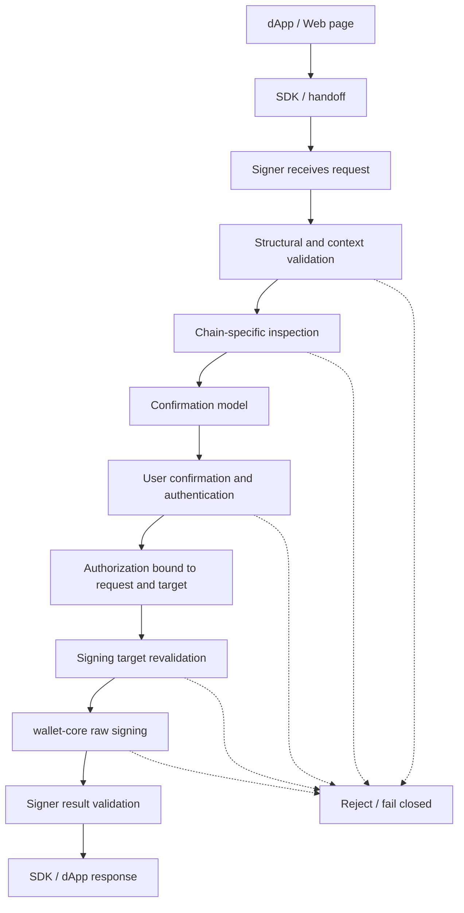
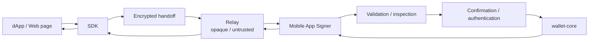

# MosaicLynx 署名フロー基本設計

## 1. 目的

本書は、MosaicLynx の Browser Extension と Mobile App が共通して実行する署名要求の論理 lifecycle、承認対象、署名可能条件、Wallet Core 境界および結果対応を定める基本設計である。

対象とする共通フローは次のとおりである。

```text
署名要求
  → 要求検証
  → 署名対象解析
  → 内容確認
  → 利用者承認・認証
  → 署名対象再検証
  → wallet-core による署名
  → 結果検証
  → 応答
```

本書は、Signer が「何に対する署名を、どの条件で、どの lifecycle で許可するか」を定める。具体的な API、wire format、暗号方式、署名 byte 列、UI layout、Storage または transport 実装を定めない。

## 2. 適用範囲と責任境界

### 2.1 Signer

Signer は Browser Extension と Mobile App である。Signer は次を担う。

- caller / Origin、permission、session、Chain、Network、Account および request context の検証
- transaction / message の chain-specific な parse、validation、semantic inspection
- 利用者が判断できる confirmation model の生成
- MosaicLynx が管理する UI による明示的な承認・拒否および署名ごとの認証
- 承認対象と wallet-core に渡す signing target の一致確認
- wallet-core 呼び出しの orchestration、署名結果の検証および元要求への対応付け
- 不明、未対応、期限切れ、改ざん、重複、認証失敗その他の安全側終了

SDK、Relay、dApp は Signer ではなく、利用者の承認・認証または最終的な署名判断を代行しない。

### 2.2 Wallet Core

`symbol-nem-wallet-core` は Wallet Store、鍵管理、秘密情報処理、chain-specific key、raw byte signing の正本である。MosaicLynx は鍵導出、暗号、Wallet Store 内部形式、秘密情報の lifecycle または raw signing を再実装しない。

Signer は、利用者が承認し、署名前に再検証した signing target だけを Wallet Core の既存公開契約へ渡す。Wallet Core が error、warning、Binding error、Store integrity / verification failure または安全な署名成立を保証できない状態を返した場合、署名結果を成功として返さない。

### 2.3 SDK

SDK は dApp と Signer の接続・受け渡し境界である。SDK は要求の correlation、必要な context、capability および安全側の結果を受け渡すが、最終的な caller verification、semantic inspection、表示、承認、認証および signing は Signer の責任とする。

### 2.4 Relay

Relay は untrusted / opaque transport である。Relay は要求・結果を配送し得るが、transaction / message を意味解釈せず、承認せず、署名せず、signing target を生成しない。Relay の delivery success は署名成功を意味しない。

Relay の restart、state loss、改ざん、重複、遅延または timeout は、Signer が再検証し、新しい承認なしに署名を再開できない状態として扱う。

### 2.5 Node

署名に必要な parse、validation、inspection、confirmation および署名は、原則として外部 Symbol / NEM node への問い合わせなしで完結できなければならない。Node、外部 API、metadata service の応答は untrusted な補助情報であり、署名対象の事実または署名可否の単独の根拠にしない。

MosaicLynx は announce、node 選択、残高、履歴または継続的な network state 管理を担わない。

## 3. 用語

| 用語                | 本書での意味                                                                                                                                                    |
| ------------------- | --------------------------------------------------------------------------------------------------------------------------------------------------------------- |
| Signer              | Browser Extension または Mobile App。署名判断と Wallet Core 呼び出しの主体。                                                                                    |
| Signing request     | 一つの署名判断に必要な request context、caller、session、operation、Account、Chain、Network および signing target の論理的な組。                                |
| Signing target      | 実際に署名される transaction、aggregate、cosignature 対象、message または chain-specific な署名対象。                                                           |
| Transaction context | transaction 本体、embedded transaction、parent aggregate、multisig wrapper、partial state など、signing target を意味解釈するために必要な chain-specific 情報。 |
| Inspection          | Signing target を parse、validation、semantic analysis し、confirmation model を生成する処理。                                                                  |
| Confirmation model  | 利用者へ提示する、Signer が signing target から生成した確認可能な情報の論理表現。UI schema や画面 layout ではない。                                             |
| Authorization       | 利用者の明示的な承認と署名ごとの認証が、特定の signing request と signing target に対して成立した状態。                                                         |
| Result unknown      | 署名生成自体の成否を、署名成功・未署名のいずれとも安全に判定できない状態。配送失敗の意味には使用しない。                                                        |
| Partial             | Chain / network 上または handoff 上の transaction 状態を表す chain-specific context。共通の署名 primitive 名ではない。                                          |

## 4. 設計原則

1. Signer が signing target 全体を安全に解析し、利用者へ確認可能な形で提示できない場合は署名しない。
2. 警告だけを表示して未解析、未対応または表示不能な signing target を bypass する経路を設けない。
3. 利用者の承認は requestId 単体ではなく、caller、session、operation、Account、Chain、Network、permission context、protocol / capability context、signing target、transaction context、inspection result および freshness の組に対して成立する。
4. Confirmation 後に署名判断へ影響する context または target が変化した場合、Authorization を失効させ、再解析・再確認・再認証を要求する。
5. Wallet Core を呼び出す直前に、利用者が確認した target と実際に渡す target の一致を再検証する。
6. `1 request = 1 confirmation = 1 authentication = 1 signing operation` を維持する。ここで signing operation とは、一つの logical signing target に対して一回限りの Authorization を消費して行う一つの logical signing decision を指す。Wallet Core の API call 数、cryptographic primitive の内部呼び出し、signature verification、result validation、response serialization、response delivery、result の resend / lookup は新しい signing operation ではない。内部処理を複数回行う場合も、承認済み target の範囲を拡張してはならない。
7. connection permission、session、UNLOCKED、直前の認証および Relay の配送成功を、署名ごとの承認・認証の代替にしない。
8. Relay、SDK、Provider、Content Script、dApp、Node または外部 API の自己申告を、署名可否の最終根拠にしない。
9. Symbol / NEM の chain-specific semantics、signing bytes、schema、address、hash および multisig / cosignature の意味を、一つの共通 transaction model で上書きしない。
10. restart、process recreation、Service Worker restart、background、Relay state loss または結果不明の後に、古い Authorization を無条件に再利用しない。

## 5. Signing Request の論理モデル

Signing request は、次の概念情報を binding した論理単位として扱う。これは概念モデルであり、JSON schema、wire field 名または特定の ID format を定めるものではない。

| 概念                           | 署名判断上の責任                                                                                                                        |
| ------------------------------ | --------------------------------------------------------------------------------------------------------------------------------------- |
| request identity / correlation | request と result を一意に対応させ、別 request への result 流用を防ぐ。                                                                 |
| operation                      | transaction、cosignature、message など、署名の意味と検証経路を固定する。                                                                |
| caller context                 | Browser が観測した Origin / tab / frame / document、または Mobile handoff で検証した要求元 context。                                    |
| session context                | 接続・handoff・transport の session。permission や signing authorization と同一視しない。                                               |
| permission context             | 対象 caller が対象 Account / Chain / Network を利用できる許可範囲。承認時の scope / revision または同等の不変識別子を binding する。    |
| Account                        | 利用者が選択し、対象 Chain / Network に明示的に関連付けた signing identity。                                                            |
| Chain / Network                | Symbol / NEM および Mainnet / Testnet の対象。別の対象へ暗黙変換しない。                                                                |
| signing target                 | 実際に署名する transaction、aggregate、cosignature target または message。                                                              |
| transaction context            | Aggregate 全体、embedded transaction、parent、multisig、partial state 等、target の意味解釈に必要な情報。                               |
| freshness                      | request-level の作成時刻、期限、nonce、generation または protocol が要求する鮮度情報。具体的な encoding や秒数は下位仕様へ委譲する。    |
| protocol / capability context  | protocol version、対応能力、Chain-specific format および operation の対応範囲。承認時の context または同等の不変識別子を binding する。 |

Signer's approval record は、少なくとも request identity だけでなく、上記の適用される context、承認時の permission scope / revision または同等の不変識別子、protocol / capability context、target digest または同等の不変性確認情報、inspection result および認証状態と結び付く。具体的な field、revision の形式および serialization は下位仕様へ委譲する。署名直前に permission や capability が現在も存在することだけでは、承認時 binding の代わりにならない。

## 6. Signing Operation Model

### 6.1 共通 operation の分類

共通設計上の署名 operation は、次の3種類に整理する。

| 概念 operation     | 対象                                                                                                                                         | 備考                                                                                             |
| ------------------ | -------------------------------------------------------------------------------------------------------------------------------------------- | ------------------------------------------------------------------------------------------------ |
| `TRANSACTION_SIGN` | 通常 transaction、Symbol Aggregate Complete / Bonded、NEM multisig wrapper など、chain-specific transaction を最初の署名対象として扱う処理。 | Aggregate や multisig を独立した共通 protocol として増殖させず、transaction context として扱う。 |
| `COSIGNATURE_SIGN` | 既存の Aggregate / multisig parent に対して、選択した cosigner が追加署名する処理。                                                          | Symbol と NEM の構造・signing bytes・意味は各 Chain integration に委譲する。                     |
| `MESSAGE_SIGN`     | structured message または既存 message signing contract に対する署名。                                                                        | Transaction signing と表示・検証・result を混同しない。                                          |

これは logical classification であり、公開 API 名、wire operation 名または SDK の optional scope を確定しない。v1 の共通能力として transaction signing と message signing が定められている。cosignature、Aggregate / multisig の公開 API、transaction construction および対応 milestone は既存の SDK / Chain-specific OPEN と後続仕様に委譲する。

### 6.2 Operation と transaction state の分離

Aggregate Complete、Aggregate Bonded、Partial、NEM multisig は、直ちに別の共通 signing operation とはしない。

- Aggregate Complete / Bonded は、Chain-specific な Aggregate transaction context を持つ `TRANSACTION_SIGN` または `COSIGNATURE_SIGN` の target になり得る。
- Partial は、network / protocol または handoff 上の状態を示す transaction context であり、それ自体を共通 signing primitive としない。
- NEM multisig は、NEM-specific な wrapper / inner transaction / cosignature semantics を持つ `TRANSACTION_SIGN` または `COSIGNATURE_SIGN` の target として扱い得る。
- どの target をどの operation として公開できるかは、対象 Chain の対応仕様、SDK の公開範囲および platform capability が確定してから決める。

## 7. Request Lifecycle / State Machine

### 7.1 状態

署名要求は、次の非 terminal state と terminal state を持つ。

```text
RECEIVED
  → VALIDATED
  → INSPECTED
  → AWAITING_USER
  → AUTHORIZED
  → SIGNING
  → SUCCEEDED

terminal:
  REJECTED / FAILED / EXPIRED / CANCELLED / INVALIDATED / RESULT_UNKNOWN
```

| 状態             | 意味                                                                                                                                             |
| ---------------- | ------------------------------------------------------------------------------------------------------------------------------------------------ |
| `RECEIVED`       | Signer が外部経路から要求を受け付けたが、信頼できる request として扱う前の状態。                                                                 |
| `VALIDATED`      | 構造、caller、permission、session、freshness、Chain / Network / Account、operation および capability の検証が完了した状態。                      |
| `INSPECTED`      | Signing target と transaction context を chain-specific に parse / validate / inspect し、confirmation model を生成できた状態。                  |
| `AWAITING_USER`  | Signer 管理 UI で利用者が確認・拒否できる状態。まだ署名認証・Authorization は成立していない。                                                    |
| `AUTHORIZED`     | 利用者の明示承認と、署名ごとの認証が特定の request / target に対して成立した状態。短寿命の内部状態とする。                                       |
| `SIGNING`        | Target の再検証を通過し、Signer が Wallet Core の署名契約を呼び出している状態。自動再実行を許可しない。                                          |
| `SUCCEEDED`      | Wallet Core の成功結果を受け、Signer が signature、signed payload、target、signer、Account、Chain、Network および request 対応を検証済みの状態。 |
| `REJECTED`       | 利用者が明示的に拒否した状態。署名結果を持たない terminal state。                                                                                |
| `FAILED`         | 検証、inspection、authentication、Wallet Core または内部処理の失敗で安全側に終了した状態。                                                       |
| `EXPIRED`        | request または message / transaction context の期限を過ぎた状態。                                                                                |
| `CANCELLED`      | 利用者、dApp、Signer、platform または transport が処理を取り消した状態。                                                                         |
| `INVALIDATED`    | context、target、承認、session、lifecycle または完全性が変化し、以前の処理を継続できない状態。                                                   |
| `RESULT_UNKNOWN` | 署名生成自体の結果を成功・未署名のいずれとも安全に確定できない状態。成功として返さず、自動 retry しない。配送失敗には使用しない。                |

### 7.2 遷移

| 遷移                                 | 条件                                                                                                              |
| ------------------------------------ | ----------------------------------------------------------------------------------------------------------------- |
| `RECEIVED → VALIDATED`               | 構造と全ての適用 context を検証できた場合のみ。                                                                   |
| `VALIDATED → INSPECTED`              | Target 全体を chain-specific に解析し、確認可能な inspection result を生成できた場合のみ。                        |
| `INSPECTED → AWAITING_USER`          | Confirmation model を Signer 管理 UI に渡せる場合のみ。                                                           |
| `AWAITING_USER → AUTHORIZED`         | 利用者が対象を確認して明示承認し、署名ごとの認証が成功した場合のみ。                                              |
| `AUTHORIZED → SIGNING`               | 直前の target、context、approval、authentication、capability を再検証し、全て一致した場合のみ。                   |
| `SIGNING → SUCCEEDED`                | Wallet Core が成功を返し、Signer が結果と元 target の対応を検証できた場合のみ。                                   |
| いずれの非 terminal state → terminal | reject、failure、expiry、cancel、context change、lifecycle loss、duplicate、replay または検証不能を検出した場合。 |

次の遷移は禁止する。

- `AWAITING_USER` または `AUTHORIZED` から、target / context の再確認なしに `SIGNING` へ進むこと。
- `REJECTED`、`FAILED`、`EXPIRED`、`CANCELLED`、`INVALIDATED` または `RESULT_UNKNOWN` から、同じ request と Authorization を使って signing を再開すること。
- `SUCCEEDED` から同じ request を再署名すること。
- terminal state の request を、新しい request として扱わずに reopen すること。
- Relay の配送成功、UI の再表示、Service Worker の再起動または Mobile process の復旧だけで `AUTHORIZED` に戻ること。

### 7.3 Lifecycle loss

Browser Extension の Service Worker 停止・再起動、extension reload、browser restart、Mobile の background / process termination / restart、Relay restart / state loss、handoff generation の変更では、context の連続性を失った request を安全側に終了する。

- `RECEIVED`、`VALIDATED`、`INSPECTED`、`AWAITING_USER` は、失われた context を復元できなければ `INVALIDATED` とする。
- `AUTHORIZED` は、承認対象と認証状態を同一の trusted context から再構成できない限り `INVALIDATED` とする。古い承認の復元だけで署名可能にしない。
- `SIGNING` 中に Wallet Core の結果が確定しない場合は `RESULT_UNKNOWN` とする。
- `SUCCEEDED` 後に response delivery だけが失敗し、signature が確定している場合は `RESULT_UNKNOWN` ではなく、配送 disposition の `DELIVERY_UNKNOWN` とする。同じ request の自動再署名は行わず、結果再取得・再送の可否だけを下位 handoff 仕様へ委譲する。

### 7.4 Result delivery disposition

署名結果の確定と、確定済み result を相手へ届けられたかは別の論理状態として扱う。署名 lifecycle の `SIGNING → SUCCEEDED` は維持し、`SUCCEEDED` は Wallet Core の署名結果が確定し、Signer が result を検証できたことを意味する。

確定済み result の配送 disposition は、少なくとも次の概念を持つ。これは署名側の state machine に新しい signing state または terminal state を追加するものではない。

```text
PENDING → DELIVERED
PENDING → DELIVERY_UNKNOWN
```

`SUCCEEDED + DELIVERY_UNKNOWN` の場合、署名は既に生成済みである。`SIGNING` へ戻ること、同じ target を再署名すること、新しい signature を生成することは禁止する。候補となるのは既存 result の resend / retrieval / lookup だけであり、response delivery retry は signing retry ではない。

一方、`RESULT_UNKNOWN` は Wallet Core / Binding 呼び出し中の process loss などにより、署名生成自体の成否を安全に判定できない場合に限定する。response delivery failure を `RESULT_UNKNOWN` と表現してはならない。

## 8. 共通署名フロー



各段階で、外部入力、補助情報または以前の状態を暗黙に信頼してはならない。失敗した段階から、古い Authorization や target を使用して後続段階へ進めない。

## 9. Transaction Signing

通常 transaction の logical flow は次のとおりである。

1. **Receive**: SDK、Provider または Mobile handoff から要求を受け、request identity と transport context を保持する。
2. **Structural validation**: 必須 context、サイズ、形式、protocol / capability、freshness、重複および完全性を検証する。
3. **Caller / permission validation**: browser が観測した caller、Mobile が検証した handoff context、現在の permission、session、要求元の scope を検証する。自己申告 Origin だけを信頼しない。
4. **Chain / Network / Account validation**: 対象 Chain、Profile Network、選択 Account、expected signer、payload 内 signer および operation の対応を検証する。
5. **Chain-specific parse / validation**: Symbol / NEM の正本 SDK、Chain integration および固定契約に従って parse、型、version、network、サイズ、canonicality および署名状態を検証する。
6. **Semantic inspection**: 送信先、資産、fee、deadline、message、権限・authority、metadata、multisig 等の確認可能な影響を解析する。
7. **Confirmation**: inspection result から Signer 管理 UI 用の confirmation model を生成し、利用者の明示承認を受ける。
8. **Authentication**: この signing request / target に対する署名ごとの認証を要求する。permission、session、UNLOCKED または直前認証を代用しない。
9. **Revalidation**: target と全 context を再取得・再解析し、承認時の inspection と実際に Wallet Core へ渡す target が一致することを検証する。
10. **Wallet Core signing**: 承認済みの raw target だけを既存 Wallet Core 契約へ渡す。
11. **Result validation**: signature、signed payload、signer、Account、Chain、Network、target identity および request correlation を検証する。
12. **Response**: 成功結果または安全側の失敗を、元 request に対応付けて返す。announce は行わない。

どの段階でも、解析不能、表示不能、unsupported、wrong network、wrong signer、permission mismatch、expired、duplicate、replay または result unknown は署名成功に変換しない。

## 10. Aggregate Transaction

### 10.1 Aggregate 全体の扱い

Symbol Aggregate Complete と Aggregate Bonded は、通常 transaction と異なり、outer transaction だけでは利用者が署名結果の影響を判断できない場合がある。Signer は、対応する範囲で Aggregate 全体を保持し、outer と embedded transaction を同一の transaction context として解析する。

少なくとも適用可能な次の情報を chain-specific inspection へ含める。

- Aggregate の type、version、network、signer、fee、deadline および target identity
- embedded transaction の件数、順序、type、version、signer、recipient、mosaic / amount、message
- namespace、metadata、authority / permission、account link、multisig またはその他の account / state 変更
- transactions hash、payload size、既存 cosignature および expected signer / role
- outer signer、embedded signer、fee payer、asset sender、recipient の関係

Signer は、解析・表示できる範囲を推測で埋めてはならない。embedded transaction の一部、signer、asset effect または権限変更を安全に確認できない場合、Aggregate 全体への署名を拒否する。

### 10.2 Complete / Bonded

Aggregate Complete / Bonded は Chain-specific な transaction context の違いであり、MosaicLynx の共通 operation を増やす根拠にはしない。どちらも、初期署名なら `TRANSACTION_SIGN`、既存 parent への追加署名なら `COSIGNATURE_SIGN` の candidate になり得る。

Bonded / partial であることを理由に、node から parent や embedded transaction を検索できることを署名条件にしてはならない。Signer に渡された情報だけで全体を検証・表示できない場合は署名しない。具体的な Symbol serialization、signing bytes、aggregate hash および supported type / version は Chain Compatibility Specification と Wallet Core 契約へ委譲する。

## 11. Cosignature

### 11.1 Cosignature の signing target

Cosignature の signing target は、cosignature byte 列だけではなく、cosignature が追加される parent transaction 全体と、それに対する selected cosigner の関係である。

```text
complete parent Aggregate / multisig context
  ├─ outer transaction
  ├─ embedded / inner transaction 全体
  ├─ existing signatures / cosignatures
  ├─ parent identity / hash
  └─ selected cosigner Account / role
              ↓
       COSIGNATURE_SIGN target
              ↓
       cosignature result
```

Signer は、少なくとも次を検証・確認する。

- parent の Chain、Network、transaction identity、hash および全 contents の対応
- Aggregate / multisig の outer、embedded / inner transaction、asset effect、権限変更および signer role
- selected Account が expected cosigner と一致すること
- existing cosignature、duplicate signer、already signed、対象外 signer、initiator / cosigner role の整合
- parent の期限、stale 状態、request の期限、caller、session および permission
- cosignature result が元 parent、selected cosigner、Account、Chain、Network および request に対応すること

### 11.2 Hash-only cosignature

parent transaction 全体を復元・解析・確認できず、hash または opaque identifier だけを受け取る cosignature は、共通の blind signing 禁止方針に反するため、署名してはならない。

hash は parent identity の照合情報として利用できるが、利用者が確認する transaction contents の代替ではない。Node、Relay、SDK または dApp が「この hash の parent は安全である」と自己申告しても、Signer の inspection を省略する根拠にならない。

既存の完全な parent payload、または下位仕様で承認された同等の全体表現を Signer が受け取り、chain-specific に検証・表示できる場合だけ、cosignature signing の候補とする。「同等の全体表現」と認めるには、その表現だけから、外部補助情報に依存せず、Signer 自身が適用される parent の全 security-relevant field を再構成、parse、validate、inspection および confirmation できなければならない。少なくとも outer transaction、embedded / inner transaction 全体、signer / expected signer、selected cosigner / role、asset / amount / recipient、fee / deadline、metadata / namespace / authority changes、existing signature / cosignature、transaction identity、canonical hash / parent binding を含む範囲を欠いてはならない。具体的な field schema は Chain-specific 仕様へ委譲する。

hash only、opaque identifier、hash + summary、external summary、dApp / Relay / Node が生成した description または summary、一部 field のみ、hash + external lookup は同等の全体表現ではない。Node、Relay、SDK または dApp からの lookup や補完を前提に、parent 全体の確認を代替してはならない。具体的な payload 形式と公開 API は未決のまま下位仕様へ委譲する。

## 12. Partial Transaction

### 12.1 Partial の位置付け

Partial は、Symbol / NEM protocol、network または handoff 上で transaction が未完成・未集約・追加署名待ちである状態を表す chain-specific transaction context である。Partial を共通の第三の署名 primitive として定義しない。

```text
Partial transaction context
  ├─ initial / outer signer が署名する場合
  │      └─ TRANSACTION_SIGN
  └─ existing parent に追加署名する場合
         └─ COSIGNATURE_SIGN
```

Partial が存在することだけで署名可能とはしない。Signer は、対象 Chain の意味に従い、transaction 全体、parent、embedded / inner contents、既存署名、expected signer、期限および影響を検証・確認できなければならない。

### 12.2 Node lookup の禁止

MosaicLynx が node に接続して Partial Transaction を検索・監視し、見つかった内容を承認対象へ補完することを共通前提にしない。dApp、SDK または Relay から渡された partial context が全体確認に不足する場合は、追加署名を開始せず `INSPECTION_FAILED` 相当の安全側終了とする。

Partial の transport、保存、network lifecycle、取得 API、公開 scope および具体的な Symbol / NEM semantics は既存の Chain / SDK / Relay の OPEN と下位仕様へ委譲する。

## 13. NEM Multisig

NEM multisig は Symbol Aggregate と同一の transaction model へ押し込めない。共通化するのは request lifecycle、approval、Account binding、result correlation、fail-closed および blind signing prevention だけである。

NEM-specific integration は次を正本として扱う。

- transaction wrapper と inner transaction の構造
- multisig account、initiator、inner signer、fee payer および cosigner の semantics
- NEM の version、address、network、hash および signing bytes
- multisig cosignature の既存署名、重複、必要な parent context および result validation

NEM multisig の inner transaction または必要な parent context を完全に解析・表示できない場合は署名しない。参照 hash だけで multisig cosignature を生成する設計は、Symbol Aggregate と同様に blind signing として拒否する。具体的な NEM type / version、serialization および Wallet Core への渡し方は NEM integration / Wallet Core 契約へ委譲する。

## 14. Message Signing

Message signing は transaction signing と別 operation として扱う。message の表示文言と実際の signing bytes を別々の入力から生成してはならない。

### 14.1 Message context

対象 protocol / operation が要求する適用可能な context を保持・検証する。

- 検証済み caller / Origin
- Account、Chain、Network
- purpose / operation
- message contents
- domain separation
- nonce、issued / freshness information、message-level expiry
- request-level の request identity、created / expires および transport replay protection

全 operation が全項目を要求するとは限らない。対象 protocol が要求する context を検証・表示できない場合は署名しない。request-level `requestId` / `createdAt` / `expiresAt` による受け渡し要求の相関・期限と、signed message 自体の replay、cross-domain、cross-purpose protection は別の security layer として扱う。

### 14.2 Message flow

1. message signing request として operation を識別する。
2. caller、Account、Chain / Network、purpose、freshness および message contents を検証する。
3. Signer が message から confirmation model を生成し、transaction signing と区別して表示できる状態にする。
4. 利用者が message contents と適用 context を確認し、署名ごとの承認・認証を行う。
5. 署名直前に message、context、domain、nonce、expiry および signing bytes の生成対象を再検証する。
6. Wallet Core の既存 chain-specific / message signing 契約へ渡し、返却された signature と signed message の対応を検証する。

raw bytes を利用者が意味確認できないまま表示して署名すること、外部アプリの表示用 message と実際の bytes を別に扱うこと、message signing の失敗を transaction signing の成功へ fallback することを禁止する。

具体的な serialization、encoding、nonce format、domain separator の値、expiry 値、API、wire schema および result format は Product / Web Handoff / Chain-specific の既存仕様へ委譲する。

## 15. Inspection / Confirmation Model

### 15.1 Inspection result

Inspection result は、Signer が signing target から生成する内部の確認モデルである。少なくとも適用可能な次の分類を持つ。

- request / caller / session context
- operation、Chain、Network、Account、expected signer / role
- target の schema、type、version、parent / aggregate / multisig context
- recipient、asset、mosaic、amount、fee、deadline、message
- embedded / inner transaction、existing signature / cosignature
- metadata、namespace、authority、permission、account state の変更
- freshness、expiry、replay / duplicate 状態
- external state が未検証であること、補助情報の限界および warning
- target identity、digest または canonical consistency の検証結果

Warning は、署名可能条件を満たさない状態を利用者の自己責任で bypass する手段ではない。確認に必要な information が欠ける場合は inspection failure とする。

### 15.2 Confirmation model の不変性

Confirmation model は、表示時点の signing target と全適用 context に binding する。次のいずれかが変化した場合は、既存 confirmation と Authorization を無効化する。

- payload、transaction、aggregate、embedded / inner transaction、message contents
- parent hash、transactions hash、signature、cosignature、signer、expected signer
- Account、Chain、Network、caller、Origin、session、permission、operation
- request freshness、expiry、capability または protocol context

外部 API、Node、Relay または dApp から取得した補助表示を、target そのものの事実として confirmation model に混入させない。補助情報の取得に失敗しても target から判断できる事実を誤表示せず、必要情報を安全に確認できなければ署名しない。

## 16. Authorization and Signing Target Binding

### 16.1 Authorization の単位

Authorization は次の論理 tuple に対する一回限りの承認として扱う。

```text
(caller, session, operation, Account, Chain, Network,
 permission context, protocol / capability context,
 signing target, transaction context, inspection result, freshness)
```

requestId はこの tuple を識別する補助であり、tuple の代替ではない。Authorization は、承認時の permission scope / revision または同等の不変識別情報と、承認時の protocol / capability context に binding する。具体的な field、revision ID および serialization は下位仕様へ委譲する。署名直前に permission が現在存在すること、または capability が現在利用可能であることだけでは、承認時 binding の代わりにならない。

Permission や session が同じでも、別 parent transaction、別 signing target、別 cosigner、別 operation、別 Account、別 Chain、別 Network、別 caller、別 permission または別 capability へ Authorization を流用しない。複数 target の batch signing をこの原則から暗黙に許可しない。

### 16.2 署名前の再検証

Wallet Core 呼び出し直前に、Signer は次を再確認する。

1. request が未期限切れ、未使用、未取消、未失効である。
2. caller、session、承認時に binding した permission context、Account、Chain、Network、operation および protocol / capability context が Authorization と一致する。現在 permission が存在することだけを確認してはならない。
3. signing target と transaction context が、利用者が確認した inspection result と一致する。
4. payload、parent、embedded / inner transaction、message、signer、expected signer、既存署名・cosignature が変化していない。
5. chain-specific parse、validation、canonicalization、signature state および承認時に binding した capability / protocol context が引き続き一致している。permission revoke、scope change、permission revision change、protocol version change、capability change または operation capability change があれば、現在の新しい context が安全に見えても既存 Authorization を `INVALIDATED` とする。
6. Wallet Core に渡す raw target が承認済み target から再構成され、別の外部入力または補助情報で置換されていない。

一つでも確認できない場合は Authorization を `INVALIDATED` とし、署名しない。これは UI 確認後の payload substitution と TOCTOU を防ぐための必須境界である。

## 17. Wallet Core Boundary

```text
Signer
  ├─ caller / permission / session
  ├─ Chain / Network / Account binding
  ├─ parse / inspection / confirmation
  ├─ user authorization / authentication
  └─ final target revalidation
              │ approved raw target only
              ▼
wallet-core
  ├─ Wallet Store
  ├─ key management / chain-specific key
  ├─ secret processing
  └─ raw byte signing
```

Signer は Wallet Core に transaction の意味解釈、利用者承認または caller verification を委譲しない。Wallet Core が返す result、error、warning、Binding error、Store integrity failure または result unknown は安全側に扱い、Secret を error、diagnostic、log、telemetry または response に含めない。

Wallet Core の具体的 API、raw byte signing、key derivation、cryptographic primitive、Store format、memory lifecycle および chain-specific signing bytes は既存の公開契約へ委譲する。

## 18. Browser Extension Flow

```text
Web page / dApp
      ↓ untrusted request
SDK / window Provider
      ↓ untrusted message
Content Script
      ↓ browser observed context + message
Extension privileged layer
      ├─ sender / Origin / tab / frame / document verification
      ├─ permission / session / Account / Chain / Network validation
      ├─ chain-specific inspection and approval UI
      └─ wallet-core Binding
              ↓
          wallet-core
```

Provider と Content Script は信頼主体ではない。Extension の privileged layer が browser API で観測した sender、Origin、tab / frame / document context と、受け取った request の対応を最終確認する。Web page が渡した caller、表示文言、app 名、icon または transaction summary を承認根拠にしない。

Extension reload、browser restart、Service Worker 停止・再起動、tab / document navigation、frame context 変更で request context または承認状態を失った場合は、旧 Authorization を破棄する。新しい要求、再検証、再確認および署名ごとの再認証なしに署名を再開しない。

## 19. Mobile / Relay Flow



Relay は transport metadata と opaque envelope を受け渡し得るが、次を担当しない。

- authorization または permission decision
- transaction / message inspection
- confirmation UI または利用者承認・認証
- signing target の生成・補完・差し替え
- signature generation、announce または result の意味的な成功判定

Mobile App は Relay から届いたデータを全て untrusted input として扱い、handoff session、generation、request identity、期限、caller、operation、Account、Chain、Network、target integrity および permission を再検証する。Relay restart、state loss、duplicate、timeout、old generation、late delivery または result unknown は、古い Authorization を復元せず、新しい要求と新しい承認を必要とする。

具体的な E2E encryption、Relay API、HTTP endpoint、Redis state、Deep Link / Universal Link / App Link の format は本書では定めない。

## 20. Result Model

### 20.1 成功結果

成功結果は、署名 bytes だけでなく、少なくとも次の概念に対応付けて扱う。

- 元 request identity / correlation
- operation
- signer identity / expected signer
- Account、Chain、Network
- signature または signed payload
- transaction、aggregate、parent / multisig identity または message identity
- target digest、transaction hash、aggregate hash または chain-specific equivalent

具体的な response field、signed payload format、hash format および API は下位仕様へ委譲する。結果に含まれる情報は、dApp / SDK が元 request と独立検証できる十分な対応関係を持たなければならない。

### 20.2 Result validation

Signer は Wallet Core から受け取った結果について、少なくとも次を検証する。

- signature / signed payload が Wallet Core へ渡した target に対応する。
- signer、Account、Chain、Network、operation が request と一致する。
- Aggregate / multisig なら parent、embedded / inner transaction、existing signature / cosignature および target identity が一致する。
- message signing なら message contents、domain、purpose、nonce、freshness および signed message context が一致する。
- response correlation が別 request、別 session、別 transport または stale result へ流用されていない。

検証不能または `RESULT_UNKNOWN` の場合、成功 result を返さない。`RESULT_UNKNOWN` は署名生成自体の成否不明に限定し、確定済み result の配送失敗は delivery disposition で表す。dApp は Provider / Relay の delivery success だけで署名成功とみなさず、受け取った結果を独立検証する。

MosaicLynx は署名後の announce、node 選択または継続的な network state 管理を行わない。

### 20.3 Result delivery disposition

署名 lifecycle の `SUCCEEDED` とは別に、確定済み result の配送 disposition を管理する。概念上は `PENDING`、`DELIVERED`、`DELIVERY_UNKNOWN` を用いることができるが、これらは新しい signing state または signing operation ではない。

`SUCCEEDED + DELIVERY_UNKNOWN` は、署名が既に生成されている一方で response delivery の成否だけを確定できない状態である。この状態から `SIGNING` へ戻らず、同じ target を再署名せず、新しい signature を生成しない。許される候補は既存 result の resend / retrieval / lookup だけであり、response delivery retry は signing retry ではない。具体的な配送・照会契約は下位仕様へ委譲する。

## 21. Retry / Duplicate / Replay / Expiration

- 同じ request identity の重複要求は、内容が同じでも追加署名を発生させない。内容が異なる場合は conflict / tampering として拒否する。
- 使用済み、期限切れ、取消済み、失効済みまたは stale な request は署名しない。
- duplicate / replay の検出に失敗した場合、署名を続行せず安全側に終了する。
- 利用者拒否、inspection failure、authentication failure、署名生成自体の `RESULT_UNKNOWN`、Relay state loss または signing lifecycle の transport timeout の再試行は、古い identity、session、ciphertext、Authorization、target および承認を再利用しない新しい request とする。`SUCCEEDED` 後の response delivery timeout は `DELIVERY_UNKNOWN` として扱い、既存 result の resend / retrieval / lookup だけを候補とする。
- `RESULT_UNKNOWN` の後に、同じ署名を自動再実行してはならない。これは署名生成自体の成否不明に限る。確定済み署名の response delivery failure は `DELIVERY_UNKNOWN` として扱い、外部利用者が既存 result を resend / retrieval / lookup できる場合だけ別処理として扱う。
- request-level expiry と message-level expiry は分けて検証する。どちらか一方が失効した場合も、適用される署名を開始しない。
- Relay の retry は配送 retry であって署名 retry ではない。Signer が同じ target を再度署名する根拠にしない。

## 22. Error / Terminal State

具体的な numeric code、JSON schema または wire error は定めず、少なくとも次の意味を区別できる設計にする。

| 意味                            | 処理                                                                                                                      |
| ------------------------------- | ------------------------------------------------------------------------------------------------------------------------- |
| user rejected                   | 利用者が明示拒否。署名 result を返さず `REJECTED`。                                                                       |
| invalid request                 | 構造、必須 context または完全性が不正。`FAILED` または下位仕様の invalid terminal。                                       |
| unsupported                     | operation、Chain、Network、type、version、format または capability が対象外。blind signing や fallback を行わない。       |
| permission denied               | caller、session、scope または Account の許可範囲不一致。                                                                  |
| authentication failed           | 署名ごとの認証失敗。署名せず、直前の承認を流用しない。                                                                    |
| expired                         | request、message、transaction または parent context の期限切れ。                                                          |
| cancelled                       | 利用者、dApp、Signer、platform または transport による取消。                                                              |
| duplicate / replay detected     | 使用済み、重複または再送を検出。追加署名しない。                                                                          |
| inspection failed               | parse、validation、semantic inspection または表示不能。blind signing しない。                                             |
| signing failed                  | Wallet Core または署名 orchestration の非成功。Secret を error に含めない。                                               |
| transport unavailable / timeout | 受け渡し不能または期限超過。古い Authorization で再開しない。                                                             |
| result unknown                  | 署名生成自体の成功・未署名を確定できない。成功として返さず、自動 retry しない。response delivery failure には使用しない。 |
| internal failure                | その他の安全性不明な内部失敗。Fail-Closed。                                                                               |

## 23. Flow Security Invariants

以下は本書の署名 flow が常に満たす MUST である。共通 Security Invariants の具体的な正本は `security-design.md` §17 とし、本章は署名 flow における適用を明確化する。

1. 利用者が確認できず、Signer 自身が parent を含む全 security-relevant field を再構成・検証・表示できない signing target には署名しない。
2. 利用者が確認した target と実際の signing target は一致しなければならない。
3. payload、transaction context、Account、Chain、Network、caller、session、operation、signer、expected signer、承認時の permission context または protocol / capability context が変われば Authorization は失効する。
4. Relay は署名判断、inspection、承認および signing の信頼主体ではない。
5. SDK / dApp / Provider の自己申告情報だけで caller を verified としない。
6. stale、replay、duplicate request を新しい承認として扱わない。
7. `RESULT_UNKNOWN` は署名生成自体が不明な場合に限定し、同一署名を自動再実行しない。確定済み result の delivery failure では再署名しない。
8. 一つの Authorization は一つの logical signing target に対する一回の signing decision にだけ使用し、result の resend / lookup を signing operation として扱わない。Wallet Core に渡すのは、再検証済みの承認 target だけとする。
9. private key / mnemonic を signing request、signing result、transport または diagnostics に露出しない。
10. unknown transaction、unsupported version、未知 message format を warning だけで blind sign しない。
11. Symbol / NEM の chain-specific semantics、signing bytes、transaction structure を共通 model で上書きしない。
12. restart、process recreation、Service Worker restart、Relay state loss または context loss 後に古い Authorization を再利用しない。

## 24. Chain-specific Boundary

### 24.1 Symbol

Symbol の transaction type / version、Aggregate Complete / Bonded の構造、embedded transaction、transactions hash、cosignature、mosaic、namespace、metadata、fee、deadline、signing bytes および署名検証は Symbol integration と Wallet Core の正本契約に従う。MosaicLynx は共通 lifecycle、approval binding、fail-closed および result correlation を提供するが、Symbol の byte-level 仕様を再定義しない。

### 24.2 NEM

NEM の transaction type / version、multisig wrapper / inner transaction、cosignature、address、network、hash、message および signing bytes は NEM integration と Wallet Core の正本契約に従う。NEM multisig を Symbol Aggregate の構造へ変換して共通化しない。

### 24.3 共通化の限界

共通化してよいのは request lifecycle、caller / permission / session binding、Account / Chain / Network binding、approval、authentication、fail-closed、result correlation および dApp への失敗意味である。Chain-specific な parse、semantic inspection、signing target、signing bytes、hash、address、signature semantics、Aggregate / multisig / cosignature の対応範囲は各 Chain integration に残す。

## 25. 下位仕様への引継ぎ

| 領域               | 本書で固定する安全条件                                                                                                             | 下位仕様へ委譲する事項                                                                                      |
| ------------------ | ---------------------------------------------------------------------------------------------------------------------------------- | ----------------------------------------------------------------------------------------------------------- |
| SDK / Provider     | Signer が検証できる context と target を渡し、結果を元 request に対応付ける。                                                      | API 名、wire schema、transport 選択、retry / error field、公開 operation scope。                            |
| Browser Extension  | Browser observed context を privileged layer が最終検証し、Extension UI と Wallet Core の間で target binding を維持する。          | Chrome message object、Service Worker lifecycle 実装、tab / frame UI、Storage、具体的な Provider contract。 |
| Mobile             | App が opaque handoff を再検証し、Mobile 自身の UI・認証・承認後だけ signing する。Sensitive UI と lifecycle loss を安全側に扱う。 | OS API、Deep Link / App Link、Mobile UI、process state、端末認証、Binding host integration。                |
| Relay              | Opaque transport と structural validation だけを担い、署名・inspection・approval を担わない。                                      | E2E encryption、HTTP / Redis / generation / TTL / endpoint / storage の形式。                               |
| Wallet Core        | 承認済み target の raw signing と秘密情報処理を正本契約で実行する。                                                                | Rust / Binding API、key derivation、Wallet Store、cryptography、signing bytes、memory lifecycle。           |
| Symbol integration | Aggregate / cosignature を含む target 全体を parse・検証・表示可能な inspection にする。                                           | schema、type / version、serialization、hash、signature byte、対応範囲、fixture。                            |
| NEM integration    | multisig / cosignature を含む NEM-specific target 全体を parse・検証・表示可能な inspection にする。                               | schema、type / version、serialization、hash、signature byte、対応範囲、fixture。                            |

## 26. OPEN / 未決事項

本書は、未決の公開契約をこの基本設計から推測して確定しない。

- `SDK-OPEN-002`、`SDK-OPEN-003`、`SDK-OPEN-004`、`SDK-OPEN-006`、`SDK-OPEN-007`: Aggregate / cosignature の公開範囲、transaction construction、transport、version policy、caller / Origin binding および具体 API。
- `MR-OPEN-002`、`MR-OPEN-003`、`MR-OPEN-005`、`MR-OPEN-006`: Mobile 受信経路、OS 保護、Binding integration、lifecycle、backup / migration。
- `CR-OPEN-001`、`CR-OPEN-002`: Wallet Core Binding host integration、秘密 byte lifecycle、OS 保護、error mapping、migration。
- Aggregate Complete / Bonded、Partial、Symbol cosignature、NEM multisig / cosignature の各 public operation / format / supported scope。共通の安全 model は本書で定めたが、公開 API と対応範囲は Chain / SDK / platform 設計で決定する。
- `result unknown` 後の既存署名結果の照会・再配送契約。照会が可能な場合も、同じ target の再署名とは分離する。
- Platform ごとの confirmation model の受け入れ条件、表示可能性、Mobile Sensitive UI の具体的な露出 policy。

OPEN を理由に、blind signing、利用者確認省略、古い Authorization の再利用、Relay の署名判断または Wallet Core の責任移管を許可してはならない。

## 27. 関連資料

- [MosaicLynx アーキテクチャ設計](./architecture.md)
- [MosaicLynx 共通セキュリティ設計](./security-design.md)
- [MosaicLynx 共通要件](../requirements/requirements.md)
- [Browser Extension 要件](../requirements/browser-extension.md)
- [Mobile App 要件](../requirements/mobile-app.md)
- [Relay 要件](../requirements/relay.md)
- [SDK 要件](../requirements/sdk.md)
- [Product Specification](../specifications/product-spec.md)
- [Web Transaction Handoff Specification](../specifications/web-transaction-handoff-spec.md)
- [Chain Compatibility Specification](../specifications/chain-compatibility-spec.md)
- `_snwc/docs/requirements/requirements.md`
- `_snwc/docs/specifications/specification.md`
- `_snwc/docs/decisions/binding-implementation.md`
