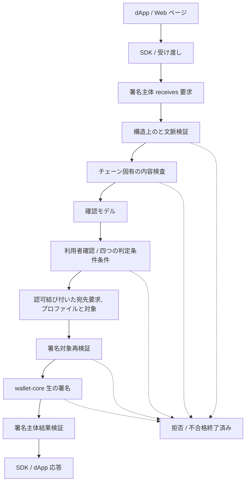
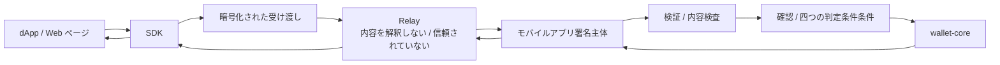

# MosaicLynx 署名フロー基本設計

## 1. 目的

本書は、MosaicLynx のブラウザ拡張機能とモバイルアプリが共通して実行する署名要求の論理ライフサイクル、承認対象、署名可能条件、wallet-core 境界および結果対応を定める基本設計である。

対象とする共通フローは次のとおりである。

```text
署名要求
  → 要求検証
  → 署名対象解析
  → 内容確認
  → 利用者承認・認証
  → 署名対象再検証
  → wallet-core による署名
  → 結果検証
  → 応答
```

本書は、署名主体が「何に対する署名を、どの条件で、どのライフサイクルで許可するか」を定める。具体的な API、通信上の形式、暗号方式、署名バイト列、UI 配置、保存領域または通信経路実装を定めない。

## 2. 適用範囲と責任境界

### 2.1 署名主体

署名主体はブラウザ拡張機能とモバイルアプリである。署名主体は次を担う。

- 呼び出し元 / オリジン、許可、セッション、チェーン、ネットワーク、アカウントおよび要求文脈の検証
- 対象要求 / 対象 / プロファイル / アカウント / チェーン / ネットワークに対する認証、署名可能な状態へのロック解除、アカウントの利用認可および利用者による明示的な承認の共通署名ゲートの成立と再確認
- トランザクション / メッセージのチェーン固有のな解析、検証、意味上の内容検査
- 利用者が判断できる確認モデルの生成
- MosaicLynx が管理する UI による明示的な承認・拒否および署名ごとの認証
- 承認対象と wallet-core に渡す署名対象の一致確認
- wallet-core 呼び出しの処理の調整、署名結果の検証および元要求への対応付け
- 不明、未対応、期限切れ、改ざん、重複、認証失敗その他の安全側終了

SDK、Relay、dApp は署名主体ではなく、共通署名ゲートを成立・変更・免除・迂回せず、利用者の承認・認証または最終的な署名判断を代行しない。

### 2.2 wallet-core

`symbol-nem-wallet-core` はウォレットストア、鍵管理、秘密情報処理、チェーン固有の鍵、生バイト署名の正本である。MosaicLynx は鍵導出、暗号、ウォレットストア内部形式、秘密情報のライフサイクルまたは生の署名を再実装しない。

署名主体は、利用者が承認し、署名前に再検証した署名対象だけを wallet-core の既存公開契約へ渡す。wallet-core がエラー、警告、バインディングエラー、ストア完全性 / 検証失敗または安全な署名成立を保証できない状態を返した場合、署名結果を成功として返さない。

wallet-core のパスワード / ストア検証や生の署名の成功は、アプリケーションレベルの認証、署名可能な状態へのロック解除、アカウントの利用認可または利用者による明示的な承認の代替ではない。これらの成立は署名主体が管理する。

### 2.3 SDK

SDK は dApp と署名主体の接続・受け渡し境界である。SDK は要求の対応付け、必要な文脈、対応能力および安全側の結果を受け渡すが、最終的な呼び出し元検証、意味上の内容検査、表示、承認、認証、共通署名ゲートの成立および署名は署名主体の責任とする。SDK、Provider または dApp の状態・自己申告は、ゲートの条件を成立させる根拠にならない。

### 2.4 Relay

Relay は信頼されていない / 内容を解釈しない通信経路である。Relay は要求・結果を配送し得るが、トランザクション / メッセージを意味解釈せず、承認せず、署名せず、署名対象を生成しない。Relay の配送成功は署名成功を意味しない。

Relay の再起動、状態消失、改ざん、重複、遅延またはタイムアウトは、署名主体が再検証し、新しい承認なしに署名を再開できない状態として扱う。

### 2.5 ノード

署名に必要な解析、検証、内容検査、確認および署名は、原則として外部 Symbol / NEM ノードへの問い合わせなしで完結できなければならない。ノード、外部 API、メタデータサービスの応答は信頼されていないな補助情報であり、署名対象の事実または署名可否の単独の根拠にしない。

MosaicLynx はアナウンス、ノード選択、残高、履歴または継続的なネットワーク状態管理を担わない。

## 3. 用語

| 用語                 | 本書での意味                                                                                                                                                                                |
| -------------------- | ------------------------------------------------------------------------------------------------------------------------------------------------------------------------------------------- |
| 署名主体             | ブラウザ拡張機能またはモバイルアプリ。署名判断と wallet-core 呼び出しの主体。                                                                                                               |
| 署名要求             | 一つの署名判断に必要な要求、呼び出し元、セッション、プロファイル、操作、アカウント、チェーン、ネットワークおよび署名対象の論理的な組。                                                      |
| 署名対象             | 実際に署名されるトランザクション、アグリゲート、連署署名対象、メッセージまたはチェーン固有のな署名対象。                                                                                    |
| トランザクション文脈 | トランザクション本体、埋め込みトランザクション、親アグリゲート、マルチシグラッパー、部分トランザクション状態など、署名対象を意味解釈するために必要なチェーン固有の情報。                    |
| 内容検査             | 署名対象を解析、検証、意味上の analysis し、確認モデルを生成する処理。                                                                                                                      |
| 確認モデル           | 利用者へ提示する、署名主体が署名対象から生成した確認可能な情報の論理表現。UI スキーマや画面配置ではない。                                                                                   |
| プロファイル         | 署名主体内部で固定されたプロファイルチェーン / ネットワーク、チェーン固有のアカウント / 鍵識別情報および wallet-core 文脈を一意に解決するアプリケーション文脈。公開フィールドを要求しない。 |
| 認可                 | 認証、署名可能な状態へのロック解除、アカウントの利用認可および利用者による明示的な承認の4条件が、特定の要求 / 対象 / プロファイルに独立して成立した状態。                                   |
| 結果不明             | 署名生成自体の成否を、署名成功・未署名のいずれとも安全に判定できない状態。配送失敗の意味には使用しない。                                                                                    |
| 部分トランザクション | チェーン / ネットワーク上または受け渡し上のトランザクション状態を表すチェーン固有の文脈。共通の署名基本機構名ではない。                                                                     |

## 4. 設計原則

1. 署名主体が署名対象全体を安全に解析し、利用者へ確認可能な形で提示できない場合は署名しない。
2. 警告だけを表示して未解析、未対応または表示不能な署名対象を迂回する経路を設けない。
3. 利用者の承認は requestId 単体ではなく、要求、呼び出し元、セッション、プロファイル、操作、アカウント、チェーン、ネットワーク、許可文脈、プロトコル / 対応能力文脈、署名対象、トランザクション文脈、内容検査結果および鮮度の組に対して成立する。
4. 認証、署名可能な状態へのロック解除、アカウントの利用認可および利用者による明示的な承認は独立した必須条件であり、4条件すべてが同じ署名主体が所有する文脈に対して成立しない限り署名しない。
5. 確認後に署名判断へ影響する文脈または対象が変化した場合、認可を失効させ、再解析・再確認・再認証を要求する。
6. wallet-core を呼び出す直前に、利用者が確認した対象と実際に渡す対象の一致を再検証する。
7. `1 request = 1 confirmation = 1 authentication = 1 signing operation` を維持する。ここで署名操作とは、一つの論理的な署名対象に対して一回限りの認可を消費して行う一つの論理的な署名判断を指す。wallet-core の API 呼び出し数、暗号学的な基本機構の内部呼び出し、署名検証、結果検証、応答シリアライズ、応答配送、結果の再送 / 照会は新しい署名操作ではない。内部処理を複数回行う場合も、承認済み対象の範囲を拡張してはならない。
8. 接続、許可、対応能力、セッション、単なる `UNLOCKED`、過去の認証、wallet-core パスワード / ストア検証、Relay 配送成功または SDK / Provider の状態を、4条件のいずれかの代替にしない。
9. Relay、SDK、Provider、コンテンツスクリプト、dApp、ノードまたは外部 API の自己申告を、署名可否の最終根拠にしない。
10. Symbol / NEM のチェーン固有の意味、署名バイト列、スキーマ、アドレス、ハッシュおよびマルチシグ / 連署署名の意味を、一つの共通トランザクションモデルで上書きしない。
11. 複数の有効な要求は、それぞれ独立したセキュリティ文脈として扱い、要求識別情報、呼び出し元 / 送信元文脈、セッション、プロファイル、アカウント、チェーン / ネットワーク、操作、対象、意味上の内容検査、承認、認証および結果 / 応答チャネルを相互に共有・統合しない。ブラウザの複数タブ / フレームとモバイルの複数ディープリンク / Relay 受け渡しを含む。キュー、排他制御、並列処理、公平性、最大同時数および具体 UI は下位へ委譲する。
12. 再起動、プロセス再作成、サービスワーカー再起動、バックグラウンド、Relay 状態消失または結果不明の後に、古い認可を無条件に再利用しない。

## 5. 署名要求の論理モデル

署名要求は、次の概念情報を結び付けした論理単位として扱う。これは概念モデルであり、JSON スキーマ、通信上のフィールド名または特定の ID 形式を定めるものではない。少なくとも `request / caller / session / Profile / Account / Chain / Network / operation / target` の関係を署名主体内部で安全に維持する。プロファイルは公開通信上のフィールドの追加を意味せず、署名主体内のな文脈として解決する。

| 概念                      | 署名判断上の責任                                                                                                                                                     |
| ------------------------- | -------------------------------------------------------------------------------------------------------------------------------------------------------------------- |
| 要求識別情報 / 対応付け   | 要求と結果を一意に対応させ、別要求への結果流用を防ぐ。                                                                                                               |
| 操作                      | トランザクション、連署署名、メッセージなど、署名の意味と検証経路を固定する。                                                                                         |
| 呼び出し元文脈            | ブラウザが観測したオリジン / タブ / フレーム / 文書、またはモバイル受け渡しで検証した要求元文脈。                                                                    |
| セッション文脈            | 接続・受け渡し・通信経路のセッション。許可や署名認可と同一視しない。                                                                                                 |
| プロファイル              | アプリケーションが選択した、一つのチェーンとネットワークに固定されたプロファイル。署名主体内部で対象アカウント / 鍵識別情報および wallet-core 文脈を一意に解決する。 |
| 許可文脈                  | 対象呼び出し元が対象アカウント / チェーン / ネットワークを利用できる許可範囲。承認時の対象範囲 / リビジョンまたは同等の不変識別子を結び付けする。                    |
| アカウント                | 対象プロファイル / ネットワークのチェーン固有のアカウント / 鍵識別情報として署名主体内部で一意に解決された署名識別情報。                                             |
| チェーン / ネットワーク   | Symbol / NEM および Mainnet / Testnet の対象。別の対象へ暗黙変換しない。                                                                                             |
| 署名対象                  | 実際に署名するトランザクション、アグリゲート、連署署名対象またはメッセージ。                                                                                         |
| トランザクション文脈      | アグリゲート全体、埋め込みトランザクション、親、マルチシグ、部分トランザクション状態等、対象の意味解釈に必要な情報。                                                 |
| 鮮度                      | 要求単位の作成時刻、期限、ノンス、世代またはプロトコルが要求する鮮度情報。具体的なエンコーディングや秒数は下位仕様へ委譲する。                                       |
| 受け渡し参加者 / 受信者   | 適用される受け渡しの意図した受信者 / 参加者、端末または署名主体内の識別情報、セッション / 世代および応答チャネル / 方向。具体的な表現は下位仕様へ委譲する。          |
| プロトコル / 対応能力文脈 | プロトコルバージョン、対応能力、チェーン固有の形式および操作の対応範囲。承認時の文脈または同等の不変識別子を結び付けする。                                           |

署名主体's 承認レコードは、少なくとも要求識別情報だけでなく、上記の適用される文脈、プロファイル、承認時の許可対象範囲 / リビジョンまたは同等の不変識別子、プロトコル / 対応能力文脈、対象ダイジェストまたは同等の不変性確認情報、内容検査結果、認証、署名可能な状態へのロック解除、アカウントの利用認可および利用者による明示的な承認の成立状態と結び付く。具体的なフィールド、リビジョンの形式およびシリアライズは下位仕様へ委譲する。署名直前に許可や対応能力が現在も存在することだけでは、承認時結び付けの代わりにならない。

## 6. 署名操作モデル

### 6.1 共通操作の分類

共通設計上の署名操作は、次の3種類に整理する。

| 概念操作           | 対象                                                                                                                                               | 備考                                                                                               |
| ------------------ | -------------------------------------------------------------------------------------------------------------------------------------------------- | -------------------------------------------------------------------------------------------------- |
| `TRANSACTION_SIGN` | 通常トランザクション、Symbol アグリゲート完了 / Bonded、NEM マルチシグラッパーなど、チェーン固有のトランザクションを最初の署名対象として扱う処理。 | アグリゲートやマルチシグを独立した共通プロトコルとして増殖させず、トランザクション文脈として扱う。 |
| `COSIGNATURE_SIGN` | 既存のアグリゲート / マルチシグ親に対して、選択した連署者が追加署名する処理。                                                                      | Symbol と NEM の構造・署名バイト列・意味は各チェーン統合に委譲する。                               |
| `MESSAGE_SIGN`     | 構造化されたメッセージまたは既存メッセージ署名契約に対する署名。                                                                                   | トランザクション署名と表示・検証・結果を混同しない。                                               |

これは論理的な分類であり、公開 API 名、通信上の操作名または SDK の任意対象範囲を確定しない。v1 の共通能力としてトランザクション署名とメッセージ署名が定められている。連署署名、アグリゲート / マルチシグの公開 API、トランザクション組み立ておよび対応マイルストーンは既存の SDK / チェーン固有の未決と後続仕様に委譲する。

### 6.2 操作とトランザクション状態の分離

アグリゲート完了、アグリゲート Bonded、部分トランザクション、NEM マルチシグは、直ちに別の共通署名操作とはしない。

- アグリゲート完了 / Bonded は、チェーン固有のなアグリゲートトランザクション文脈を持つ `TRANSACTION_SIGN` または `COSIGNATURE_SIGN` の対象になり得る。
- 部分トランザクションは、ネットワーク / プロトコルまたは受け渡し上の状態を示すトランザクション文脈であり、それ自体を共通署名基本機構としない。
- NEM マルチシグは、NEM 固有のなラッパー / 内部トランザクション / 連署署名意味を持つ `TRANSACTION_SIGN` または `COSIGNATURE_SIGN` の対象として扱い得る。
- どの対象をどの操作として公開できるかは、対象チェーンの対応仕様、SDK の公開範囲およびプラットフォーム対応能力が確定してから決める。

## 7. 要求ライフサイクル / 状態遷移

### 7.1 状態

署名要求は、次の非終端状態と終端状態を持つ。

```text
RECEIVED
  → VALIDATED
  → INSPECTED
  → AWAITING_USER
  → AUTHORIZED
  → SIGNING
  → SUCCEEDED

終端:
  REJECTED / FAILED / EXPIRED / CANCELLED / INVALIDATED / RESULT_UNKNOWN
```

| 状態             | 意味                                                                                                                                                                                                                                                                   |
| ---------------- | ---------------------------------------------------------------------------------------------------------------------------------------------------------------------------------------------------------------------------------------------------------------------- |
| `RECEIVED`       | 署名主体が外部経路から要求を受け付けたが、信頼できる要求として扱う前の状態。                                                                                                                                                                                           |
| `VALIDATED`      | 構造、呼び出し元、許可、セッション、プロファイル、鮮度、チェーン / ネットワーク / アカウント、操作および対応能力の検証と、プロファイルに結び付いたアカウント / wallet-core 文脈の一意な解決が完了した状態。                                                            |
| `INSPECTED`      | 署名対象とトランザクション文脈をチェーン固有のに解析 / 検証 / 内容検査し、確認モデルを生成できた状態。                                                                                                                                                                 |
| `AWAITING_USER`  | 署名主体管理 UI で利用者が確認・拒否できる状態。まだ利用者による明示的な承認、認証、署名可能な状態へのロック解除またはアカウントの利用認可は成立していない。                                                                                                           |
| `AUTHORIZED`     | 認証、署名可能な状態へのロック解除、対象プロファイル / チェーン / ネットワーク / アカウントに対するアカウントの利用認可および利用者による明示的な承認が、独立した必須条件として、特定の要求 / 対象とそのプロファイル文脈に対して成立した状態。短寿命の内部状態とする。 |
| `SIGNING`        | 4条件、プロファイルを含む全結び付けおよび対象の再検証を通過し、署名主体が wallet-core の署名契約を呼び出している状態。自動再実行を許可しない。                                                                                                                         |
| `SUCCEEDED`      | wallet-core の成功結果を受け、署名主体が署名、署名済みペイロード、対象、署名主体、プロファイル、アカウント、チェーン、ネットワーク、要求対応および署名時の共通ゲート文脈を検証済みの状態。                                                                             |
| `REJECTED`       | 利用者が明示的に拒否した状態。署名結果を持たない終端状態。                                                                                                                                                                                                             |
| `FAILED`         | 検証、内容検査、認証、wallet-core または内部処理の失敗で安全側に終了した状態。                                                                                                                                                                                         |
| `EXPIRED`        | 要求またはメッセージ / トランザクション文脈の期限を過ぎた状態。                                                                                                                                                                                                        |
| `CANCELLED`      | キャンセルが受理され、署名開始前または署名生成の不成立を署名主体が確定できた状態。利用者、dApp、署名主体、プラットフォームまたは通信経路による要求終了を含むが、`SIGNING` 中の成否不明や既知の署名成功をこの状態へ変換しない。                                         |
| `INVALIDATED`    | 文脈、プロファイル、対象、承認、セッション、ライフサイクルまたは完全性が変化し、以前の処理を継続できない状態。                                                                                                                                                         |
| `RESULT_UNKNOWN` | 署名生成自体の結果を成功・未署名のいずれとも安全に確定できない状態。成功として返さず、自動再試行しない。配送失敗には使用しない。                                                                                                                                       |

### 7.2 遷移

| 遷移                         | 条件                                                                                                                                                                                                                  |
| ---------------------------- | --------------------------------------------------------------------------------------------------------------------------------------------------------------------------------------------------------------------- |
| `RECEIVED → VALIDATED`       | 構造と全ての適用文脈を検証できた場合のみ。                                                                                                                                                                            |
| `VALIDATED → INSPECTED`      | 対象全体をチェーン固有のに解析し、確認可能な内容検査結果を生成できた場合のみ。                                                                                                                                        |
| `INSPECTED → AWAITING_USER`  | 確認モデルを署名主体管理 UI に渡せる場合のみ。                                                                                                                                                                        |
| `AWAITING_USER → AUTHORIZED` | 利用者が対象を確認して利用者による明示的な承認を行い、認証、署名可能な状態へのロック解除および対象プロファイル / チェーン / ネットワーク / アカウントに対するアカウントの利用認可が、独立してすべて成功した場合のみ。 |
| `AUTHORIZED → SIGNING`       | 直前の対象、プロファイルを含む全文脈、承認および4条件の成立状態を再検証し、全て一致・有効である場合のみ。                                                                                                             |
| `SIGNING → SUCCEEDED`        | wallet-core が成功を返し、署名主体が結果と元対象、プロファイル、要求および署名時の4条件・承認文脈の対応を安全に検証できた場合のみ。                                                                                   |
| いずれの非終端状態 → 終端    | 拒否、失敗、期限切れ、キャンセル、文脈変更、ライフサイクル消失、重複、リプレイまたは検証不能を検出した場合。                                                                                                          |

次の遷移は禁止する。

- `AWAITING_USER` または `AUTHORIZED` から、対象 / 文脈の再確認なしに `SIGNING` へ進むこと。
- `REJECTED`、`FAILED`、`EXPIRED`、`CANCELLED`、`INVALIDATED` または `RESULT_UNKNOWN` から、同じ要求と認可を使って署名を再開すること。
- `SUCCEEDED` から同じ要求を再署名すること。
- 終端状態の要求を、新しい要求として扱わずに再発すること。
- キャンセル要求の受理・拒否・既終端を確認しないまま、ローカル待機の終了を署名主体側のキャンセル完了と扱うこと。
- Relay の配送成功、UI の再表示、サービスワーカーの再起動またはモバイルプロセスの復旧だけで `AUTHORIZED` に戻ること。
- セキュリティ失敗、利用者拒否、ロック済みまたは `RESULT_UNKNOWN` の後に、別通信経路、Provider または署名主体経路へ自動代替経路して署名を試みること。

### 7.3 ライフサイクル消失

ブラウザ拡張機能のサービスワーカー停止・再起動、拡張機能再読み込み、ブラウザ再起動、モバイルのバックグラウンド / プロセス終了 / 再起動、Relay 再起動 / 状態消失、受け渡し世代の変更では、文脈の連続性を失った要求を安全側に終了する。

- `RECEIVED`、`VALIDATED`、`INSPECTED`、`AWAITING_USER` は、失われた文脈を復元できなければ `INVALIDATED` とする。
- `AUTHORIZED` は、承認対象と認証状態を同一の信頼された文脈から再構成できない限り `INVALIDATED` とする。古い承認の復元だけで署名可能にしない。
- プロファイル切り替え、プロファイルロック、プロファイル関連付け変更、アカウント切り替え、チェーン / ネットワーク切り替え、呼び出し元文脈変更または関連する許可 / セッション変更は、既存の承認、認証、アカウントの利用認可および署名文脈を失効させる。プロファイル A の文脈をプロファイル B へ流用しない。
- `SIGNING` 中に wallet-core の結果が確定しない場合は `RESULT_UNKNOWN` とする。
- `SUCCEEDED` 後に応答配送だけが失敗し、署名が確定している場合は `RESULT_UNKNOWN` ではなく、配送処理結果の区分の `DELIVERY_UNKNOWN` とする。同じ要求の自動再署名は行わず、結果再取得・再送の可否だけを下位受け渡し仕様へ委譲する。

### 7.4 キャンセルと署名結果の競合

キャンセルは、対象要求識別情報と適用される呼び出し元 / 送信元、セッション / 世代、意図した受信者 / 参加者、端末または署名主体内の識別情報、応答チャネル / 方向、操作、対象および鮮度の結び付け文脈に対するライフサイクル操作とする。キャンセルを発行できる主体は該当する境界の判断権限に限り、キャンセル要求とその受領確認は同じ要求に対応付ける。具体的な API、受領確認フィールド、通信経路および並行処理基本機構は下位仕様へ委譲する。

- `RECEIVED` から `AUTHORIZED` まででキャンセルが受理され、署名主体が署名を開始していないことを確定できる場合は `CANCELLED` とする。
- `SIGNING` とキャンセルが競合し、wallet-core / バインディングの結果から署名生成自体の成否を確定できない場合は `RESULT_UNKNOWN` とする。キャンセルの送信、受理または通信経路タイムアウトだけで未署名と推測しない。
- `SIGNING` 中に署名生成の不成立を署名主体が確定できる場合だけ `CANCELLED` とする。既知の成功結果をキャンセルへ変換しない。
- `SUCCEEDED` 後のキャンセルは既存の署名結果を取り消さない。応答配送が不明な場合は `SUCCEEDED + DELIVERY_UNKNOWN` を維持し、既存結果の再配送・照会だけを候補とする。
- `EXPIRED`、`REJECTED`、`FAILED`、`INVALIDATED` および既に終端の要求はキャンセルにより別の終端状態へ変換せず、終端状態を再発、再認証または再署名しない。

### 7.5 結果配送処理結果の区分

署名結果の確定と、確定済み結果を相手へ届けられたかは別の論理状態として扱う。署名ライフサイクルの `SIGNING → SUCCEEDED` は維持し、`SUCCEEDED` は wallet-core の署名結果が確定し、署名主体が結果を検証できたことを意味する。

確定済み結果の配送処理結果の区分は、少なくとも次の概念を持つ。これは署名側の状態遷移に新しい署名状態または終端状態を追加するものではない。

```text
PENDING → DELIVERED
PENDING → DELIVERY_UNKNOWN
```

`SUCCEEDED + DELIVERY_UNKNOWN` の場合、署名は既に生成済みである。`SIGNING` へ戻ること、同じ対象を再署名すること、新しい署名を生成することは禁止する。候補となるのは既存結果の再送 / 取得 / 照会だけであり、応答配送再試行は署名再試行ではない。

一方、`RESULT_UNKNOWN` は wallet-core / バインディング呼び出し中のプロセス消失などにより、署名生成自体の成否を安全に判定できない場合に限定する。応答配送失敗を `RESULT_UNKNOWN` と表現してはならない。

## 8. 共通署名フロー


```mermaid
flowchart TD
    D[dApp / Web ページ] --> S[SDK / 受け渡し]
    S --> R[署名主体 receives 要求]
    R --> V[構造上のと文脈検証]
    V --> I[チェーン固有の内容検査]
    I --> C[確認モデル]
    C --> U[利用者確認 / 四つの判定条件条件]
    U --> A[認可結び付いた宛先要求, プロファイルと対象]
    A --> T[署名対象再検証]
    T --> W[wallet-core 生の署名]
    W --> Q[署名主体結果検証]
    Q --> O[SDK / dApp 応答]
    V -.-> X[拒否 / 不合格終了済み]
    I -.-> X
    U -.-> X
    T -.-> X
    W -.-> X
```

各段階で、外部入力、補助情報または以前の状態を暗黙に信頼してはならない。認証、署名可能な状態へのロック解除、アカウントの利用認可および利用者による明示的な承認の4条件は独立した必須条件として署名主体が成立させ、いずれかが確認できなければ安全側での終了とする。失敗した段階から、古い認可や対象を使用して後続段階へ進めない。

## 9. トランザクション署名

通常トランザクションの論理的なフローは次のとおりである。

1. **Receive**: SDK、Provider またはモバイル受け渡しから要求を受け、要求識別情報と通信経路文脈を保持する。
2. **構造上の検証**: 必須文脈、サイズ、形式、プロトコル / 対応能力、鮮度、重複および完全性を検証する。
3. **呼び出し元 / 許可検証**: ブラウザが観測した呼び出し元、モバイルが検証した受け渡し文脈、現在の許可、セッション、要求元の対象範囲を検証する。自己申告オリジンだけを信頼しない。
4. **プロファイル / チェーン / ネットワーク / アカウント検証**: 署名主体内部で一つのチェーン / ネットワークに固定されたプロファイル、チェーン固有のアカウント / 鍵識別情報および wallet-core 文脈を一意に解決し、選択アカウント、期待される署名主体、ペイロード内署名主体、対象チェーン / ネットワークおよび操作の対応を検証する。プロファイルを公開要求フィールドとして要求することは、この結び付けの前提ではない。
5. **チェーン固有の解析 / 検証**: Symbol / NEM の正本 SDK、チェーン統合および固定契約に従って解析、型、バージョン、ネットワーク、サイズ、正規形式への適合性および署名状態を検証する。
6. **意味上の内容検査**: 送信先、資産、手数料、期限、メッセージ、権限・判断権限、メタデータ、マルチシグ等の確認可能な影響を解析する。
7. **確認**: 内容検査結果から署名主体管理 UI 用の確認モデルを生成し、利用者の利用者による明示的な承認を受ける。
8. **共通の署名判定条件**: 当該要求 / 対象 / プロファイルに対する認証、署名可能な状態へのロック解除、アカウントの利用認可および利用者による明示的な承認の4条件が、独立してすべて成立していることを確認する。接続、許可、対応能力、セッション、単なる `UNLOCKED`、過去の認証または wallet-core のパスワード / ストア検証を代用しない。
9. **再検証**: 対象とプロファイルを含む全文脈、承認および4条件の成立状態を再取得・再解析し、承認時の内容検査と実際に wallet-core へ渡す対象が一致することを検証する。
10. **wallet-core 署名**: 4条件を満たした承認済みの生の対象だけを既存 wallet-core 契約へ渡す。
11. **結果検証**: 署名、署名済みペイロード、署名主体、プロファイル、アカウント、チェーン、ネットワーク、対象識別情報、要求対応付けおよび署名時の4条件・承認文脈の対応を検証する。
12. **応答**: 署名文脈を安全に帰属・確認できる成功結果、または安全側の失敗だけを元要求に対応付けて返す。アナウンスは行わない。

どの段階でも、解析不能、表示不能、未対応の、誤ったネットワーク、誤った署名主体、許可不一致、プロファイル / アカウント不一致、ロック済み、4条件のいずれかの未成立、期限切れ、重複、リプレイまたは結果不明は署名成功に変換しない。セキュリティ失敗の後に別通信経路、Provider または署名主体経路へ自動代替経路しない。

## 10. アグリゲートトランザクション

### 10.1 アグリゲート全体の扱い

Symbol アグリゲート完了とアグリゲート Bonded は、通常トランザクションと異なり、外側トランザクションだけでは利用者が署名結果の影響を判断できない場合がある。署名主体は、対応する範囲でアグリゲート全体を保持し、外側と埋め込みトランザクションを同一のトランザクション文脈として解析する。

アグリゲート全体への初期署名または連署署名は、共通署名ゲートの一つの署名対象として扱う。署名主体は、アグリゲート全体の内容検査、確認および対象結び付けに対して、認証、署名可能な状態へのロック解除、アカウントの利用認可および利用者による明示的な承認の4条件を独立して成立させる。

少なくとも適用可能な次の情報をチェーン固有の内容検査へ含める。

- アグリゲートの型、バージョン、ネットワーク、署名主体、手数料、期限および対象識別情報
- 埋め込みトランザクションの件数、順序、型、バージョン、署名主体、受信者、mosaic / 数量、メッセージ
- 名前空間、メタデータ、判断権限 / 許可、アカウントリンク、マルチシグまたはその他のアカウント / 状態変更
- トランザクションハッシュ、ペイロードサイズ、既存連署署名および期待される署名主体 / 役割
- 外側署名主体、埋め込み署名主体、手数料支払者、資産送信者、受信者の関係

署名主体は、解析・表示できる範囲を推測で埋めてはならない。埋め込みトランザクションの一部、署名主体、資産影響または権限変更を安全に確認できない場合、アグリゲート全体への署名を拒否する。

### 10.2 完了 / Bonded

アグリゲート完了 / Bonded はチェーン固有のなトランザクション文脈の違いであり、MosaicLynx の共通操作を増やす根拠にはしない。どちらも、初期署名なら `TRANSACTION_SIGN`、既存親への追加署名なら `COSIGNATURE_SIGN` の候補になり得る。

Bonded / 部分トランザクションであることを理由に、ノードから親や埋め込みトランザクションを検索できることを署名条件にしてはならない。署名主体に渡された情報だけで全体を検証・表示できない場合は署名しない。具体的な Symbol シリアライズ、署名バイト列、アグリゲートハッシュおよび対応済みの型 / バージョンはチェーン互換性仕様と wallet-core 契約へ委譲する。

## 11. 連署署名

### 11.1 連署署名の署名対象

連署署名の署名対象は、連署署名バイト列だけではなく、連署署名が追加される親トランザクション全体と、それに対する選択済みの連署者の関係である。連署署名でも、対象プロファイル / アカウント / チェーン / ネットワークに対する共通署名ゲート4条件を省略しない。

```text
完了親アグリゲート / マルチシグ文脈
  ├─ 外側トランザクション
  ├─ 埋め込み / 内部トランザクション全体
  ├─ 既存の署名 / cosignatures
  ├─ 親識別情報 / ハッシュ
  └─ 選択済みの連署者アカウント / 役割
              ↓
       COSIGNATURE_SIGN 対象
              ↓
       連署署名結果
```

署名主体は、少なくとも次を検証・確認する。

- 親のチェーン、ネットワーク、トランザクション識別情報、ハッシュおよび全内容の対応
- アグリゲート / マルチシグの外側、埋め込み / 内部トランザクション、資産影響、権限変更および署名主体役割
- 選択済みのアカウントが期待される連署者と一致すること
- 既存の連署署名、重複署名主体、既に署名済み、対象外署名主体、開始主体 / 連署者役割の整合
- 親の期限、古くなった状態、要求の期限、呼び出し元、セッションおよび許可
- 連署署名結果が元親、選択済みの連署者、アカウント、チェーン、ネットワークおよび要求に対応すること

### 11.2 ハッシュのみ連署署名

親トランザクション全体を復元・解析・確認できず、ハッシュまたは内容を解釈しない識別子だけを受け取る連署署名は、共通の内容を確認しない署名禁止方針に反するため、署名してはならない。

ハッシュは親識別情報の照合情報として利用できるが、利用者が確認するトランザクション内容の代替ではない。ノード、Relay、SDK または dApp が「このハッシュの親は安全である」と自己申告しても、署名主体の内容検査を省略する根拠にならない。

既存の完全な親ペイロード、または下位仕様で承認された同等の全体表現を署名主体が受け取り、チェーン固有のに検証・表示できる場合だけ、連署署名署名の候補とする。「同等の全体表現」と認めるには、その表現だけから、外部補助情報に依存せず、署名主体自身が適用される親の全セキュリティに関わるフィールドを再構成、解析、検証、内容検査および確認できなければならない。少なくとも外側トランザクション、埋め込み / 内部トランザクション全体、署名主体 / 期待される署名主体、選択済みの連署者 / 役割、資産 / 数量 / 受信者、手数料 / 期限、メタデータ / 名前空間 / 判断権限変更、既存の署名 / 連署署名、トランザクション識別情報、正規ハッシュ / 親結び付けを含む範囲を欠いてはならない。具体的なフィールドスキーマはチェーン固有の仕様へ委譲する。

ハッシュのみ、内容を解釈しない識別子、ハッシュ + 要約、外部要約、dApp / Relay / ノードが生成した説明または要約、一部フィールドのみ、ハッシュ + 外部照会は同等の全体表現ではない。ノード、Relay、SDK または dApp からの照会や補完を前提に、親全体の確認を代替してはならない。具体的なペイロード形式と公開 API は未決のまま下位仕様へ委譲する。

## 12. 部分トランザクショントランザクション

### 12.1 部分トランザクションの位置付け

部分トランザクションは、Symbol / NEM プロトコル、ネットワークまたは受け渡し上でトランザクションが未完成・未集約・追加署名待ちである状態を表すチェーン固有のトランザクション文脈である。部分トランザクションを共通の第三の署名基本機構として定義しない。

```text
部分トランザクショントランザクション文脈
  ├─ 初期 / 外側署名主体が署名する場合
  │      └─ TRANSACTION_SIGN
  └─ 既存の親に追加署名する場合
         └─ COSIGNATURE_SIGN
```

部分トランザクションが存在することだけで署名可能とはしない。署名主体は、対象チェーンの意味に従い、トランザクション全体、親、埋め込み / 内部内容、既存署名、期待される署名主体、期限および影響を検証・確認できなければならない。

### 12.2 ノード照会の禁止

MosaicLynx がノードに接続して部分トランザクショントランザクションを検索・監視し、見つかった内容を承認対象へ補完することを共通前提にしない。dApp、SDK または Relay から渡された部分トランザクション文脈が全体確認に不足する場合は、追加署名を開始せず `INSPECTION_FAILED` 相当の安全側終了とする。

部分トランザクションの通信経路、保存、ネットワークライフサイクル、取得 API、公開対象範囲および具体的な Symbol / NEM 意味は既存のチェーン / SDK / Relay の未決と下位仕様へ委譲する。

## 13. NEM マルチシグ

NEM マルチシグは Symbol アグリゲートと同一のトランザクションモデルへ押し込めない。共通化するのは要求ライフサイクル、4条件の共通署名ゲート、承認、プロファイル / アカウント結び付け、結果対応付け、安全側での終了および内容を確認しない署名防止だけである。

NEM 固有の統合は次を正本として扱う。

- トランザクションラッパーと内部トランザクションの構造
- マルチシグアカウント、開始主体、内部署名主体、手数料支払者および連署者の意味
- NEM のバージョン、アドレス、ネットワーク、ハッシュおよび署名バイト列
- マルチシグ連署署名の既存署名、重複、必要な親文脈および結果検証

NEM マルチシグの内部トランザクションまたは必要な親文脈を完全に解析・表示できない場合は署名しない。参照ハッシュだけでマルチシグ連署署名を生成する設計は、Symbol アグリゲートと同様に内容を確認しない署名として拒否する。具体的な NEM 型 / バージョン、シリアライズおよび wallet-core への渡し方は NEM 統合 / wallet-core 契約へ委譲する。

## 14. メッセージ署名

メッセージ署名はトランザクション署名と別操作として扱う。メッセージの表示文言と実際の署名バイト列を別々の入力から生成してはならない。

メッセージ署名でも、元要求、呼び出し元、プロファイル、アカウント、チェーン / ネットワーク、操作、メッセージ対象および承認文脈に対する認証、署名可能な状態へのロック解除、アカウントの利用認可および利用者による明示的な承認の4条件を独立して成立させる。トランザクション署名のゲートをメッセージ署名で省略・代替してはならない。

### 14.1 メッセージ文脈

対象プロトコル / 操作が要求する適用可能な文脈を保持・検証する。

- 検証済み呼び出し元 / オリジン
- プロファイルとプロファイルチェーン / ネットワーク
- アカウント、チェーン、ネットワーク
- 目的 / 操作
- メッセージ内容
- ドメイン分離
- ノンス、発行された / 鮮度情報、メッセージ単位の期限切れ
- 要求単位の要求識別情報、created / expires および通信経路リプレイ保護

全操作が全項目を要求するとは限らない。対象プロトコルが要求する文脈を検証・表示できない場合は署名しない。要求単位の `requestId` / `createdAt` / `expiresAt` による受け渡し要求の相関・期限と、署名済みメッセージ自体のリプレイ、ドメイン間の、目的間の保護は別のセキュリティ層として扱う。

### 14.2 メッセージフロー

1. メッセージ署名要求として操作を識別する。
2. 呼び出し元、アカウント、チェーン / ネットワーク、目的、鮮度およびメッセージ内容を検証する。
3. 署名主体がメッセージから確認モデルを生成し、トランザクション署名と区別して表示できる状態にする。
4. 利用者がメッセージ内容と適用文脈を確認し、利用者による明示的な承認を行う。
5. 認証、署名可能な状態へのロック解除、対象プロファイル / チェーン / ネットワーク / アカウントに対するアカウントの利用認可および利用者による明示的な承認の4条件が独立して成立していることを確認する。
6. 署名直前にメッセージ、プロファイルを含む全文脈、承認、4条件、ドメイン、ノンス、期限切れおよび署名バイト列の生成対象を再検証する。
7. wallet-core の既存チェーン固有の / メッセージ署名契約へ渡し、返却された署名と署名済みメッセージの対応を検証する。

生バイト列を利用者が意味確認できないまま表示して署名すること、外部アプリの表示用メッセージと実際のバイト列を別に扱うこと、メッセージ署名の失敗をトランザクション署名の成功へ代替経路することを禁止する。

具体的なシリアライズ、エンコーディング、ノンス形式、ドメイン区切り文字の値、期限切れ値、API、通信上のスキーマおよび結果形式はプロダクト / Web 受け渡し / チェーン固有の既存仕様へ委譲する。

## 15. 内容検査 / 確認モデル

### 15.1 内容検査結果

内容検査結果は、署名主体が署名対象から生成する内部の確認モデルである。少なくとも適用可能な次の分類を持つ。

- 要求 / 呼び出し元 / セッション文脈
- プロファイル、プロファイルチェーン / ネットワークおよびプロファイルに結び付いたアカウント / 鍵識別情報
- 操作、チェーン、ネットワーク、アカウント、期待される署名主体 / 役割
- 対象のスキーマ、型、バージョン、親 / アグリゲート / マルチシグ文脈
- 受信者、資産、mosaic、数量、手数料、期限、メッセージ
- 埋め込み / 内部トランザクション、既存の署名 / 連署署名
- メタデータ、名前空間、判断権限、許可、アカウント状態の変更
- 鮮度、期限切れ、リプレイ / 重複状態
- 外部状態が未検証であること、補助情報の限界および警告
- 対象識別情報、ダイジェストまたは正規整合性の検証結果

警告は、署名可能条件を満たさない状態を利用者の自己責任で迂回する手段ではない。確認に必要な情報が欠ける場合は内容検査失敗とする。

### 15.2 確認モデルの不変性

確認モデルは、表示時点の署名対象と全適用文脈、4条件の成立対象に結び付けする。次のいずれかが変化した場合は、既存確認と認可を無効化する。

- ペイロード、トランザクション、アグリゲート、埋め込み / 内部トランザクション、メッセージ内容
- 親ハッシュ、トランザクションハッシュ、署名、連署署名、署名主体、期待される署名主体
- プロファイル、プロファイルチェーン / ネットワーク、アカウント、チェーン、ネットワーク、呼び出し元、オリジン、セッション、許可、操作
- 要求鮮度、期限切れ、対応能力またはプロトコル文脈

プロファイル、アカウント、チェーン / ネットワーク、呼び出し元文脈、関連する許可 / セッション、認証、署名可能な状態へのロック解除、アカウントの利用認可または利用者による明示的な承認のいずれかを確認できない場合も、確認と認可を無効化する。

外部 API、ノード、Relay または dApp から取得した補助表示を、対象そのものの事実として確認モデルに混入させない。補助情報の取得に失敗しても対象から判断できる事実を誤表示せず、必要情報を安全に確認できなければ署名しない。

## 16. 認可と署名対象バインディング

### 16.1 認可の単位

認可は次の論理組に対する一回限りの承認として扱う。公開 SigningRequest、SDK API または Relay エンベロープにプロファイルフィールドを追加することを要求するものではなく、署名主体内部でプロファイルとアカウント / wallet-core 文脈を一意に解決して結び付けする。プロファイルは要求、認証、署名可能な状態へのロック解除、アカウントの利用認可、承認、署名対象、署名および結果にわたる必須の内部文脈とする。

```text
(要求, 呼び出し元, セッション, プロファイル, 操作, アカウント, チェーン, ネットワーク,
 許可文脈, プロトコル / 対応能力文脈,
 署名対象, トランザクション文脈, 内容検査結果, 鮮度,
 意図した受信者 / 参加者, 端末または署名主体識別情報,
 応答チャネル / 方向)
```

requestId はこの組を識別する補助であり、組の代替ではない。認可は、承認時の許可対象範囲 / リビジョンまたは同等の不変識別情報、承認時のプロトコル / 対応能力文脈およびプロファイルに結び付いたアカウント / wallet-core 文脈に結び付けする。具体的なフィールド、リビジョン ID およびシリアライズは下位仕様へ委譲する。署名直前に許可が現在存在すること、または対応能力が現在利用可能であることだけでは、承認時結び付けの代わりにならない。

認可を成立させる認証、署名可能な状態へのロック解除、対象プロファイル / チェーン / ネットワーク / アカウントに対するアカウントの利用認可および利用者による明示的な承認は、互いに独立した4条件である。接続、許可、対応能力、セッション、単なる `UNLOCKED`、過去の認証、wallet-core パスワード / ストア検証または Relay 配送成功は、いずれの条件も代替しない。署名主体が4条件を成立・再確認し、下流の dApp、SDK、Provider、コンテンツスクリプト、Relay または wallet-core が成立・変更・免除・迂回してはならない。

許可やセッションが同じでも、別プロファイル、別親トランザクション、別署名対象、別連署者、別操作、別アカウント、別チェーン、別ネットワーク、別呼び出し元、別許可または別対応能力へ認可を流用しない。プロファイル A の承認、認証、認可または結果をプロファイル B へ流用してはならない。複数対象の一括処理署名をこの原則から暗黙に許可しない。

### 16.2 署名前の再検証

wallet-core 呼び出し直前に、署名主体は次を再確認する。

1. 要求が未期限切れ、未使用、未取消、未失効であり、プロファイル、アカウント、チェーン / ネットワーク、呼び出し元文脈、意図した受信者 / 参加者、端末 / 署名主体識別情報、応答チャネル / 方向が継続している。
2. 呼び出し元、セッション、プロファイル、承認時に結び付けした許可文脈、アカウント、チェーン、ネットワーク、操作およびプロトコル / 対応能力文脈が認可と一致する。現在許可が存在することだけを確認してはならない。
3. 署名対象とトランザクション文脈が、利用者が確認した内容検査結果と一致する。
4. ペイロード、親、埋め込み / 内部トランザクション、メッセージ、署名主体、期待される署名主体、既存署名・連署署名が変化していない。
5. チェーン固有の解析、検証、正規化、署名状態および承認時に結び付けした対応能力 / プロトコル文脈が引き続き一致している。許可失効、対象範囲変更、許可リビジョン変更、プロトコルバージョン変更、対応能力変更、操作対応能力変更、プロファイル切り替え、プロファイル関連付け変更、アカウント切り替えまたはチェーン / ネットワーク切り替えがあれば、現在の新しい文脈が安全に見えても既存認可を `INVALIDATED` とする。
6. 認証、署名可能な状態へのロック解除、対象プロファイル / チェーン / ネットワーク / アカウントに対するアカウントの利用認可および利用者による明示的な承認の4条件が、当該要求 / 対象に対してすべて成立し、失効・ロック・古くなった・不明でない。
7. wallet-core に渡す生の対象が承認済み対象から再構成され、別の外部入力または補助情報で置換されていない。

一つでも確認できない場合は認可を `INVALIDATED` とし、署名しない。これは UI 確認後のペイロード差し替えと TOCTOU を防ぐための必須境界である。

## 17. wallet-core 境界

```text
署名主体
  ├─ 呼び出し元 / 許可 / セッション / プロファイル結び付け
  ├─ チェーン / ネットワーク / アカウント / wallet-core 文脈結び付け
  ├─ 解析 / 内容検査 / 確認
  ├─ 認証 / 署名可能な状態へのロック解除 / アカウントの利用認可 / 明示的な承認
  └─ 最終対象再検証
              │ 承認済み生の対象のみ
              ▼
wallet-core
  ├─ ウォレットストア
  ├─ 鍵管理 / チェーン固有の鍵
  ├─ 秘密情報処理
  └─ 生バイト署名
```

署名主体は wallet-core にトランザクションの意味解釈、利用者承認、アプリケーションレベルの認証、署名可能な状態へのロック解除、アカウントの利用認可または呼び出し元検証を委譲しない。wallet-core が返す結果、エラー、警告、バインディングエラー、ストア完全性失敗または結果不明は安全側に扱い、秘密情報をエラー、診断、ログ、遠隔計測データまたは応答に含めない。

wallet-core の具体的 API、生バイト署名、鍵導出、暗号学的な基本機構、ストア形式、メモリライフサイクルおよびチェーン固有の署名バイト列は既存の公開契約へ委譲する。

## 18. ブラウザ拡張機能フロー

```text
Web ページ / dApp
      ↓ 信頼されていない要求
SDK / window Provider
      ↓ 信頼されていないメッセージ
コンテンツスクリプト
      ↓ ブラウザ観測された文脈 + メッセージ
拡張機能特権を持つ層
      ├─ 送信者 / オリジン / タブ / フレーム / 文書検証
      ├─ 許可 / セッション / プロファイル / アカウント / チェーン / ネットワーク検証
      ├─ 共通の署名判定条件: 認証 / ロック解除 / アカウントの利用認可 / 承認
      ├─ チェーン固有の内容検査と承認 UI
      └─ wallet-core バインディング
              ↓
          wallet-core
```

Provider とコンテンツスクリプトは信頼主体ではない。拡張機能の特権を持つ層がブラウザ API で観測した送信者、オリジン、タブ / フレーム / 文書文脈と、受け取った要求の対応を最終確認する。Web ページが渡した呼び出し元、表示文言、アプリ名、アイコンまたはトランザクション要約を承認根拠にしない。ブラウザ特権を持つ層が認証、署名可能な状態へのロック解除、プロファイルに結び付いたアカウントの利用認可および利用者による明示的な承認の4条件を成立させる署名主体側の責任主体である。

拡張機能再読み込み、ブラウザ再起動、サービスワーカー停止・再起動、タブ / 文書ページ遷移、フレーム文脈変更で要求文脈または承認状態を失った場合は、旧認可を破棄する。プロファイル切り替え、プロファイルロック、プロファイル関連付け変更、アカウント切り替え、チェーン / ネットワーク切り替え、呼び出し元文脈変更または許可 / セッション変更でも、該当する承認、認証、アカウントの利用認可および署名文脈を失効させる。新しい要求、再検証、再確認および署名ごとの再認証なしに署名を再開しない。

## 19. モバイル / Relay フロー


```mermaid
flowchart LR
    D[dApp / Web ページ] --> S[SDK]
    S --> E[暗号化された受け渡し]
    E --> R[Relay<br/>内容を解釈しない / 信頼されていない]
    R --> M[モバイルアプリ署名主体]
    M --> C[検証 / 内容検査]
    C --> U[確認 / 四つの判定条件条件]
    U --> W[wallet-core]
    W --> M
    M --> R
    R --> S
    S --> D
```

Relay は通信経路メタデータと内容を解釈しないエンベロープを受け渡し得るが、次を担当しない。

- 認可または許可判断
- トランザクション / メッセージ内容検査
- 確認 UI または利用者承認・認証
- 署名対象の生成・補完・差し替え
- 署名生成、アナウンスまたは結果の意味的な成功判定

モバイルアプリは Relay から届いたデータを全て信頼されていない入力として扱い、受け渡しセッション、世代、要求識別情報、期限、呼び出し元、プロファイル、操作、アカウント、チェーン、ネットワーク、対象完全性および許可を再検証する。モバイルアプリ信頼されたホストは認証、署名可能な状態へのロック解除、プロファイルに結び付いたアカウントの利用認可および利用者による明示的な承認の4条件を成立させる署名主体側の責任主体である。Relay 再起動、状態消失、重複、タイムアウト、旧世代、遅延した配送または結果不明は、古い認可を復元せず、新しい要求と新しい承認を必要とする。

モバイル / Relay フローでは、モバイル署名主体と意図した受信者 / 参加者、必要な端末または署名主体内の識別情報、受け渡しセッション / 世代、応答チャネル / 方向を同じ要求文脈に結び付けする。Relay またはアダプターは参加者役割、世代、方向および構造上のチャネル条件を検証し、モバイル署名主体は検証済み受け渡し送信元、受信者、端末 / 署名主体識別情報、要求、対象、承認および結果の対応を再検証する。別端末、別参加者、誤った方向、古くなった世代、別要求または古くなったチャネルの応答は、配送成功にかかわらず受け付けず、署名成功へ変換しない。

具体的な E2E 暗号化、Relay API、HTTP エンドポイント、Redis 状態、ディープリンク / 普遍的な Link / App Link の形式は本書では定めない。

## 20. 結果モデル

### 20.1 成功結果

成功結果は、署名バイト列だけでなく、少なくとも次の概念に対応付けて扱う。

- 元要求識別情報 / 対応付けと呼び出し元 / 送信元文脈
- 操作
- 意図した受信者 / 参加者、端末または署名主体内の識別情報、応答チャネル / 方向および配送文脈
- 署名主体識別情報 / 期待される署名主体
- プロファイル、アカウント、チェーン、ネットワークおよびプロファイルに結び付いた wallet-core 文脈
- 署名または署名済みペイロード
- トランザクション、アグリゲート、親 / マルチシグ識別情報またはメッセージ識別情報
- 対象ダイジェスト、トランザクションハッシュ、アグリゲートハッシュまたはチェーン固有の equivalent
- 署名時に成立した認証、署名可能な状態へのロック解除、アカウントの利用認可および利用者による明示的な承認の4条件と、その承認文脈

具体的な応答フィールド、署名済みペイロード形式、ハッシュ形式および API は下位仕様へ委譲する。結果に含まれる情報は、dApp / SDK が元要求と独立検証できる十分な対応関係を持たなければならない。プロファイルおよび共通ゲート文脈は署名主体内部で安全に帰属・検証できなければならず、公開通信上のフィールドとして返すことを本書は要求しない。

### 20.2 結果検証

署名主体は wallet-core から受け取った結果について、少なくとも次を検証する。

- 署名 / 署名済みペイロードが wallet-core へ渡した対象に対応する。
- 元要求、呼び出し元、プロファイル、アカウント、チェーン、ネットワーク、操作およびプロファイルに結び付いた wallet-core 文脈が一致する。
- アグリゲート / マルチシグなら親、埋め込み / 内部トランザクション、既存の署名 / 連署署名および対象識別情報が一致する。
- メッセージ署名ならメッセージ内容、ドメイン、目的、ノンス、鮮度および署名済みメッセージ文脈が一致する。
- 応答対応付けが別要求、別セッション、別通信経路、別参加者、別端末、別チャネルまたは古くなった結果へ流用されていない。
- 意図した受信者 / 参加者、端末 / 署名主体識別情報、応答チャネル / 方向、セッション / 世代が元要求と一致し、誤った端末、wrong-direction、stale-channel または別参加者の応答でない。
- 認証、署名可能な状態へのロック解除、アカウントの利用認可および利用者による明示的な承認の4条件と承認文脈が、署名時に当該要求 / 対象 / プロファイルに対して成立していたことを署名主体が安全に帰属・確認できる。

検証不能または `RESULT_UNKNOWN` の場合、成功結果を返さない。結果返却時の署名文脈が消失した、不明、古くなった、失効済み、ロック済みまたは不一致の場合も成功とせず、このために新しい署名を行ってはならない。`RESULT_UNKNOWN` は署名生成自体の成否不明に限定し、確定済み結果の配送失敗は `DELIVERY_UNKNOWN` の配送処理結果の区分で表す。既知結果の保管・再配送方法および具体エラー状態は下位仕様へ委譲する。dApp は Provider / Relay の配送成功だけで署名成功とみなさず、受け取った結果を独立検証する。

MosaicLynx は署名後のアナウンス、ノード選択または継続的なネットワーク状態管理を行わない。

### 20.3 結果配送処理結果の区分

署名ライフサイクルの `SUCCEEDED` とは別に、確定済み結果の配送処理結果の区分を管理する。概念上は `PENDING`、`DELIVERED`、`DELIVERY_UNKNOWN` を用いることができるが、これらは新しい署名状態または署名操作ではない。

`SUCCEEDED + DELIVERY_UNKNOWN` は、署名が既に生成されている一方で応答配送の成否だけを確定できない状態である。この状態から `SIGNING` へ戻らず、同じ対象を再署名せず、新しい署名を生成しない。許される候補は既存結果の再送 / 取得 / 照会だけであり、応答配送再試行は署名再試行ではない。具体的な配送・照会契約は下位仕様へ委譲する。

## 21. 再試行 / 重複 / リプレイ / 有効期限

- 同じ要求識別情報の重複要求は、内容が同じでも追加署名を発生させない。内容が異なる場合は競合 / 改ざんとして拒否する。
- 使用済み、期限切れ、取消済み、失効済みまたは古くなったな要求は署名しない。
- 重複 / リプレイの検出に失敗した場合、署名を続行せず安全側に終了する。
- 利用者拒否、内容検査失敗、認証失敗、署名生成自体の `RESULT_UNKNOWN`、Relay 状態消失または署名ライフサイクルの通信経路タイムアウトの再試行は、古い識別情報、セッション、暗号文、認可、対象および承認を再利用しない新しい要求とする。`SUCCEEDED` 後の応答配送タイムアウトは `DELIVERY_UNKNOWN` として扱い、既存結果の再送 / 取得 / 照会だけを候補とする。
- `RESULT_UNKNOWN` の後に、同じ署名を自動再実行してはならない。これは署名生成自体の成否不明に限る。確定済み署名の応答配送失敗は `DELIVERY_UNKNOWN` として扱い、外部利用者が既存結果を再送 / 取得 / 照会できる場合だけ別処理として扱う。
- 要求単位の期限切れとメッセージ単位の期限切れは分けて検証する。どちらか一方が失効した場合も、適用される署名を開始しない。
- Relay の再試行は配送再試行であって署名再試行ではない。署名主体が同じ対象を再度署名する根拠にしない。
- 利用者拒否、ロック済み、認証失敗、署名可能な状態へのロック解除失敗、アカウントの利用認可失敗、許可失敗、呼び出し元不一致、完全性失敗、リプレイ / 重複失敗、意味上の内容検査失敗、チェーン / ネットワーク不一致、その他のセキュリティに関わる文脈不一致または `RESULT_UNKNOWN` の後に、同一要求を別通信経路、Provider または署名主体経路へ自動代替経路して署名を試みない。可用性・通信経路復旧のためにセキュリティ判断を迂回してはならない。
- 利用者が明示的に再試行する場合は、新鮮な利用者有効化、新鮮な要求、新鮮な検証、新鮮な認証、新鮮な署名可能な状態へのロック解除、新鮮なアカウントの利用認可および新鮮な利用者による明示的な承認を伴う新しい署名フローとする。過去の要求識別情報、セッション、認可、承認、認証、暗号文、対象結び付けを再利用しない。通信経路選択順序、Provider 検出および具体的な再試行アルゴリズムは下位仕様へ委譲する。

## 22. エラー / 終端状態

具体的な数値のコード、JSON スキーマまたは通信上のエラーは定めず、少なくとも次の意味を区別できる設計にする。

共通署名ゲートの認証、署名可能な状態へのロック解除、アカウントの利用認可および利用者による明示的な承認は独立した必須条件である。いずれかが未成立、ロック済み、不明、古くなった、失効済みまたは不一致の場合は安全側での終了とし、署名を開始せず、成功結果も返さない。下位仕様はこの条件を迂回するエラー対応付け、再試行または代替経路を定めてはならない。

| 意味                             | 処理                                                                                                                          |
| -------------------------------- | ----------------------------------------------------------------------------------------------------------------------------- |
| 利用者拒否済み                   | 利用者が明示拒否。署名結果を返さず `REJECTED`。                                                                               |
| 無効な要求                       | 構造、必須文脈または完全性が不正。`FAILED` または下位仕様の無効な終端。                                                       |
| 未対応の                         | 操作、チェーン、ネットワーク、型、バージョン、形式または対応能力が対象外。内容を確認しない署名や代替経路を行わない。          |
| 許可拒否済み                     | 呼び出し元、セッション、対象範囲、プロファイルまたはアカウントの許可範囲不一致。                                              |
| アカウントの利用認可失敗         | 対象プロファイル / チェーン / ネットワーク / アカウントに対する署名認可の失敗または確認不能。署名せず、古い認可を流用しない。 |
| 認証失敗                         | 署名ごとの認証の失敗。署名せず、直前の承認を流用しない。                                                                      |
| 署名可能な状態へのロック解除失敗 | 署名可能なロック解除条件の失敗または確認不能。署名せず、単なる `UNLOCKED` を代用しない。                                      |
| 期限切れ                         | 要求、メッセージ、トランザクションまたは親文脈の期限切れ。                                                                    |
| キャンセル済み                   | 利用者、dApp、署名主体、プラットフォームまたは通信経路による取消。                                                            |
| 重複 / リプレイ detected         | 使用済み、重複または再送を検出。追加署名しない。                                                                              |
| 内容検査失敗                     | 解析、検証、意味上の内容検査または表示不能。内容を確認しない署名しない。                                                      |
| 署名失敗                         | wallet-core または署名処理の調整の非成功。秘密情報をエラーに含めない。                                                        |
| 通信経路利用不能 / タイムアウト  | 受け渡し不能または期限超過。古い認可で再開せず、セキュリティ失敗後に自動代替経路しない。                                      |
| 結果不明                         | 署名生成自体の成功・未署名を確定できない。成功として返さず、自動再試行しない。応答配送失敗には使用しない。                    |
| 内部失敗                         | その他の安全性不明な内部失敗。安全側での終了。                                                                                |

## 23. フローセキュリティ上の不変条件

以下は本書の署名フローが常に満たす MUST である。共通セキュリティ上の不変条件の具体的な正本は `security-design.md` §17 とし、本章は署名フローにおける適用を明確化する。

1. 利用者が確認できず、署名主体自身が親を含む全セキュリティに関わるフィールドを再構成・検証・表示できない署名対象には署名しない。
2. 利用者が確認した対象と実際の署名対象は一致しなければならない。
3. 認証、署名可能な状態へのロック解除、対象プロファイル / チェーン / ネットワーク / アカウントに対するアカウントの利用認可および利用者による明示的な承認は独立した4条件であり、すべてが同じ要求 / 対象 / 署名文脈に対して成立しない限り署名しない。
4. 接続、許可、対応能力、セッション、単なる `UNLOCKED`、過去の認証、wallet-core パスワード / ストア検証または Relay 配送成功は、共通署名ゲートの代替にならない。署名主体は4条件を成立・再確認し、dApp、SDK、Provider、コンテンツスクリプト、Relay および wallet-core は成立・変更・免除・迂回しない。
5. ペイロード、トランザクション文脈、プロファイル、プロファイルチェーン / ネットワーク、アカウント、チェーン、ネットワーク、呼び出し元、セッション、操作、署名主体、期待される署名主体、承認時の許可文脈またはプロトコル / 対応能力文脈が変われば認可は失効する。
6. プロファイル、プロファイルに結び付いたアカウント / 鍵識別情報、承認、認証、署名対象、署名および結果は、署名主体内部で同じプロファイル文脈に結び付けする。一つのプロファイルは一つのチェーンに固定し、異なるチェーンのアカウント、許可または認可を同じプロファイル文脈に関連付けない。プロファイル切り替え、プロファイルロック、プロファイル関連付け変更、アカウント切り替え、チェーン / ネットワーク切り替え、呼び出し元文脈変更または関連する許可 / セッション変更後に古い文脈を流用しない。
7. Relay は署名判断、内容検査、承認および署名の信頼主体ではない。
8. SDK / dApp / Provider の自己申告情報だけで呼び出し元を検証済みとしない。ブラウザの観測された呼び出し元 / オリジンまたはモバイル信頼されたホストの検証済み受け渡し文脈を最終判断権限とする。
9. 複数の有効な要求は独立したセキュリティ文脈として扱う。要求識別情報、呼び出し元 / 送信元文脈、セッション、プロファイル、アカウント、チェーン / ネットワーク、操作、対象、意味上の内容検査、承認、認証および結果 / 応答チャネルを相互に流用・共有・暗黙統合しない。
10. 古くなった、リプレイ、重複要求を新しい承認として扱わない。
11. `RESULT_UNKNOWN` は署名生成自体が不明な場合に限定し、同一署名を自動再実行しない。確定済み結果の配送失敗は `DELIVERY_UNKNOWN` として扱い、再署名しない。
12. 一つの認可は一つの論理的な署名対象に対する一回の署名判断にだけ使用し、結果の再送 / 照会を署名操作として扱わない。wallet-core に渡すのは、4条件とプロファイル結び付けを再検証した承認対象だけとする。
13. セキュリティ失敗、利用者拒否、ロック済み、認証 / ロック解除 / アカウントの利用認可 / 許可失敗、呼び出し元 / 完全性 / リプレイ / 重複 / 内容検査失敗、チェーン / ネットワーク不一致、セキュリティに関わる文脈不一致または `RESULT_UNKNOWN` の後に、別通信経路、Provider または署名主体経路へ自動代替経路して署名を試みない。明示的再試行は新鮮な利用者有効化と新しい要求 / 検証 / 判定条件を要求する。
14. 秘密鍵 / ニーモニックを署名要求、署名結果、通信経路または診断情報に露出しない。
15. 不明トランザクション、未対応のバージョン、未知メッセージ形式を警告だけで内容を確認しない署名しない。
16. Symbol / NEM のチェーン固有の意味、署名バイト列、トランザクション構造を共通モデルで上書きしない。
17. 再起動、プロセス再作成、サービスワーカー再起動、Relay 状態消失または文脈消失後に古い認可を再利用しない。

## 24. チェーン固有の境界

### 24.1 Symbol

Symbol のトランザクション型 / バージョン、アグリゲート完了 / Bonded の構造、埋め込みトランザクション、トランザクションハッシュ、連署署名、mosaic、名前空間、メタデータ、手数料、期限、署名バイト列および署名検証は Symbol 統合と wallet-core の正本契約に従う。MosaicLynx は共通ライフサイクル、承認との結び付け、安全側での終了および結果対応付けを提供するが、Symbol の byte-level 仕様を再定義しない。

### 24.2 NEM

NEM のトランザクション型 / バージョン、マルチシグラッパー / 内部トランザクション、連署署名、アドレス、ネットワーク、ハッシュ、メッセージおよび署名バイト列は NEM 統合と wallet-core の正本契約に従う。NEM マルチシグを Symbol アグリゲートの構造へ変換して共通化しない。

### 24.3 共通化の限界

共通化してよいのは要求ライフサイクル、呼び出し元 / 許可 / セッション / プロファイル結び付け、プロファイル / アカウント / チェーン / ネットワーク結び付け、承認、認証、安全側での終了、結果対応付けおよび dApp への失敗意味である。ただしプロファイルは一つのチェーンに固定し、Symbol と NEM を利用する場合はプロファイル文脈を分離する。チェーン固有のな解析、意味上の内容検査、署名対象、署名バイト列、ハッシュ、アドレス、署名意味、アグリゲート / マルチシグ / 連署署名の対応範囲は各チェーン統合に残す。

## 25. 下位仕様への引継ぎ

ブラウザ拡張機能の特権を持つ層とモバイルアプリの信頼されたホストがプロファイル結び付けと共通署名ゲート4条件の署名主体側の責任主体であり、SDK / Provider / dApp / コンテンツスクリプト / Relay はその条件を成立・変更・免除・迂回しない。wallet-core は署名主体が確認済みの対象の生の署名と秘密情報処理を担うが、アプリケーションレベルの認証、署名可能な状態へのロック解除、アカウントの利用認可または利用者による明示的な承認を担わない。

| 領域             | 本書で固定する安全条件                                                                                                                  | 下位仕様へ委譲する事項                                                                                                    |
| ---------------- | --------------------------------------------------------------------------------------------------------------------------------------- | ------------------------------------------------------------------------------------------------------------------------- |
| SDK / Provider   | 署名主体が検証できる文脈と対象を渡し、結果を元要求に対応付ける。                                                                        | API 名、通信上のスキーマ、通信経路選択、再試行 / エラーフィールド、公開操作対象範囲。                                     |
| ブラウザ拡張機能 | ブラウザ観測された文脈を特権を持つ層が最終検証し、拡張機能 UI と wallet-core の間で対象結び付けを維持する。                             | Chrome メッセージオブジェクト、サービスワーカーライフサイクル実装、タブ / フレーム UI、保存領域、具体的な Provider 契約。 |
| モバイル         | アプリが内容を解釈しない受け渡しを再検証し、モバイル自身の UI・認証・承認後だけ署名する。機微な UI とライフサイクル消失を安全側に扱う。 | OS API、ディープリンク / App Link、モバイル UI、プロセス状態、端末認証、バインディングホスト統合。                        |
| Relay            | 内容を解釈しない通信経路と構造上の検証だけを担い、署名・内容検査・承認を担わない。                                                      | E2E 暗号化、HTTP / Redis / 世代 / TTL / エンドポイント / 保存領域の形式。                                                 |
| wallet-core      | 承認済み対象の生の署名と秘密情報処理を正本契約で実行する。                                                                              | Rust / バインディング API、鍵導出、ウォレットストア、暗号処理、署名バイト列、メモリライフサイクル。                       |
| Symbol 統合      | アグリゲート / 連署署名を含む対象全体を解析・検証・表示可能な内容検査にする。                                                           | スキーマ、型 / バージョン、シリアライズ、ハッシュ、署名バイト、対応範囲、フィクスチャ。                                   |
| NEM 統合         | マルチシグ / 連署署名を含む NEM 固有の対象全体を解析・検証・表示可能な内容検査にする。                                                  | スキーマ、型 / バージョン、シリアライズ、ハッシュ、署名バイト、対応範囲、フィクスチャ。                                   |

## 26. 未決 / 未決事項

本書は、未決の公開契約をこの基本設計から推測して確定しない。

- `SDK-OPEN-002`、`SDK-OPEN-003`、`SDK-OPEN-004`、`SDK-OPEN-006`: アグリゲート / 連署署名の公開範囲、トランザクション組み立て、通信経路、バージョンポリシーおよび具体 API。
- `SDK-OPEN-007`: SDK が呼び出し元 / オリジン文脈を要求・伝播・対応付けする公開契約、対応付けの公開契約、通信経路固有の表現、バージョンおよび API 詳細。呼び出し元 / オリジン検証の最終責任は署名主体にあり、ブラウザの特権を持つ文脈から得た観測された呼び出し元 / オリジンまたはモバイル信頼されたホストが確立した検証済み受け渡し文脈を最終判断権限とする。この判断権限、SDK / Provider / dApp / Relay の自己申告値を信頼された呼び出し元の信頼性判断としない境界および SDK が署名主体の呼び出し元検証を代替しないことは未決ではない。
- `MR-OPEN-002`、`MR-OPEN-003`、`MR-OPEN-005`、`MR-OPEN-006`: モバイル受信経路、OS 保護、バインディング統合、ライフサイクル、バックアップ / 移行。
- `CR-OPEN-001`、`CR-OPEN-002`: wallet-core バインディングホスト統合、秘密バイトライフサイクル、OS 保護、エラー対応付け、移行。
- アグリゲート完了 / Bonded、部分トランザクション、Symbol 連署署名、NEM マルチシグ / 連署署名の各公開操作 / 形式 / 対応済みの対象範囲。共通の安全モデルは本書で定めたが、公開 API と対応範囲はチェーン / SDK / プラットフォーム設計で決定する。
- `result unknown` 後の既存署名結果の照会・再配送契約。照会が可能な場合も、同じ対象の再署名とは分離する。
- プラットフォームごとの確認モデルの受け入れ条件、表示可能性、モバイル機微な UI の具体的な露出ポリシー。

未決を理由に、内容を確認しない署名、利用者確認省略、古い認可の再利用、Relay の署名判断または wallet-core の責任移管を許可してはならない。

## 27. 関連資料

- [MosaicLynx アーキテクチャ設計](./architecture.md)
- [MosaicLynx 共通セキュリティ設計](./security-design.md)
- [MosaicLynx 共通要件](../requirements/requirements.md)
- [ブラウザ拡張機能要件](../requirements/browser-extension.md)
- [モバイルアプリ要件](../requirements/mobile-app.md)
- [Relay 要件](../requirements/relay.md)
- [SDK 要件](../requirements/sdk.md)
- [プロダクト仕様](../specifications/product-spec.md)
- [Web トランザクション受け渡し仕様](../specifications/web-transaction-handoff-spec.md)
- [チェーン互換性仕様](../specifications/chain-compatibility-spec.md)
- `_snwc/docs/requirements/requirements.md`
- `_snwc/docs/specifications/specification.md`
- `_snwc/docs/decisions/binding-implementation.md`
